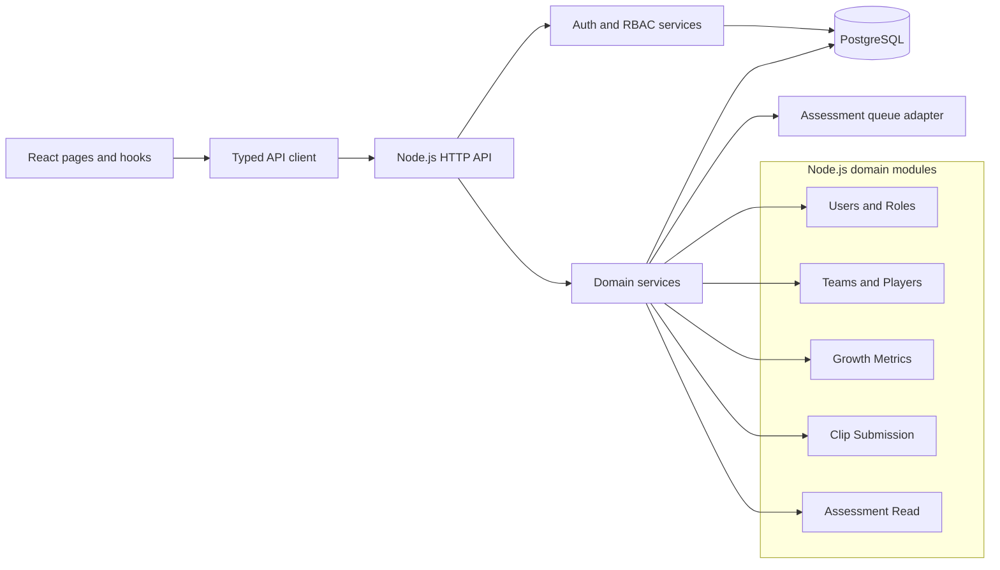

## feat: React + Node.js OpenAPI PostgreSQL architecture plan

## Summary
Define and implement a full architecture using a React frontend and a Node.js backend with an OpenAPI-first contract and PostgreSQL persistence. The backend will expose stable, role-protected APIs for coaches-growth, teams, clips, and assessments, while the React app consumes those APIs using contract-aligned client models. The plan establishes concrete file paths and test targets so implementation can start without inventing structure.

## Source documents
- docs/plans/2026-07-02-001-feat-coach-player-development-plan.md
- docs/brainstorms/2026-07-01-coaches-growth-match-time-performance-requirements.md
- docs/brainstorms/2026-07-02-internal-jwt-auth-and-role-control-requirements.md
- docs/brainstorms/2026-07-02-situational-video-assessment-requirements.md
- docs/ux/mockup/index.html
- docs/ux/mockup/S0-login.html
- docs/ux/mockup/S1-player-list.html
- docs/ux/mockup/S2-player-dashboard.html
- docs/ux/mockup/S3-team-management.html
- docs/ux/mockup/S4-video-capture.html
- docs/ux/mockup/S6-assessment-list.html
- docs/ux/mockup/S7-admin-user-management.html

## Problem
Current project assets define requirements and UX flows, but no executable backend architecture exists yet. Without an API contract and relational data model, frontend and backend development will drift and role-protected features will be hard to implement consistently.

## Goals and success criteria
- Establish a backend architecture that is explicitly API-first using OpenAPI.
- Establish a React frontend architecture that consumes OpenAPI-backed services cleanly.
- Persist core domain entities in PostgreSQL with clear relational boundaries.
- Support JWT authentication and role-based authorization (SystemAdmin and Coach).
- Provide stable contract coverage for all phase-1 mockup journeys.

Success criteria
- OpenAPI specification covers authentication, teams, players, growth metrics, clip submission, and assessment retrieval.
- PostgreSQL schema supports one-team-per-player assignment, growth metrics history, user roles, clips, and assessment status transitions.
- API contract and auth rules are traceable to the brainstorm requirements and phase-1 plan scope.
- Existing mockup pages can map every primary action to an API endpoint defined in OpenAPI.
- React screens have dedicated data-query hooks and API client wrappers for each phase-1 flow.

## Primary users
- Backend engineers
- Frontend engineers integrating mockups into app code
- QA engineers validating contract behavior
- Tech leads and architects reviewing long-term scalability

---

## Scope
### In scope
- Backend architecture definition and Node.js module structure
- React frontend architecture for phase-1 screens and API integration
- OpenAPI v3 specification for phase-1 endpoints
- PostgreSQL relational schema design and migration strategy
- JWT authentication and role authorization model
- Endpoint-to-mockup action mapping for phase-1 pages
- Initial integration and test strategy for frontend, contract, and persistence layers

### Deferred for later
- Event streaming architecture for async processing beyond queue baseline
- Real-time clip analysis endpoints
- Multi-tenant deployment partitioning
- Public/external API exposure strategy
- Advanced analytics query optimization and warehouse pipeline

### Out of scope
- CI/CD infrastructure automation details
- Cloud-specific deployment manifests

---

## Key technical decisions
- OpenAPI contract is the source of truth for backend interface behavior.
- React (TypeScript) is the frontend framework for all phase-1 user journeys.
- Node.js (TypeScript) is the backend runtime for API and auth services.
- PostgreSQL is the primary transactional store for all phase-1 entities.
- JWT access token model is short-lived for v1, aligned with requirements.
- Role model is minimal and explicit for v1: SystemAdmin and Coach.
- One player belongs to one team at a time in phase-1 data design.

---

## Output structure
```text
apps/
  api/
    src/
      app.ts
      server.ts
      config/
      modules/
        auth/
        users/
        teams/
        players/
        growth/
        clips/
        assessments/
      db/
        migrations/
        schema/
    tests/
      unit/
      integration/
      contract/
  web/
    src/
      app/
      components/
      features/
        auth/
        teams/
        players/
        growth/
        clips/
        assessments/
      services/api/
      hooks/
    tests/
      unit/
      integration/
openapi/
  v1/
    openapi.yaml
    schemas/
    examples/
docs/
  ux/mockup/
  ux/mockup/API-Mockup-Mapping.md
```

---

## High-level technical design


---

## Implementation units

### U1. Backend architecture foundation and service boundaries
**Goal:** Create a clean backend structure that separates transport, domain, persistence, and integration layers.

**Requirements:** aligns with phase-1 scope; supports OpenAPI-first implementation and PostgreSQL persistence.

**Dependencies:** none.

**Files:**
- apps/api/src/app.ts
- apps/api/src/server.ts
- apps/api/src/config/env.ts
- apps/api/src/modules/index.ts
- apps/api/src/shared/http/error-handler.ts
- apps/api/tests/unit/app.bootstrap.spec.ts
- apps/api/tests/integration/healthcheck.api.spec.ts

**Approach:**
- Define module boundaries and ownership for auth, teams/players, growth metrics, clips, and assessments.
- Keep HTTP/serialization concerns in API layer and business rules in domain layer.
- Isolate PostgreSQL access behind repositories/data-access interfaces.

**Patterns to follow:** layered architecture and thin-controller pattern.

**Test scenarios:**
- Happy path: backend boots with all required modules loaded.
- Edge case: invalid dependency wiring fails fast at startup.
- Error path: missing required configuration reports clear startup errors.
- Integration: architecture-level tests verify layer boundaries are respected.

**Verification:** architecture documentation and code structure clearly enforce separations and ownership.

---

### U2. OpenAPI contract for phase-1 endpoints
**Goal:** Define the authoritative OpenAPI specification for authentication, roles, teams, players, growth metrics, clips, and assessments.

**Requirements:** contract must cover phase-1 journeys from mockups and requirements documents.

**Dependencies:** U1.

**Files:**
- openapi/v1/openapi.yaml
- openapi/v1/schemas/auth.yaml
- openapi/v1/schemas/users.yaml
- openapi/v1/schemas/teams.yaml
- openapi/v1/schemas/players.yaml
- openapi/v1/schemas/growth.yaml
- openapi/v1/schemas/clips.yaml
- openapi/v1/schemas/assessments.yaml
- openapi/v1/examples/auth-login-success.json
- openapi/v1/examples/team-list-success.json
- apps/api/tests/contract/openapi.spec.ts

**Approach:**
- Model endpoint groups by bounded context: auth, users/roles, teams, players, growth, clips, assessments.
- Include request/response schema examples for primary and error flows.
- Define consistent error envelope and authorization failure responses.

**Patterns to follow:** OpenAPI v3 specification conventions and reusable schema components.

**Test scenarios:**
- Happy path: contract validates and exposes all required phase-1 endpoints.
- Edge case: required fields and enum constraints reject invalid payload examples.
- Error path: unauthorized and forbidden response contracts are defined and valid.
- Integration: contract tests confirm mockup-triggered actions map to defined operations.

**Verification:** OpenAPI spec validates with no errors and supports endpoint mapping for all existing phase-1 mockup pages.

---

### U3. PostgreSQL schema, migrations, and data access baseline
**Goal:** Implement the PostgreSQL relational model and migration baseline for phase-1 entities.

**Requirements:** supports users/roles, teams, player assignment, growth metrics, clips, and assessments.

**Dependencies:** U1, U2.

**Files:**
- apps/api/src/db/migrations/001_init_roles_users.sql
- apps/api/src/db/migrations/002_init_teams_players.sql
- apps/api/src/db/migrations/003_init_growth_clips_assessments.sql
- apps/api/src/db/schema/tables.sql
- apps/api/src/modules/shared/repositories/base-repository.ts
- apps/api/src/modules/players/repositories/player-repository.ts
- apps/api/tests/unit/repositories/player-repository.spec.ts
- apps/api/tests/integration/db/migrations.spec.ts

**Approach:**
- Create normalized tables for users, roles, user_roles, teams, players, player_growth_metrics, clips, and assessments.
- Enforce one-team-per-player with referential constraints and clear update semantics.
- Add indexes for common query paths used by dashboard and list filters.

**Patterns to follow:** explicit migrations, foreign-key integrity, and repository abstractions.

**Test scenarios:**
- Happy path: migrations apply cleanly on empty database.
- Edge case: null/invalid FK assignments are rejected.
- Error path: duplicate constrained values fail with expected database error handling.
- Integration: repository tests verify create/read/update flows for each core entity.

**Verification:** database schema supports all phase-1 entity relationships and query patterns without violating constraints.

---

### U4. JWT authentication and role-based authorization services
**Goal:** Implement login/session APIs and authorization enforcement for SystemAdmin and Coach roles.

**Requirements:** aligns with internal-jwt-auth requirements for role-protected access.

**Dependencies:** U2, U3.

**Files:**
- apps/api/src/modules/auth/controllers/auth.controller.ts
- apps/api/src/modules/auth/services/auth.service.ts
- apps/api/src/modules/auth/middleware/jwt-auth.middleware.ts
- apps/api/src/modules/auth/policies/role-policy.ts
- apps/api/src/modules/users/controllers/users.controller.ts
- apps/api/tests/unit/auth/auth.service.spec.ts
- apps/api/tests/unit/auth/role-policy.spec.ts
- apps/api/tests/integration/auth/login-and-access.spec.ts

**Approach:**
- Implement internal credential authentication and JWT issuance.
- Enforce role checks at protected operation level.
- Expose user lifecycle operations only for SystemAdmin.

**Patterns to follow:** policy-based authorization and centralized token validation middleware.

**Test scenarios:**
- Happy path: valid login issues token and role claims.
- Edge case: expired/invalid token is denied consistently across endpoints.
- Error path: Coach access to admin endpoints returns forbidden.
- Integration: deactivated user cannot authenticate or access protected resources.

**Verification:** role-appropriate access control is consistently enforced across all protected endpoint groups.

---

### U5. Coaches-growth and team-management API implementation
**Goal:** Deliver phase-1 domain APIs for teams, players, and growth dashboards aligned to mockup flows.

**Requirements:** supports team creation, player assignment, team filter, growth data retrieval, and comparison-ready views.

**Dependencies:** U2, U3, U4.

**Files:**
- apps/api/src/modules/teams/controllers/teams.controller.ts
- apps/api/src/modules/teams/services/teams.service.ts
- apps/api/src/modules/players/controllers/players.controller.ts
- apps/api/src/modules/players/services/players.service.ts
- apps/api/src/modules/growth/controllers/growth.controller.ts
- apps/api/src/modules/growth/services/growth.service.ts
- apps/api/tests/unit/teams/teams.service.spec.ts
- apps/api/tests/unit/growth/growth.service.spec.ts
- apps/api/tests/integration/players/team-filter.spec.ts

**Approach:**
- Implement CRUD for teams and assignment endpoints for players.
- Implement list and detail endpoints with team-based filtering.
- Implement growth summary endpoints with missing-data visibility semantics.

**Patterns to follow:** resource-oriented API design and explicit DTO validation.

**Test scenarios:**
- Happy path: coach retrieves player list filtered by selected team.
- Edge case: unassigned players appear clearly in list/filter responses.
- Error path: invalid team/player assignment requests return structured validation errors.
- Integration: dashboard aggregation endpoints return expected trend and summary payloads.

**Verification:** team and growth APIs fully support phase-1 coach pages and filtering behavior.

---

### U6. Clip submission and assessment retrieval API implementation
**Goal:** Deliver backend APIs for clip upload metadata submission, status tracking, and assessment retrieval.

**Requirements:** supports asynchronous assessment model and clip browsing behavior.

**Dependencies:** U2, U3, U4.

**Files:**
- apps/api/src/modules/clips/controllers/clips.controller.ts
- apps/api/src/modules/clips/services/clips.service.ts
- apps/api/src/modules/assessments/controllers/assessments.controller.ts
- apps/api/src/modules/assessments/services/assessments.service.ts
- apps/api/src/integrations/assessment-queue/assessment-queue.adapter.ts
- apps/api/tests/unit/clips/clips.service.spec.ts
- apps/api/tests/unit/assessments/assessments.service.spec.ts
- apps/api/tests/integration/clips/clip-submission.spec.ts

**Approach:**
- Implement clip metadata submission and queued processing status lifecycle.
- Implement assessment read endpoints for list and detail views.
- Keep async integration behind adapter boundary for future provider changes.

**Patterns to follow:** asynchronous job submission boundary and status-state consistency.

**Test scenarios:**
- Happy path: clip submission persists and returns queued status.
- Edge case: unsupported clip metadata or size constraints return validation errors.
- Error path: failed assessment processing surfaces retryable failure state.
- Integration: assessment status transitions from queued to assessed and appears in list results.

**Verification:** clip and assessment API behavior matches phase-1 mockup flow expectations.

---

### U7. Contract-to-mockup integration map and verification harness
**Goal:** Create explicit mapping and verification between existing mockup interactions and OpenAPI operations.

**Requirements:** every primary action on mockup pages maps to a backend contract operation.

**Dependencies:** U2, U5, U6.

**Files:**
- docs/ux/mockup/API-Mockup-Mapping.md
- apps/web/src/services/api/client.ts
- apps/web/src/features/auth/hooks/useLogin.ts
- apps/web/src/features/players/hooks/usePlayerList.ts
- apps/web/src/features/teams/hooks/useTeams.ts
- apps/web/src/features/clips/hooks/useSubmitClip.ts
- apps/web/src/features/assessments/hooks/useAssessmentList.ts
- apps/web/tests/unit/services/api-client.spec.ts
- apps/web/tests/unit/features/auth/useLogin.spec.ts
- apps/web/tests/integration/mockup-flows/coach-journey.spec.ts

**Approach:**
- Document per-page action-to-endpoint matrix.
- Add frontend integration tests for key journeys: login, player list filtering, team management, clip submission, assessment list.
- Use mapping as shared artifact for React and Node.js implementation alignment.

**Patterns to follow:** traceable mapping from UX journey to API operation IDs.

**Test scenarios:**
- Happy path: each primary mockup journey has at least one contract verification test.
- Edge case: mapping highlights and tests no-data/missing-data responses for dashboard/list pages.
- Error path: mapping includes unauthorized/forbidden behavior checks for role-sensitive actions.
- Integration: end-to-end contract checks validate coherent operation flow across page journeys.

**Verification:** mockup-driven user journeys are contract-complete and test-covered.

---

## Risks and dependencies
- Risk: contract drift between UX and backend implementation.
  - Mitigation: OpenAPI is source of truth and mapping matrix is maintained in lockstep.
- Risk: PostgreSQL model evolves incompatibly with API payloads.
  - Mitigation: schema changes require contract impact review and migration tests.
- Risk: authorization gaps expose admin operations.
  - Mitigation: centralized RBAC checks and explicit forbidden-path tests.
- Risk: React frontend diverges from OpenAPI response contracts.
  - Mitigation: typed API client wrappers and integration tests tied to mockup flow mapping.

Dependencies
- Node.js runtime and package management standard for workspace.
- React app bootstrap and routing foundation.
- PostgreSQL environment availability for local and CI execution.
- Queue mechanism for asynchronous assessment lifecycle.

---

## Open questions
- Which Node.js HTTP framework should be adopted for v1 (Express, Fastify, or Nest)?
- Which React app bootstrap should be used in v1 (Vite + React Router baseline recommended)?
- What exact JWT access token lifetime should be set for v1?
- Which queue technology should be used for assessment processing in v1?
- What initial clip-size and format limits should be enforced at API level?

---

## Phased execution suggestion
- Phase A: U1, U2, U3
- Phase B: U4, U5
- Phase C: U6, U7

This sequence keeps architecture and contract stable before deeper domain implementation and integration mapping.
