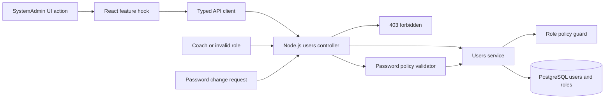

# feat: SystemAdmin user management and credential control

## Summary
Add phase-1 capabilities for SystemAdmin to create users, change user roles, and change user passwords across a React frontend and Node.js API backed by PostgreSQL. This plan extends the existing internal JWT and role-control scope with explicit admin-managed credential rotation while preserving role boundaries between SystemAdmin and Coach.

---

## Problem Frame
The platform already defines JWT authentication and role-based access, but SystemAdmin user management needs full operational coverage for day-to-day administration. Without explicit flows for create user, role changes, and password updates, administrators cannot safely onboard users or remediate access issues.

Origin and traceability:
- origin: docs/brainstorms/2026-07-02-internal-jwt-auth-and-role-control-requirements.md
- alignment: docs/plans/2026-07-03-001-feat-openapi-postgresql-architecture-plan.md

---

## Scope Boundaries
### In scope
- SystemAdmin creates users with initial role assignment.
- SystemAdmin changes existing user role between Coach and SystemAdmin.
- SystemAdmin changes another user password (admin-managed credential rotation).
- Validation, authorization, and audit-safe response behavior for those actions.
- React admin screen updates aligned to existing admin mockup flows.

### Deferred for later
- Self-service forgot-password and email recovery flow.
- Multi-factor authentication.
- Session revocation dashboard and token blacklist operations.
- Fine-grained role hierarchy beyond SystemAdmin and Coach.

### Outside this product identity
- External identity provider federation.

---

## Requirements Mapping
- R5, R6: enforce role-based authorization for admin-only actions.
- R7, R10: implement SystemAdmin user management operations.
- R8: deny Coach role from user-management endpoints and UI actions.
- R11: preserve deactivated-user access denial behavior.

Flow and acceptance alignment:
- SystemAdmin user provisioning flow.
- Unauthorized access attempt flow.
- Acceptance examples for role boundary enforcement and deactivated-user controls.

Additional scope decision:
- Add admin-driven password change as phase-1 admin capability (separate from deferred self-service reset).

---

## Key Technical Decisions
- Use Node.js TypeScript modules in apps/api for all user-admin operations.
- Keep OpenAPI as source of truth; implement endpoints only after schema update.
- Store password hashes only; no plaintext password transport or storage beyond request body handling.
- Require SystemAdmin role claims for create user, change role, and change password operations.
- Keep role vocabulary constrained to SystemAdmin and Coach for v1 consistency.
- Expose only non-sensitive user fields in list/detail API responses.

---

## High-Level Technical Design

---

## Implementation Units

### U1. OpenAPI contract for admin user lifecycle operations
**Goal:** Add contract definitions for create user, change role, and change password operations.

**Requirements:** R5, R6, R7, R8, R10.

**Dependencies:** none.

**Files:**
- openapi/v1/openapi.yaml
- openapi/v1/schemas/users.yaml
- openapi/v1/examples/admin-create-user-success.json
- openapi/v1/examples/admin-change-role-success.json
- openapi/v1/examples/admin-change-password-success.json
- openapi/v1/examples/forbidden-coach-user-admin.json
- apps/api/tests/contract/openapi.user-admin.spec.ts

**Approach:**
- Define admin endpoints under users domain with explicit role guard requirements.
- Add request schemas for create user payload, role change payload, and password change payload.
- Standardize error envelopes for forbidden, validation error, not found, and conflict.

**Patterns to follow:**
- Existing OpenAPI grouping and schema reuse from auth and users sections.

**Test scenarios:**
- Happy path: contract validates create user, change role, and change password operations with required fields.
- Edge case: role enum rejects values outside SystemAdmin and Coach.
- Error path: forbidden response schema is defined for Coach attempts.
- Integration: mockup action-to-endpoint mapping includes admin table actions and password modal submit.

**Verification:**
- OpenAPI validation passes and exposes all new admin operations with consistent request/response schemas.

---

### U2. PostgreSQL and repository support for credential and role updates
**Goal:** Ensure persistence model supports secure password changes and role updates.

**Requirements:** R5, R7, R10, R11.

**Dependencies:** U1.

**Files:**
- apps/api/src/db/migrations/004_user_password_and_role_admin.sql
- apps/api/src/db/schema/tables.sql
- apps/api/src/modules/users/repositories/user-repository.ts
- apps/api/src/modules/users/repositories/user-role-repository.ts
- apps/api/tests/unit/users/user-repository.spec.ts
- apps/api/tests/integration/db/user-admin-migration.spec.ts

**Approach:**
- Add/confirm columns for password_hash, updated_at, and deactivated_at with safe defaults.
- Enforce unique username or email constraints used by admin create flow.
- Implement repository methods for atomic role update and password hash update.

**Patterns to follow:**
- Migration-first schema evolution and repository abstraction patterns.

**Test scenarios:**
- Happy path: migration applies and repository persists role and password hash updates.
- Edge case: duplicate username or email fails with conflict-safe behavior.
- Error path: update against non-existent user returns not found semantics.
- Integration: transaction rollback preserves previous role and hash on partial failure.

**Verification:**
- Data layer supports secure and consistent admin lifecycle writes without constraint regressions.

---

### U3. Node.js admin user-management API and authorization enforcement
**Goal:** Implement backend endpoints and services for create user, change role, and change password.

**Requirements:** R5, R6, R7, R8, R10, R11.

**Dependencies:** U1, U2.

**Files:**
- apps/api/src/modules/users/controllers/users.controller.ts
- apps/api/src/modules/users/services/users-admin.service.ts
- apps/api/src/modules/users/validators/admin-create-user.validator.ts
- apps/api/src/modules/users/validators/admin-change-role.validator.ts
- apps/api/src/modules/users/validators/admin-change-password.validator.ts
- apps/api/src/modules/auth/policies/role-policy.ts
- apps/api/tests/unit/users/users-admin.service.spec.ts
- apps/api/tests/unit/users/admin-validators.spec.ts
- apps/api/tests/integration/users/user-admin.api.spec.ts

**Approach:**
- Add admin service methods with centralized authorization checks.
- Validate payloads before persistence and hash password updates through auth utility.
- Return sanitized user DTOs excluding password and security-sensitive fields.

**Execution note:**
- Start with failing API integration tests for all three operations before controller wiring.

**Patterns to follow:**
- Thin-controller and service-layer orchestration patterns used across existing module plan.

**Test scenarios:**
- Happy path: SystemAdmin creates user with role and receives sanitized user response.
- Happy path: SystemAdmin updates user role and subsequent authorization behavior matches new role.
- Happy path: SystemAdmin changes password and target user can authenticate only with new credentials.
- Edge case: payload with weak password or missing required fields is rejected with validation error.
- Error path: Coach token calling admin endpoint returns forbidden.
- Error path: deactivated target user role or password updates follow explicit business rule response.
- Integration: role update plus login verifies effective permission change on protected endpoint access.

**Verification:**
- All admin user-management APIs enforce role boundaries and produce contract-aligned responses.

---

### U4. React admin user-management experience and route protection
**Goal:** Enable SystemAdmin UI flows for create user, change role, and change password.

**Requirements:** R6, R7, R8, R10.

**Dependencies:** U1, U3.

**Files:**
- apps/web/src/features/admin-users/pages/AdminUsersPage.tsx
- apps/web/src/features/admin-users/components/CreateUserForm.tsx
- apps/web/src/features/admin-users/components/ChangeRoleDialog.tsx
- apps/web/src/features/admin-users/components/ChangePasswordDialog.tsx
- apps/web/src/features/admin-users/hooks/useAdminUsers.ts
- apps/web/src/features/admin-users/hooks/useCreateUser.ts
- apps/web/src/features/admin-users/hooks/useChangeUserRole.ts
- apps/web/src/features/admin-users/hooks/useChangeUserPassword.ts
- apps/web/src/app/routes/AdminRoutes.tsx
- apps/web/tests/unit/features/admin-users/admin-users-page.spec.tsx
- apps/web/tests/unit/features/admin-users/change-password-dialog.spec.tsx
- apps/web/tests/integration/admin-users/admin-user-lifecycle-flow.spec.tsx

**Approach:**
- Build admin-only page and dialogs from existing admin mockup interaction model.
- Add route guards and action-level disable logic for non-admin sessions.
- Surface validation and API failure states inline for each admin action.

**Patterns to follow:**
- Existing hook-based API access and role-aware route guard patterns.

**Test scenarios:**
- Happy path: SystemAdmin can create user, change role, and change password from admin screen.
- Edge case: form validation blocks weak or mismatched password input before API submit.
- Error path: API forbidden or conflict response renders actionable error state.
- Integration: Coach session cannot access admin route and is redirected or denied.

**Verification:**
- Admin screen supports full lifecycle actions with clear feedback and strict role gating.

---

### U5. End-to-end verification, telemetry, and mockup mapping update
**Goal:** Finalize traceability and quality gates for admin user-management feature.

**Requirements:** R6, R7, R8, R10, success criteria alignment.

**Dependencies:** U3, U4.

**Files:**
- docs/ux/mockup/API-Mockup-Mapping.md
- docs/ux/mockup/S7-admin-user-management.html
- apps/api/tests/integration/users/user-admin-rbac-regression.spec.ts
- apps/web/tests/integration/admin-users/admin-role-guard-regression.spec.tsx

**Approach:**
- Update mockup-to-API matrix for all admin actions and failure states.
- Add regression coverage to prevent Coach access to admin actions over time.
- Define telemetry events for create user, role change, and password change outcomes.

**Patterns to follow:**
- Existing mapping artifact and role-regression testing strategy in phase-1 plan assets.

**Test scenarios:**
- Happy path: each admin action emits success telemetry with actor role and target user id.
- Edge case: repeated role change requests remain idempotent by expected business rules.
- Error path: unauthorized action attempts emit denied telemetry and no data mutation occurs.
- Integration: end-to-end admin journey remains consistent with mockup interaction flow.

**Verification:**
- Traceability document, tests, and telemetry definitions collectively prove admin feature readiness.

---

## Risks and Dependencies
- Risk: password handling mistakes could expose sensitive data.
  - Mitigation: enforce hash-only storage, sanitized DTOs, and redacted logs.
- Risk: role change may create accidental privilege escalation.
  - Mitigation: strict role enum validation and explicit policy checks at service boundary.
- Risk: UI and API drift on admin operations.
  - Mitigation: maintain API-mockup mapping and contract tests as release gate.

Dependencies:
- Existing JWT auth module and role policy middleware.
- PostgreSQL migration execution path in development and CI.
- Admin mockup flow as baseline UX reference.

---

## Open Questions
- Should admin password changes force immediate token invalidation for the affected user in v1?
- What minimum password policy should v1 enforce for admin-set passwords?
- Should admin role changes require a second confirmation step for SystemAdmin-to-Coach downgrade?

---

## Verification Strategy
- Contract verification for all admin endpoints and schemas.
- API integration verification for authorization and mutation behavior.
- React integration verification for role-protected navigation and action UX.
- Regression verification for unauthorized access attempts by Coach role.

---

## Phased Execution Suggestion
- Phase A: U1 and U2.
- Phase B: U3.
- Phase C: U4 and U5.

This sequence locks contract and persistence first, then backend behavior, then UI integration and final regression hardening.
