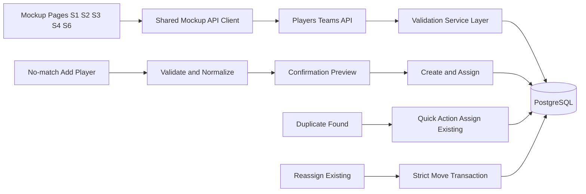

# feat: PostgreSQL player source of record with validated create-on-no-match and strict move

## Summary
Move player and team assignment ownership to PostgreSQL and align all relevant mockup pages to consume backend data only. Add Player supports create-on-no-match with mandatory confirmation before submit, strict move reassignment, and one-click duplicate resolution.

---

## Problem Frame
Player names and assignments are currently split across hard-coded page content and in-page state. This creates inconsistent cross-page behavior and non-durable assignment changes.

---

## Origin
- docs/brainstorms/2026-07-01-coaches-growth-match-time-performance-requirements.md
- docs/plans/2026-07-03-001-feat-openapi-postgresql-architecture-plan.md
- docs/plans/2026-07-03-003-fix-s1-player-list-team-filter-add-player-plan.md

---

## Scope Boundaries

### In scope
- PostgreSQL as source of record for players and team assignment.
- API contract and implementation for player/team reads, create-and-assign, and strict move reassignment.
- Add Player no-match creation with:
  - minimum validation rules
  - confirmation preview showing selected team and normalized final player name before submit
- Duplicate detection with explicit quick-action to assign the existing matched player immediately.
- Mockup alignment for:
  - docs/ux/mockup/S1-player-list.html
  - docs/ux/mockup/S2-player-dashboard.html
  - docs/ux/mockup/S3-team-management.html
  - docs/ux/mockup/S4-video-capture.html
  - docs/ux/mockup/S6-assessment-list.html

### Deferred to Follow-Up Work
- Multi-team membership.
- Transfer history and assignment audit timeline UX.
- Real-time sync across multiple open pages.

### Out of scope
- Authentication redesign.
- AI assessment model changes.
- Non-player domain expansion.

---

## Requirements Trace
- Player and assignment data persists in PostgreSQL and is exposed through API.
- Scoped mockup pages use backend player source, not hard-coded lists.
- Add Player supports:
  - assign existing match
  - create-on-no-match only after explicit confirmation
- New player minimum validation:
  - required trimmed name
  - length 2 to 60
  - allowed characters: letters, spaces, apostrophe, hyphen
  - repeated spaces collapsed before persistence
  - normalized duplicate check prevents duplicate creation
- Reassignment is strict move:
  - player belongs to one team at a time
  - move is atomic

---

## Resolved Decisions
- Confirmation copy includes selected team and normalized final player name preview before submit.
- Duplicate detection provides a direct quick-action to assign the existing matched player immediately.

---

## Key Technical Decisions
- PostgreSQL is the sole source of truth for player/team state.
- Add Player is write-through: mutation first, then refresh from persisted read.
- No-match creation is blocked until explicit confirmation is completed.
- Name validation is enforced in both UI pre-submit and API validator/service layers using one shared rule set.
- Duplicate handling returns existing player identity and assignment quick-action metadata.
- Strict move semantics are enforced transactionally in the service/data layer.

---

## High-Level Technical Design

---

## Implementation Units

### U1. OpenAPI contract for player/team read, create-on-no-match, duplicate quick-action, strict move
**Goal:** Define the complete API contract for read, create-and-assign, duplicate quick-action, and strict move.

**Requirements:** Source-of-record API behavior; explicit create confirmation semantics; validation and duplicate response shapes.

**Dependencies:** none.

**Files:**
- openapi/v1/openapi.yaml
- openapi/v1/schemas/players.yaml
- openapi/v1/schemas/teams.yaml
- openapi/v1/examples/players-list-success.json
- openapi/v1/examples/player-create-and-assign-success.json
- openapi/v1/examples/player-reassign-strict-move-success.json
- openapi/v1/examples/player-create-validation-error.json
- apps/api/tests/contract/openapi.players-teams.spec.ts

**Approach:**
- Add player and team read operations with team-scoped query support.
- Add create-and-assign operation requiring an explicit confirmation marker for no-match creation.
- Add reassignment operation with strict single-team semantics.
- Define duplicate response payload carrying existing player identity and assign-existing quick-action data.
- Standardize validation, not-found, and conflict envelopes.

**Patterns to follow:**
- Existing OpenAPI grouping and schema reuse in openapi/v1/openapi.yaml.

**Test scenarios:**
- Happy path: list players by team returns expected schema.
- Happy path: unmatched valid name with confirmation creates and assigns.
- Happy path: reassignment applies strict move and returns updated relation.
- Edge case: create with minimal required payload defaults optional fields.
- Error path: no-match create without confirmation is rejected.
- Error path: invalid length/character set returns validation error.
- Error path: normalized duplicate returns conflict with assign-existing quick-action payload.
- Integration: contract validation confirms create, duplicate quick-action, and strict move consistency.

**Verification:**
- OpenAPI validates and exposes all read, create, duplicate quick-action, and strict move operations with consistent request/response schemas.

---

### U2. PostgreSQL schema and migration for canonical player/team state
**Goal:** Persist players and team assignment with one active team per player.

**Requirements:** Durable storage; strict move integrity; duplicate-safe creates.

**Dependencies:** U1.

**Files:**
- apps/api/src/db/migrations/005_players_teams_source_of_record.sql
- apps/api/src/db/schema/tables.sql
- apps/api/tests/integration/db/players-teams-migration.spec.ts

**Approach:**
- Introduce players and teams tables plus an assignment model enforcing one active team per player.
- Add normalized-name indexing/constraints to support duplicate detection.
- Ensure reassignment updates are atomic and leave no dual-team state.

**Patterns to follow:**
- Migration-first schema evolution used in apps/api/src/db/migrations.

**Test scenarios:**
- Happy path: migration applies on a clean database.
- Happy path: create player then assign persists correctly.
- Happy path: reassignment moves player from old team to new team.
- Edge case: same-team reassignment is idempotent.
- Error path: invalid player or team foreign key fails safely.
- Integration: failed move transaction leaves prior assignment intact.

**Verification:**
- Database guarantees single active team per player and durable create/assign behavior.

---

### U3. Backend services and controllers for validation, create, duplicate quick-action, strict move
**Goal:** Implement API behavior defined by the contract and schema.

**Requirements:** Validation parity; explicit confirmation gate; duplicate detection; strict move enforcement.

**Dependencies:** U1, U2.

**Files:**
- apps/api/src/modules/players/controllers/players.controller.ts
- apps/api/src/modules/players/services/players.service.ts
- apps/api/src/modules/players/repositories/player-repository.ts
- apps/api/src/modules/teams/controllers/teams.controller.ts
- apps/api/src/modules/teams/services/team-assignment.service.ts
- apps/api/src/modules/teams/repositories/team-repository.ts
- apps/api/src/modules/players/validators/player-create.validator.ts
- apps/api/src/modules/teams/validators/team-assignment.validator.ts
- apps/api/tests/unit/players/players.service.spec.ts
- apps/api/tests/integration/players-teams/players-teams.api.spec.ts

**Approach:**
- Centralize name normalization and validation at the service boundary.
- Reject no-match create when explicit confirmation is missing/false.
- Detect normalized duplicates and return existing player identity plus assign-existing quick-action metadata.
- Enforce strict move as a transactional reassignment.
- Return sanitized DTOs for UI consumption.

**Execution note:** Start with failing API integration tests for create-confirm, duplicate quick-action, and strict move before wiring controllers.

**Patterns to follow:**
- Thin-controller and service-orchestration conventions in existing apps/api modules.

**Test scenarios:**
- Happy path: confirmed create-on-no-match succeeds and assigns to selected team.
- Happy path: existing matched player assignment succeeds.
- Happy path: strict move removes old-team association and sets new-team association.
- Happy path: duplicate detection returns quick-action assign path and assigns existing player on invocation.
- Edge case: name normalization prevents casing/spacing duplicate creation.
- Error path: unconfirmed create is blocked.
- Error path: invalid characters/length rejected consistently across layers.
- Integration: write then read confirms cross-endpoint consistency.

**Verification:**
- API behavior matches the contract and enforces validation, duplicate quick-action, and strict move invariants.

---

### U4. Shared mockup API client and cross-page backend-source alignment
**Goal:** Replace hard-coded player sources across scoped mockup pages with API-backed reads.

**Requirements:** Backend-driven player source used consistently by all scoped pages.

**Dependencies:** U3.

**Files:**
- docs/ux/mockup/js/mockup-api-client.js
- docs/ux/mockup/S1-player-list.html
- docs/ux/mockup/S2-player-dashboard.html
- docs/ux/mockup/S3-team-management.html
- docs/ux/mockup/S4-video-capture.html
- docs/ux/mockup/S6-assessment-list.html

**Approach:**
- Introduce a shared client for read and mutation operations.
- Replace static player rendering with API-driven rendering.
- Standardize loading, empty, and error states across pages.

**Patterns to follow:**
- Existing inline interaction style in docs/ux/mockup/S7-admin-user-management.html, centralized through a shared helper.

**Test scenarios:**
- Happy path: each scoped page loads player data from API.
- Edge case: empty team renders an explicit empty state.
- Error path: API read failure shows a non-stale fallback state (no hard-coded roster).
- Integration: after assignment write on S1, subsequent loads in S2/S4/S6 reflect persisted state.

**Verification:**
- No scoped page relies on a hard-coded player list as operational source.

---

### U5. S1 Add Player UX with confirmation preview and duplicate quick-action assign
**Goal:** Deliver deterministic Add Player UX for assign, create-with-confirmation, and duplicate quick-action.

**Requirements:** Minimum validation; confirmation preview fields (team + normalized name); duplicate quick-action; strict move messaging.

**Dependencies:** U4.

**Files:**
- docs/ux/mockup/S1-player-list.html
- docs/ux/mockup/style/site.css
- tests/bdd/features/player-list-team-filter-and-add-player.feature
- tests/bdd/features/step_definitions/player-list.steps.js
- tests/playwright/s1-player-list.spec.js

**Approach:**
- For matched flow: assign existing player.
- For no-match flow: validate input, show a confirmation preview with the selected team and normalized final name, and require explicit confirmation before submit.
- On duplicate detection: show a conflict state with a one-click Assign Existing action.
- Keep submit disabled until team selected, name valid, and (for no-match) confirmation completed.
- Distinguish success messaging for created-and-assigned versus moved.

**Patterns to follow:**
- Existing S1 add-player interaction model in docs/ux/mockup/S1-player-list.html.

**Test scenarios:**
- Happy path: confirmation preview shows exact selected team and normalized name before submit.
- Happy path: matched name assigns existing player.
- Happy path: confirmed no-match create creates and assigns.
- Happy path: reassign existing player moves them and shows move-specific feedback.
- Happy path: duplicate warning quick-action assigns existing player immediately and closes conflict state.
- Edge case: same-team reassignment is a no-op with clear feedback.
- Error path: no-match create without confirmation cannot submit.
- Error path: invalid name format/length keeps submit disabled with visible validation.
- Integration: reload confirms created player and assignment persisted.

**Verification:**
- S1 supports validated create, explicit confirmation preview, duplicate quick-action, and strict move semantics.

---

### U6. Mapping, traceability, and regression hardening
**Goal:** Preserve source-of-record behavior and prevent regressions for create/confirm/duplicate/move flows.

**Requirements:** Traceability and durable regression safety.

**Dependencies:** U1, U5.

**Files:**
- docs/ux/mockup/API-Mockup-Mapping.md
- tests/bdd/README.md
- apps/api/tests/integration/players-teams/players-teams.api.spec.ts
- tests/playwright/s1-player-list.spec.js

**Approach:**
- Update mockup-to-API mapping for confirmation preview and duplicate quick-action behavior.
- Add regression assertions for validation, duplicate quick-action, and strict move outcomes.
- Ensure anti-regression coverage against static-player-source behavior returning.

**Patterns to follow:**
- Existing mapping and QA documentation conventions in docs/ux and tests.

**Test scenarios:**
- Happy path: mapping aligns UI actions to read/create/assign/move endpoints.
- Edge case: mapping includes no-match confirmation and duplicate quick-action flows.
- Error path: mapping captures validation and duplicate rejection outcomes.
- Integration: regression suite fails if static-player fallback reappears in scoped pages.

**Verification:**
- Behavior is documented and protected at contract, API, BDD, and browser layers.

---

## Risks and Mitigation
- Validation too strict for legitimate names.
  - Mitigation: representative name fixtures and rule tuning.
- Duplicate normalization mismatches creating near-duplicate records.
  - Mitigation: shared normalization utility with unit and integration coverage.
- UX confusion between create and assign-existing.
  - Mitigation: explicit confirmation preview copy and a distinct duplicate action state.
- Stale UI after a successful mutation if refresh fails.
  - Mitigation: hydrate from mutation response plus explicit retry/read handling.

---

## Open Questions
None.

---

## Implementation-Time Unknowns
- Final confirmation control form (checkbox vs explicit confirm action) can be chosen during implementation while preserving required behavior.
- Optional default metadata for newly created players (position default strategy, trend default) can be finalized during implementation after API contract review.
