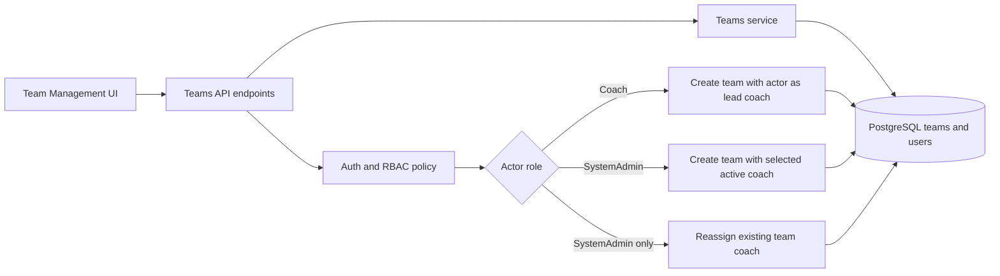

# feat: Team creation with role-based coach assignment

## Summary
Implement a database-backed Team Management feature where Coaches can create teams that auto-assign themselves as lead coach, and SystemAdmin can create teams with explicit coach selection plus reassign the coach for any team.

---

## Problem Frame
The current Team Management experience is mockup-only and not backed by API/database contracts. Team creation behavior does not enforce role-aware coach assignment rules, and SystemAdmin lacks a first-class capability to assign or change the coach for existing teams. This creates governance gaps and prevents a reliable source of record for team ownership.

Origin and alignment:
- Primary origin: docs/brainstorms/2026-07-01-coaches-growth-match-time-performance-requirements.md
- Role and authorization alignment: docs/brainstorms/2026-07-02-internal-jwt-auth-and-role-control-requirements.md
- Architecture alignment: docs/plans/2026-07-03-001-feat-openapi-postgresql-architecture-plan.md
- Admin pattern alignment: docs/plans/2026-07-03-002-feat-system-admin-user-management-plan.md

---

## Requirements Trace
- Team creation must use database persistence as the source of record.
- When a Coach creates a team, the current authenticated Coach is assigned as lead coach automatically.
- When a SystemAdmin creates a team, the request must allow selecting an existing Coach.
- SystemAdmin must be able to assign or change the coach for any existing team.
- Authorization must enforce Coach vs SystemAdmin boundaries for team-coach assignment operations.
- Team list/read operations must reflect persisted coach assignments consistently.

---

## Scope Boundaries
### In scope
- OpenAPI contract additions for team creation and coach assignment operations.
- PostgreSQL schema and migration updates for team ownership relations.
- Backend service/controller logic for role-aware team creation and coach reassignment.
- Team Management UI updates for Coach and SystemAdmin role-specific create/assign flows.
- Regression updates in Playwright and BDD for team creation and coach assignment behavior.
- API-to-mockup mapping updates for new team endpoints.

### Deferred to follow-up work
- Multi-coach team support (assistant coaches/co-coaches).
- Historical audit timeline for coach assignment changes.
- Bulk import/create team workflows.
- Notification workflows on coach reassignment.

### Out of scope
- New role types beyond SystemAdmin and Coach.
- External identity provider changes.
- Advanced team hierarchy or tournament grouping structures.

---

## Key Technical Decisions
- Add explicit coach ownership columns and foreign-key relations in PostgreSQL so coach assignment is always queryable from the database.
- Use one create-team endpoint with role-aware server-side branching:
  - Coach actor ignores client-selected coach and assigns current actor.
  - SystemAdmin actor must provide selected active Coach identifier.
- Introduce a dedicated SystemAdmin-only endpoint to reassign team coach for existing teams.
- Keep coach-picker scope to active Coach users only (confirmed in planning scope).
- Preserve OpenAPI-first contract discipline before backend/UI implementation.

---

## High-Level Technical Design

---

## Implementation Units

### U1. Expand OpenAPI contract for teams and coach assignment
**Goal:** Define contract-first endpoints and schemas for role-aware team creation and coach reassignment.

**Requirements:** DB-backed team creation; role-specific team coach assignment behavior; SystemAdmin reassignment capability.

**Dependencies:** none.

**Files:**
- openapi/v1/openapi.yaml
- openapi/v1/schemas/teams.yaml
- openapi/v1/examples/team-create-coach-success.json
- openapi/v1/examples/team-create-admin-success.json
- openapi/v1/examples/team-coach-reassign-success.json
- openapi/v1/examples/team-coach-forbidden.json
- apps/api/tests/contract/openapi.teams-coach-assignment.spec.ts

**Approach:**
- Add operations for create team, list teams (with lead coach details), and SystemAdmin coach reassignment.
- Define request/response schema variants by actor behavior and error envelopes.
- Capture explicit forbidden and validation contract cases for incorrect role or invalid coach selection.

**Patterns to follow:**
- Existing contract structure in openapi/v1/openapi.yaml and openapi/v1/schemas/users.yaml.

**Test scenarios:**
- Happy path: contract validates Coach-created team response with actor assigned as lead coach.
- Happy path: contract validates SystemAdmin-created team response with selected coach.
- Happy path: contract validates SystemAdmin coach-reassign endpoint and response payload.
- Edge case: selected coach must be active and role=Coach.
- Error path: Coach actor attempting reassignment operation returns forbidden schema.
- Integration: API-to-mockup mapping actions for S3 create/reassign correspond to defined operations.

**Verification:**
- OpenAPI validates and covers all role-aware team/coach assignment operations needed by UI flows.

### U2. Add PostgreSQL team ownership schema and migration support
**Goal:** Persist teams and coach assignment relationships as source of record.

**Requirements:** Database source-of-record for team creation and coach assignment; consistent team read behavior.

**Dependencies:** U1.

**Files:**
- apps/api/src/db/migrations/005_teams_and_coach_assignment.sql
- apps/api/src/db/schema/tables.sql
- apps/api/src/modules/teams/repositories/team-repository.ts
- apps/api/tests/unit/teams/team-repository.spec.ts
- apps/api/tests/integration/db/team-coach-assignment-migration.spec.ts

**Approach:**
- Create/expand teams table with lead_coach_user_id foreign key to users.id.
- Enforce referential integrity and uniqueness rules for team identity.
- Add repository methods for create team, list teams with coach join, and update lead coach.

**Patterns to follow:**
- Existing migration and repository patterns used by apps/api/src/db/migrations/004_user_password_and_role_admin.sql.

**Test scenarios:**
- Happy path: migration creates/updates teams schema with valid FK constraints.
- Happy path: repository persists team create and coach reassignment changes.
- Edge case: coach assignment to non-Coach or inactive user fails validation path before write.
- Error path: invalid user foreign key is rejected and returns not_found semantics.
- Integration: transaction rollback preserves previous lead coach on reassignment failure.

**Verification:**
- Team and coach ownership data is persisted and queryable from PostgreSQL without integrity violations.

### U3. Implement backend role-aware team creation and reassignment services
**Goal:** Enforce role rules and business behavior for create-team and assign/change-coach flows.

**Requirements:** Coach auto-assignment on create; SystemAdmin selected-coach create; SystemAdmin reassign any team; authorization boundaries.

**Dependencies:** U1, U2.

**Files:**
- apps/api/src/modules/teams/controllers/teams.controller.ts
- apps/api/src/modules/teams/services/teams.service.ts
- apps/api/src/modules/teams/validators/create-team.validator.ts
- apps/api/src/modules/teams/validators/reassign-team-coach.validator.ts
- apps/api/src/modules/auth/policies/role-policy.ts
- apps/api/tests/unit/teams/teams.service.spec.ts
- apps/api/tests/unit/teams/teams.validators.spec.ts
- apps/api/tests/integration/teams/team-coach-assignment.api.spec.ts

**Approach:**
- Parse authenticated actor role and user id from JWT claims.
- Apply role-branching in service layer for create-team behavior.
- Restrict reassignment operation to SystemAdmin and validate target coach eligibility.
- Return team DTOs with lead coach identity fields used by S3 views.

**Execution note:**
- Start with failing integration tests for create-team role branching and reassignment authorization.

**Patterns to follow:**
- Thin-controller/service orchestration and forbidden handling in apps/api user-admin modules.

**Test scenarios:**
- Happy path: Coach creates team and returned team.leadCoach is authenticated coach.
- Happy path: SystemAdmin creates team with selected active coach id.
- Happy path: SystemAdmin reassigns lead coach for existing team and read model reflects change.
- Edge case: duplicate team name request is rejected with conflict.
- Edge case: SystemAdmin create request missing coach selection is validation_error.
- Error path: Coach actor calling reassignment endpoint returns forbidden.
- Error path: selected coach user inactive or role=SystemAdmin returns validation_error.
- Integration: create then list teams reflects persisted coach assignments across requests.

**Verification:**
- API behavior enforces role-specific rules and always reflects database state for team-coach ownership.

### U4. Add role-aware Team Management UI flows for create and reassign
**Goal:** Deliver S3 interactions for coach/self-create and SystemAdmin create/reassign workflows.

**Requirements:** Coach auto-assigned on create; SystemAdmin selects coach on create; SystemAdmin can assign/change coach for any team.

**Dependencies:** U1, U3.

**Files:**
- docs/ux/mockup/S3-team-management.html
- docs/ux/mockup/js/mockup-api-client.js
- tests/playwright/s3-team-management.spec.js
- tests/playwright/s0-auth-entry.spec.js

**Approach:**
- Add Create Team modal/form in S3 with role-sensitive fields:
  - Coach: coach selection hidden/disabled with self-assignment indicator.
  - SystemAdmin: active-coach picker required.
- Add row action for SystemAdmin to reassign coach and refresh table/KPIs from source-of-record data.
- Keep current role-badge simulation behavior while wiring deterministic state changes through API client abstraction.

**Patterns to follow:**
- Existing modal/action patterns in docs/ux/mockup/S7-admin-user-management.html.

**Test scenarios:**
- Happy path: Coach creates team and table shows current coach as lead coach.
- Happy path: SystemAdmin creates team with selected coach and table reflects selection.
- Happy path: SystemAdmin changes coach on existing team and table updates.
- Edge case: active-coach picker excludes inactive users.
- Error path: Coach role cannot see or execute change-coach action.
- Integration: team count KPI and roster table remain consistent after create/reassign.

**Verification:**
- S3 role-specific create/assign UX maps correctly to source-of-record team ownership behaviors.

### U5. Extend BDD coverage and mockup-API traceability
**Goal:** Lock behavior with executable role-aware scenarios and updated mapping documentation.

**Requirements:** Regression coverage for create-team and SystemAdmin coach assignment/change.

**Dependencies:** U3, U4.

**Files:**
- tests/bdd/features/team-creation-and-coach-assignment.feature
- tests/bdd/features/step_definitions/team-coach-assignment.steps.js
- tests/bdd/features/admin-user-management.feature
- docs/ux/mockup/API-Mockup-Mapping.md

**Approach:**
- Add BDD scenarios for coach self-assignment create flow and SystemAdmin selected/reassign flows.
- Reuse existing auth/role step foundations for forbidden-path assertions.
- Update mapping table to include S3 create/reassign endpoints and error contracts.

**Patterns to follow:**
- Existing BDD style and role assertions in tests/bdd/features/admin-user-management.feature.

**Test scenarios:**
- Happy path: authenticated Coach creates team and becomes lead coach.
- Happy path: authenticated SystemAdmin creates team selecting active coach.
- Happy path: authenticated SystemAdmin reassigns coach for existing team.
- Edge case: inactive coach selection rejected with validation error and no data mutation.
- Error path: Coach reassignment attempt returns forbidden.
- Integration: S3 UI actions map one-to-one to OpenAPI operations with expected success/error responses.

**Verification:**
- BDD + mapping artifacts provide traceable, regression-safe coverage for role-aware team/coach workflows.

---

## Risks and Dependencies
- Risk: role-branching logic in create-team may drift between API and UI assumptions.
  - Mitigation: centralize rules in service layer and assert with integration + BDD scenarios.
- Risk: stale or invalid coach selections can cause assignment errors.
  - Mitigation: validate selected coach is active and role=Coach at API boundary; refresh selectable list from source-of-record data.
- Risk: schema evolution impacts existing mockup seed behavior.
  - Mitigation: include migration/integration tests and explicit default handling for legacy seed data.

Dependencies:
- Existing JWT role claims and policy enforcement.
- Existing users table with active/inactive and role fields.
- Team management screen as primary UX surface for create/reassign actions.

---

## Open Questions
- Should team name uniqueness be global or scoped by season/program in v1?
- Should reassignment preserve prior coach as historical metadata now, or defer to follow-up audit work?

---

## Implementation-Time Unknowns
- Final endpoint naming between create/reassign operations may be adjusted during OpenAPI harmonization, while preserving all required behaviors in this plan.
- UI control choice for reassignment (inline select vs modal) can be finalized during implementation without changing role rules.

---

## Verification Strategy
- Contract verification for teams endpoints and role-specific error envelopes.
- Integration verification for role branching, validation, and persistence outcomes.
- Playwright verification for S3 role-specific create/reassign flows.
- BDD verification for cross-role acceptance behavior and forbidden cases.
