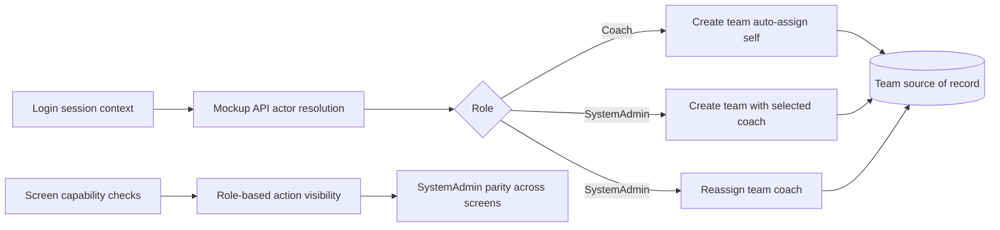

# fix: Role access regressions for team management and SystemAdmin parity

## Summary
Fix role-access bugs where Coach receives permission errors while creating teams and SystemAdmin lacks complete team-management controls. Ensure SystemAdmin can perform all role-scoped functions across the system while preserving explicit authorization boundaries.

---

## Problem Frame
Two regressions are blocking expected operations:
- Coach cannot reliably create teams due to permission errors tied to actor/session resolution.
- SystemAdmin does not consistently see or execute team-management actions needed to support users.

The current behavior violates planned role rules and reduces operational support capability for administrators.

Origin and alignment:
- docs/plans/2026-07-03-005-feat-team-creation-coach-assignment-plan.md
- docs/brainstorms/2026-07-02-internal-jwt-auth-and-role-control-requirements.md
- docs/brainstorms/2026-07-01-coaches-growth-match-time-performance-requirements.md

---

## Requirements Trace
- Coach must be able to create a team without permission errors when authenticated.
- Coach create-team flow must auto-assign current Coach as lead coach.
- SystemAdmin must be able to create teams with selected active coaches.
- SystemAdmin must be able to reassign coach for any team.
- SystemAdmin must retain effective access to all operational screens/functions needed to help users.
- Role checks must remain explicit and deterministic (no hidden fallback to forbidden for valid actor sessions).

---

## Scope Boundaries
### In scope
- Session/actor-resolution hardening in mockup API and role-aware UI flows.
- Team Management screen fixes for Coach create and SystemAdmin create/reassign actions.
- SystemAdmin access-parity fixes across primary feature screens/navigation entry points.
- BDD and Playwright regression updates for role access conditions.

### Deferred to follow-up work
- Centralized enterprise IAM/SSO integration.
- Fine-grained permission matrix beyond SystemAdmin and Coach.
- Audit-history UI for every privileged action.

### Out of scope
- New business domains unrelated to access and team ownership.
- New roles beyond current role model.

---

## Key Technical Decisions
- Treat authenticated session user as the source-of-truth actor for authorization decisions.
- Reject only truly unauthenticated contexts; do not reject valid Coach/SystemAdmin sessions due to missing optional payload actor fields.
- Keep SystemAdmin as superset operator for all in-system support actions while preserving explicit forbidden checks for Coach on admin-only mutations.
- Add deterministic role-capability checks at screen-load and action level to avoid inconsistent hidden-state behavior.

---

## High-Level Technical Design

---

## Implementation Units

### U1. Stabilize actor/session authorization resolution
**Goal:** Remove false permission denials for valid authenticated users.

**Requirements:** Coach team create succeeds when authenticated; role checks deterministic.

**Dependencies:** none.

**Files:**
- docs/ux/mockup/js/mockup-api-client.js
- tests/bdd/features/step_definitions/team-coach-assignment.steps.js
- tests/playwright/s0-auth-entry.spec.js

**Approach:**
- Normalize actor resolution to prefer authenticated session user.
- Guard only on real unauthenticated state or invalid role.
- Ensure create/reassign team methods use unified resolution path.

**Patterns to follow:**
- Existing login/session semantics in docs/ux/mockup/S0-login.html and user-management access checks.

**Test scenarios:**
- Happy path: authenticated Coach creates team and receives success.
- Happy path: authenticated SystemAdmin creates team with selected coach.
- Edge case: direct screen navigation after valid login still preserves actor role.
- Error path: unauthenticated actor receives forbidden.
- Integration: session from login is honored by team-management methods without explicit actor payload.

**Verification:**
- No permission errors for valid authenticated Coach/SystemAdmin actions.

### U2. Fix Team Management role controls and SystemAdmin action availability
**Goal:** Ensure S3 consistently exposes and executes correct actions by role.

**Requirements:** Coach create-team works; SystemAdmin create/reassign always available.

**Dependencies:** U1.

**Files:**
- docs/ux/mockup/S3-team-management.html
- tests/playwright/s3-team-management.spec.js
- tests/bdd/features/team-creation-and-coach-assignment.feature

**Approach:**
- Make create-team behavior role-sensitive but always available to authenticated Coach and SystemAdmin.
- Ensure SystemAdmin-only change-coach controls render and function on all teams.
- Harden modal and form-state logic to avoid accidental hidden/disabled admin actions.

**Patterns to follow:**
- Existing modal/action structure from docs/ux/mockup/S7-admin-user-management.html.

**Test scenarios:**
- Happy path: Coach creates team and appears as lead coach.
- Happy path: SystemAdmin creates team with active-coach picker.
- Happy path: SystemAdmin reassigns team coach and table updates.
- Edge case: inactive coach unavailable in selector.
- Error path: Coach cannot execute SystemAdmin-only reassign action.
- Integration: KPI and table remain synchronized after role-specific mutations.

**Verification:**
- S3 actions match role expectations with no missing SystemAdmin controls.

### U3. Enforce SystemAdmin full-function access parity across primary screens
**Goal:** Ensure SystemAdmin can access all support-relevant feature functions.

**Requirements:** SystemAdmin can do all in-system functions needed to help users.

**Dependencies:** U1.

**Files:**
- docs/ux/mockup/S0-login.html
- docs/ux/mockup/S1-player-list.html
- docs/ux/mockup/S3-team-management.html
- docs/ux/mockup/S4-video-capture.html
- docs/ux/mockup/S6-assessment-list.html
- tests/playwright/s0-auth-entry.spec.js

**Approach:**
- Review role gating and entry flows on primary screens.
- Remove unintended restrictions that block SystemAdmin from operational features.
- Keep explicit denial only for actions intended to remain Coach-limited.

**Patterns to follow:**
- Existing role-badge and role-view toggling conventions already present in mockup screens.

**Test scenarios:**
- Happy path: SystemAdmin can navigate from login to user-management and operational screens.
- Happy path: SystemAdmin can execute team-management create/reassign actions.
- Edge case: switching between screens preserves session and role capabilities.
- Error path: unauthorized/unauthenticated attempts still blocked.
- Integration: SystemAdmin journey covers end-to-end support path without hidden action loss.

**Verification:**
- SystemAdmin can perform full support scope across the mockup system.

### U4. Refresh behavior traceability and regression guardrails
**Goal:** Align contract/mapping/tests with fixed access behavior.

**Requirements:** BDD and Playwright conditions reflect corrected role access model.

**Dependencies:** U2, U3.

**Files:**
- docs/ux/mockup/API-Mockup-Mapping.md
- tests/bdd/features/auth-and-access-control.feature
- tests/bdd/features/team-creation-and-coach-assignment.feature
- tests/playwright/s3-team-management.spec.js
- tests/playwright/s0-auth-entry.spec.js

**Approach:**
- Update mapping for role-scoped create/reassign and SystemAdmin parity expectations.
- Add/adjust regression scenarios for permission-denial bug path and fixed outcomes.
- Keep scenario language aligned with role rules from auth requirements.

**Patterns to follow:**
- Existing BDD/Playwright style and API error-code conventions in current test suites.

**Test scenarios:**
- Happy path: Coach create-team no longer hits forbidden.
- Happy path: SystemAdmin can access and execute team-management support actions.
- Edge case: stale session handling prompts expected denial, not false-denial for valid sessions.
- Error path: Coach reassign action remains forbidden.
- Integration: combined login + team-management flows satisfy role-access matrix.

**Verification:**
- Test suite reliably catches regressions for both Coach and SystemAdmin access contracts.

---

## Risks and Dependencies
- Risk: over-correction could unintentionally broaden Coach privileges.
  - Mitigation: keep explicit admin-only checks and add forbidden-path tests.
- Risk: session-state drift across pages causes intermittent permission failures.
  - Mitigation: centralize actor resolution and validate via cross-page tests.
- Risk: role-based UI visibility diverges from API behavior.
  - Mitigation: keep BDD + Playwright + mapping aligned to same role matrix.

Dependencies:
- Existing login/session behavior in S0 and mockup API login path.
- Existing team ownership data model in mockup source-of-record.

---

## Open Questions
- Should SystemAdmin default landing remain user-management, or route to a unified operational dashboard with admin controls?
- Are any Coach-only actions intentionally excluded from SystemAdmin parity for policy reasons?

---

## Implementation-Time Unknowns
- Exact scope of cross-screen parity adjustments may expand slightly if hidden role checks are discovered in additional mockup pages.

---

## Verification Strategy
- BDD verification for role access contracts and forbidden paths.
- Playwright verification for login-to-team-management journeys by role.
- Manual UI sanity check for action visibility and modal behavior by role.
