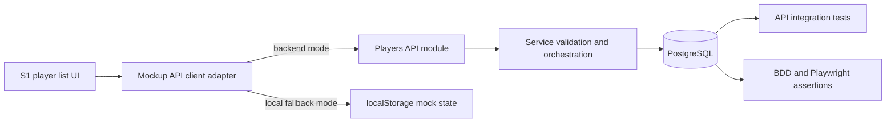

# feat: Persist mock player and team data to PostgreSQL with API-backed mock UI

## Summary
Persist player and team-assignment state in PostgreSQL and make the mock UI consume API-backed data by default. Preserve a feature-flagged local fallback mode for offline/manual workflows.

---

## Problem Frame
Player creation and team assignment behavior in the mock UI currently depends on browser-local state. This causes non-durable behavior across refreshes, sessions, and parallel clients, and it weakens integration confidence for API and end-to-end tests.

---

## Origin
- docs/plans/2026-07-03-004-feat-postgresql-player-source-of-record-plan.md
- docs/plans/2026-07-03-003-fix-s1-player-list-team-filter-add-player-plan.md
- docs/brainstorms/2026-07-01-coaches-growth-match-time-performance-requirements.md

---

## Requirements Trace
- R1: Creating a player from the mock UI persists a database record and returns persisted identity.
- R2: Assigning or moving a player to a team is persisted and queryable by team.
- R3: Mock UI defaults to API-backed reads and writes when backend is reachable.
- R4: Feature-flagged fallback retains current local behavior when backend is intentionally unavailable.
- R5: Integration, BDD, and Playwright coverage validates API-backed source-of-record behavior.

---

## Scope Boundaries

### In scope
- Player persistence and team assignment persistence for the mock flow.
- Backend module additions for player read/create/assign/move behavior.
- Mock client adapter updates so S1 consumes backend endpoints when enabled.
- Regression coverage updates in API integration, BDD, and Playwright layers.

### Deferred to Follow-Up Work
- Persisting non-player entities (users, clips, assessments) to PostgreSQL.
- Historical transfer timeline and audit UX.
- Real-time sync across multiple simultaneous browser sessions.

### Out of scope
- Authentication and authorization redesign.
- AI assessment model behavior changes.
- Frontend redesign beyond behavior needed for source-of-record alignment.

---

## Key Technical Decisions
- PostgreSQL is the single source of truth for player and team-assignment state in API-backed mode.
- Backend shape follows existing layered module conventions (repository, service, controller).
- Team assignment enforces strict single-team ownership for a player at a point in time.
- Mock UI uses capability detection and explicit flags to switch between backend and local modes without changing UI contracts.
- Duplicate handling and normalization are enforced server-side to keep behavior deterministic across clients.

---

## High-Level Technical Design

---

## Implementation Units

### U1. Add player and assignment persistence schema
**Goal:** Establish durable database structures for players and team assignments.

**Requirements:** R1, R2.

**Dependencies:** none.

**Files:**
- apps/api/src/db/migrations/006_players_teams_source_of_record.sql (new)

**Approach:**
- Introduce player persistence with normalized-name support for duplicate detection.
- Introduce assignment persistence that supports strict move behavior.
- Add indexes/constraints that support query-by-team and uniqueness expectations.

**Patterns to follow:**
- Migration conventions in apps/api/src/db/migrations/004_user_password_and_role_admin.sql.
- Migration conventions in apps/api/src/db/migrations/005_teams_and_coach_assignment.sql.

**Test scenarios:**
- Happy path: migration applies successfully to a clean database.
- Happy path: creating a player and assignment persists both entities.
- Edge case: same normalized name cannot create conflicting duplicate records.
- Error path: assignment referencing a non-existent player or team fails safely.
- Integration: failed assignment mutation does not leave partial persistence.

**Verification:**
- Database model supports durable player persistence, strict team assignment, and duplicate-safe constraints.

### U2. Implement player repository and service orchestration
**Goal:** Provide backend domain behavior for create, list, assign, and move using the persisted schema.

**Requirements:** R1, R2, R5.

**Dependencies:** U1.

**Files:**
- apps/api/src/modules/players/repositories/player-repository.ts (new)
- apps/api/src/modules/players/services/players.service.ts (new)
- apps/api/src/modules/players/validators/player-create.validator.ts (new)
- apps/api/tests/unit/players/players.service.spec.ts (new)

**Approach:**
- Encapsulate persistence reads/writes in repository methods aligned with existing module patterns.
- Enforce input validation and normalization in service-level orchestration.
- Support list filtering by team and deterministic duplicate outcomes.
- Preserve strict move semantics so reassignment updates source-of-record state consistently.

**Execution note:**
- Start with failing service-level tests for normalized create, duplicate outcome, and strict move behavior.

**Patterns to follow:**
- apps/api/src/modules/users/repositories/user-repository.ts.
- apps/api/src/modules/users/services/users-admin.service.ts.

**Test scenarios:**
- Happy path: valid create persists and returns canonical persisted identity.
- Happy path: list by team returns only assigned players for the filter.
- Happy path: move reassigns player to the new team and removes prior-team ownership.
- Edge case: casing/spacing variants normalize to one duplicate domain identity.
- Error path: invalid name payload is rejected with validation envelope.
- Integration: create then list-by-team reflects persisted state across separate requests.

**Verification:**
- Service behavior is deterministic for create, duplicate handling, list, and strict move semantics.

### U3. Expose API endpoints and contract updates for player source-of-record
**Goal:** Deliver HTTP endpoints and OpenAPI alignment for UI and test consumption.

**Requirements:** R1, R2, R3, R5.

**Dependencies:** U2.

**Files:**
- apps/api/src/modules/players/controllers/players.controller.ts (new)
- apps/api/src/modules/players/index.ts (new)
- openapi/v1/openapi.yaml (update)
- openapi/v1/schemas/players.yaml (new or update)
- apps/api/tests/integration/players-api.spec.ts (new)

**Approach:**
- Keep controllers thin and delegate business rules to service methods.
- Expose endpoints for list, create, get-by-id, and assignment/move operations.
- Align response envelopes and status codes to existing API conventions.
- Update OpenAPI to keep API behavior discoverable and contract-tested.

**Patterns to follow:**
- apps/api/src/modules/users/controllers/users.controller.ts.
- Existing OpenAPI grouping conventions in openapi/v1/openapi.yaml.

**Test scenarios:**
- Happy path: create request returns persisted identity and expected status.
- Happy path: assign or move request updates team ownership and returns updated model.
- Happy path: list by team filter returns only players for that team.
- Edge case: get-by-id for existing player returns consistent canonical data.
- Error path: invalid create payload returns validation error contract.
- Error path: non-existent player assignment target returns not-found/invalid-target response.
- Integration: endpoint write followed by read confirms durable persistence.

**Verification:**
- API contract and implementation remain aligned and support backend-first mock UI behavior.

### U4. Update mockup API adapter and S1 behavior for backend-first mode
**Goal:** Ensure S1 flows use backend persistence by default with explicit local fallback support.

**Requirements:** R1, R2, R3, R4.

**Dependencies:** U3.

**Files:**
- docs/ux/mockup/js/mockup-api-client.js
- docs/ux/mockup/S1-player-list.html

**Approach:**
- Add backend availability and feature-flag decisioning to the shared mockup client.
- Route create/list/assign operations to API in backend mode.
- Preserve return-shape compatibility so UI behavior remains stable.
- Keep explicit local fallback behavior for offline/manual runs.

**Patterns to follow:**
- Existing S1 add-player interaction conventions in docs/ux/mockup/S1-player-list.html.
- Existing mock API adapter conventions in docs/ux/mockup/js/mockup-api-client.js.

**Test scenarios:**
- Happy path: backend mode create persists and appears after page reload.
- Happy path: backend mode assignment or move is visible on subsequent list reads.
- Edge case: backend health unavailable with local fallback flag enabled keeps local behavior functional.
- Error path: backend mode request failure surfaces explicit non-silent UI error state.
- Integration: add in S1 then read in subsequent S1 load returns backend-persisted state.

**Verification:**
- S1 behavior is backend-first in supported environments with controlled fallback semantics.

### U5. Harden cross-layer regression coverage
**Goal:** Prevent regressions for source-of-record behavior across integration, BDD, and browser flows.

**Requirements:** R5.

**Dependencies:** U3, U4.

**Files:**
- tests/bdd/features/player-source-of-record-and-confirmed-create.feature
- tests/bdd/features/step_definitions/player-list.steps.js
- tests/playwright/s1-player-list.spec.js
- apps/api/tests/integration/players-api.spec.ts
- docs/ux/mockup/API-Mockup-Mapping.md

**Approach:**
- Ensure BDD scenarios represent persisted create/list/assign expectations.
- Update Playwright journey to assert persistence across page lifecycle events.
- Keep API integration assertions aligned with UI-facing behavior and mapping documentation.

**Patterns to follow:**
- Existing BDD style in tests/bdd/features/player-list-team-filter-and-add-player.feature.
- Existing browser test style in tests/playwright/s1-player-list.spec.js.

**Test scenarios:**
- Happy path: add player in UI then subsequent read confirms durable backend persistence.
- Happy path: assignment update is reflected in team-filtered views.
- Edge case: duplicate create attempt resolves through expected duplicate-safe behavior.
- Error path: invalid create payload path returns validation outcome surfaced in tests.
- Integration: API test and browser test assert equivalent post-write state.

**Verification:**
- Regression suite detects reintroduction of local-only source behavior in backend-capable environments.

---

## Dependencies and Sequencing
- U1 -> U2 -> U3 -> U4 -> U5.
- API module and migration work are prerequisite to backend-first mockup wiring.
- Cross-layer test updates should land after API and mock adapter behavior are stable.

---

## Risks and Mitigations
- Risk: duplicate normalization diverges between UI assumptions and API behavior.
	- Mitigation: keep normalization and duplicate decisions authoritative in service layer and validate via integration tests.
- Risk: fallback mode masks backend regressions in local workflows.
	- Mitigation: make backend-first behavior default in non-mock runs and enforce API-backed assertions in CI-oriented tests.
- Risk: move semantics introduce inconsistent team state during failures.
	- Mitigation: keep reassignment transactional and verify rollback/integrity behavior in integration tests.

---

## Open Questions
- Should local fallback mode be restricted to explicit mock-only environment flags, or also auto-enable when health checks fail?
- Should duplicate outcomes return only conflict metadata, or include explicit assign-existing action payload for UI shortcut handling?

---

## Implementation-Time Unknowns
- Final endpoint naming and payload granularity can be finalized during implementation while preserving this plan's behavior contracts.
- Exact fixture strategy for integration and browser tests can be tuned during implementation to minimize flakiness.
