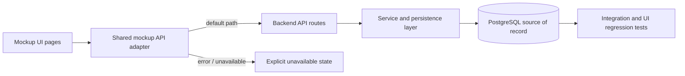

# feat: Remove mock data and standardize on database-backed source of record

## Summary
The app still depends on browser-local seed data and mock state for primary user-visible flows. This plan removes that dependency so the mockup experience reads and writes only from the PostgreSQL-backed system of record through the backend API.

---

## Problem Frame
- The mockup UI currently bootstraps teams, users, players, and clips from local seed data, which makes the experience inconsistent across refreshes and sessions.
- The backend has begun to expose database-backed endpoints for some entities, but the app still carries mock-driven behavior that can silently bypass the system of record.
- This weakens confidence in the app’s data model, makes testing less representative, and prevents the UI from reflecting database state reliably.

## Origin
- docs/plans/2026-07-03-007-feat-persist-mock-data-plan.md
- docs/plans/2026-07-04-001-fix-db-backed-team-user-lists-plan.md
- docs/db/DB-SCHEMA-RECOMMENDATION.md

---

## Requirements Trace
- R1: All user-visible data in the app is served from backend API endpoints backed by PostgreSQL.
- R2: Primary flows for players, teams, users, and clips do not depend on browser-local mock data or localStorage as the authoritative source.
- R3: The backend exposes read and write endpoints for each data domain required by the mockup UI.
- R4: When the database is unavailable or misconfigured, the app surfaces an explicit service-unavailable state instead of silently falling back to mock data.
- R5: Regression coverage verifies that reads and writes reflect persisted database state.

---

## Scope Boundaries

### In scope
- Replace mock-backed data reads in the mockup frontend with backend-driven reads for all primary entities.
- Remove or disable local seed initialization for the main app data flows.
- Extend the backend API so the UI can retrieve and persist players, teams, users, and clips from the database.
- Update integration, BDD, and Playwright coverage to assert database-backed behavior.

### Deferred to Follow-Up Work
- Authentication and authorization redesign beyond the current role-aware data access requirements.
- Advanced analytics, timeline history, and audit views for historical changes.
- Real-time synchronization across multiple concurrent browser sessions.

### Out of scope
- Visual redesign of the mockup experience.
- New external integrations or AI assessment behavior changes.
- Non-data-related infrastructure work unrelated to source-of-record enforcement.

---

## Key Technical Decisions
- PostgreSQL is the single source of truth for the app’s primary data in backend mode.
- The mockup client should use the backend API as the default data path and no longer bootstrap its own data store for core flows.
- Backend response shapes should remain stable and UI-friendly, while normalization and validation stay server-side.
- The app should fail clearly when persistence is unavailable rather than silently switching back to mock state.

---

## High-Level Technical Design

---

## Implementation Units

### U1. Inventory and remove local seed dependencies from the client
**Goal:** Eliminate the primary dependency on browser-local mock data for the UI.

**Requirements:** R1, R2.

**Dependencies:** none.

**Files:**
- docs/ux/mockup/js/mockup-api-client.js
- docs/ux/mockup/S1-player-list.html
- docs/ux/mockup/S3-team-management.html
- docs/ux/mockup/S7-admin-user-management.html

**Approach:**
- Map each data read and write path that currently depends on localStorage or in-browser seed state.
- Replace those paths with backend-driven reads and explicit error handling for unavailable persistence.
- Keep the UI contract stable while moving the data source behind the shared adapter.

**Patterns to follow:**
- Existing backend adapter conventions in docs/ux/mockup/js/mockup-api-client.js.
- Existing mockup page conventions for page-level data rendering.

**Test scenarios:**
- Happy path: loading the team and user pages retrieves data from backend responses.
- Happy path: player list and player detail views reflect persisted backend data after reload.
- Error path: when the backend is unavailable, the UI shows a clear unavailable state instead of mock data.
- Integration: the same domain record is visible through the UI after a backend-backed write.

**Verification:**
- The mockup client no longer depends on seeded local data for the core business data flows.

### U2. Extend the backend API to cover all primary app data domains
**Goal:** Make every required entity available through database-backed API endpoints.

**Requirements:** R1, R3.

**Dependencies:** U1.

**Files:**
- scripts/serve-mockup.js
- apps/api/src/db/schema/tables.sql
- apps/api/src/db/schema/deploy.sql
- openapi/v1/openapi.yaml

**Approach:**
- Add or complete backend routes for players, teams, users, and clips/assessments so the UI can read and write through a consistent contract.
- Ensure payloads and status codes align with the mockup client expectations.
- Keep validation and normalization centralized server-side.

**Execution note:**
- Start with failing integration coverage for each new route contract before wiring the UI to it.

**Patterns to follow:**
- Existing API route patterns in scripts/serve-mockup.js.
- Existing schema and OpenAPI conventions in apps/api/src/db/schema and openapi/v1.

**Test scenarios:**
- Happy path: a GET request returns persisted data for each major domain.
- Happy path: a write operation persists data and a subsequent read returns the stored record.
- Edge case: a lookup for a missing entity returns a deterministic not-found or validation error.
- Error path: the API returns service-unavailable details when the database is unreachable.

**Verification:**
- All primary app entities are reachable through backend endpoints backed by PostgreSQL.

### U3. Remove mock bootstrapping and fail-safe fallback behavior for primary flows
**Goal:** Stop bootstrapping app state from mock seed values and make the backend path the only supported path for normal operation.

**Requirements:** R1, R2, R4.

**Dependencies:** U2.

**Files:**
- docs/ux/mockup/js/mockup-api-client.js
- docs/ux/mockup/js/mockup-api-client.js
- scripts/serve-mockup.js

**Approach:**
- Remove or neutralize the local seed creation path used to initialize the app’s store.
- Make backend mode the default execution path for the primary app experience.
- Preserve explicit error messaging when backend persistence is unavailable rather than silently returning seeded data.

**Patterns to follow:**
- Existing backend-mode detection in docs/ux/mockup/js/mockup-api-client.js.
- Existing service-unavailable response handling in scripts/serve-mockup.js.

**Test scenarios:**
- Happy path: the app initializes with backend data when the database is reachable.
- Error path: the app surfaces a clear unavailable message when the database is unreachable.
- Edge case: a manual local-only mode is not used by default for core business flows.

**Verification:**
- The app no longer depends on mock seed initialization for primary data loading.

### U4. Update regression coverage for database-backed data flows
**Goal:** Lock in the new source-of-record behavior across API, BDD, and browser layers.

**Requirements:** R5.

**Dependencies:** U2, U3.

**Files:**
- apps/api/tests/integration/
- tests/bdd/features/
- tests/playwright/s1-player-list.spec.js
- tests/playwright/s3-team-management.spec.js
- tests/playwright/s7-admin-user-management.spec.js

**Approach:**
- Add or update integration tests to verify API-backed reads and writes.
- Extend BDD coverage to validate data visibility through the app’s user flows.
- Strengthen Playwright scenarios to ensure reloads and navigation reflect persisted state.

**Patterns to follow:**
- Existing API, BDD, and Playwright conventions in the repository.

**Test scenarios:**
- Happy path: a data write is visible in a later read through the UI.
- Happy path: a page reload returns the same backend-backed dataset.
- Error path: a DB outage produces the expected explicit unavailable state.
- Integration: API and UI assertions agree on the persisted record state.

**Verification:**
- Regression coverage proves that the app relies on database-backed data rather than mock state.

---

## Dependencies and Sequencing
- U1 -> U2 -> U3 -> U4.
- The client migration depends on the backend API being available for the data domains in scope.
- Regression coverage should land after the data paths have been stabilized.

---

## Risks and Mitigations
- Risk: some UI flows still assume local state or seeded data.
  - Mitigation: inventory all data reads and writes before changing the adapter and update them in a single pass.
- Risk: backend endpoints may not cover every page’s data shape.
  - Mitigation: define the shared payload contract early and keep normalization server-side.
- Risk: service-unavailable behavior could degrade the experience if not handled clearly.
  - Mitigation: surface explicit error states and cover them in regression tests.
