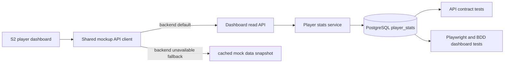

# feat: S2 player dashboard should read player_stats from PostgreSQL source of record

## Summary
Make the S2 player dashboard read its growth, match time, performance, and assessment summary from a PostgreSQL-backed `player_stats` table instead of synthesizing those values from cached mock data. Migrate the current dashboard data into the database, preserve the existing coach-only experience, and keep cached data only as an explicit fallback when the backend is unavailable.

## Problem Frame
S2 currently renders a polished player-development view, but the values on that screen are still synthetic: the shared mockup client derives them from local state, player clips, and hard-coded defaults. That makes the dashboard look live while it is actually disconnected from the source of record, so changes do not survive reloads or backend restarts.

The dashboard also needs to keep two important behaviors intact: coaches must still see a clear, coach-oriented summary, and missing data must be visible rather than silently inferred. The current mockup already has a coach-only BDD story and a missing-metrics scenario, so the new data model has to satisfy both the persistence goal and the existing UX contract.

## Origin
- docs/brainstorms/2026-07-01-coaches-growth-match-time-performance-requirements.md
- tests/bdd/features/coach-player-development-dashboard.feature

## Requirements Trace
- S2 must read player development summary data from PostgreSQL instead of from cached mock data by default.
- The dashboard must surface the same coach-facing growth, match time, performance, and assessment summary currently shown in S2, but sourced from `player_stats`.
- Current dashboard data must be migrated into the database so existing players have persisted stats rows.
- Cached/local data may remain as a fallback only when backend access is unavailable.
- Missing or incomplete metrics must be represented clearly.
- Coach access must remain allowed and non-coach access must remain forbidden.
- Regression coverage must prove the dashboard still loads, falls back safely, and reflects persisted data.

## Scope Boundaries
### In scope
- Database schema and migration work for a canonical `player_stats` table.
- Backfill of current dashboard values into PostgreSQL for the existing players.
- Backend API contract for reading player dashboard stats.
- Shared mockup client and S2 page changes so backend data is the default path.
- Browser, contract, and API regression coverage for the dashboard read path and fallback behavior.

### Deferred to follow-up work
- Predictive analytics, scouting recommendations, or richer longitudinal modeling beyond the current dashboard summary.
- Cross-player comparison UX expansion beyond the existing coach workflow.
- Real-time synchronization of stat changes across open tabs.

### Out of scope
- Authentication redesign.
- Non-dashboard player editing flows unless they are needed to keep the stats table consistent.
- Visual redesign of the S2 layout beyond any state needed for source-of-record correctness.

## Key Technical Decisions
- Treat `player_stats` as the canonical denormalized dashboard summary for S2, with one row per player.
- Preserve the existing S2 query-string entry behavior, but resolve it through backend-backed player lookup before rendering the dashboard summary.
- Use a dedicated dashboard read endpoint rather than overloading the list-player endpoint, so the summary contract can evolve independently of roster listing.
- Keep cached/local data as a fallback only when backend access fails, not as the default runtime source.
- Model missing metrics explicitly in the payload so the UI can show a clear unavailable state instead of inventing values.
- Preserve coach-only access for the dashboard and keep forbidden behavior explicit for other roles.

## High-Level Technical Design

## Implementation Units

### U1. Add the player_stats schema and backfill current dashboard data
**Goal:** Create a durable stats table and populate it for the existing players already present in the system.

**Requirements:** persisted dashboard summary data; migration of current dashboard values; explicit handling of missing data.

**Dependencies:** none.

**Files:**
- apps/api/src/db/migrations/008_player_stats_source_of_record.sql
- apps/api/src/db/schema/tables.sql
- apps/api/tests/integration/db/player-stats-migration.spec.ts

**Approach:**
- Add a `player_stats` table keyed by player with the current summary fields needed by S2.
- Include columns that cover the dashboard sections already rendered today: growth indicators, match-time totals, performance summary, and clip/assessment counts.
- Backfill current rows from the existing player, team-assignment, and clip data so the dashboard has persisted values immediately after migration.
- Make the migration idempotent so reruns do not duplicate rows or corrupt existing stats.

**Patterns to follow:**
- Existing migration conventions in apps/api/src/db/migrations/005_teams_and_coach_assignment.sql.
- Existing source-of-record migration patterns in apps/api/src/db/migrations/006_players_teams_source_of_record.sql.

**Test scenarios:**
- Happy path: the migration creates `player_stats` and backfills a row for every existing player.
- Happy path: dashboard summary counts match the seeded clip and player data after backfill.
- Edge case: a player with missing clip history still gets a persisted stats row with clear null/empty fields.
- Error path: rerunning the migration does not create duplicate stats rows.
- Integration: the backfilled stats remain queryable after the seed data is reloaded.

**Verification:**
- The database contains a durable dashboard summary row for each current player.

### U2. Add a coach-only dashboard read contract and API implementation
**Goal:** Expose the dashboard summary as an API-backed read path that S2 can consume.

**Requirements:** backend-first dashboard reads; coach-only access; clear missing-data handling.

**Dependencies:** U1.

**Files:**
- openapi/v1/openapi.yaml
- openapi/v1/schemas/players.yaml
- scripts/serve-mockup.js
- apps/api/tests/contract/openapi.players.spec.ts
- apps/api/tests/integration/players/player-stats.api.spec.ts

**Approach:**
- Add a dedicated dashboard read endpoint that returns the persisted `player_stats` row plus the canonical player identity needed by S2.
- Preserve the current query-string navigation contract at the UI boundary, but resolve it against the backend before returning data.
- Enforce coach-only authorization for the dashboard read and return a forbidden response for unauthorized roles.
- Include explicit fields or flags for missing metric states so the UI can render the current "not available yet" behavior without guessing.

**Patterns to follow:**
- Existing thin HTTP handler style in scripts/serve-mockup.js.
- Existing OpenAPI schema organization in openapi/v1/openapi.yaml.

**Test scenarios:**
- Happy path: a Coach can fetch a dashboard summary for a known player and receives the persisted stats payload.
- Happy path: the payload includes the full set of summary values S2 renders today.
- Edge case: a player with incomplete stats returns clear missing-data markers instead of fabricated values.
- Error path: SystemAdmin access is forbidden for the dashboard read path, matching the existing BDD story.
- Integration: the API response is stable enough for both the mockup client and contract tests to consume.

**Verification:**
- The dashboard summary is obtainable from the API and reflects PostgreSQL data rather than local derivation.

### U3. Switch S2 to backend-first loading with explicit cached fallback
**Goal:** Make the S2 page read from the API by default while preserving a fallback when the backend is unavailable.

**Requirements:** backend default behavior; fallback only when unavailable; current UX preserved.

**Dependencies:** U2.

**Files:**
- docs/ux/mockup/js/mockup-api-client.js
- docs/ux/mockup/S2-player-dashboard.html

**Approach:**
- Update the shared mockup client so dashboard reads go through the backend path first.
- Use the cached/mock data path only when the backend cannot be reached or returns a service-unavailable response.
- Keep the S2 page markup and existing dashboard sections intact, but bind them to the API payload instead of hard-coded metrics.
- Preserve the current player query-string behavior so the screen still opens the right player profile from navigation.

**Patterns to follow:**
- Existing adapter conventions in docs/ux/mockup/js/mockup-api-client.js.
- Existing S2 rendering structure in docs/ux/mockup/S2-player-dashboard.html.

**Test scenarios:**
- Happy path: S2 loads dashboard data from the backend and shows the persisted values.
- Happy path: the coach dashboard still renders all existing sections with the API payload.
- Edge case: backend unavailable falls back to cached data instead of leaving the page blank.
- Error path: fallback mode is explicit and does not become the default when the backend is healthy.
- Integration: query-string player navigation still lands on the intended player dashboard after the data path change.

**Verification:**
- The page no longer depends on cached mock values as the normal runtime source.

### U4. Lock in the dashboard contract with browser, BDD, and mapping updates
**Goal:** Prevent regressions in dashboard behavior, access control, and fallback semantics.

**Requirements:** regression coverage for source-of-record reads, missing data, and coach-only access.

**Dependencies:** U2, U3.

**Files:**
- tests/playwright/s2-player-dashboard.spec.js
- tests/bdd/features/coach-player-development-dashboard.feature
- docs/ux/mockup/API-Mockup-Mapping.md

**Approach:**
- Update the Playwright suite to assert the dashboard shows persisted values and still exposes the existing action buttons and sections.
- Extend the BDD story so the coach-only behavior and missing-data messaging remain explicit against the new database-backed contract.
- Update the mockup mapping doc to record the S2 dashboard read operation and its fallback semantics.

**Patterns to follow:**
- Existing S2 browser test structure in tests/playwright/s2-player-dashboard.spec.js.
- Existing dashboard BDD shape in tests/bdd/features/coach-player-development-dashboard.feature.

**Test scenarios:**
- Happy path: the dashboard shows the persisted growth, match time, and performance values for a known coach-visible player.
- Happy path: the dashboard still renders the existing action links and sections.
- Edge case: missing metrics show the explicit unavailable message rather than fabricated numbers.
- Error path: non-coach access remains forbidden.
- Integration: backend-backed dashboard reads survive reloads and do not regress to synthetic defaults.

**Verification:**
- Browser, BDD, and mapping documentation all describe and enforce the same backend-first dashboard contract.

## Dependencies and Sequencing
- U1 establishes the persisted dashboard model.
- U2 exposes the read contract against that model.
- U3 moves the UI to backend-first behavior with fallback only on failure.
- U4 closes the loop with regression coverage and mapping updates.

## Risks and Mitigations
- Risk: backfilled stats may not exactly match the values the current dashboard synthesizes.
  - Mitigation: derive the initial rows from the current player, clip, and assignment data so the migration is deterministic and reviewable.
- Risk: cached fallback can hide backend outages if it becomes the default.
  - Mitigation: make the backend path first-class and test the fallback only as the failure path.
- Risk: the dashboard summary contract may drift from the existing S2 sections.
  - Mitigation: keep the same visible dashboard sections and align the payload to those sections explicitly.

## Open Questions
- Should the dashboard read endpoint be keyed by player name compatibility, player id, or both for the first release?
- Should future stat updates be written directly into `player_stats`, or should a later job recompute it from event-level data?
