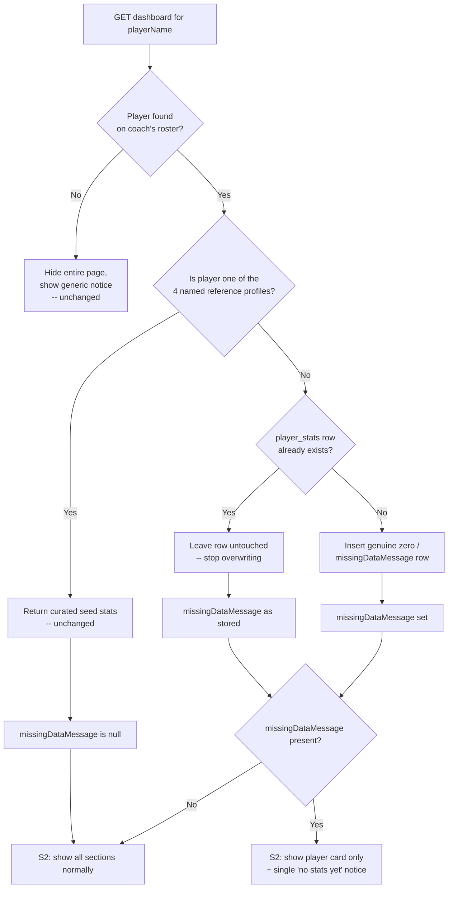

# fix: Stop the S2 dashboard from showing fabricated "default player" data when a player has no real stats

## Summary
When a player has no genuinely recorded `player_stats` (e.g. a newly added player who hasn't played a match or been assessed yet), the S2 dashboard currently shows fabricated, realistic-looking numbers and narrative text copied from one of four hardcoded reference profiles (Lionel Messi, Cristiano Ronaldo, Neymar Jr, Kylian Mbappe) — including literal copy-pasted sentences like Ronaldo's "Pace was strong, timing can improve." attributed to an unrelated player. This plan removes the fabrication at its source and changes the S2 dashboard so a player without real stats shows only their identity card plus a clear "no stats yet" notice, instead of another player's data.

## Problem Frame
This was discovered by live-testing the current system rather than from a bug report: fetching `/api/v1/players/dashboard` for "Carter" — a real player on the U08 team with no match history — returned `lastMatchSummary: "Pace was strong, timing can improve."` (Cristiano Ronaldo's exact seeded text), a fabricated `540` total minutes, a `7.1` average score, and non-zero clip counts, none of which reflect anything Carter has actually done.

The root cause lives in `scripts/serve-mockup.js`: `syncDefaultDashboardStats()` runs unconditionally on every server start (via `ensureDatabase()`) and calls `upsertPlayerStats` for **every** player using `getSeedDashboardStats(normalizedName, trend)`. For the four named reference profiles this correctly applies their curated demo data. For any other player, `getSeedDashboardStats` falls through to `buildDefaultDashboardStats(trend)`, which returns one of three fixed archetype profiles (keyed only by `trend`) — literally the same numbers and narrative text as Messi/Ronaldo/Neymar, just picked by trend bucket. Because `upsertPlayerStats` is an `ON CONFLICT ... DO UPDATE`, this **overwrites** the correct zero/"no stats yet" row that `buildNewPlayerDashboardStats` correctly wrote when the player was created — on every single server restart. The same shape of problem exists independently in the offline/local fallback client (`docs/ux/mockup/js/mockup-api-client.js`), whose `buildDashboardSnapshot` computes generic trend-based approximate numbers for **every** player, named or not, rather than reflecting "no real stats yet" for players outside the four seeded profiles.

The S2 markup itself only has narrow handling for this today: a single `missingDataMessage`-driven notice under the "Recent Performance" section, while the "Development Progress", "Match Time History", and "Video Assessments" sections keep rendering whatever numbers the payload contains — fabricated or not.

## Origin
- Live investigation performed during planning (this session): confirmed via `GET /api/v1/players/dashboard?playerName=Carter&actorEmail=joao@vantageiq.club` against the running dev server.
- docs/ux/mockup/S2-player-dashboard.html (target mockup)
- docs/plans/2026-07-04-004-feat-s2-dashboard-metric-change-indicators-plan.md (most recent prior plan touching this same dashboard/data path)
- No `docs/brainstorms/*-requirements.md` document exists for this change; there is no `CONCEPTS.md` or `STRATEGY.md` in the repo to carry forward.

## Scope Decisions (confirmed with requester)
The requester was asked to confirm three scoping forks and skipped the question, so this plan proceeds with the recommended defaults below and states them explicitly as assumptions:
- **Root-cause fix is in scope.** This plan fixes the data layer (`syncDefaultDashboardStats` and its offline-client equivalent), not just the S2 display logic — a display-only fix would be silently undone by the fabrication bug on the next server restart.
- **When stats are unavailable, all stats-derived sections are hidden**, not just "Recent Performance". Development Progress, Match Time History, Recent Performance, and Video Assessments are all suppressed in favor of one unified notice, because the clip counts shown in "Video Assessments" come from the same fabricated `player_stats` row (see Key Technical Decisions) rather than a live count of real clips.
- **The existing "player truly not found" behavior is unchanged.** Today a bad/stale player reference hides the entire page and shows a generic notice, because no real identity is known at all in that case. This plan's "show the player card only" behavior applies to the *found-but-no-stats* case, where identity (name, team, position) is genuinely known.

## Requirements Trace
- A player with no real recorded stats must never display another player's numbers or narrative text, in either the Postgres-backed path or the offline/local fallback path.
- The S2 dashboard must show the player's real identity (name, team, position, trend) plus a single clear "no stats recorded yet" notice when stats are unavailable, instead of partially-fabricated section content.
- The fix must be durable across server restarts — re-running the dev server's startup sync must not reintroduce fabricated data for a player who has none.
- Existing dashboard behavior for the four named reference profiles (Messi, Ronaldo, Neymar Jr, Mbappe) and for the "player not found" case must not regress.

## Scope Boundaries
### In scope
- Stopping `syncDefaultDashboardStats` (and the equivalent offline-client logic) from writing fabricated archetype data for any player outside the four named reference profiles.
- A one-time data remediation for `player_stats` rows that are already corrupted by this bug in the running dev database.
- S2 markup/script changes so a "no real stats" player shows only their identity card and a single notice.
- Mirroring the same "no stats yet" behavior in the offline/local fallback client.
- Marking the now-genuinely-nullable dashboard stat fields as nullable in the OpenAPI schema.
- Regression coverage (integration test for the sync fix and migration, Playwright, BDD, mapping doc).

### Deferred to follow-up work
- Deriving live clip counts for "Video Assessments" from the real `clips` table instead of the cached `player_stats.clip_*_count` columns — currently nothing updates those cached columns when clips are submitted or assessed for *any* player, named or not. This plan sidesteps the gap by hiding "Video Assessments" whenever stats are unavailable; making the section independently accurate for players who *do* have real clips but no growth stats is a separate, larger change.
- Any workflow for transitioning a player from "no stats yet" to having real recorded stats (e.g. a coach manually entering match/fitness data, or clip assessments feeding into growth metrics). No such pipeline exists today for any player.
- Changing the "player not found" page-level behavior (see Scope Decisions).

### Out of scope
- Authentication/authorization changes.
- Any other S2 field not related to this fabricated-data problem (e.g. the pre-existing Last Match binding, timeline bars — tracked separately).

## Key Technical Decisions
- **Restrict `syncDefaultDashboardStats` to the four named reference profiles.** Only Messi/Ronaldo/Neymar Jr/Mbappe get their curated seed data applied on every sync. Any other player is left untouched if a `player_stats` row already exists, and only gets a genuine zero/"no stats yet" row inserted if one is missing entirely (defensive backfill, not overwrite). This makes `buildDefaultDashboardStats`'s trend-archetype branch unreachable in the sync path; it becomes dead code safe to remove, since its only caller (`getSeedDashboardStats`'s fallback) is no longer exercised for real players.
- **Reuse `missingDataMessage` as the single authoritative "no stats" signal**, rather than introducing a new field. It already exists, is already set correctly by `buildNewPlayerDashboardStats` at player-creation time, and the OpenAPI/API-Mockup-Mapping docs already describe it as the missing-data indicator for the Recent Performance section — this plan just widens what the frontend does in response to it.
- **Hide, don't zero-fill, the stats-derived sections.** Rather than continuing to render "0 minutes", "N/A" scattered across four sections, S2 hides the Development Progress, Match Time History, Recent Performance, and Video Assessments sections entirely and shows one clear notice next to the player identity card. This avoids the confusing "half real, half placeholder" look and matches the requester's "present the player card only" framing.
- **One-time remediation migration, not a runtime repair.** Because the corruption only ever comes from two sources (creation-time zero-seed, or the boilerplate sync), any existing non-named player's `player_stats` row today is one of those two shapes — there is no third, legitimately-modified state to preserve. A single idempotent migration resets all non-named `player_stats` rows to the genuine "no stats yet" shape once; the code fix (above) prevents recurrence going forward.
- **Mirror the fix in the offline/local fallback client**, following the same pattern used for the metric-change-indicator work: `buildDashboardSnapshot` in `docs/ux/mockup/js/mockup-api-client.js` checks the same four-name allowlist and returns a genuine "no stats yet" payload for everyone else, instead of a generic trend-based approximation.

## High-Level Technical Design

## Implementation Units

### U1. Stop fabricating archetype stats for non-named players in `syncDefaultDashboardStats`
**Goal:** Eliminate the root cause — remove the ability for any player outside the four named reference profiles to have their stats overwritten with another player's archetype data.

**Requirements:** durable fix across server restarts; no regression to named-profile seeding.

**Dependencies:** none.

**Files:**
- scripts/serve-mockup.js
- apps/api/tests/integration/db/schema-bootstrap.spec.ts (or a new integration spec if a more suitable file exists for server-logic tests)

**Approach:**
- In `syncDefaultDashboardStats`, branch on whether `player.normalizedName` matches one of the four named reference profiles (the same set `getSeedDashboardStats` already special-cases: `lionel messi`, `cristiano ronaldo`, `neymar jr`, `kylian mbappe`).
  - Named profile: call `getSeedDashboardStats`/`upsertPlayerStats` as today (unchanged behavior).
  - Any other player: only insert a row if none exists yet, using the same genuine "no stats yet" shape `buildNewPlayerDashboardStats` already produces (zeroed counts, null scores, `missingDataMessage` set) — never call `upsertPlayerStats`'s overwrite path for a row that already exists.
- Remove `buildDefaultDashboardStats`'s trend-archetype branch once it has no remaining caller, or leave it in place only if another legitimate caller is found during implementation — do not leave unreachable code that could be re-wired into the overwrite path by a future edit without review.
- Double-check `getSeedDashboardStats`'s existing fallback (`return buildDefaultDashboardStats(trend);`) is only reached from the sync path being changed here; if any other caller depends on it, surface that as a blocker rather than silently changing behavior for it too.

**Patterns to follow:**
- The existing zero/"no stats yet" shape already produced by `buildNewPlayerDashboardStats` in scripts/serve-mockup.js.
- The existing named-profile branch structure in `getSeedDashboardStats`.

**Test scenarios:**
- Happy path: syncing a roster that includes a non-named player with an existing zero-state `player_stats` row leaves that row's values unchanged (specifically: does not introduce non-zero `total_minutes`, `average_score`, or a borrowed `last_match_summary`).
- Happy path: syncing still applies the four named profiles' curated seed data exactly as before (regression).
- Edge case: a non-named player with no `player_stats` row at all gets a genuine zero/"no stats yet" row inserted, not a fabricated one.
- Edge case: running the sync twice in a row (simulating two server restarts) produces identical results the second time (idempotency / regression test for the exact bug found).

**Verification:**
- Restarting the dev server against a database containing a non-named, no-stats player (e.g. a freshly created player) never changes that player's `player_stats` values.

### U2. One-time remediation migration for already-corrupted rows
**Goal:** Clean up `player_stats` rows that were already overwritten with fabricated archetype data before this fix existed.

**Requirements:** existing corrupted data must not persist indefinitely once the code fix (U1) stops new corruption.

**Dependencies:** none (independent of U1; both should ship together).

**Files:**
- apps/api/src/db/migrations/010_reset_fabricated_player_stats.sql
- apps/api/tests/integration/db/schema-bootstrap.spec.ts

**Approach:**
- Add a new idempotent migration that resets `player_stats` rows for any player whose `normalized_name` is **not** one of the four named reference profiles back to the genuine "no stats yet" shape (zeroed counts, null scores/messages cleared appropriately, `missing_data_message` set, metric-change columns cleared).
- Guard the `UPDATE` so it only touches rows that still look like generic, unmodified data (there is no other legitimate source of non-named `player_stats` content today, so this can safely target all non-named rows), and make the statement safe to rerun without changing already-reset rows a second time.
- Follow the existing migration style (`apps/api/src/db/migrations/008_player_stats_source_of_record.sql`, `009_player_stats_metric_change_indicators.sql`) for idempotent guard conditions and comments explaining intent.

**Patterns to follow:**
- Idempotent `UPDATE ... WHERE` guard style already used in `apps/api/src/db/migrations/009_player_stats_metric_change_indicators.sql`.

**Test scenarios:**
- Happy path: after the migration, a previously-corrupted non-named player's row shows zeroed counts, null scores, and a set `missing_data_message`.
- Edge case: the four named profiles' rows are untouched by this migration.
- Edge case: rerunning the migration is a no-op the second time (idempotency).

**Verification:**
- Every non-named player in the dev database shows a genuine "no stats yet" row after the migration runs once.

### U3. Mark now-nullable dashboard stat fields in the OpenAPI schema
**Goal:** Keep the API contract accurate now that stat fields (and the metric-change indicators) can legitimately be `null` for a real, expected reason rather than only via a fallback default.

**Requirements:** API contract stays additive/backward-compatible; documents the `missingDataMessage` contract.

**Dependencies:** U1.

**Files:**
- openapi/v1/schemas/players.yaml

**Approach:**
- Mark `currentLevelChange`, `fitnessChange`, and `skillProgressChange` (in both `PlayerDashboardStats` and the `metrics` object) as `nullable: true`, since a "no stats yet" player now legitimately returns `null` for these instead of a placeholder object.
- Add or extend a schema description on `missingDataMessage` stating it is the authoritative signal that stat-derived sections have no real data to display, so downstream consumers (including this codebase's own frontend) treat it as more than a Recent-Performance-only note.

**Patterns to follow:**
- Existing additive, backward-compatible schema extension style already used in this file.

**Test scenarios:**
- Test expectation: none beyond schema-shape review — this unit only changes documentation/schema annotations, not runtime behavior. Verify the schema still parses and existing contract tests (if any assert against this file) still pass.

**Verification:**
- The schema accurately reflects that a "no stats" dashboard response can return `null` for the metric-change fields.

### U4. Mirror the "no stats yet" behavior in the offline/local fallback client
**Goal:** Keep the offline/local fallback (`mockup-api-client.js`) consistent with the fixed backend behavior, so demo/offline mode doesn't independently fabricate data for non-named players.

**Requirements:** fallback parity with the backend path; no regression for the four named profiles (already covered by prior work).

**Dependencies:** U1 (mirrors its behavioral contract).

**Files:**
- docs/ux/mockup/js/mockup-api-client.js

**Approach:**
- In `buildDashboardSnapshot`, check the same four-name allowlist already used for `SEEDED_METRIC_CHANGE_INDICATORS`. For a named profile, keep today's behavior. For any other player (including ones added at runtime via "Add Player" in local mode), return the genuine "no stats yet" shape (zeroed counts, null scores, `missingDataMessage` set, `null` metric-change objects) instead of the generic trend-based approximate numbers currently computed for every player.
- Keep clip counts computed live from `store.clips` as today — that part of the offline client is already accurate per-player; only the growth/match-time/performance numbers need to switch to the "no stats" shape for non-named players.

**Patterns to follow:**
- The `SEEDED_METRIC_CHANGE_INDICATORS` lookup and per-player-override pattern already added to this file in the prior metric-change-indicator plan.
- `buildNewPlayerDashboardStats`'s zero/"no stats yet" shape in scripts/serve-mockup.js, mirrored client-side.

**Test scenarios:**
- Happy path: a locally-added, non-named player resolves to a "no stats yet" dashboard snapshot (zeroed values, `missingDataMessage` set) in offline/local mode.
- Happy path: the four named profiles retain their existing exact values in offline mode (regression).
- Integration: the "no stats" shape returned client-side has the same keys as the backend's "no stats" shape, so S2's binding script (U5) needs no backend-vs-fallback branching.

**Verification:**
- Toggling `window.__USE_MOCK_LOCAL__ = true` and viewing a non-named, non-seeded player's dashboard shows the same "no stats yet" behavior as the backend path.

### U5. Bind S2 to show the player card only when stats are unavailable
**Goal:** Make the dashboard actually hide fabricated-looking sections and show a single clear notice, using the now-trustworthy `missingDataMessage` signal.

**Requirements:** player identity card and navigation remain visible; stats-derived sections hidden as one unit; existing behavior for players with real stats is unchanged.

**Dependencies:** U1, U3, U4 (needs both runtime paths emitting the corrected shape).

**Files:**
- docs/ux/mockup/S2-player-dashboard.html

**Approach:**
- Group the "Development Progress", "Match Time History", "Recent Performance", and "Video Assessments" `.section` blocks so they can be toggled together (e.g. a shared class or a wrapping container), distinct from the always-visible player identity card and the final "Compare Player" / "Submit a Clip" CTA row.
- When `dashboard.performance.missingDataMessage` (or the equivalent top-level field) is present, hide that group and show one clear notice near the player identity card — reusing the existing `dashboardNotice` element or a new sibling notice scoped to "no stats yet" (distinct from the page-level not-found notice, which stays on the `!dashboard` early-return path).
- Remove the now-redundant narrower `metricMissingData` notice under "Recent Performance" once the whole section is hidden in this state, or confirm it naturally becomes unreachable and simplify only if that's unambiguous.
- Leave the "player not found" (`!dashboard`) branch untouched per Scope Decisions.

**Patterns to follow:**
- The existing `!dashboard` early-return notice-and-hide pattern already in this file, applied at the section-group level instead of the whole page.

**Test scenarios:**
- Happy path: loading S2 for a non-named, no-stats player (e.g. Carter) shows the player identity card (name/team/position/trend) and a single "no stats recorded yet" notice, with Development Progress, Match Time History, Recent Performance, and Video Assessments all hidden.
- Happy path: loading S2 for a named reference profile (e.g. Messi) shows all sections exactly as before (regression).
- Edge case: the "player not found" page-level behavior is unchanged (regression).

**Verification:**
- Visually and via Playwright, a no-stats player's dashboard never shows another player's numbers or text, and shows only their own identity plus a clear notice.

### U6. Regression coverage and documentation
**Goal:** Lock in the fix with tests and keep docs accurate.

**Requirements:** regression coverage for the exact bug found; documentation reflects the new `missingDataMessage` contract.

**Dependencies:** U1-U5.

**Files:**
- tests/playwright/s2-player-dashboard.spec.js
- tests/bdd/features/coach-player-development-dashboard.feature
- tests/bdd/features/step_definitions/coach-development-video-source.steps.js
- docs/ux/mockup/API-Mockup-Mapping.md

**Approach:**
- Extend the Playwright spec with a test for a non-named, no-stats player showing only the identity card and notice (per U5's test scenarios).
- Extend the BDD feature with a scenario for a "no stats yet" player profile, following the existing Background/Scenario table shape used for the other player-profile scenarios in this feature file.
- Update `docs/ux/mockup/API-Mockup-Mapping.md` to document that `missingDataMessage` now drives whole-section visibility, not just a Recent-Performance note, and that non-named players default to a genuine "no stats yet" state rather than demo data.

**Patterns to follow:**
- Existing Playwright assertions and BDD Background/Scenario shape already in these files (including the pattern established by the prior metric-change-indicator plan's regression coverage).

**Test scenarios:**
- Covered by U5's test scenarios; this unit is where they are actually implemented as runnable tests.

**Verification:**
- New tests fail against the pre-fix code path and pass after U1-U5 are implemented.

## Dependencies and Sequencing
- U1 and U2 both address the root cause (code + data) and can proceed in parallel; both must land before U5's frontend behavior is meaningful in the live dev database.
- U3 documents the contract U1 creates; U4 mirrors U1's contract in the offline client. Both can proceed once U1's shape is settled.
- U5 depends on U1, U3, and U4 so both runtime paths already emit the corrected shape before the UI is wired to it.
- U6 closes the loop once U1-U5 are in place.

## Risks and Mitigations
- Risk: the one-time remediation migration (U2) could reset a `player_stats` row that was legitimately customized by some means this plan didn't discover.
  - Mitigation: confirmed during investigation that no such mechanism exists today (clip submission/assessment does not write to `player_stats`); if implementation discovers otherwise, narrow the migration's `WHERE` guard before running it rather than resetting unconditionally.
- Risk: hiding "Video Assessments" for a no-stats player also hides real, already-submitted clip counts for that player.
  - Mitigation: explicitly called out and deferred (see Scope Boundaries) rather than silently accepted — a future plan can make clip counts independently live from the `clips` table.
- Risk: removing `buildDefaultDashboardStats`'s archetype branch could break an undiscovered caller.
  - Mitigation: U1 explicitly calls for verifying there is no other caller before removal, and flags it as a blocker if one is found.

## Open Questions
- Should "Video Assessments" eventually be made independently accurate (live clip counts) even when growth stats are unavailable, so a player with real submitted clips but no growth data isn't fully hidden? (Deferred — no live-aggregation pipeline exists yet for clip counts on any player.)
- Should there be a coach-facing workflow to move a player out of "no stats yet" (e.g. manually entering initial values), or does real data only ever arrive via a future clip-assessment-to-stats pipeline? (Deferred — out of scope for this fix.)
