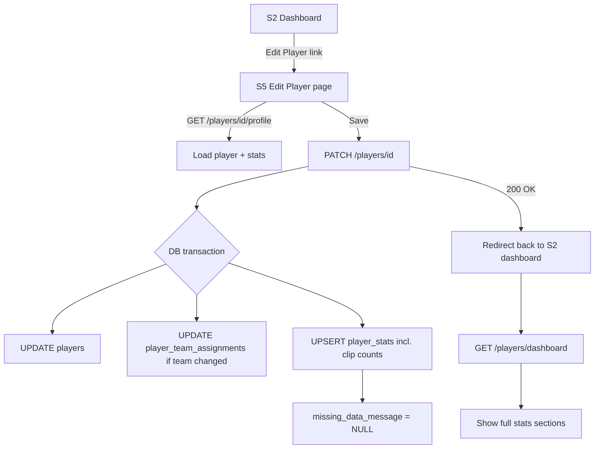

# feat: Add Edit Player profile page from S2 dashboard

## Summary

Add an **Edit Player** action on the S2 player development dashboard that opens a new coach-facing edit page (`S5-player-edit.html`). Coaches can view and save the full player profile — identity fields, every dashboard stat/rating (including metric-change badges), and clip counts — backed by a new `PATCH /v1/players/{playerId}` API. Saving clears `missingDataMessage` so a player previously in the "no stats yet" state immediately shows the full S2 dashboard on return.

## Problem Frame

The recent S2 dashboard work (see `docs/plans/2026-07-04-005-fix-s2-dashboard-missing-stats-default-player-plan.md`) correctly stopped fabricated stats and introduced a genuine **"no stats yet"** read path: new or unrecorded players show only their identity card plus a notice. That plan explicitly **deferred** the write workflow for moving a player out of that state.

Coaches still have no way to manually enter or correct player data. Today the mockup supports **create** (`POST /v1/players`) and **assign** (`POST /v1/players/{playerId}/assign`) but not **update**. `GET /v1/players/{playerId}` returns identity only; dashboard stats live in `player_stats` and are read-only after creation. For a POC where coaches bootstrap roster members before clips or external integrations exist, a first-class edit surface is the natural complement to the read-only dashboard.

## Origin

- User request (this session): add **Edit Player** on S2, new page, coach can set all player attributes including all ratings.
- Scope decisions confirmed with requester:
  - **Editable fields include clip submitted/assessed/pending counts** (coach may manually override cached clip counts, not only derived values).
  - **Clear `missingDataMessage` on save** so S2 immediately shows the full dashboard after the coach records stats.
- Related prior work:
  - `docs/plans/2026-07-04-005-fix-s2-dashboard-missing-stats-default-player-plan.md` (read path / no-stats contract)
  - `docs/plans/2026-07-04-003-feat-s2-player-dashboard-player-stats-source-of-record-plan.md` (`player_stats` as dashboard source of record)
  - `docs/brainstorms/2026-07-01-coaches-growth-match-time-performance-requirements.md` (coach need for editable progress data — high level only)

---

## Requirements Trace

- S2 exposes a clear **Edit Player** entry point for the currently viewed player.
- A dedicated edit page loads the player's current identity **and** full dashboard stats in one form.
- An active **Coach** can save changes to:
  - **Identity:** name, team, position, trend
  - **Development:** growth status, current level, fitness, skill progress, and all three metric-change indicators (label + trend)
  - **Match time:** total minutes, appearances, recent average
  - **Performance:** average score, last match score, last match summary
  - **Clip counts:** submitted, assessed, pending (manually editable per requester scope)
- Saving persists to Postgres (`players`, `player_team_assignments`, `player_stats`) and mirrors the same behavior in offline/local mode.
- When a player had `missingDataMessage` set, a successful save **clears** it so S2 no longer hides stats sections.
- Coach edits must **survive server restart** — startup sync must not clobber coach-saved rows (extends the durability fix from plan 005).
- Non-coach roles receive `403 forbidden`; unknown players receive `404 not_found`.
- OpenAPI contract, mockup mapping doc, Playwright, and BDD cover the new flow.

---

## Scope Boundaries

### In scope

- New mockup screen `S5-player-edit.html` and S2 navigation into it.
- `GET /v1/players/{playerId}/profile` (read full editable payload) and `PATCH /v1/players/{playerId}` (save).
- Backend implementation in `scripts/serve-mockup.js` (primary persistence path for this POC).
- Offline/local fallback in `docs/ux/mockup/js/mockup-api-client.js`.
- OpenAPI schema additions in `openapi/v1/schemas/players.yaml` and path wiring in `openapi/v1/openapi.yaml`.
- Minimal `apps/api` scaffold extension so existing contract/integration tests can assert the new shape.
- Regression tests and `docs/ux/mockup/API-Mockup-Mapping.md` update.

### Deferred to follow-up work

- **Bidirectional sync between `clips` table and `player_stats.clip_*_count` columns** — coaches may edit cached counts manually in this feature; nothing auto-reconciles them against live clip rows afterward. A future plan can derive clip counts from `clips` on read or recompute on clip submit/assess.
- **Audit trail / edit history** for who changed what and when.
- **Bulk edit** or spreadsheet import.
- **SystemAdmin edit path** — only Coach is in scope; admins use existing team/player management flows.
- **Age field on player** — S2 still displays a placeholder age string; no new `players.age` column in this plan.

### Out of scope

- Changing S2 read layout beyond adding the Edit entry point.
- Replacing video capture / assessment pipelines.
- Authentication changes beyond reusing existing Coach session checks.

---

## Key Technical Decisions

- **New screen `S5-player-edit.html`.** Screen ID `S5` is unused in the mockup index (`S4` = capture, `S6` = assessments). Keeps S2 read-only and gives the edit form room for grouped sections without modal cramming.
- **Separate profile read endpoint.** `GET /v1/players/{playerId}` stays identity-only for backward compatibility. Add `GET /v1/players/{playerId}/profile` returning `{ player, stats }` using the same stat shape as the dashboard's `stats` object (plus fields needed for editing metric-change columns). The edit page loads this endpoint once on open.
- **Unified `PATCH /v1/players/{playerId}`.** One request body updates identity, team assignment, and `player_stats` in a single transaction. Simpler coach UX (one Save) and matches "set all attributes" framing. Team change reuses strict-move semantics from assign (update `player_team_assignments`, bump `updated_at`).
- **Clear `missingDataMessage` on save.** After validation, if the payload represents a coach-initiated save (always, for this endpoint), set `missing_data_message = NULL`. This is the deliberate "bootstrap out of no stats yet" transition deferred from plan 005. No extra toggle required (confirmed with requester).
- **Extend startup sync durability to named profiles too.** Plan 005 made non-named `player_stats` rows insert-only on restart. Named reference profiles (Messi/Ronaldo/Neymar/Mbappe) still receive `upsertPlayerStats` overwrite today, which would erase coach edits on restart. Change `syncDefaultDashboardStats` so **every** player uses insert-if-missing only; never overwrite an existing `player_stats` row on startup. Named seed data applies only when the row is first created.
- **Clip counts are write-through cache.** Coaches edit `clip_submitted_count`, `clip_assessed_count`, `clip_pending_count` directly on `player_stats`. Document the intentional drift from the `clips` table in mapping notes; do not block save when counts disagree with live clips.
- **Name change validation mirrors create.** Reuse normalization (`toTitleCase`, 2–60 chars, allowed character class) and return `409 conflict` when `normalized_name` would collide with another player.
- **Coach roster scoping matches dashboard.** PATCH/GET profile require active Coach actor (session email) and verify the player belongs to a team led by that coach — same join pattern as `GET /players/dashboard`.

---

## High-Level Technical Design

---

## Implementation Units

### U1. Define OpenAPI contract for player profile read/update

**Goal:** Document the authoritative request/response shapes for the edit flow.

**Requirements:** Requirements trace (API contract); downstream mockup and tests can assert against schema.

**Dependencies:** none

**Files:**

- `openapi/v1/schemas/players.yaml`
- `openapi/v1/openapi.yaml`
- `apps/api/tests/contract/openapi.players.spec.ts` (if present — extend or add assertions)

**Approach:**

- Add `PlayerProfileResponse` with `{ data: { player: Player, stats: PlayerDashboardStats } }`.
- Add `UpdatePlayerProfileRequest` with:
  - Identity: `name`, `teamName`, `position`, `trend`
  - Stats: all editable `PlayerDashboardStats` fields including nullable metric-change objects and clip counts
  - Omit read-only/computed dashboard mirrors (`metrics`, `matchTime`, `performance` wrappers — server derives those on read)
- Add paths:
  - `GET /v1/players/{playerId}/profile`
  - `PATCH /v1/players/{playerId}`
- Document that a successful PATCH clears `missingDataMessage` and that clip counts are coach-editable cache fields.

**Patterns to follow:**

- Existing `PlayerDashboardStats` and `CreatePlayerRequest` validation style in `openapi/v1/schemas/players.yaml`
- Additive, backward-compatible schema extension pattern used in plan 004/005

**Test scenarios:**

- Contract test: OpenAPI includes both new operations and references `UpdatePlayerProfileRequest`
- Contract test: PATCH response returns updated `PlayerProfileResponse` shape

**Verification:**

- Schema files parse and contract spec passes.

---

### U2. Implement profile read/update in `scripts/serve-mockup.js`

**Goal:** Persist coach edits to Postgres with correct auth, validation, and transactional updates.

**Requirements:** Full editable field set; clear `missingDataMessage`; roster-scoped Coach auth; survive restart (with U3 sync change).

**Dependencies:** U1 (shape settled)

**Files:**

- `scripts/serve-mockup.js`

**Approach:**

- Add `findPlayerProfileById(playerId, coachId)` joining `players`, assignment, team, and `player_stats` (LEFT JOIN stats — create row if missing on PATCH, not on GET).
- Add `GET /api/v1/players/{playerId}/profile`:
  - Coach auth identically to dashboard
  - Verify player is on a team led by actor
  - Return `{ data: { player, stats } }` using existing `toDashboardPayload` stat mapping helpers where possible
- Add `PATCH /api/v1/players/{playerId}`:
  - Same auth/roster guard
  - Validate name/team/trend/enums/numeric fields
  - Transaction: update `players` (name, normalized_name, position, trend, updated_at); update assignment if `teamName` changed; upsert `player_stats` with all editable columns; force `missing_data_message = NULL`
  - Return `{ data: { player, stats } }`
- Refactor shared validation helpers near existing create/assign handlers (`normalizeComparable`, team lookup, name rules).

**Patterns to follow:**

- `POST /players` create transaction in `scripts/serve-mockup.js`
- `upsertPlayerStats` / `PLAYER_STATS_COLUMNS` helpers added in plan 005
- Dashboard coach scoping query in `GET /players/dashboard`

**Test scenarios:**

- Happy path: PATCH updates identity and stats; subsequent GET profile and GET dashboard reflect changes
- Happy path: PATCH on player with `missing_data_message` set clears it; dashboard returns null message
- Edge case: name change to conflicting normalized name returns `409 conflict`
- Edge case: inactive/non-coach actor returns `403 forbidden`
- Edge case: player not on coach roster returns `404 not_found`
- Edge case: PATCH clip counts persists values even when `clips` table counts differ

**Verification:**

- Manual: edit a "no stats yet" player via API, reload S2 — full sections visible.

---

### U3. Stop startup sync from overwriting coach-edited stats (all players)

**Goal:** Ensure coach saves are durable across server restart, including for named reference profiles.

**Requirements:** Durability requirement; complements plan 005.

**Dependencies:** none (can land in parallel with U2; must ship together)

**Files:**

- `scripts/serve-mockup.js`
- `apps/api/tests/integration/db/schema-bootstrap.spec.ts` (optional comment/assertion if migration not needed)

**Approach:**

- Change `syncDefaultDashboardStats` named-profile branch from `upsertPlayerStats` (overwrite) to `ensurePlayerStatsRowExists` (insert-only), matching non-named behavior from plan 005.
- Named seed stats apply only when no row exists yet.
- Add integration-style assertion or inline test comment that restarting sync twice does not change an existing row's `total_minutes` / `missing_data_message`.

**Patterns to follow:**

- `ensurePlayerStatsRowExists` from plan 005 implementation

**Test scenarios:**

- Happy path: after PATCH, simulated second sync pass leaves row unchanged
- Regression: brand-new named profile still gets seed row on first insert

**Verification:**

- Restart mockup server after editing Messi stats — edited values remain.

---

### U4. Mirror profile read/update in offline/local fallback client

**Goal:** Edit page works in CI and offline mode without Postgres.

**Requirements:** Fallback parity with backend; Playwright can force local mode.

**Dependencies:** U1, U2 (behavioral contract)

**Files:**

- `docs/ux/mockup/js/mockup-api-client.js`

**Approach:**

- Add `getPlayerProfile(playerId)` and `updatePlayerProfile(playerId, payload)` to `MockupApi`.
- Local mode: read from `localStorage` store + in-memory stats map (extend store shape if needed — e.g. `playerStats` keyed by player id, or embed stats on player records).
- On update: apply same validation rules as server; clear `missingDataMessage` on stats; update `store.players` and stats; persist via `saveStore`.
- Backend mode: delegate to new REST endpoints with session email.

**Patterns to follow:**

- Existing `createPlayer` / `assignPlayer` / `getDashboardPlayer` branching on `shouldUseBackendPlayersMode()`

**Test scenarios:**

- Happy path: local edit of non-named player clears no-stats state in subsequent dashboard read
- Happy path: backend delegation returns same keys as local path

**Verification:**

- `window.__USE_MOCK_LOCAL__ = true` — edit flow round-trips without DATABASE_URL.

---

### U5. Build `S5-player-edit.html` edit page

**Goal:** Coach-facing form to view and save all editable attributes.

**Requirements:** All field groups; validation feedback; return navigation to S2.

**Dependencies:** U4 (API client methods)

**Files:**

- `docs/ux/mockup/S5-player-edit.html` (new)
- `docs/ux/mockup/index.html` (optional link in Coach Journey section)
- `scripts/serve-mockup.js` (route alias if needed — existing static file serving should suffice)

**Approach:**

- Page loads `playerId` from query string (`?playerId=`); redirect/error if missing.
- On load: call `MockupApi.getPlayerProfile(playerId)`; bind form fields grouped like S2 sections:
  - **Identity:** name, team (select from coach teams), position, trend
  - **Development:** growth status, current level, fitness, skill progress; three metric-change pairs (label + trend select)
  - **Match time:** total minutes, appearances, recent avg
  - **Performance:** average score, last match score, last match summary
  - **Clip counts:** submitted, assessed, pending
- Save button calls `MockupApi.updatePlayerProfile`; on success navigate to `S2-player-dashboard.html?player=<encoded name>`.
- Cancel/back returns to S2 without saving.
- Reuse `site.css` form patterns from `S3-team-management.html` (`.form-label`, `.modal-form` styling adapted to full page).
- Show inline error notice on validation/API failure (reuse `#dashboardNotice`-style pattern).

**Patterns to follow:**

- `S3-team-management.html` form/modal structure
- `S4-video-capture.html` submit + validation notice pattern

**Test scenarios:**

- Happy path: page renders all field groups populated from profile GET
- Happy path: save redirects to S2 with updated name/stats visible
- Edge case: missing `playerId` shows clear error state
- Edge case: API 403/404 shows notice, form disabled or hidden

**Verification:**

- Visual review: edit page matches mockup visual language; all S2 dashboard fields are represented.

---

### U6. Add Edit Player entry point on S2 dashboard

**Goal:** Connect read dashboard to edit page for the viewed player.

**Requirements:** S2 entry point requirement.

**Dependencies:** U5

**Files:**

- `docs/ux/mockup/S2-player-dashboard.html`

**Approach:**

- Add **Edit Player** button in toolbar or player-summary area (secondary button style).
- Link target: `./S5-player-edit.html?playerId=<id>` using `dashboard.player.id` from binding script.
- Show button whenever dashboard loaded successfully (including no-stats-yet state — editing is especially important there).
- Hide/disable on `!dashboard` not-found path (unchanged).

**Patterns to follow:**

- Existing toolbar button pattern (`Back to Player List`)

**Test scenarios:**

- Happy path: Edit Player navigates to S5 with correct id
- Happy path: available even when `missingDataMessage` is set (no-stats player)

**Verification:**

- Click-through from S2 → S5 → save → S2 shows updated data.

---

### U7. Regression coverage and documentation

**Goal:** Lock in edit flow with tests and update mapping doc.

**Requirements:** Requirements trace (tests + docs).

**Dependencies:** U1–U6

**Files:**

- `tests/playwright/s2-player-dashboard.spec.js` (navigation test)
- `tests/playwright/s5-player-edit.spec.js` (new)
- `tests/bdd/features/coach-player-development-dashboard.feature` (or new `coach-edit-player-profile.feature`)
- `tests/bdd/features/step_definitions/coach-development-video-source.steps.js` (or new steps file)
- `docs/ux/mockup/API-Mockup-Mapping.md`

**Approach:**

- Playwright: force offline mode via `addInitScript` (same pattern as S1/S2 specs); test S2 → S5 navigation; test editing a no-stats player clears notice on return to S2.
- BDD: scenario — coach opens edit page, updates a stat field, saves, dashboard shows updated value and no missing-data message.
- Update mapping table with S5 rows for GET profile and PATCH.
- Note clip-count manual override and `missingDataMessage` clearing behavior.

**Patterns to follow:**

- `tests/playwright/s2-player-dashboard.spec.js` offline init script pattern
- Existing BDD dashboard feature Background shape

**Test scenarios:**

- Covered by U5/U6 verification scenarios; implemented as runnable tests in this unit.

**Verification:**

- `npx playwright test tests/playwright/s5-player-edit.spec.js` passes
- Cucumber feature passes

---

## Dependencies and Sequencing

- **U1** first (contract shapes).
- **U2 + U3** in parallel once U1 is settled; both must land before manual end-to-end verification.
- **U4** after U2 contract is stable.
- **U5** depends on U4; **U6** depends on U5.
- **U7** closes after U1–U6.

Recommended implementation order: U1 → U2 + U3 → U4 → U5 → U6 → U7.

---

## Risks and Mitigations

| Risk | Mitigation |
|------|------------|
| Coach-edited clip counts drift from `clips` table | Accepted for POC per requester scope; document in API-Mockup-Mapping; defer live reconciliation |
| Name change breaks S2 links using `?player=` name query | Redirect back to S2 using updated name from PATCH response; S1 list already keys by id internally |
| Duplicate `trend` on `players` vs `player_stats` | PATCH writes both; prefer `players.trend` as identity trend on dashboard read (existing behavior) — keep in sync in PATCH handler |
| GET profile without stats row | Return stats object with same "no stats yet" defaults as dashboard, or lazy-create empty row on first PATCH only |
| OpenAPI `Player.id` type is integer but DB uses string ids like `p_10` | Align PATCH path param schema with actual id type used in DB/mockup (string) — fix in U1 if contract currently wrong |

---

## Open Questions

- Should S1 player list also expose **Edit** (shortcut to S5)? Deferred — S2 entry point satisfies the stated request; S1 link is a one-line follow-up.
- Should average score accept string `"N/A"` or only numeric/null? Match existing dashboard display conventions (`"N/A"` strings in mockup, numeric in DB) — implementer should normalize consistently with `toDashboardPayload` on read.
