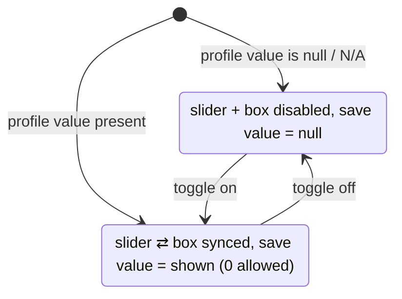

# feat: Slider controls for S5 ratings and scores

## Summary

Replace the free-text rating inputs and free-text/number score inputs on `docs/ux/mockup/S5-player-edit.html` with a reusable control: a bounded slider synced to a numeric box, plus a per-metric "not recorded" toggle that carries the null state. Applies to the three Development Progress ratings (0–100%) and the two performance scores (0–10). A save clears the S2 no-stats notice only once at least one rating is recorded.

---

## Problem Frame

S5 currently enters Current Level, Fitness, and Skill Progress as unconstrained text (`e.g. 92%`) and the two scores as bare number inputs. Nothing enforces the range, there is no fast way to nudge a value, and — most importantly — a control that always rests at a value cannot distinguish "not recorded yet" from a genuine `0`. The S2 dashboard relies on null ratings (via `missingDataMessage`) to show the identity card only, so the edit control must represent absence as a first-class state rather than collapsing it into zero.

A second behavior gap compounds this: the save path hard-clears `missingDataMessage` on every PATCH (`scripts/serve-mockup.js:1027` and its client mirror). Once per-metric toggles let a coach save with everything still unrecorded, that unconditional clear would drop S2 out of the no-stats state into empty sections. The clear must become conditional on at least one recorded rating.

---

## Requirements

Traces to `docs/brainstorms/2026-07-05-s5-percentage-slider-controls-requirements.md`.

**Control behavior**

- R1. Current Level, Fitness, Skill Progress use a slider synced to a numeric box over 0–100 in whole-number steps (origin R1, R2).
- R2. Average Score and Last Match Score use the same control over 0–10 in 0.1 steps (origin R5).
- R3. Slider and numeric box stay in sync in both directions (origin R2).
- R4. Each metric has a "not recorded" toggle: off = null (`N/A`) with disabled inputs; on = the shown value, where `0` is a valid recorded value distinct from not-recorded (origin R3, R6).
- R5. A numeric box value outside its field's range is corrected on blur to the nearest bound, with the box visibly snapping so the coach sees the correction (origin R8).

**Load / save / persistence**

- R6. Opening S5 sets each control from the profile: a recorded value shows the value with its toggle on; a null/`N/A` value shows the toggle off with inputs disabled (origin R7).
- R7. A saved rating persists in its existing `"N%"` string form so S2 still displays `N%`; a saved score persists as its number; unrecorded metrics persist as null (origin R4, R6).
- R8. A save clears `missingDataMessage` only once at least one Development Progress rating (Current Level, Fitness, or Skill Progress) is recorded; saving with all three still not-recorded leaves the notice in place (origin R9).

**Unchanged**

- R9. Metric-change badges, Recent Avg, Total Minutes, Appearances, and clip counts keep their current inputs (origin R10, R11).

---

## Key Technical Decisions

- **Keep ratings as `"N%"` strings; parse/format at the control boundary.** `player_stats` stores ratings as strings like `"92%"` and S2 renders them verbatim. The control works in numbers internally, parsing `"92%" → 92` on load and formatting `92 → "92%"` on save. Preserves origin R4/R7 display and avoids any storage migration.
- **The toggle is the single source of the null state.** Toggle off forces the saved value to null regardless of the slider's resting position; toggle on sends the shown number. This is the mechanism that keeps `0%` distinct from not-recorded, so both the control and the payload builder key off the toggle, not off an empty string.
- **Toggling on never auto-lands on `0`.** On enable, the control shows the last value entered this session if any, otherwise the range midpoint (`50` for ratings, `5.0` for scores) — never `0`. `0` results only when the coach explicitly sets it. Clearing the numeric box while the toggle is on restores the previous valid value on blur rather than coercing to `0`, so an emptied enabled box never serializes a spurious recorded `0`.
- **Clamp on blur, visibly.** Out-of-range typed values snap to the nearest bound on blur (a single trigger, not "sometimes on save"), and the box updates in place so the coach sees the correction.
- **Notice-clearing moves from unconditional to rating-gated, in both the backend and the offline client.** `parseUpdateProfilePayload` sets `missingDataMessage: null` today; it becomes: null when any of the three ratings is non-null after parse, otherwise `'Performance metrics are not available yet.'`. The client mirror in `docs/ux/mockup/js/mockup-api-client.js` applies the identical rule so offline and backend modes agree.
- **One reusable control factory, not five bespoke widgets.** A single JS builder renders slider + number box + toggle parameterized by range, step, and display suffix (`%` vs none), so the three ratings and two scores share behavior and the round-trip logic is written once.

---

## High-Level Technical Design

The load-bearing shape is the per-metric control's two-state behavior and its number ⇄ string boundary. Directional, not prescriptive.

Load and save boundary (ratings): `"92%"` ⇄ `92` at the control; scores pass through as numbers. On save, the toggle decides null vs value before the notice-gate reads the three ratings.

---

## Implementation Units

### U1. Reusable slider + number box + toggle control on S5

- **Goal:** Add a control factory and markup that renders slider + synced numeric box + "not recorded" toggle, parameterized by range/step/suffix.
- **Requirements:** R1, R2, R3, R4, R5.
- **Dependencies:** none.
- **Files:** `docs/ux/mockup/S5-player-edit.html` (markup for the five fields + `<style>` + control-factory JS in the existing inline script).
- **Approach:** Replace the three rating text inputs (`fieldCurrentLevel`, `fieldFitness`, `fieldSkillProgress`) and the two score number inputs (`fieldAverageScore`, `fieldLastMatchScore`) with the control markup. A factory wires: slider `input` → box live-sync; box → slider live-sync, with clamp-to-nearest-bound applied on `blur` (single trigger); toggle `change` → enable/disable slider+box. On enable, seed the value per the KTD rule (last-entered-this-session, else range midpoint — never `0`); on `blur` of an empty enabled box, restore the previous valid value rather than coercing to `0`. Ratings use `min=0 max=100 step=1` and a `%` display; scores use `min=0 max=10 step=0.1`. Give each control an accessible name that ties its slider, box, and toggle to the metric label, and reflect the toggle's on/off and the resulting disabled state to assistive tech (`aria-label`/`aria-disabled`). Keep element ids stable where possible or expose a `getState()/setState()` per control for U2 to read.
- **Patterns to follow:** existing inline-script structure and `setValue`/`value` helpers in `S5-player-edit.html`; existing `.form-grid`/`.form-field` styling and the metric-change-row layout.
- **Test scenarios:**
  - Dragging a rating slider updates its box and vice versa (Covers AE1).
  - Typing `140` into a rating box snaps the box to `100` on blur (Covers AE5).
  - Toggling "not recorded" off disables the slider and box; toggling on re-enables them and seeds a non-zero value (midpoint when there is no prior value), not `0`.
  - Clearing an enabled box and blurring restores the previous valid value rather than showing `0`.
  - A score control accepts `7.5` on the 0–10 range and steps by `0.1` (Covers AE4).
- **Verification:** All five fields render as slider + box + toggle; ranges/steps match field type; disabled state visibly follows the toggle.

### U2. Wire load and save round-trip through the controls

- **Goal:** Populate controls from the profile and build the save payload from control state, preserving `"N%"` strings and null semantics.
- **Requirements:** R4, R6, R7.
- **Dependencies:** U1.
- **Files:** `docs/ux/mockup/S5-player-edit.html` (the `populate()` and `buildPayload()` functions).
- **Approach:** In `populate()`, for each rating parse the stored string (`"92%"`/`null`/`"N/A"`): a numeric parse sets value + toggle on; null/`N/A` sets toggle off + disabled. Scores set value + toggle on when a number is present, toggle off when null. In `buildPayload()`, emit `"N%"` for a recorded rating and `null` when its toggle is off; emit the number for a recorded score and `null` when off. `0` with toggle on must serialize as `"0%"` / `0`, not null.
- **Patterns to follow:** current `populate()`/`buildPayload()` and the `displayText` helper in `S5-player-edit.html`.
- **Test scenarios:**
  - Opening a player with Current Level `92%` shows toggle on, value `92`; save after dragging to `85` sends `"85%"` (Covers AE1).
  - Opening a no-stats player shows every rating toggle off with disabled inputs (Covers AE2).
  - A rating toggled on and set to `0` serializes as `"0%"`, distinct from not-recorded (Covers AE3).
  - A score cleared via "not recorded" serializes as `null` (Covers AE4).
- **Verification:** Round-trip load→edit→save→reload preserves recorded values and null states across all five metrics.

### U3. Gate notice-clearing on a recorded rating (backend + offline client)

- **Goal:** Clear `missingDataMessage` on save only when at least one rating is recorded; otherwise retain the no-stats message.
- **Requirements:** R8.
- **Dependencies:** none (independent of U1/U2; can land first or last).
- **Files:** `scripts/serve-mockup.js` (`parseUpdateProfilePayload`, ~line 1027), `docs/ux/mockup/js/mockup-api-client.js` (its `parseUpdateProfilePayload` mirror).
- **Approach:** After parsing `currentLevel`/`fitness`/`skillProgress`, compute `hasRating = [currentLevel, fitness, skillProgress].some(v => v !== null)`. Set `missingDataMessage: hasRating ? null : 'Performance metrics are not available yet.'`. Apply the identical expression in the client mirror so both modes agree. There is no shared named constant today — the message is an inline string literal repeated at several sites in `serve-mockup.js`; reuse the same literal wording inline to match the existing pattern.
- **Patterns to follow:** the existing `'Performance metrics are not available yet.'` literal in `serve-mockup.js` (seed stats and the `010` reset migration) — reuse the same wording verbatim.
- **Test scenarios:**
  - Saving a no-stats player with all ratings not-recorded returns a profile whose `missingDataMessage` is still set (Covers AE2).
  - Saving with Current Level recorded at `70%` returns `missingDataMessage: null` (Covers AE6).
  - Backend and offline client produce the same `missingDataMessage` outcome for the same payload.
- **Verification:** No-rating save keeps the notice; any-rating save clears it, identically in both modes.

### U4. Regression coverage and mapping doc

- **Goal:** Lock the control round-trip and the notice-gating behavior, and update the API/mockup mapping.
- **Requirements:** R4, R6, R7, R8.
- **Dependencies:** U1, U2, U3.
- **Files:** `tests/playwright/s5-player-edit.spec.js`, `tests/bdd/features/coach-player-development-dashboard.feature`, `tests/bdd/features/step_definitions/coach-development-video-source.steps.js`, `docs/ux/mockup/API-Mockup-Mapping.md`.
- **Approach:** Extend the Playwright S5 spec with the slider/toggle round-trip, the `0%`-vs-not-recorded case, the clamp-on-blur case, a score round-trip that clears to null, and a no-rating save that keeps the notice. Add a BDD scenario "Saving with no ratings recorded keeps the no-stats notice" alongside the existing clears-the-notice scenario, and update the step that saves stats so it drives the rating-gated clear. Cover the score-only edge case: a save that records only a score (no rating) keeps the notice, so S2 still hides the performance section — assert this explicitly so the intended cross-screen behavior is locked. Update `API-Mockup-Mapping.md` to note the control shape and the rating-gated `missingDataMessage` clear (replacing the current "always clears on save" wording).
- **Patterns to follow:** existing `tests/playwright/s5-player-edit.spec.js` structure and its `addInitScript` local-mode forcing; existing BDD scenario/step patterns in the two BDD files.
- **Test scenarios:**
  - Covers AE1: recorded rating round-trip via slider.
  - Covers AE2: no-rating save keeps identity-card-only + notice on S2.
  - Covers AE3: `0%` recorded is distinct from not-recorded.
  - Covers AE4: score round-trip on the 0–10 range and clear-to-null persists as `N/A`.
  - Covers AE5: out-of-range clamps to bound on blur.
  - Covers AE6: recording one rating clears the notice and shows stats sections on S2.
  - Score-only save (a score recorded, all ratings not-recorded) keeps the notice and hides the performance section on S2.
- **Verification:** Playwright and BDD suites pass; mapping doc reflects the new control and clearing rule.

---

## Scope Boundaries

- Metric-change badges (`"Up 5%"` + trend) keep their text-label-plus-trend inputs — they are signed deltas, not absolute ratings.
- Recent Avg, Total Minutes, Appearances, and clip counts keep their current inputs.
- No change to `player_stats` storage types or columns; ratings stay `"N%"` strings.

### Deferred to Follow-Up Work

- Numeric storage for ratings (drop the `%` string) — only if a future need outweighs preserving the current display path.
- Toggle affordance polish (checkbox vs switch styling) within the mockup design language.

---

## Open Questions

Deferred to implementation:

- Exact disabled-state styling and whether the toggle renders as a checkbox or a styled switch — a visual choice resolved against the existing mockup CSS during U1. The disabled/not-recorded state must stay visually distinct from an active control so the two don't read alike at a glance.
- Whether the score controls show a coarse tick strip; default is a plain slider unless it reads poorly at 0.1 steps.
- Fixture check for the rating-gated clear: any seed/fixture that carries both non-null ratings and a set `missingDataMessage` (e.g., the migration-008 seeded player) will now clear the notice on the first save under R8. Confirm no existing test relies on such a player staying in the no-stats state after an edit; adjust the fixture or test if so.

---

## Sources & Research

- `docs/brainstorms/2026-07-05-s5-percentage-slider-controls-requirements.md` — origin requirements.
- `docs/ux/mockup/S5-player-edit.html` — current inputs (`fieldCurrentLevel`/`fieldFitness`/`fieldSkillProgress`, `fieldAverageScore`/`fieldLastMatchScore`), `populate()`/`buildPayload()`.
- `scripts/serve-mockup.js` — `parseUpdateProfilePayload` (unconditional `missingDataMessage: null` at ~line 1027); seed stats and the `'Performance metrics are not available yet.'` literal.
- `docs/ux/mockup/js/mockup-api-client.js` — offline mirror of the update payload parsing.
- `docs/ux/mockup/API-Mockup-Mapping.md` — current "always clears on save" edit contract to be updated.
- `docs/plans/2026-07-04-006-feat-s2-edit-player-profile-plan.md` — the plan that introduced S5 and the current clearing behavior.
