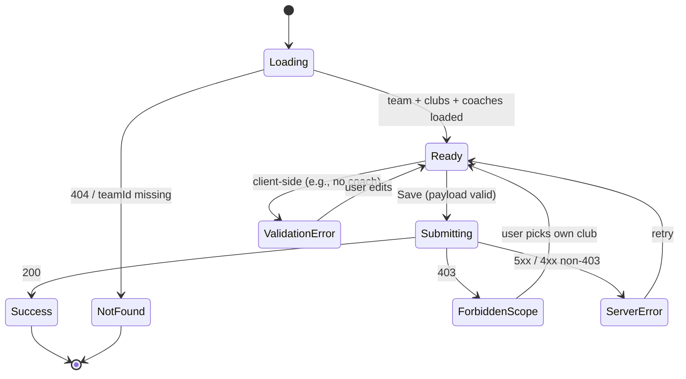

# feat: Team Update screen + team status (active/inactive) for S3

## Summary

Three coordinated changes:

1. **A new `teams.status` column** (`active` / `inactive`) with a backfill defaulting every existing seeded team to `active`, mirroring the `users.status` shape and DDL pattern.
2. **A `Show active` checkbox (default ON) and an `Only my teams` checkbox on the S3 teams table** — they narrow the rendered rows; unchecking `Show active` reveals inactive rows. Both filters ride on top of the existing club filter and the prior coach-only `Only show my clubs` toggle.
3. **A new `S3a-team-update.html` screen** (a row-action link) allowing a Coach (their own club only) or SystemAdmin (any team) to update a team's lead coach, the team's club, and the team's status. The new screen honors the answer to "should S3a expose Status?" — **yes**, the user confirmed Status belongs on the S3a form (so the user can both un-active a stale team and re-activate it from the same place they edit coach/club).

The three changes ship together because each is meaningless without the other two: status without a UI control to flip it would be invisible; a control without the column would 404; an update screen without a status field would force admins to a separate tool. Backend transaction is atomic per update.

## Problem Frame

Today teams exist in a flat namespace with no lifecycle: a team that finishes its season in November still shows up alongside a freshly created one in May, an existing-club transfer leaves a ghost team visible in the old club, and there's no signal in the UI for "this team is no longer active." Users also want to move teams between clubs and reassign their coach — supported today only via the modal-style change-coach path, exclusive to SystemAdmin, and the existing pattern doesn't permit club moves at all. The prior plan (`docs/plans/2026-07-06-005-feat-manage-club-table-and-s3-filter-plan.md`) introduced the `clubs` entity and the S3 admin/coach club filter but left the team-update path untouched.

This plan layers on top of that: a `status` field for lifecycle, two S3 checkboxes to make the roster manageable, and a one-stop S3a screen for coaches/admins to change coach + club + status in one save.

## Requirements

### Status (lifecycle) requirements

- **S1.** A `teams.status` column exists, `TEXT NOT NULL DEFAULT 'active' CHECK (status IN ('active', 'inactive'))`. Mirrors the `users.status` shape (`apps/api/src/db/schema/tables.sql` line 8).
- **S2.** Existing seeded teams are backfilled with `status = 'active'` (idempotent — running the migration twice doesn't change any row).
- **S3.** The `Team` payload returned by every `GET /v1/teams`, `POST /v1/teams`, `POST /v1/teams/coach`, and the new update endpoint (below) includes a `status` field.

### S3 surface requirements

- **S4.** S3 renders two new checkboxes in the existing filter row (next to the existing club-filter dropdown): `Show active` (default **ON**) and `Only my teams` (default OFF, replaces — or runs alongside — the existing `Only show my clubs` checkbox per the user message "with checkbox default to 'show active' and another checkbox 'only my teams'"). The exact placement next to the club filter is preserved; the existing admin-vs-coach role split (admin hides the coach toggle, coach shows it) is preserved.
- **S5.** When `Show active` is ON (default), the table excludes `status = 'inactive'` rows. When OFF, the table includes both.
- **S6.** When `Only my teams` is ON for a Coach actor, the table excludes teams whose `club_id` is not in `coach_clubs` for that user. The toggle is **hidden** for SystemAdmin. (Refines the prior `Only show my clubs` checkbox into the user's preferred wording.)
- **S7.** The empty state message ("No teams match this filter") handles the all-filters-on case.
- **S8.** S3 row actions still include `View`, `Assign`, the admin-only `Change Coach`, and the new `Update` link from R1–R11 below. Inactive rows display the same actions (no separate "reactivate" button needed; reactivation is the `Update` screen).

### Team Update (S3a) requirements

- **R1.** Each row in the S3 team table exposes an `Update` action that navigates to `S3a-team-update.html?teamId=<id>`. Inactive rows expose `Update` too (so a reactivation is one click away).
- **R2.** The S3a page shows the team's identity (`name`, `ageGroup`, `clubName`), its current `leadCoach`, its current `status`, and its `playerCount`. All five are read-only on this screen.
- **R3.** Coach, Club, **and Status** are the only fields editable on S3a (per user answer `status-on-s3a`). The status field is a radio/select with `active` and `inactive` options.
- **R4.** The Coach select lists active Coaches (`listActiveCoaches()`).
- **R5.** The Club select lists clubs the actor can manage (admin: all; coach: only `coach_clubs`-assigned clubs).
- **R6.** Submitting the update calls a new endpoint `POST /v1/teams/:teamId/update` with body `{ coachEmail, clubId, status, actorRole, actorEmail }`. The handler runs a single transaction that:
    - validates role-scoped club assignment (Coach may only move into one of their own clubs);
    - validates `status ∈ {active, inactive}`;
    - atomically `UPDATE teams SET lead_coach_email, club_id, status, updated_at = NOW()` and upserts `coach_clubs` for the new coach when coach changes clubs.
- **R7.** A Coach updating one of their own teams can move it only into one of their own clubs (403 `forbidden_scope`); a Coach attempting to set `status = 'inactive'` for **a team they own in their own club** is allowed (you can deactivate your own).
- **R8.** A SystemAdmin updating any team can pick any club and any status.
- **R9.** On 200, redirect to S3 with a toast confirming the update; on 4xx/5xx, render the inline error and stay on S3a.
- **R10.** Unauthenticated/inactive users bounce to S0 (`docs/ux/mockup/README.md`).
- **R11.** A new Playwright spec `tests/playwright/team-update.spec.js` covers: coach happy path (coach + status flip), SystemAdmin cross-club move + status flip, validation rejection for coach-move-into-foreign-club, and the `>= 3` named-team invariant.

## Scope Boundaries

### In scope

- New `teams.status` column, migration, backfill, idempotency, index on `(status, club_id)`.
- Two new S3 checkboxes: `Show active` (default ON) and `Only my teams` (default OFF).
- New screen `docs/ux/mockup/S3a-team-update.html` with header, current snapshot, coach select, club select, status field, save/cancel buttons.
- A new S3a navigation path from each S3 row's `Actions` cell (`Update` button alongside `View`, `Assign`, and admin-only `Change Coach`).
- New endpoint `POST /v1/teams/:teamId/update` accepting `{ coachEmail, clubId, status, actorRole, actorEmail }`, validating role-scoped club + status, and applying all three mutations atomically.
- `MockupApi.updateTeamCoachAndClub(teamId, payload)` extending to also update `status`, with offline-mode parity.
- Updated `MockupApi.listTeamSummary` and offline seed to include `status`.
- OpenAPI additions: `Team.status`, `UpdateTeamRequest { coachEmail, clubId, status, actorRole, actorEmail }`, the new endpoint.
- New section in `docs/ux/mockup/API-Mockup-Mapping.md` (replacing the placeholder section from the first version of this plan) covering all three deliverables.
- New `tests/playwright/team-update.spec.js` with the at-least-3 floor.

### Deferred to follow-up work

- Editing `name` or `ageGroup` on the update screen (out of confirmed scope).
- Auto-archiving a season's worth of teams (bulk status flip — separate ticket).
- Multi-coach team support (assistant coaches / co-coaches).
- Historical audit timeline for coach/club/status changes.
- Reactivate-via-S3-row-action: reactivation lives only on S3a for this plan.
- Renaming a club from S3a (club-level rename belongs on a future admin surface, not S3a).
- Notification flows when a team is deactivated (e.g., notify the coach).

### Out of scope

- New role types.
- A brand-new `clubs` admin CRUD screen.
- Changing the `coach_clubs` M:N model.

## Key Technical Decisions

- **DDL mirrors `users.status`.** Same `CHECK (status IN ('active','inactive'))` shape, same `DEFAULT 'active'`, same `updated_at` stamping pattern. The new index `idx_teams_status_club (status, club_id)` covers the S3 filter `WHERE status = ? AND club_id = ?` that's used by both roles.
- **`Show active` defaults ON** (user answer `show-active-default`). Default-on is the friendly behavior: a fresh S3 view shows what the team is currently using, not zombie teams. To see inactive rows, the user unchecks.
- **`Only my teams` replaces `Only show my clubs`.** The user's exact words were "checkbox default to 'show active' and another checkbox 'only my teams'" — that wording is the contract. The prior manage-club plan's `Only show my clubs` checkbox evolves into `Only my teams` (the meaning is identical for Coach actors: hide teams in clubs they don't belong to; admin still doesn't see the toggle). This is **not** a separate feature — the existing `onlyMyClubsWrap` markup + state get renamed.
- **Status is a column, not a soft-delete.** No `teams.deleted_at` or `deleted` flag; status is the lifecycle signal. Inactive teams keep all their players, coach, and club assignments — they just don't show up in `Show active` mode.
- **Coach can de-activate their own team.** Asymmetric: Coach can deactivate their own team (it's their team), but cannot deactivate a team in a club they don't belong to (because they shouldn't see it in the first place). The 403 `forbidden_scope` covers "coach doing something to a foreign-club team" holistically (status or coach/club change alike).
- **Single atomic transaction.** The endpoint runs `BEGIN; UPDATE teams SET lead_coach_email=…, club_id=…, status=…, updated_at=NOW() WHERE id=$1; -- upsert coach_clubs if coach changed; COMMIT;` so a partial failure can't leave a team mid-state (e.g., coach switched but status still active).
- **`POST /v1/teams/:teamId/update` is a new endpoint, not an extension.** Three fields are now mutable. Folding `status` into the prior plan's "extend `POST /v1/teams/coach`" question would muddy the URL: coach reassignment was already a separate operation. The new endpoint owns "coach + club + status in one save."
- **Server-side filter.** The S3 checkboxes `Show active` and `Only my teams` are pure UI hints — the canonical source of truth remains the backend's `GET /v1/teams` filter contract. We extend `GET /v1/teams` to accept `?status=active|inactive|all` (default `active`) and `?scope=mine` is already there from the manage-club plan. The UI checkboxes translate into those query params.
- **At-least-3 invariant still holds.** The new spec opens with the same `>= 3` named-seed check; status filtering makes the visible count go up or down inside that floor, but the seeded `Senior Squad` / `U19 Prime` / `U17 Elite` all start as `status = 'active'` per the backfill.
- **Rename `Only show my clubs` → `Only my teams`.** Same DOM, same logic, different label.

## High-Level Technical Design

### Flow: S3 load with status filter

```mermaid
flowchart LR
  A[S3 mount] --> B[load currentUser]
  B --> C[GET /v1/teams?status=active&actorEmail=...]
  C --> D[render clubFilter + Show active + Only my teams]
  D --> E{user toggles Show active}
  E -->|uncheck| F[GET /v1/teams?status=all&actorEmail=...]
  E -->|check (default)| G[GET /v1/teams?status=active&actorEmail=...]
```

### Flow: S3a save

```mermaid
sequenceDiagram
  participant U as User
  participant S3a as S3a-team-update.html
  participant API as POST /v1/teams/:teamId/update
  participant DB as PostgreSQL
  U->>S3a: edit coach, club, status + Save
  S3a->>API: { coachEmail, clubId, status, actorRole, actorEmail }
  API->>API: validate (role-scoped club, status enum)
  API->>DB: BEGIN; UPDATE teams; UPSERT coach_clubs; COMMIT
  DB-->>API: refreshed row
  API-->>S3a: 200 + payload
  S3a->>S3: window.location to S3 + toast
```

### State machine: S3a



## Implementation Units

### U1. DB migration: `teams.status` + index, idempotent backfill

**Goal:** Land the source-of-record column so the rest of the work has data to render and filter against.

**Files:**
- `apps/api/src/db/migrations/013_teams_status.sql` (new; next number after the `012_*` clubs migration)
- `apps/api/src/db/schema/tables.sql`
- `apps/api/src/db/schema/deploy.sql`

**Approach:** Run an idempotent migration that:
1. `ALTER TABLE teams ADD COLUMN IF NOT EXISTS status TEXT NOT NULL DEFAULT 'active' CHECK (status IN ('active','inactive'));` — the `DEFAULT 'active'` clause means Postgres backfills existing rows in the same statement.
2. `CREATE INDEX IF NOT EXISTS idx_teams_status_club ON teams(status, club_id);` — covers the `WHERE status = ? AND club_id IN (...)` S3 filter.
3. An explicit upsert guard isn't needed because step 1's `DEFAULT` plus the `IF NOT EXISTS` makes the migration safe to re-run.

Update `apps/api/src/db/schema/tables.sql` (canonical source of record): add the `status` column to the `teams` block and the index. Update `apps/api/src/db/schema/deploy.sql` if it also declares the `teams` block.

**Patterns to follow:** `users.status` declaration at `apps/api/src/db/schema/tables.sql` line 8 and the related `idx_users_role_status` index at line 17.

**Test scenarios:**
- Migration runs cleanly twice (idempotent).
- After migration, all three seeded teams (`t_u17`, `t_u19`, `t_senior`) have `status = 'active'`.
- A `UPDATE teams SET status = 'inactive' WHERE id = 't_u19'` survives a subsequent `SELECT id, status FROM teams WHERE id = 't_u19'` as expected.
- `CHECK` constraint rejects a future `INSERT … status = 'archived'` with a constraint error.

**Verification:** A manual `psql` against the dev DB shows the new column and index, and `\d teams` lists the column with its `CHECK` constraint.

---

### U2. Update `scripts/serve-mockup.js` to expose `status` and a new update endpoint

**Goal:** Make `status` flow through every team payload, extend `GET /v1/teams?status=...` filter, and add `POST /v1/teams/:teamId/update` that mutates coach + club + status atomically.

**Files:**
- `scripts/serve-mockup.js`
- `openapi/openapi.yaml`
- `openapi/v1/schemas/teams.yaml`

**Approach:** Inside `toTeamPayload`, add `status: row.status || row.status_at_query || 'active'`. Update the `GET /v1/teams` handler to accept a `status` query parameter with values `active` (default), `all`, `inactive`. Apply `WHERE` filtering only when the actor wants a non-default; admin sees whatever they ask for; Coach actor's role-scoping (`?actorEmail=<coach>`) continues to work orthogonally. New handler `POST /v1/teams/:teamId/update` matches `^/api/v1/teams/([^/]+)/update$`:
1. Parse payload `{ coachEmail, clubId, status, actorRole, actorEmail }`.
2. Look up actor from `users WHERE LOWER(email) = LOWER(actorEmail)`; reject `400` if absent.
3. Look up the team by `:teamId`; reject `404` if absent.
4. If `actorRole === 'Coach'`, check `coach_clubs` for the actor. The team must currently be in one of those clubs **and** the new `clubId` must also be in those clubs. If either fails, return `403 forbidden_scope`.
5. Validate `status ∈ {'active','inactive'}`; reject `400` if not.
6. Validate `clubId` exists in `clubs`; reject `400` if not.
7. Validate `coachEmail` is an active Coach in `users`; reject `400` if not.
8. Run the transaction: `BEGIN; UPDATE teams SET lead_coach_email = $1, club_id = $2, status = $3, updated_at = NOW() WHERE id = $4; INSERT INTO coach_clubs(user_id, club_id) SELECT u.id, $2 FROM users u WHERE LOWER(u.email) = LOWER($1) ON CONFLICT DO NOTHING; COMMIT;`.
9. Return `200 { data: toTeamPayload(updated_row) }`.

Update OpenAPI: extend `Team` with `status`; add `UpdateTeamRequest`; add the `POST /v1/teams/{teamId}/update` operation with `200 Team`, `403 forbidden_scope`, `404 not_found`, `400 validation_error`. Document the `status` query parameter on `GET /v1/teams`.

**Patterns to follow:** Existing `POST /v1/teams/coach` (same file) for the transactional upsert pattern; `resolveActorContext` shape used by `GET /v1/teams?actorEmail=` for role-narrowing; `toTeamPayload` extension pattern.

**Test scenarios:**
- `GET /api/v1/teams` defaults to `status = 'active'` for both roles.
- `GET /api/v1/teams?status=all` returns active + inactive for admin.
- `GET /api/v1/teams?status=inactive` for an admin with no inactive teams returns `data: []`.
- `POST /api/v1/teams/<id>/update` admin with `{ coachEmail, clubId, status }` → 200, payload refreshed, `coach_clubs` upserted.
- Same call from a Coach trying a foreign club → 403, no DB writes.
- Same call with `status = 'archived'` → 400 validation_error.
- After a status flip to `inactive`, `GET /api/v1/teams` (default) no longer returns that team; `GET /api/v1/teams?status=all` does.
- After a status flip back to `active`, default `GET` includes the team again.

**Verification:** Manual `curl` against the live endpoint plus a check of `teams.status` and `coach_clubs` after each call.

---

### U3. Extend `MockupApi` for status + `updateTeamCoachAndClub`

**Goal:** Add the client-facing helpers S3 + S3a call, with offline parity.

**Files:**
- `docs/ux/mockup/js/mockup-api-client.js`

**Approach:** Extend the seeded `createSeed()` to stamp `status: 'active'` on every team. Extend `listTeams`, `listTeamSummary`, and the team projections so every team carries `status`. Add a new method on `MockupApi`:
```js
updateTeamCoachAndClub(teamId, payload) {
  if (shouldUseBackendPlayersMode()) {
    return backendRequest('POST', `/teams/${teamId}/update`, payload);
  }
  // offline / mock-local parity
  const store = loadStore();
  const team = (store.teams || []).find((t) => String(t.id) === String(teamId));
  if (!team) return { status: 404, body: { error: 'not_found' } };
  const newClubId = payload.clubId || team.clubId;
  const newCoachEmail = (payload.coachEmail || '').toLowerCase();
  const newStatus = payload.status || team.status || 'active';
  if (!['active','inactive'].includes(newStatus)) {
    return { status: 400, body: { error: 'validation_error', message: 'status must be active or inactive' } };
  }
  team.leadCoachEmail = newCoachEmail;
  team.leadCoach = payload.coachName || team.leadCoach;
  team.clubId = newClubId;
  team.status = newStatus;
  const club = (store.clubs || []).find((c) => c.id === newClubId);
  if (club) team.clubName = club.name;
  const coachUser = (store.users || []).find((u) => (u.email || '').toLowerCase() === newCoachEmail);
  if (coachUser) {
    if (!Array.isArray(store.coachClubs)) store.coachClubs = [];
    const exists = store.coachClubs.some((cc) => cc.userId === coachUser.id && cc.clubId === newClubId);
    if (!exists) store.coachClubs.push({ userId: coachUser.id, clubId: newClubId });
  }
  saveStore(store);
  return { status: 200, body: { data: team } };
}
```

If the team-create helper doesn't already set `status`, set it there too (`status: 'active'` on creation).

**Patterns to follow:** Existing `reassignTeamCoach` for the offline-mode pattern; existing `createTeam` for the online/backend split.

**Test scenarios:**
- `MockupApi.updateTeamCoachAndClub('t_u19', { coachEmail: 'ana@vantageiq.club', clubId: 'c_default', status: 'inactive', actorRole: 'SystemAdmin', actorEmail: 'maria@vantageiq.club' })` returns 200 with the updated payload (offline mode).
- The local store reflects `team.status = 'inactive'` immediately.
- Invalid `status` returns 400 with the validation_error shape.
- Unknown `teamId` returns 404.

**Verification:** A `page.evaluate(() => window.MockupApi.updateTeamCoachAndClub(...))` call from Playwright returns the expected object in both backend and offline modes.

---

### U4. New `S3a-team-update.html` + S3 row-action Update link

**Goal:** Build the screen, wire `Update` into S3 row actions, and apply the two S3 checkboxes.

**Files:**
- `docs/ux/mockup/S3a-team-update.html` (new file)
- `docs/ux/mockup/S3-team-management.html` (extend filter row + row actions)
- `docs/ux/mockup/style/site.css` (any new style hooks for snapshot/status)

**Approach:**

**`S3a-team-update.html`** — mirror the topbar/bottom-nav/conventions of `S1-player-list.html`; mirror the form pattern of the existing `createTeamModal` (coach select, club select, error block, action row). Layout:
- Topbar with icon-only exit button.
- Heading "Update Team" with team name in the title.
- Read-only "Current Snapshot" panel: age group, current lead coach (before), current club name (before), current status, player count.
- Editable form:
    - Coach select (populated by `MockupApi.listActiveCoaches()`).
    - Club select (populated by `MockupApi.listClubs(actorRole, actorEmail)` — preserves role-split).
    - Status field (a `<select>` with `active` / `inactive`).
    - `Save` and `Cancel` buttons; Cancel returns to S3; Save calls `MockupApi.updateTeamCoachAndClub`.
- On mount: parse `?teamId=`. Look up the team from `MockupApi.listTeamSummary()` (or a new `MockupApi.getTeamById`). Redirect to `S0-login.html` if no active session. Redirect to `S3` if `teamId` missing or unknown.
- On Save success: write a `vantageiq_toast` to `localStorage` and `window.location.href = './S3-team-management.html'`.

**`S3-team-management.html`** — three changes:
1. **Filter row additions.** Rename the existing `Only show my clubs` checkbox to `Only my teams` (HTML/text change in the `<label>` and any `data-testid` keeps its existing testid to avoid touching the existing `manage-club.spec.js`). Add a new `Show active` checkbox immediately to its left, checked by default. Both checkboxes ride alongside the existing club-filter dropdown.
2. **Filter application.** Extend `renderTeams` to apply both filters: if `Show active` is checked, skip `team.status !== 'active'` rows. The backend is the canonical filter, but the UI also hides rows the backend wouldn't return anyway.
3. **Row actions.** Add `<a class="mini-btn" href="./S3a-team-update.html?teamId=<id>">Update</a>` to the actions cell, alongside `View`, `Assign`, and the admin-only `Change Coach`. Visible to both roles (server enforces scope; coach sees the link for any team the backend returns, the S3a screen enforces the same 403 guards on save).

**Patterns to follow:** Topbar markup from `docs/ux/mockup/README.md`; form select/label pattern from the existing `createTeamForm`; modal action-cell shape around `openCreateTeam.addEventListener`.

**Test scenarios:** Covered in U5.

**Verification:** Loading `S3a-team-update.html?teamId=t_senior` after logging in as either Maria (admin) or Joao (coach) renders the snapshot and editable controls with the seeded values; the S3 row actions include a working `Update` link; the `Show active` and `Only my teams` checkboxes default to ON and OFF respectively; unchecking `Show active` reveals inactive rows.

---

### U5. New Playwright spec `tests/playwright/team-update.spec.js`

**Goal:** Lock in S3 → S3a → save round-trip + status flips for both roles with the resilient-testing policy.

**Files:**
- `tests/playwright/team-update.spec.js` (new)
- `tests/playwright/_fixture-utils.js` (extend if a new helper is needed — probably not since seeded rows are stable)

**Approach:** Five tests:
1. **At-least-3 invariant.** Open S3 as Joao (coach); assert `tbody tr` count `>= 3` and Senior Squad / U19 Prime / U17 Elite are visible (with default `Show active` ON).
2. **Coach happy path + status flip.** Open S3a for `t_u19` (U19 Prime) as Joao; change coach to Ana Costa and status to `inactive`; save; assert 200 redirect to S3; assert U19 Prime row no longer appears with `Show active` ON; uncheck `Show active`; assert U19 Prime reappears with `Inactive` (or `status=inactive` indicator).
3. **Coach self-update idempotency.** Open S3a for `t_u17` (U17 Elite) as Joao; leave coach as Joao, switch club to same club, status stays `active`; save; assert 200 and team unchanged.
4. **Coach-move-into-foreign-club 403.** Log in as a coach with only one club in `coach_clubs`; attempt to save S3a targeting a different club; assert inline error and stay on S3a.
5. **SystemAdmin cross-club + status flip.** Log in as Maria; open S3a for `t_senior`; change coach to Ana and club to a club Admin can pick and status to `inactive`; save; assert S3 row reflects new coach + new club; with `Show active` ON, Senior Squad row no longer appears.

Use seed-stable rows (`t_u17`, `t_u19`, `t_senior`). For U5 (test 2), after deactivating U19 Prime, the test then re-activates it via S3a as Maria (admin) so the next run starts at the seeded state. Same for Senior Squad.

**Patterns to follow:** `tests/playwright/manage-club.spec.js` login + role-split pattern; `tests/playwright/_fixture-utils.js` `uniqueTeamName` style where applicable.

**Test scenarios:**
- Spec opens with `>= 3` teams visible; three named-seeded rows render.
- Coach happy-path status flip + S3 row visibility toggle.
- Coach self-update is a no-op success.
- Coach attempting foreign-club move gets an inline error.
- SystemAdmin cross-club + status flip both save.

**Verification:** All five tests pass under `npx playwright test tests/playwright/team-update.spec.js`. The spec also runs cleanly in two consecutive runs (because every status flip is restored at the end of the test that triggers it).

---

### U6. Docs update + traceability

**Goal:** Reflect the status, checkboxes, and S3a update flow in the API mapping doc.

**Files:**
- `docs/ux/mockup/API-Mockup-Mapping.md`

**Approach:** Add a new section **"Team Update (S3a) + team status (active/inactive) for S3"** (or replace the placeholder section from the first version of this plan). Cover:
- `teams.status` column, default `active`, `CHECK` constraint.
- New `?status=` query parameter on `GET /v1/teams`; defaults to `active`.
- New `POST /v1/teams/:teamId/update` endpoint, body shape (`UpdateTeamRequest`), the role-aware 403.
- `MockupApi.updateTeamCoachAndClub` payload and offline-mode parity.
- S3a screen and the two S3 checkboxes (`Show active`, `Only my teams`).
- `tests/playwright/team-update.spec.js` added to the traceability list.

**Patterns to follow:** Section shape used by the **"Clubs and team-club scoping (Manage Club feature)"** entry appended in `docs/plans/2026-07-06-005-…`.

**Test scenarios:**
- Markdown renders without broken table syntax.
- Cross-references to `tests/playwright/team-update.spec.js` and `POST /v1/teams/:teamId/update` are spelled correctly.

**Verification:** The new section is present and the section ordering (manage-club → status+update) reads chronologically for a new reviewer.

---

## Open Questions

1. **Rename `Only show my clubs` → `Only my teams` vs. add a second toggle?** The user explicitly chose the wording `Only my teams` (singular). I've folded the rename into U4. If at implementation time the existing `manage-club.spec.js` test (which asserts `data-testid="only-my-clubs"`) makes the rename risky, we can either rename the `data-testid` to `only-my-teams` and update the spec, or keep the testid and only relabel visible text. Decide at implementation.
2. **`Create Team` default status?** Default `active` on create is implicit (DB default). The create modal doesn't expose status. If UX research later surfaces "create as inactive" (e.g., a draft mode), it can be added.

## Decisions Deferred to Implementation

- Exact commit/PR boundaries between U1, U2, U3, U4, U5, U6 (likely 1 commit per unit, or one combined commit if U1+U2+U3+U4 land together cleanly).
- Toast wording for the post-save confirmation.
- Whether the seeded offline store (`createSeed()`) needs to backfill status on **already-stored** local stores that don't have `status` on existing teams — at implementation, write a small migration helper (`if (!team.status) team.status = 'active'`) before `saveStore`.
- Aria-labels for the new S3a form controls.
- Whether to add a column indicator (e.g., "Inactive" tag) on the S3 row when `Show active` is OFF — light scope decision, default to no indicator for v1.

## System-Wide Impact

- **Users:** Coaches get a self-serve path to update their own team's coach, club, and status. Admins get a single screen for all three mutations. S3 stays usable for the user who only wants to browse — `Show active` defaults ON keeps the table clean.
- **Data:** `teams.status` is the new lifecycle column. `teams.updated_at` will be stamped on every save. `coach_clubs` may grow as coaches fan out across clubs (idempotent upserts keep this safe).
- **API surface:** One new operation (`POST /v1/teams/:teamId/update`) and one new query param on `GET /v1/teams` (`?status=`). No breaking changes.
- **UI surface:** One new screen (`S3a-team-update.html`), two new S3 checkboxes, one new row-action link on S3.
- **Tests:** One new spec (`team-update.spec.js`) following the resilient-testing policy from `docs/plans/2026-07-06-006-…`.
