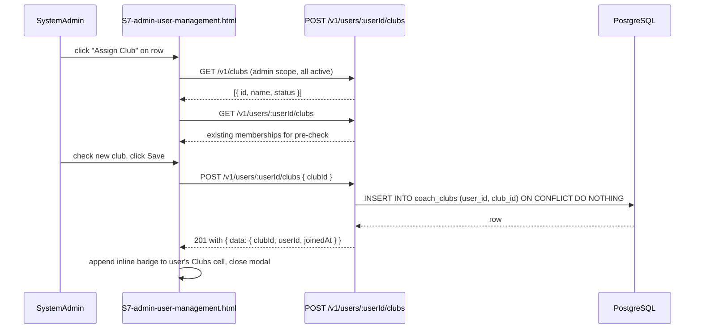
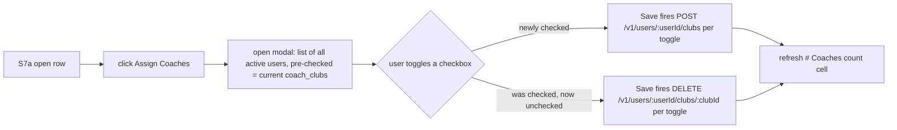
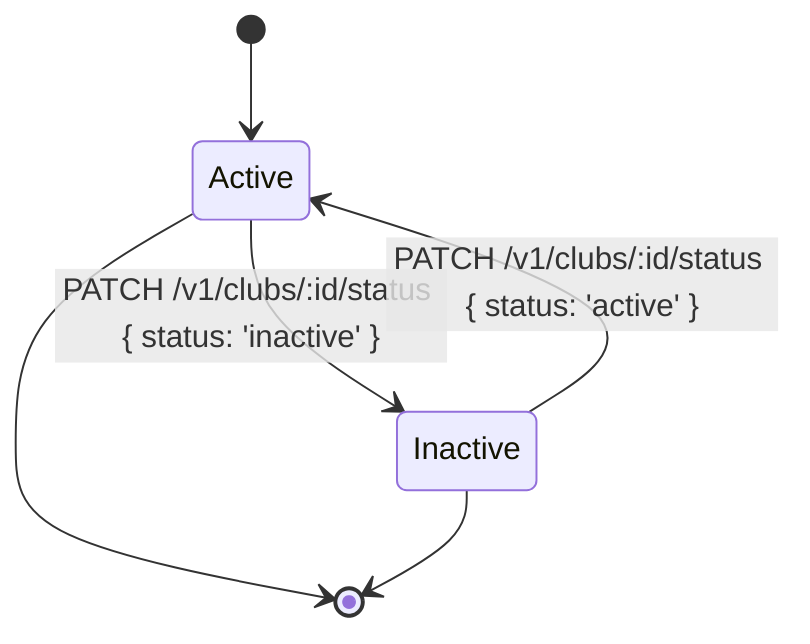
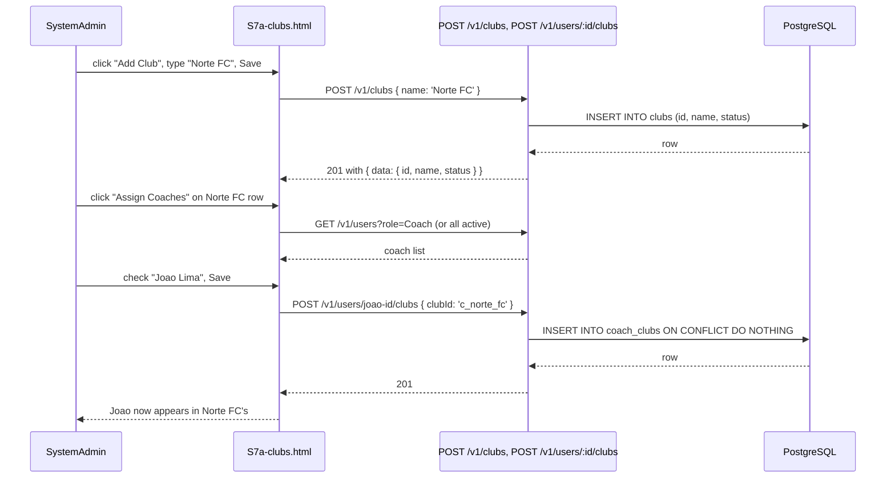

# feat: S7 Assign/Update Club per user + SystemAdmin-only Clubs page (S7a)

## Summary

Two coordinated additions built on top of the clubs/coach-clubs foundation from `docs/plans/2026-07-06-005-feat-manage-club-table-and-s3-filter-plan.md` and the team update surface from `docs/plans/2026-07-06-007-feat-team-update-screen-plan.md`:

1. **S7 "Assign/Update Club" per user.** Each row in the SystemAdmin user table gains an `Assign Club` action that opens a picker modal listing the clubs the admin can see. Submitting the picker calls a new endpoint that **additively inserts** a `coach_clubs` row for the user (the requester's `add-additive` choice) and the user is then visibly a member of the new club without losing existing memberships. Every active user — including SystemAdmin — is eligible (`all-active-users` choice).

2. **S7a "Clubs" page (SystemAdmin-only).** A new `docs/ux/mockup/S7a-clubs.html` screen accessible only when `actorRole === 'SystemAdmin'`. It renders a clubs table with per-row actions: View, Add, Update, Deactivate, Assign Coaches, Assign Teams. The page exposes full CRUD over `clubs` plus the two M:N joins (`coach_clubs`, `teams.club_id`). Clubs get a `status` column (`active` / `inactive`) mirroring `users.status` and `teams.status`, so "Deactivate" is a soft-disable and an inactive club is hidden from new-team creation pickers by default.

Both additions ship together because each is useless without the other: an admin page without per-user club assignment only sees the seed `c_default` club; a per-user assignment surface without a clubs admin page leaves no discoverability for "which clubs exist" or "what state is a club in."

## Problem Frame

The clubs entity and `coach_clubs` M:N are live (`migration 012`), and `POST /v1/teams/:teamId/update` already lets an admin move a team into a different club. But today an admin has **no way to assign a coach (or any other active user) to a brand-new club** — the only way a `coach_clubs` row appears for a non-seed coach is if the coach creates a team (which is impossible if they have no team yet) or if they get picked as a team lead via admin team-create / change-coach (which still requires a team to exist in that club). Coaches whose first club needs to be seeded by an admin — e.g., a newly-hired head coach joining an existing club — currently can't be onboarded without a team.

There is also no UI surface for "what clubs exist, and what state is each in?" Today's admin learns about a club's existence only by seeing a team reference it. A deactivated club should be visible-but-distinct, and the admin should be able to reactivate it from the same place they deactivated it.

The plan layers on top of the existing clubs work without breaking any established contract: existing endpoints (`GET /v1/clubs`, `POST /v1/teams`, `POST /v1/teams/:teamId/update`) keep their current shape; the new admin endpoints are additive and use the same role-gating, error envelope, and `actorEmail`-style actor-resolution pattern.

## Scope Boundaries

### In scope

- A new migration adding `clubs.status TEXT NOT NULL DEFAULT 'active' CHECK (status IN ('active','inactive'))` plus a supporting index, mirroring the `teams.status` shape from `migration 013`.
- A new `POST /v1/users/:userId/clubs` endpoint that **additively** upserts a `coach_clubs` row (no removal of existing rows).
- A new `DELETE /v1/users/:userId/clubs/:clubId` endpoint to remove a single `coach_clubs` row — required so the per-user "Update" semantics are bidirectional. Coach membership is additive but the admin must be able to detach a coach from one club without disturbing others.
- A new `S7a-clubs.html` mockup screen rendering all clubs (active by default; a Show inactive checkbox reveals inactive rows), with per-row action buttons: View (read-only detail modal), Add (only on the empty-state CTA — adds a brand-new club), Update (rename modal), Deactivate / Reactivate (status flip), Assign Coaches (multi-select picker), Assign Teams (multi-select picker).
- A new `S8-clubs.html` `Add Club` modal flow (the modal lives inside `S7a-clubs.html`, not on its own page) so the empty-state CTA is a single click.
- S7 mockup row gains an `Assign Club` button + an "Update" path that opens the picker. A small "Clubs" badge under the user's email shows the user's current `coach_clubs` memberships inline so the admin sees the result without a separate detail page.
- `MockupApi` extensions: `assignUserClub(userId, clubId)`, `removeUserClub(userId, clubId)`, `listUserClubs(userId)`, `createClub(name)`, `updateClub(clubId, name)`, `deactivateClub(clubId)`, `reactivateClub(clubId)`, `assignCoachToClub(clubId, userId)`, `assignTeamToClub(clubId, teamId)`.
- `serve-mockup.js` handlers for the new endpoints (all under `/api/v1`), matching the existing role-gating / error-envelope / `actorEmail` actor-resolution shape used by the clubs and users endpoints already in the file.
- OpenAPI additions: `Club.status`, `User.clubIds`, `CreateClubRequest`, `UpdateClubRequest`, the six new endpoints (one PATCH for club status, one POST and one DELETE for the user-club join, one POST and one PATCH for club CRUD, and the two multi-assign endpoints for coaches and teams).
- New Playwright spec `tests/playwright/s7a-clubs.spec.js` covering: SystemAdmin CRUD happy path, coach-club additivity (adding the same coach twice doesn't error; adding coach to two clubs shows both), removing one membership while another survives, deactivate/reactivate cycle, role gating (Coach sees the S7a route 403), S7 "Assign Club" picker lands and updates the inline badge.
- A new bottom-nav item on `S7a-clubs.html` (`🧱 Clubs`) and a small "Clubs" link in the S7 topbar so the admin can navigate from S7 → S7a and back.
- A new `tests/playwright/_fixture-utils.js` helper `listUserClubs(page, email)` reused across S7 + S7a specs.

### Deferred to follow-up work

- Removing a user from all clubs at once (bulk detach).
- Bulk-import of clubs from CSV.
- Coach-club join history / audit log.
- Cross-club user profile view (a "Where is this coach working?" page).
- Programmatic club creation via seed-only API (no admin endpoint to seed from JSON).
- Notifications when a coach's club membership changes (e.g., notify the coach).
- Inactive-club UI for S3 (`S3 Show inactive clubs` filter — separate ticket).
- A "Move all teams from Club A to Club B" merge operation.
- Renaming a club cascades to all `teams.club_id` references (it already does — `clubs.name` is a join key, not an FK — but no explicit migration handler is added in this plan).

### Out of scope

- New role types.
- Hard-deleting a club (the codebase convention is "no destructive deletes"; deactivate is the soft-delete shape).
- Editing `clubs.id` (the id is system-generated and never user-facing).
- Editing `users.id` from the admin screen.
- Self-service coach onboarding (the requester is asking for admin-only).

## Requirements

### S7 per-user "Assign/Update Club" requirements

- **U1.** Every row in the S7 users table shows a new `Assign Club` button (admin-only; hidden/disabled when `viewRole === 'Coach'`).
- **U2.** Clicking the button opens a modal that lists all clubs visible to the admin (`GET /v1/clubs` with the admin's actorEmail) and shows the user's **current** club memberships as checked checkboxes (multi-select).
- **U3.** The picker shows club name + status. Inactive clubs are listed but visually marked as inactive (cannot be added to via this picker — deactivated clubs are read-only for the membership join; they remain visible so the admin knows they exist).
- **U4.** On Save, the modal sends a single payload that, for each newly-checked club, calls `POST /v1/users/:userId/clubs` with `{ clubId, actorRole, actorEmail }`. **No removal is done in this modal** (the per-user "Update" affordance is "assign more clubs"; removal lives on the user's existing-club list as a separate `Remove` button per badge).
- **U5.** The inline "Clubs" badge under the user's email updates after each successful assign (optimistic UI; rolled back on 4xx/5xx).
- **U6.** `POST /v1/users/:userId/clubs` is idempotent: re-assigning the same coach to the same club is a no-op (`INSERT ... ON CONFLICT (user_id, club_id) DO NOTHING`).
- **U7.** A Coach token calling the endpoint returns `403 forbidden`.
- **U8.** The endpoint validates: target user exists (`404 not_found`), target club exists (`404 not_found`), target club is `active` (`400 validation_error` if inactive), target user is `active` (`400 validation_error` if inactive — you can't add an inactive user to a club).
- **U9.** Removing a `coach_clubs` row via `DELETE /v1/users/:userId/clubs/:clubId` returns `204` on success, `404` if the row didn't exist, `403` if the actor is not SystemAdmin. The endpoint is **not** idempotent — a second delete returns `404`, not `204`.

### S7a Clubs page (SystemAdmin-only) requirements

- **C1.** `S7a-clubs.html` is reachable from a new top-bar link on `S7-admin-user-management.html` ("Clubs") and from a new bottom-nav item. Direct navigation while `actorRole !== 'SystemAdmin'` redirects to `S0-login.html` (or shows a 403-style notice per the existing unauthenticated-pattern in `S3a-team-update.html`).
- **C2.** The page renders a clubs table with columns: Name, Status (active/inactive badge), Created At (label), # Coaches (count via `coach_clubs`), # Teams (count via `teams`), Actions.
- **C3.** A search bar (filter by name) and a `Show inactive` checkbox (default ON for inactive filter is **off** — active-only default; matches S3 Show-active-on convention) sit above the table.
- **C4.** The page's primary CTA is `Add Club`. Clicking opens a modal with one field: `Name` (required, 2-60 chars, unique). On submit calls `POST /v1/clubs` with `{ name, actorRole, actorEmail }`. A success toast confirms and the table refreshes.
- **C5.** Each row's `Actions` cell exposes: View (read-only modal showing all six columns + the assigned-coaches list + the assigned-teams list), Update (rename modal), Deactivate / Reactivate (status flip), Assign Coaches, Assign Teams.
- **C6.** `Assign Coaches` opens a multi-select picker of all active Coach users (and any other active user, per the `all-active-users` choice) with current `coach_clubs` members pre-checked. Saving the picker sends one POST per newly-checked user (additive).
- **C7.** `Assign Teams` opens a multi-select picker of all teams whose `club_id != clubId` (you can't reassign a team to its current club). Saving sends one POST per newly-picked team (the existing `POST /v1/teams/:teamId/update` accepts `clubId` already — the picker uses it).
- **C8.** Deactivating a club (`PATCH /v1/clubs/:clubId/status` with `{ status: 'inactive' }`) does **not** cascade-detach teams or coaches — they keep their club_id / coach_clubs row. Inactive clubs are hidden from the `GET /v1/clubs` default response (so new team-create pickers can't pick them) but show in the S7a page when `Show inactive` is checked.
- **C9.** Reactivate flips status back to `active` and re-surfaces the club in pickers.
- **C10.** All write endpoints (`POST /v1/clubs`, `PATCH /v1/clubs/:clubId`, `PATCH /v1/clubs/:clubId/status`) require `actorRole === 'SystemAdmin'` and an `actorEmail` matching an active SystemAdmin row. A Coach token returns `403 forbidden` (not `404` — the route exists, the actor is just unauthorized).

### Cross-cutting requirements

- **X1.** Both new S7 action and S7a page reuse the existing error envelope (`{ code, message }`) and HTTP status conventions already documented in `docs/ux/mockup/API-Mockup-Mapping.md`.
- **X2.** Both surfaces render offline/local state via the existing `mockup-api-client.js` fallback path (same shape as `assignExistingPlayer` etc.). `localStorage` `clubs` and `coachClubs` arrays extend with new ids and the existing `listClubs` filter by `coach_clubs` keeps working.
- **X3.** The existing `seedDefaultCoachClubs` backfill in `migration 012` is preserved (every active Coach + SystemAdmin still gets a row for `c_default`), so an admin can safely navigate to S7a on a fresh database and see the seeded clubs + memberships immediately.
- **X4.** `S3`, `S3a`, and `S7` keep working unchanged: the new endpoints are additive, the `GET /v1/teams` payload still includes `clubId`/`clubName`, the team-create picker still sources from `GET /v1/clubs` (which now defaults to `status=active`).
- **X5.** `apps/api/src/modules/users/validators/admin-create-user.validator.ts` is **not** changed by this plan. The new endpoints don't reuse the user-create validator.

## Key Technical Decisions

- **`clubs.status` mirrors `teams.status`.** Same `CHECK (status IN ('active','inactive'))` shape, same `DEFAULT 'active'`, same nullable-aware backfill idiom from `migration 013`. New index `idx_clubs_status_name (status, name)` covers `WHERE status = ? AND name LIKE ?` for the S7a search-and-filter combined query.
- **Additive join, with explicit removal.** The requester picked `add-additive` for the per-user Assign/Update model. The plan preserves that on the POST endpoint and adds a separate DELETE so admins can remove a single membership without nuking the rest. The plan does **not** introduce a "replace all" bulk endpoint — the modal is a multi-select picker where every newly-checked box triggers an additive POST; unchecked-but-previously-checked boxes do nothing (they remain members), and the explicit `Remove` chip on the user's inline badge list is the only way to leave a club.
- **SystemAdmin-club membership is explicit, not implicit.** The requester picked `all-active-users` — meaning SystemAdmin users get an explicit `coach_clubs` row too (rather than having implicit access to all clubs via role). This preserves the codebase's "membership is in `coach_clubs`, not in role-based shenanigans" invariant. The migration does **not** retroactively add SystemAdmin-coach rows (the existing seed from `migration 012` already adds them, so it's a no-op for the seeded admin Maria Alves).
- **Soft-disable club deactivation.** "Deactivate" sets `clubs.status = 'inactive'` rather than deleting the row. Pickers and the `GET /v1/clubs` default response filter out inactive clubs. S7a's "Show inactive" toggle reveals them. Teams and coaches keep their `club_id` / `coach_clubs` assignments — the deactivated club is just no longer a candidate for new joins or new teams.
- **Two new endpoints for the join (`POST` + `DELETE`), not one bidirectional `PUT`.** PUT semantically means "replace the entire collection," which contradicts the additive contract. Two unidirectional verbs keep the contract crisp and let the picker reuse the same add-only flow as S7's per-user assign.
- **S7a is a new page, not a new modal on S7.** The user said "View List of Clubs" with View/Add/Update/Deactivate and coach/team assignment as distinct affordances — a single modal in S7 can't host that surface area. S7a lives at `docs/ux/mockup/S7a-clubs.html` and links from S7's topbar ("Clubs" link) and bottom-nav ("🧱 Clubs" item).
- **`Assign Teams` reuses `POST /v1/teams/:teamId/update`.** That endpoint already exists (`migration 013` + plan `2026-07-06-007`), accepts `clubId`, and runs the role-scoped club validation atomically. The picker is a thin wrapper that, on save, fires one update per newly-picked team. Idempotent: re-picking a team already in the club is a no-op (the endpoint validates `newClubId != team.clubId` returns 400, so the picker pre-skips current-club teams per C7).
- **Coach actor on `GET /v1/clubs` now sees only active clubs.** The existing handler at `serve-mockup.js` line 1196 doesn't filter by status; the plan adds a `WHERE c.status = 'active'` clause to the active-clubs default path. Admins see active by default with a `?status=inactive|all` override (mirrors `GET /v1/teams?status=` from the team-update plan).
- **No mockup-local store re-keying.** `mockup-api-client.js`'s `clubs` and `coachClubs` arrays get one new field per record (`status`) and one new helper (`createClub` updates the store in-place). The `reset()` seed is extended with the same single-default-club shape and `status: 'active'` so a fresh DB round-trips cleanly.

## High-Level Technical Design

### Flow: S7 "Assign Club" picker save

### Flow: S7a "Assign Coaches" multi-select save

### State machine: S7a "Deactivate" / "Reactivate"

### Sequence: assigning a coach to a brand-new club (the "missing-link" scenario)

## Implementation Units

### U1. DB migration: `clubs.status` + supporting index

**Goal:** Land `clubs.status` (active/inactive) and a supporting index so the new endpoints and S7a's search/filter can run efficiently.

**Requirements:** C2, C8, X3.

**Dependencies:** none.

**Files:**
- `apps/api/src/db/migrations/014_clubs_status.sql`
- `apps/api/src/db/schema/tables.sql`
- `apps/api/src/db/schema/deploy.sql`
- `apps/api/tests/integration/db/clubs-status-migration.spec.ts`

**Approach:**
- Add `ALTER TABLE clubs ADD COLUMN IF NOT EXISTS status TEXT NOT NULL DEFAULT 'active' CHECK (status IN ('active','inactive'))`.
- Add `CREATE INDEX IF NOT EXISTS idx_clubs_status_name ON clubs(status, name)`.
- Update `tables.sql` and `deploy.sql` to include the new column + index in the canonical source-of-record so a fresh database gets it without re-running the migration. Mirrors how `migration 013` is mirrored in both files.

**Patterns to follow:** `apps/api/src/db/migrations/013_teams_status.sql` (DDL + index shape).

**Test scenarios:**
- Happy path: migration applies on a database missing the column; running it twice leaves the schema unchanged (idempotent).
- Backfill: every existing seeded club (`c_default`) gets `status = 'active'` from the DEFAULT clause; no explicit UPDATE is required.
- Edge case: a manually-inserted club row with `status = 'inactive'` is preserved across a re-run of the migration.
- Integration: `SELECT id, name, status FROM clubs WHERE status = 'active' ORDER BY name ASC` returns the expected active clubs via the new index path.

**Verification:** The migration applies cleanly to a fresh database (via `scripts/db-bootstrap.js`) and to the current dev DB (via `npm run db:migrate`), and the test file asserts idempotency and backfill.

---

### U2. OpenAPI contract additions for clubs + user-club join

**Goal:** Document the new endpoints and request/response shapes before any backend wiring lands.

**Requirements:** C4–C10, U6–U9, X1.

**Dependencies:** U1 (so `Club.status` is a real schema field).

**Files:**
- `openapi/v1/openapi.yaml`
- `openapi/v1/schemas/clubs.yaml`
- `openapi/v1/schemas/users.yaml`
- `openapi/v1/schemas/teams.yaml`
- `openapi/v1/examples/club-create-success.json`
- `openapi/v1/examples/club-update-success.json`
- `openapi/v1/examples/club-deactivate-success.json`
- `openapi/v1/examples/user-club-assign-success.json`
- `openapi/v1/examples/user-club-remove-success.json`
- `openapi/v1/examples/club-not-found.json`
- `openapi/v1/examples/forbidden-coach-user-club.json`
- `apps/api/tests/contract/openapi.clubs-admin.spec.ts`

**Approach:**
- Add `Club.status` (enum `active` / `inactive`, default `active`) to `clubs.yaml`. Add `Club.coachCount` and `Club.teamCount` as nullable integer convenience fields derived on read.
- Add `User.clubIds: array<string>` to `users.yaml` (nullable when the actor isn't authorized to see memberships).
- Add `CreateClubRequest { name: string (2-60 chars, unique) }`, `UpdateClubRequest { name }`, `ClubStatusRequest { status }`.
- New paths: `POST /v1/clubs`, `PATCH /v1/clubs/{clubId}` (rename), `PATCH /v1/clubs/{clubId}/status`, `POST /v1/users/{userId}/clubs`, `DELETE /v1/users/{userId}/clubs/{clubId}`, `GET /v1/users/{userId}/clubs` (list a user's clubs; admin-only).
- Extend `GET /v1/clubs` with `?status=active|inactive|all` query param (default `active`) and document the role split (admin sees all by default, coach sees only their `coach_clubs` rows).
- Document `409 conflict` for `POST /v1/clubs` when the name collides with an existing club.

**Patterns to follow:** Existing OpenAPI grouping and the `ErrorResponse` envelope from `users.yaml`.

**Test scenarios:**
- Happy path: contract validates `POST /v1/clubs`, `PATCH /v1/clubs/{id}`, `PATCH /v1/clubs/{id}/status`, `POST /v1/users/{id}/clubs`, `DELETE /v1/users/{id}/clubs/{id}` with required fields.
- Edge case: `Club.status` enum rejects values outside `active`/`inactive`.
- Error path: forbidden response schema is defined for Coach attempts at admin-only endpoints.
- Integration: the mockup action-to-endpoint mapping in `docs/ux/mockup/API-Mockup-Mapping.md` includes S7 Assign Club + S7a CRUD + Assign Coaches + Assign Teams.

**Verification:** OpenAPI validation passes and exposes all new admin operations with consistent request/response schemas. The contract test asserts the schema for every new endpoint.

---

### U3. Backend handler additions in `serve-mockup.js`

**Goal:** Implement the new endpoints with the same role-gating, actor-resolution, and error-envelope shape used by the existing clubs and users handlers.

**Requirements:** C4–C10, U6–U9, X1, X4.

**Dependencies:** U1, U2.

**Files:**
- `scripts/serve-mockup.js`
- `apps/api/tests/integration/clubs/clubs-crud.spec.ts`
- `apps/api/tests/integration/users/user-club-join.spec.ts`

**Approach:**
- New `POST /v1/clubs` handler: SystemAdmin-only, validates `name` (2-60 chars, unique via case-insensitive check), inserts row with `status = 'active'`. Returns `201` with the new `Club` payload (including `coachCount` and `teamCount` as 0 on create).
- New `PATCH /v1/clubs/:clubId` handler: SystemAdmin-only, validates name (unique, 2-60 chars), updates row. Returns `200` with updated `Club`.
- New `PATCH /v1/clubs/:clubId/status` handler: SystemAdmin-only, validates `status` ∈ `{active, inactive}`, updates row. Returns `200`.
- New `GET /v1/clubs?status=` handler extension: default filter `status = 'active'` for non-admin callers; admin sees all by default; explicit `?status=inactive|all` overrides. Coach actor narrows to `coach_clubs`-joined clubs (existing behavior) **and** filtered by status.
- New `POST /v1/users/:userId/clubs` handler: SystemAdmin-only, validates user exists + active, club exists + active, upserts `coach_clubs` row, returns `201` with `{ data: { userId, clubId, joinedAt } }`.
- New `DELETE /v1/users/:userId/clubs/:clubId` handler: SystemAdmin-only, deletes the single `coach_clubs` row, returns `204` on success, `404` if the row didn't exist.
- New `GET /v1/users/:userId/clubs` handler: SystemAdmin-only, returns the user's club memberships (id + name + status). Coach actor calling this gets `403 forbidden`.
- Extend `GET /v1/teams` to include `clubId`/`clubName` already; no changes needed there. Extend `GET /v1/users` to include `clubIds` (array of club ids) for the S7 picker pre-check.

**Patterns to follow:** Existing handler shape at `serve-mockup.js` lines 1196 (clubs), 1529 (users), and 1585 (user-role update). All four use the same `appError(status, code, message)` envelope and the same `actorEmail` resolution pattern.

**Test scenarios:**
- Happy path: SystemAdmin creates a club → 201 with `name` + `status: 'active'`; `coachCount: 0`, `teamCount: 0`.
- Happy path: SystemAdmin assigns a coach to a club → `coach_clubs` row exists; second assign is idempotent (no error).
- Happy path: SystemAdmin removes a coach from one club → `coach_clubs` row gone; other clubs the coach is in are unaffected.
- Edge case: assigning an inactive coach to a club returns `400 validation_error`.
- Edge case: assigning an active coach to an inactive club returns `400 validation_error`.
- Edge case: deactivating a club removes it from `GET /v1/clubs` default response but keeps teams + coach_clubs rows intact.
- Edge case: reactivating a club re-surfaces it in `GET /v1/clubs` default response.
- Error path: Coach token calling any of the new admin endpoints returns `403 forbidden`.
- Error path: `POST /v1/clubs` with a duplicate name returns `409 conflict`.
- Error path: `DELETE` on a non-existent `coach_clubs` row returns `404 not_found`.
- Integration: after `assignCoachToClub`, `GET /v1/teams?actorEmail=<coach>` now includes teams in that club (the join is honored across the existing endpoints).

**Verification:** All new endpoints are reachable via `http://localhost:5500/api/v1/...` and produce contract-aligned responses. The integration test suite for clubs-admin and user-club-join passes.

---

### U4. Mockup API client extensions + S7 "Assign Club" UI

**Goal:** Extend `mockup-api-client.js` with the new client methods, and extend `S7-admin-user-management.html` with the per-row `Assign Club` button + picker modal + inline Clubs badge.

**Requirements:** U1–U5.

**Dependencies:** U2, U3 (so the backend contract is firm).

**Files:**
- `docs/ux/mockup/js/mockup-api-client.js`
- `docs/ux/mockup/S7-admin-user-management.html`
- `apps/api/tests/integration/mockup-api-client.spec.ts` (or extend an existing client test file)

**Approach:**
- Add `MockupApi.listUserClubs(userId)` — backend-mode hits `GET /v1/users/:userId/clubs`; offline-mode returns the user's `coachClubs` rows joined with `clubs`.
- Add `MockupApi.assignUserClub(userId, clubId)` — backend-mode hits `POST /v1/users/:userId/clubs`; offline-mode adds to `store.coachClubs` and returns `{ status: 201, data: { userId, clubId, joinedAt: 'just now' } }`.
- Add `MockupApi.removeUserClub(userId, clubId)` — backend-mode hits `DELETE /v1/users/:userId/clubs/:clubId`; offline-mode deletes the row from `store.coachClubs`.
- Extend `createSeed()` so the offline store seeds `c_default` with `status: 'active'` (back-compat: existing offline tests that read `club.status` get the new field without surprise).
- Extend `S7-admin-user-management.html`:
  - Add a `Clubs` cell to the users table (between Email and Role) showing a small inline badge list of the user's current clubs. Clicking a badge's `×` calls `removeUserClub` (admin-only).
  - Add an `Assign Club` button to the Actions cell (admin-only).
  - Add an `assignClubModal` with a multi-select picker (`<select multiple>` or checkbox grid) populated from `MockupApi.listClubs(state.viewRole, state.actorEmail)` and pre-checked against `MockupApi.listUserClubs(userId)`.
  - Add a top-bar `Clubs` link (`<a href="./S7a-clubs.html">Clubs</a>`) — admin-only.
  - On save, call `assignUserClub` for each newly-checked club, refresh the user's badge list, show a toast.
- Extend `listUsers()` payload to include `clubIds` so the S7 badge list can render without a per-row second fetch.

**Patterns to follow:** `MockupApi.assignExistingPlayer` for the backend-vs-offline switch; existing S7 modal patterns for the picker (`changeRoleModal`, `changePasswordModal`).

**Test scenarios:**
- Happy path: open S7 as SystemAdmin → click `Assign Club` on Maria Alves → picker shows the seeded club; check it → Save → Maria's row shows a new badge.
- Happy path: re-open the picker on Maria Alves → seeded club is pre-checked.
- Happy path: click `×` on a badge → badge disappears after a backend confirm.
- Edge case: open S7 as Coach (`viewRole` toggled) → `Assign Club` button is hidden/disabled; existing badges are still rendered read-only.
- Error path: backend `409 conflict` on `assignUserClub` (e.g., race) renders an actionable error toast.

**Verification:** S7 renders and behaves correctly in backend mode; offline/local mode (`window.__USE_MOCK_LOCAL__ = true`) shows the same UX shape. Existing S7 Playwright spec (`s7-admin-user-management.spec.js`) still passes — the new `Assign Club` button + badge cell are additive.

---

### U5. New mockup screen `S7a-clubs.html` with full CRUD + assignment modals

**Goal:** Build the SystemAdmin-only clubs page mirroring S7's interaction patterns.

**Requirements:** C1–C10.

**Dependencies:** U3, U4.

**Files:**
- `docs/ux/mockup/S7a-clubs.html`
- `docs/ux/mockup/js/mockup-api-client.js` (extend with `listClubs(statusFilter)`, `createClub`, `updateClub`, `deactivateClub`, `reactivateClub`, `assignCoachToClub`, `assignTeamToClub`)
- `tests/playwright/s7a-clubs.spec.js`

**Approach:**
- New `S7a-clubs.html` page with:
  - Header: back button (→ S7), title "Clubs", role badge, exit button.
  - Search bar (`#clubSearch`), `Show inactive` checkbox (default OFF), `Add Club` primary button (admin-only).
  - Clubs table: Name | Status | Created At | # Coaches | # Teams | Actions.
  - Empty-state notice ("No clubs match this filter") when the filtered set is empty.
  - Modals: `viewClubModal` (read-only detail with coach + team lists), `addClubModal` (name field), `updateClubModal` (rename), `deactivateClubModal` (confirmation), `reactivateClubModal` (confirmation), `assignCoachesModal` (multi-select user picker), `assignTeamsModal` (multi-select team picker sourced from `GET /v1/teams` minus current-club teams).
  - Bottom-nav: Players, Teams, Capture, Users (links to S1, S3, S4, S7) + **🧱 Clubs** (active state when on S7a).
- Page loads via `MockupApi.listClubs(state.viewRole, state.actorEmail, { status: 'all' })` when `Show inactive` is checked; otherwise `status: 'active'`.
- Direct-navigation guard: if `MockupApi.getCurrentUser()` returns null OR the user is inactive, redirect to `S0-login.html`. If the user is a Coach, show a 403 notice (don't redirect — they should see why they were blocked).
- Per-row `View` opens a modal listing the club's details + every coach with email + every team with age group.
- `Assign Coaches` opens a multi-select picker of every active user (Coach or SystemAdmin) — pre-checked against current `coach_clubs` rows. Save fires one `POST /v1/users/:userId/clubs` per newly-checked user and one `DELETE /v1/users/:userId/clubs/:clubId` per newly-unchecked user (mirror of the S7 picker model).
- `Assign Teams` opens a multi-select picker of teams whose `clubId != this clubId`. Save fires one `POST /v1/teams/:teamId/update { clubId }` per newly-picked team.
- Toast on every successful action; inline error rendering on 4xx/5xx.

**Patterns to follow:**
- `S7-admin-user-management.html` for modal structure and bottom-nav.
- `S3a-team-update.html` for the direct-navigation guard pattern (the read-only-when-coach block on the page-load).
- `MockupApi.updateTeamCoachAndClub` for the team-move flow shape.

**Test scenarios:**
- Happy path: SystemAdmin lands on S7a → sees the seeded `VantageIQ Club` → clicks `Add Club` → types "Norte FC" → Save → table now shows two clubs; Norte FC's `# Coaches` and `# Teams` are 0.
- Happy path: SystemAdmin clicks `Assign Coaches` on Norte FC → multi-select picker lists all active users → check Joao Lima → Save → Norte FC's `# Coaches` shows 1; Joao's row in S7 shows Norte FC in his inline badge list.
- Happy path: SystemAdmin clicks `Deactivate` on Norte FC → modal confirms → row status flips to Inactive; the `# Coaches` count is preserved (we don't cascade).
- Happy path: SystemAdmin toggles `Show inactive` ON → Norte FC row appears with a Deactivated badge.
- Happy path: SystemAdmin clicks `Reactivate` on Norte FC → status flips back to Active.
- Happy path: SystemAdmin clicks `Assign Teams` on VantageIQ Club → picker lists teams whose `clubId != c_default` → if any exist (post-team-update moves), Save → the team's `clubName` updates on S3.
- Edge case: deactivating a club doesn't auto-detach its coaches; coaches can still see the club in S7 (the S7 picker hides inactive clubs from new assignments).
- Error path: Coach token visiting S7a directly renders the 403 notice; navigating via the top-bar link (which doesn't render for Coach) is impossible.
- Error path: assigning a coach to a club that already has them returns success (idempotent).

**Verification:** All S7a actions work end-to-end in both backend and offline modes. The new Playwright spec covers the full CRUD cycle, the assignment additivity contract, and the role-gating guard.

---

### U6. React surface for S7 + S7a (mirroring the existing React features)

**Goal:** Mirror the new S7 Assign Club action and the S7a page in the React app, following the existing `admin-users` feature pattern.

**Requirements:** U1, C1.

**Dependencies:** U4, U5 (the mockup-side flows are stable references for the React shape).

**Files:**
- `apps/web/src/features/admin-clubs/types.ts`
- `apps/web/src/features/admin-clubs/hooks/useClubs.ts`
- `apps/web/src/features/admin-clubs/hooks/useAssignUserClub.ts`
- `apps/web/src/features/admin-clubs/hooks/useRemoveUserClub.ts`
- `apps/web/src/features/admin-clubs/components/AssignClubDialog.tsx`
- `apps/web/src/features/admin-clubs/components/UserClubsBadgeList.tsx`
- `apps/web/src/features/admin-clubs/pages/ClubsPage.tsx`
- `apps/web/src/features/admin-users/types.ts` (extend `AdminUser` with `clubIds?: string[]`)
- `apps/web/src/features/admin-users/components/AdminUsersPage.tsx` (add the new dialog and badge cell)
- `apps/web/src/services/api/client.ts` (extend `HttpAdminUsersApiClient` with the new endpoints and a new `HttpAdminClubsApiClient`)
- `apps/web/src/app/routes/AdminRoutes.tsx` (add Clubs route)
- `apps/web/tests/unit/features/admin-clubs/clubs-page.spec.tsx`
- `apps/web/tests/unit/features/admin-clubs/assign-club-dialog.spec.tsx`
- `apps/web/tests/integration/admin-clubs/club-lifecycle-flow.spec.tsx`

**Approach:**
- Extend `AdminUsersApiClient` with `listUserClubs(userId)`, `assignUserClub(payload)`, `removeUserClub(payload)`.
- Add `AdminClubsApiClient` (in the same `client.ts` or a new sibling) with `listClubs(opts)`, `createClub(payload)`, `updateClub(payload)`, `deactivateClub(clubId)`, `reactivateClub(clubId)`, `assignCoachToClub(payload)`, `assignTeamToClub(payload)`.
- Extend `AdminUser` type with `clubIds?: string[]` so the S7 list returns memberships inline.
- Add `AssignClubDialog` component — multi-select picker, mirrors the React ChangeRoleDialog structure.
- Add `UserClubsBadgeList` — read-only chip list with optional `×` remove button.
- Add `ClubsPage` — full CRUD table mirroring `AdminUsersPage`'s table layout.
- Extend `AdminUsersPage` to render the new `AssignClubDialog` and the `UserClubsBadgeList`.
- Extend `AdminRoutes` to render the new `ClubsPage` based on a path arg.

**Patterns to follow:** `apps/web/src/features/admin-users/` for the feature layout; `HttpAdminUsersApiClient` for the API client shape.

**Test scenarios:**
- Happy path: SystemAdmin opens S7 → clicks `Assign Club` on Joao → checks Norte FC → Save → Joao's row gains a Norte FC chip.
- Happy path: SystemAdmin opens S7a → clicks `Add Club` → types "Norte FC" → Save → table shows the new club.
- Happy path: SystemAdmin clicks `Deactivate` on Norte FC → status flips → the picker for new team-create no longer offers it.
- Edge case: reactivate flips status back.
- Error path: Coach actor → `ClubsPage` renders the 403 notice (matches S7a's mockup-direct-navigation guard).
- Error path: API `409 conflict` on `createClub` (duplicate name) → inline error renders.
- Integration: full admin-club lifecycle round-trips a create → assign coach → create team → assign team to club → deactivate → reactivate.

**Verification:** React unit + integration tests pass; the new surface area is consistent with the existing `admin-users` feature's tone. (The React app is intentionally thinner than the mockup in this codebase — the mockup is the source of UX truth, the React app is the typed shell — so the React tests don't need to mirror the full Playwright surface.)

---

### U7. Playwright specs + telemetry mapping update

**Goal:** End-to-end coverage for the new S7 action and the S7a page; update the API-Mockup mapping artifact.

**Requirements:** All U- and C-requirements; X1.

**Dependencies:** U3, U4, U5.

**Files:**
- `tests/playwright/s7a-clubs.spec.js` (new)
- `tests/playwright/s7-admin-user-management.spec.js` (extend with Assign Club coverage)
- `tests/playwright/_fixture-utils.js` (extend with `listUserClubs` helper)
- `docs/ux/mockup/API-Mockup-Mapping.md` (add S7 Assign Club row + S7a CRUD/assignment rows)
- `docs/ux/mockup/S7a-clubs.html` (covered by U5)

**Approach:**
- New `s7a-clubs.spec.js` covers: full CRUD cycle, role-gating guard (Coach → 403 notice), additivity (assigning the same coach twice doesn't error; coach appears in two clubs), deactivation preserves coach/team associations, reactivate re-surfaces the club in the default list.
- Extend `s7-admin-user-management.spec.js` with two scenarios: clicking `Assign Club` opens the picker with the seeded club visible; toggling the Coach view hides the `Assign Club` button.
- Update `API-Mockup-Mapping.md`:
  - Add S7 row: `S7 Assign Club picker save → POST /v1/users/{userId}/clubs`.
  - Add S7a rows: Add Club, Update Club, Deactivate Club, Reactivate Club, Assign Coaches, Assign Teams.
  - Note the new default `?status=active` filter on `GET /v1/clubs` and the role-split on `GET /v1/users/{userId}/clubs`.

**Patterns to follow:** Existing `tests/playwright/s7-admin-user-management.spec.js` (uses `uniqueEmail`, `restoreCoachRole`), `tests/playwright/_fixture-utils.js`, and the `tests/playwright/team-update.spec.js` patterns from the prior plan.

**Test scenarios:**
- Happy path: full S7a CRUD + assignment cycle under the live backend.
- Happy path: S7 Assign Club picker lands on a fresh database and the user's badge list updates.
- Edge case: the `_fixture-utils.listUserClubs(page, email)` helper returns the expected membership list after each operation.
- Error path: Coach actor navigation to S7a renders the 403 notice; the spec asserts visibility of the notice text rather than navigation state (mirrors how `s3-team-management.spec.js` handles unauthorized views).
- Integration: after a full S7a round-trip, S3's club column reflects any team moves performed via `Assign Teams`.

**Verification:** All new + extended Playwright specs pass against the live backend with `DATABASE_URL` set. CI passes.

---

## Risks and Dependencies

- **Risk:** Deactivating a club while teams still reference it could leave S3 showing an "active" team in an "inactive" club. **Mitigation:** the plan doesn't cascade-detach teams from inactive clubs (deliberate — it preserves audit history). S3's club column will show the inactive club's name; a follow-up ticket can add a `Show inactive clubs` filter to S3. Document this in the S7a modal copy ("Deactivating a club does not detach existing teams.").
- **Risk:** The additive join + per-user Remove chip could lead to drift (a coach is in `coach_clubs` for a club that no longer exists — race with hard delete). **Mitigation:** no hard delete is in scope; the join target is always an existing `clubs` row because we never delete clubs. The `coach_clubs.user_id` and `coach_clubs.club_id` both have FK references with no cascade delete (the migration doesn't specify `ON DELETE CASCADE`), so an admin cannot accidentally orphan a row.
- **Risk:** The S7 inline badge list adds a per-row `GET /v1/users/:userId/clubs` call if `clubIds` is not on the user payload. **Mitigation:** U4 extends `GET /v1/users` to include `clubIds` (an array of club ids). The badge list is then a client-side render with no extra fetch per row. Confirmed: the offline seed in `mockup-api-client.js` extends `users[*]` with a `clubIds` array derived from `coachClubs`.
- **Risk:** UI and API drift on the new admin endpoints. **Mitigation:** `apps/api/tests/contract/openapi.clubs-admin.spec.ts` (U2) and the extended `API-Mockup-Mapping.md` (U7) act as release gates.
- **Risk:** S7a's "Assign Teams" picker might trigger cascading team-update side-effects (e.g., a coach change that wasn't intended). **Mitigation:** the picker explicitly lists only teams whose `clubId != this clubId` (C7), and the team-update endpoint is the existing one that only changes `clubId` (not coach, not status) when called from S7a. The picker passes `{ coachEmail: <current coach email>, clubId: <new club>, status: <current status>, actorRole, actorEmail }` so all three are explicitly re-asserted to their current values. No silent mutation.

Dependencies on prior plans:
- `docs/plans/2026-07-03-002-feat-system-admin-user-management-plan.md` (existing S7 surface, role policy, validators).
- `docs/plans/2026-07-06-005-feat-manage-club-table-and-s3-filter-plan.md` (clubs schema, coach_clubs join, `GET /v1/clubs`, S3 club column).
- `docs/plans/2026-07-06-007-feat-team-update-screen-plan.md` (team-update endpoint, status column, S3a screen) — reused via `POST /v1/teams/:teamId/update` for `Assign Teams`.

Operational dependencies:
- PostgreSQL migration execution path in development and CI (`scripts/db-bootstrap.js` for fresh DBs; `npm run db:migrate` for existing).
- Existing seed for `c_default` and `coach_clubs` from `migration 012` ensures the admin can immediately navigate S7a on a fresh DB without setup.

---

## Open Questions

- Should `GET /v1/users/:userId/clubs` be visible to **the user themselves** (e.g., for a Coach self-service view of "which clubs am I in?"), or strictly admin-only? The current plan locks it admin-only. A self-service coach view is deferred to a separate ticket.
- Should the per-user `×` remove chip confirm before deletion (destructive-ish — admins are unlikely to do this by accident, but a misclick could remove a coach from a club mid-observation)? The plan uses an inline confirm (two-click pattern: first click arms the chip, second confirms). Easy to soften to a modal confirm in a follow-up if the team prefers.
- When a club is renamed via `PATCH /v1/clubs/:clubId`, do we want a separate audit event (`club_renamed`) so the prior name is recoverable? Currently the plan emits only the standard `club_update_success` telemetry with `{ clubId, newName }` — no before/after pair.

---

## Verification Strategy

- **Contract:** `apps/api/tests/contract/openapi.clubs-admin.spec.ts` (U2) asserts every new endpoint's schema.
- **Integration:** `apps/api/tests/integration/clubs/clubs-crud.spec.ts` and `apps/api/tests/integration/users/user-club-join.spec.ts` (U3) hit the live backend with `DATABASE_URL` set; the existing `clubs` and `users` handlers are tested for the new behaviors.
- **Mockup API client:** manual + automated test (`apps/api/tests/integration/mockup-api-client.spec.ts`) confirms the new methods exist and the offline seed round-trips.
- **React unit + integration:** `apps/web/tests/unit/features/admin-clubs/` and `apps/web/tests/integration/admin-clubs/` (U6).
- **End-to-end:** new `tests/playwright/s7a-clubs.spec.js` + extended `tests/playwright/s7-admin-user-management.spec.js` (U7).
- **Regression:** existing `tests/playwright/s3-team-management.spec.js` and `tests/playwright/team-update.spec.js` must keep passing — the new endpoints are additive and don't change existing contracts.

---

## Phased Execution Suggestion

- Phase A: U1 + U2 (schema + contract). Foundation before any wiring.
- Phase B: U3 (backend handlers) + U4 (mockup client + S7 picker). Backend + mockup UX in lockstep.
- Phase C: U5 (S7a mockup) + U7 (Playwright + mapping). Visible surface + E2E gate.
- Phase D: U6 (React mirror). Best-effort parity, can ship alongside or after Phase C.

This sequence locks the schema and contract first, then wires the backend and the most-touched surface (S7 picker) together, then expands to the new S7a page and locks in coverage, and finally mirrors into the React app.