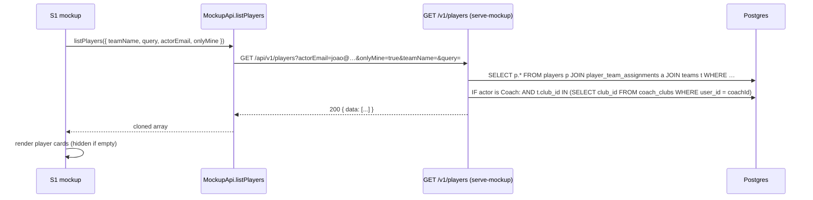
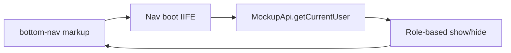

# feat: Coach-scoped S1 player list, Clubs main menu, and player-club invariant

## Summary

Build on the clubs + `coach_clubs` wiring landed in plan 008 to deliver the coach-facing UX changes: a coach-scoped `S1-player-list`, a SystemAdmin-only "Clubs" entry in the bottom-nav, and the player-creation invariant that every player has a club.

The plan touches the S1 mockup, every mockup's bottom-nav, the mockup API client (backend + offline modes), and the OpenAPI contract for `GET /v1/players`. It adds Playwright coverage for coach scoping and nav role-gating, plus Vitest coverage for the invariant that "the picked team carries a club, so the new player does too". No DB schema changes are required.

## Problem Frame

The clubs + `coach_clubs` schema and API exist (plan 008), but the coach-facing experience hasn't caught up: a Coach currently sees every player on `S1` regardless of which clubs they belong to, the new `S7a-clubs.html` page is reachable only via a S7 inline link (not main nav), and the contract for player creation does not explicitly state the "every player has a club" guarantee.

This plan closes those gaps by:

1. Wiring coach scoping into `GET /v1/players` and the offline mirror in `mockup-api-client.js`.
2. Surfacing a new "Only My Players" checkbox on `S1-player-list.html`, default ON for coaches, hidden for SystemAdmin (who always see all players).
3. Promoting "Clubs" into the bottom-nav as a SystemAdmin-only entry, while keeping the coach-facing nav clean (no "Users", no "Clubs").
4. Locking the player-club invariant as a documented, test-enforced contract.

## Scope Boundaries

### In scope

- `GET /v1/players` query params: `actorEmail` (existing pattern), `onlyMine` (new boolean).
- `scripts/serve-mockup.js` handler: join through `coach_clubs` for Coach actors; SystemAdmin bypasses scoping.
- `docs/ux/mockup/js/mockup-api-client.js`: forward `actorEmail` + `onlyMine` to backend; mirror the same filter offline.
- `docs/ux/mockup/S1-player-list.html`: add "Only My Players" checkbox in the toolbar (hidden for SystemAdmin), wire `state.onlyMine`, persist in component state, surface result-count notice.
- All mockup HTML files: bottom-nav role-gating (Users visible only to SystemAdmin; Clubs visible only to SystemAdmin).
- Playwright specs: coach scoping, nav role-gating, "Only My Players" toggle, SystemAdmin always-sees-all.
- Vitest specs: serve-mockup static-analysis for the new filter, mockup-api-client static-analysis, OpenAPI contract assertions, player-club invariant assertion.
- `docs/ux/mockup/API-Mockup-Mapping.md`: add the new screen rows and a brief "Clubs main nav + S1 coach scoping" section.

### Out of scope (deferred)

- **React player-list feature.** `apps/web/src/features/players/` does not exist yet. The mockup is the only player-list surface today; React parity is a separate plan.
- **New DB columns, migrations, or stored procedures.** `coach_clubs`, `teams.club_id`, and `clubs.status` already exist (plan 008 + earlier plans).
- **Bulk-move-players-between-clubs workflow.** Not requested.
- **S7a clubs page changes.** The page itself is fine; the only edit is the bottom-nav entry linking to it from admin contexts.
- **Coach-side "view other coaches' players" override.** A coach cannot opt out of scoping once `onlyMine=true` (only admins can use `onlyMine=false`).
- **React main-nav.** No React main-nav exists yet.

### Non-goals

- Multi-club player assignments: a player still belongs to exactly one team (and therefore one club), unchanged.
- Renaming of any schema entity.
- Removing or rewriting existing endpoints.

## Key Technical Decisions

### K1. Coach scoping is server-enforced via `coach_clubs` (not client-trusted)

The Coach scoping filter must be enforced in `scripts/serve-mockup.js` (and the contract test must assert the same), not in the browser. The mockup client may forward `actorEmail`, but the server must apply the join through `coach_clubs → clubs` and only return rows whose team's `club_id` is in the coach's club set. Without this, a malicious or hand-crafted client request could enumerate every player.

### K2. `onlyMine` semantics: filter on top of role, not a role override

`onlyMine` does not change role scoping — it is layered on top. For Coach: `onlyMine=true` narrows to the coach's clubs; `onlyMine=false` is not a meaningful concept for coaches (they have no unscoped view by default). For SystemAdmin: `onlyMine=true` would mean "only show me players in clubs I belong to via `coach_clubs`"; per the user's decision in `AskQuestion`, SystemAdmin does not see the toggle, so SystemAdmin requests always pass `onlyMine=false` implicitly. The server still accepts the param for API completeness; the mockup never sends `onlyMine=true` for admins.

### K3. "Only My Players" checkbox default = ON for Coach, hidden for SystemAdmin

Per the user's confirmed call: SystemAdmin never sees the toggle (always shows all players); Coach sees the toggle default ON. The `S1` toolbar renders the checkbox only when `MockupApi.getCurrentUser().role === 'Coach'`. The checkbox state is component-local; refreshing the page resets to default (not URL-persisted) to keep this small.

### K4. Bottom-nav role-gating is implemented in JavaScript, not by deleting nav markup

Each mockup HTML inlines its `<nav class="bottom-nav">`. To keep the markup stable (and avoid per-page conditional duplication), every mockup page runs a small nav-bootstrapping IIFE that calls `MockupApi.getCurrentUser()` and toggles the visibility of nav items by `data-role` attributes. This makes the S1 → Clubs link and the S1/S3/S4/S6 → Users link role-gated from one place.

### K5. Player-club invariant: implicit through `teams.club_id`, locked by contract test

The "every player has a club" rule is already satisfied structurally: `POST /v1/players` requires `teamName`, and team-create enforces `club_id` (see `createTeam` in `serve-mockup.js` and the `createTeam` mockup-API branch). No new column on the player row is needed. The invariant is locked with a Vitest assertion that `CreatePlayerRequest` does not need a redundant `clubId` field, AND that `TeamResponse.clubId` is non-nullable in the OpenAPI schema.

## Requirements

| ID | Requirement |
|---|---|
| R1 | `GET /v1/players` accepts `actorEmail` (string) and `onlyMine` (boolean) query parameters. |
| R2 | For `actorEmail` resolving to an active Coach, the response only contains players whose team's `club_id` is in the coach's `coach_clubs` set. |
| R3 | For `actorEmail` resolving to an active SystemAdmin, the response is unchanged from the current behavior (no scoping applied) regardless of `onlyMine`. |
| R4 | When `actorEmail` is omitted or unknown, the response is unchanged (current behavior). |
| R5 | `S1-player-list.html` shows an "Only My Players" checkbox for Coach sessions, default ON. Toggling it OFF shows every player across every team. |
| R6 | `S1-player-list.html` never shows the "Only My Players" checkbox for SystemAdmin sessions. |
| R7 | The bottom-nav on every mockup page includes a "Clubs" entry visible only to SystemAdmin. |
| R8 | The bottom-nav on every mockup page includes a "Users" entry visible only to SystemAdmin (it is shown today on S7 and S7a but never for coaches). |
| R9 | `mockup-api-client.js` `listPlayers` accepts `actorEmail` + `onlyMine` and forwards them to the backend in backend mode; mirrors the same filter offline. |
| R10 | The "every player has a club" invariant is documented and enforced via a Vitest assertion that `Team.clubId` is required (non-nullable) in OpenAPI. |

## High-Level Technical Design

### Data flow for S1 with coach scoping

### Nav role-gating

## Implementation Units

### U1. OpenAPI contract + `serve-mockup.js` coach scoping for `GET /v1/players`

**Goal**: Extend `GET /v1/players` with coach scoping, declared in OpenAPI and enforced server-side.

**Requirements**: R1, R2, R3, R4.

**Dependencies**: none.

**Files**:
- `openapi/v1/openapi.yaml` — add `actorEmail` and `onlyMine` parameters to the `GET /players` operation.
- `openapi/v1/schemas/players.yaml` — no schema changes expected; document the scoping contract in the operation description.
- `scripts/serve-mockup.js` — extend the `GET /api/v1/players` handler: read `actorEmail` and `onlyMine` from query; for active Coach actors, append an `IN (...)` predicate on `t.club_id` joined through `coach_clubs`.
- `apps/api/tests/contract/openapi.players.spec.ts` — add assertions that the parameters exist and that `Team.clubId` is required (K5 invariant).

**Approach**:
- Add a new helper `applyCoachScope(query, actor)` in `serve-mockup.js` that, given the SQL fragment and the resolved actor row, returns the SQL fragment plus the bound values. The current `listPlayers(teamName, query)` signature becomes `listPlayers({ teamName, query, actor, onlyMine })`.
- The actor is resolved by `actorEmail`: SystemAdmin → bypass; Coach → join through `coach_clubs`; unknown → bypass (current behavior).
- For `onlyMine=true` with a non-Coach actor, fall through to no scoping (the mockup never sends this, but the API should not 400).

**Patterns to follow**:
- The `resolveCoachActor` helper already in `serve-mockup.js` (around line 890) is the model for resolving actor → user row. Mirror its shape with a `resolveActorForPlayersList` that also handles SystemAdmin.
- `apps/api/src/db/migrations/013_teams_status.sql` shows the existing `coach_clubs` join idiom (`SELECT club_id FROM coach_clubs WHERE user_id = $1`).

**Test scenarios**:
- Coach `joao@vantageiq.club` requests `GET /v1/players?actorEmail=joao@vantageiq.club&onlyMine=true` → returns only players on teams whose `club_id` is in Joao's `coach_clubs`. After the seed, Joao is in `c_default`, so the response is `{Lionel Messi, Cristiano Ronaldo, Neymar Jr, Kylian Mbappe}` (all four seeded players).
- Coach `joao@vantageiq.club` requests `GET /v1/players?actorEmail=joao@vantageiq.club&onlyMine=true&teamName=Senior Squad` → returns the same set scoped to Senior Squad: `{Cristiano Ronaldo, Kylian Mbappe}`.
- SystemAdmin `maria@vantageiq.club` requests `GET /v1/players?actorEmail=maria@vantageiq.club&onlyMine=true` → returns every player regardless of `onlyMine` (admins bypass scoping).
- Unknown actor: `GET /v1/players?actorEmail=ghost@vantageiq.club` → returns the full set (current behavior preserved).
- Existing `teamName` + `query` filters continue to compose with scoping: `GET /v1/players?actorEmail=joao@vantageiq.club&onlyMine=true&query=messi` → returns `{Lionel Messi}` only.

**Verification**: OpenAPI loads, contract tests pass, serve-mockup static-analysis test asserts the new query-params branch exists and the helper is wired.

---

### U2. `mockup-api-client.js` offline + backend `listPlayers` updates

**Goal**: Mirror the server scoping in the offline/local path and forward the new query params in the backend path.

**Requirements**: R1, R2, R3, R4, R9.

**Dependencies**: U1 (server contract must be defined before the client mirrors it).

**Files**:
- `docs/ux/mockup/js/mockup-api-client.js` — extend `listPlayers(options)` to accept `actorEmail` + `onlyMine`; in backend mode, forward both to `/api/v1/players`; in offline mode, mirror the filter locally by joining `players → player_team_assignments → teams` and, when an actor is Coach, intersecting with `coach_clubs`.
- `apps/api/tests/integration/clubs/mockup-api-client.spec.ts` — add Vitest assertions for the new method signature and for the offline filter logic.

**Approach**:
- Mirror `resolveActorContext` (already in mockup-api-client.js) into a new helper that returns `{ id, role }` for the active user via `getSessionUser(store)`. The offline `listPlayers` then applies the same predicate the server applies.
- Add a `MockupApi.listPlayers({ teamName, query, actorEmail, onlyMine })` signature that preserves backward compatibility (no breaking change to existing callers that pass only `teamName` + `query`).

**Patterns to follow**:
- The `resolveActorContext` + `MockupApi.listClubs` shape is the closest precedent for "filter by Coach's club set".

**Test scenarios**:
- In offline mode, calling `MockupApi.listPlayers({ actorEmail: 'joao@vantageiq.club', onlyMine: true })` returns only the four seeded players (Joao is in `c_default` which holds all seeded teams).
- In offline mode, calling `MockupApi.listPlayers({ actorEmail: 'maria@vantageiq.club', onlyMine: true })` returns the full set (SystemAdmin bypass).
- In offline mode, calling `MockupApi.listPlayers({ actorEmail: 'joao@vantageiq.club', onlyMine: true, teamName: 'Senior Squad' })` returns `{Cristiano Ronaldo, Kylian Mbappe}` (filter composes).
- Backend mode forwards both query params (asserted by reading the `URLSearchParams` building block).

**Verification**: New static-analysis assertions pass; existing S1 Playwright specs continue to pass under both backend and offline modes.

---

### U3. S1 mockup — coach scoping, "Only My Players" checkbox, role-gated nav

**Goal**: Surface the new behavior in `S1-player-list.html` with a Coach-only checkbox and a SystemAdmin-only "Clubs" link.

**Requirements**: R5, R6, R7, R8.

**Dependencies**: U1, U2.

**Files**:
- `docs/ux/mockup/S1-player-list.html` — add the checkbox markup in the toolbar, gate its visibility on `currentUser.role === 'Coach'`, add the "Clubs" bottom-nav entry with `data-role="SystemAdmin"`, hide the existing "Users" entry on this page (the page is for coaches, not admin entry points — keep the inline "Admin Users" button for SystemAdmin sessions only), and wire `state.onlyMine` through `MockupApi.listPlayers`.
- `docs/ux/mockup/js/mockup-api-client.js` — no additional changes beyond U2.

**Approach**:
- Add `state.onlyMine = true` to the IIFE state; initialize from a single check on `currentUser.role` so SystemAdmin sessions skip the checkbox entirely.
- The new checkbox element lives in the toolbar alongside `#teamFilter`, with `data-testid="only-mine-toggle"`.
- Update the result-count notice text to say "Showing N players in your clubs" when `state.onlyMine && currentUser.role === 'Coach'`.
- Bottom-nav: replace the inline nav with the role-gated nav from U4 (or just inline the change for S1 specifically, leaving U4 to generalize across other pages — see Implementation Note in U4).

**Patterns to follow**:
- The S7 admin-page pattern of `viewRole` toggling is the model for role-driven UI changes; S1 uses `currentUser.role` directly because there is no "Switch view" toggle.
- The S1 toolbar's `class="toolbar"` is the natural home for the new checkbox.

**Test scenarios**:
- Coach session lands on S1 with the team filter set to "All Teams" and the "Only My Players" checkbox checked by default; only players in the coach's clubs are shown.
- Coach unchecks "Only My Players"; the player grid populates with every player (including those outside the coach's clubs in the offline seed — same players in the current seed, but verifies the toggle).
- Coach checks "Only My Players" again; the grid returns to the scoped view.
- SystemAdmin session lands on S1; the checkbox is not rendered; all players are shown.
- SystemAdmin session: clicking the bottom-nav "Clubs" entry navigates to `S7a-clubs.html`.
- Coach session: the bottom-nav "Clubs" entry is not rendered; the existing "Users" entry is also not rendered for the coach view of S1.

**Verification**: New Playwright `tests/playwright/s1-coach-scope.spec.js` passes; existing `s1-player-list.spec.js` continues to pass.

---

### U4. Bottom-nav role-gating across all mockups

**Goal**: A single, role-aware nav-bootstrapping pattern that hides SystemAdmin items from coaches and coach items from SystemAdmin on every page.

**Requirements**: R7, R8.

**Dependencies**: U3 (the S1 page is the visible confirmation; this unit generalizes).

**Files**:
- `docs/ux/mockup/js/mockup-api-client.js` — add a tiny `MockupApi.applyRoleGatedNav()` helper that finds every `[data-role]` nav item and toggles its `display` based on `getCurrentUser().role`.
- `docs/ux/mockup/S1-player-list.html`, `S2-player-dashboard.html`, `S3-team-management.html`, `S3a-team-update.html`, `S4-video-capture.html`, `S5-player-edit.html`, `S6-assessment-list.html`, `S7-admin-user-management.html`, `S7a-clubs.html` — replace the static bottom-nav with one whose items carry `data-role` attributes; call `MockupApi.applyRoleGatedNav()` once on load.
- `tests/playwright/s1-coach-scope.spec.js` (or a new `bottom-nav-role-gating.spec.js`) — assert per-page nav visibility.

**Approach**:
- A small `MockupApi.applyRoleGatedNav()` helper inspects each `[data-role-visible-to]` element and sets `el.style.display = ''` only when the user's role matches (or when no attribute is set, default visible). This is more flexible than hardcoded role lists in markup.
- Per page, the only markup changes are: add `data-role-visible-to="SystemAdmin"` to the "Clubs" and "Users" items, and the helper script tag at the bottom of the body. No structural change.

**Patterns to follow**:
- The existing `setAdminActionState()` pattern in `S7a-clubs.html` (line 237) shows how role-driven UI state is implemented today; the new helper centralizes it.

**Test scenarios**:
- Coach loads each of `S1`, `S3`, `S4`, `S6`; the bottom-nav shows Players, Teams, Capture, My Clips only; "Clubs" and "Users" items are not visible.
- SystemAdmin loads `S1`, `S3`, `S4`, `S6`; the bottom-nav shows Players, Teams, Capture, My Clips, Clubs, Users (six items, with Clubs and Users new).
- SystemAdmin loads `S7` and `S7a`; "Clubs" is the active item (or, on `S7`, the "Users" item is active and Clubs is reachable); behavior unchanged from today's six-item admin nav.
- Coach navigates directly to `S7-admin-user-management.html` via URL (no nav guard in route — the role gating is nav-only by design); the page itself returns the "Coach view: admin actions are disabled" notice (existing behavior, unchanged).

**Verification**: New Playwright spec passes across all listed pages; existing nav specs in `s1-player-list.spec.js` and `s7-admin-user-management.spec.js` continue to pass with the new markup.

---

### U5. Player-club invariant test + API-Mockup mapping update

**Goal**: Lock the "every player has a club" rule as a tested invariant and update the cross-cutting documentation.

**Requirements**: R10.

**Dependencies**: U1.

**Files**:
- `apps/api/tests/contract/openapi.players.spec.ts` — add a Vitest assertion that `Team.clubId` is a required (non-nullable) field in `openapi/v1/schemas/teams.yaml`. (If a small documentation update is needed in that schema, do it inline.)
- `docs/ux/mockup/API-Mockup-Mapping.md` — add a new "S1 coach scoping + Clubs main nav" section listing the four added screen rows (Coach toggle, Coach nav hide, Admin nav show, Admin always-show-all), the new query params, and the test traceability updates.
- `tests/playwright/_debug.spec.js` is not touched (it's a debug helper).

**Approach**:
- The invariant test reads the YAML and asserts: `Team` schema has `clubId` as a required property AND it is `nullable: false`.
- The mapping doc lists new screen rows: "S1 toolbar · Only My Players checkbox · (client-side only)", "S1 bottom-nav · Clubs entry · (client-side only)", and the four OpenAPI parameter rows.

**Patterns to follow**:
- Existing `apps/api/tests/contract/openapi.players.spec.ts` test file pattern.

**Test scenarios**:
- Vitest: `Team.clubId` is required in `openapi/v1/schemas/teams.yaml` and is not nullable.
- Manual: review the updated `API-Mockup-Mapping.md` for accuracy against the OpenAPI changes.

**Verification**: Vitest passes; the mapping doc lists every new screen row and points to the new spec files.

---

## Verification Strategy

- **Unit**: `vitest run apps/api/tests/contract` validates OpenAPI shape and the player-club invariant.
- **Unit**: `vitest run apps/api/tests/integration/clubs` validates `mockup-api-client.js` and `serve-mockup.js` changes via static analysis.
- **E2E**: `npx playwright test tests/playwright/s1-coach-scope.spec.js` validates the new S1 coach-scoping UX.
- **E2E**: `npx playwright test tests/playwright/bottom-nav-role-gating.spec.js` validates per-page nav role-gating.
- **E2E regression**: `npx playwright test` continues to pass for `s1-player-list.spec.js`, `s7-admin-user-management.spec.js`, `s7a-clubs.spec.js`, `s7-user-club-assignment.spec.js`, `logout.spec.js`, `s0-auth-entry.spec.js`, `s3-team-management.spec.js`, `s4-video-capture.spec.js`, `s5-player-edit.spec.js`, `s6-assessment-list.spec.js`, `s2-player-dashboard.spec.js`.
- **Smoke**: start `npm run serve:mockup` and curl `GET /api/v1/players?actorEmail=joao@vantageiq.club&onlyMine=true` against a seeded database — confirm only the four seeded players are returned.

## Open Questions

- **Q1 (deferred)**: Should `S1` show a system-admin "Only My Players" toggle too? Per the answered `AskQuestion`, no — SystemAdmin never sees the toggle. Documented in K3.
- **Q2 (deferred)**: Should a Coach be able to send `onlyMine=false` to bypass scoping on purpose (e.g. to debug a teammate's view)? Per K2, no — coaches have no unscoped view by design. The server still accepts the param for API completeness, but the mockup never surfaces it for coaches.

## Risks & Dependencies

- **Risk**: Changing the bottom-nav markup could break existing Playwright locators (`.bottom-nav .nav-item`, `hasText: 'Teams'`, etc.). Mitigation: keep the same `<a class="nav-item">` markup and only add `data-role-visible-to` attributes; do not rename or restructure items.
- **Risk**: Static-analysis tests on `serve-mockup.js` could be brittle to slice boundaries (this bit plan 008). Mitigation: use dynamic slicing from the `GET /api/v1/players` handler start to the next `requestUrl.pathname` block, mirroring the pattern in `clubs-api-mockup.spec.ts`.
- **Dependency**: `GET /v1/players` already uses `actorEmail` for `/dashboard` and `/profile`. The new `onlyMine` param is the only contract delta.
- **Dependency**: `clubs.status`, `coach_clubs`, and `teams.club_id` are all present from earlier plans; no migration is needed.

## Phased Delivery

This plan is small enough to land as a single PR. Implementation order:

1. **U1** (server contract) — get the API + OpenAPI right first.
2. **U2** (mock client mirror) — depends on U1.
3. **U3** (S1 UX) — depends on U1 + U2.
4. **U4** (cross-page nav) — depends on U3 (so the helper and S1 reference implementation land together).
5. **U5** (invariant test + mapping doc) — depends on U1.

Each unit is independently shippable, but the user-visible value (S1 coach scoping + Clubs main nav) only becomes apparent at the end of U3.