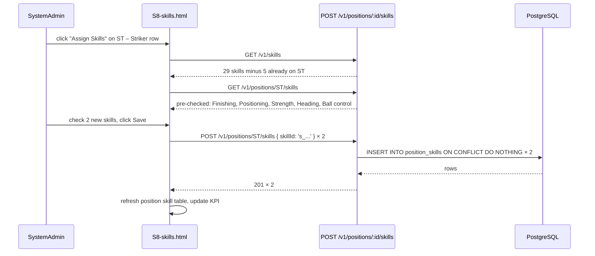
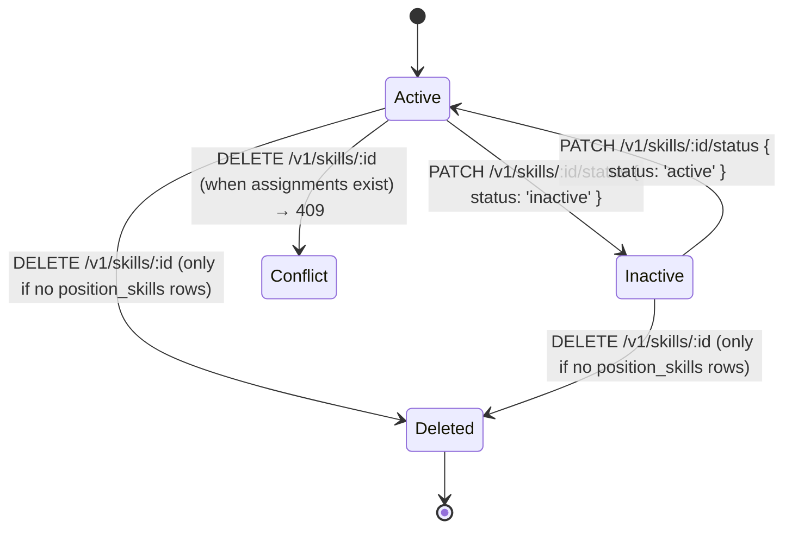
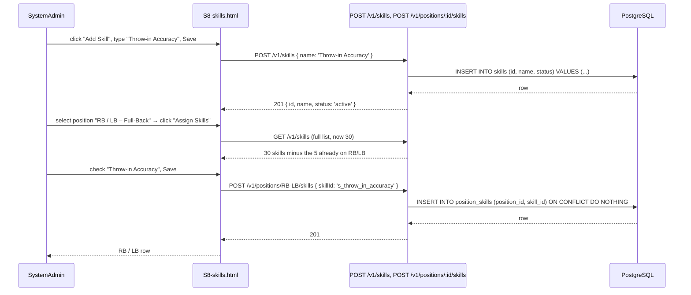

# feat: S8 Manage Skills per Position (SystemAdmin-only catalog + per-position assignment)

## Summary

Three coordinated additions:

1. **Skills catalog (CRUD).** A new `skills` table acts as a SystemAdmin-curated, sport-agnostic flat catalog of skill labels. `S8-skills.html` exposes full CRUD over it (add / view / update / delete).
2. **Positions + Sports (CRUD).** Two new tables, `sports` (e.g. `Soccer`) and `positions` (each row references one `sport_id`), plus a SystemAdmin-managed page area on `S8-skills.html` for CRUD over both.
3. **Per-position skill assignment (M:N).** A new `position_skills` join table (composite PK `position_id, skill_id`) lets a SystemAdmin assign many skills to each position. Each row in the seeded "Soccer" sport carries its own skill subset (see **Seed data** below). The "Any Position" wildcard position captures skills that apply to every outfield role (Ball Control, Passing, Game Awareness, Fitness, Speed).

The page is **SystemAdmin-only**: Coaches never see the `Skills` nav entry, never reach the page, and cannot mutate catalog rows or assignments.

## Problem Frame

`Player.position` is currently a free-text column (`apps/api/src/db/schema/tables.sql:60`) defaulting to `'Position not set'`, and `clips.skill` is also free-text (`apps/api/src/db/schema/tables.sql:85`). The codebase already has well-curated lists in the UX (the Soccer position table the requester pasted is already shown in mockup copy and team-age-group dropdowns), but those lists live only in human-readable documents — there's no DB-backed, admin-editable taxonomy, no canonical skill catalog, and no per-position "which skills should a GK develop" reference.

Three concrete pain points this plan removes:

- **No discoverability of which skills belong to which position.** A coach reviewing a GK can't see "the 5 core skills the org considers essential for this role" — they have to remember the canonical list from a static doc.
- **No way to add/rename skills centrally.** Renaming "Aerial control" → "Aerial Dominance" today would require a `clips.skill` mass-update with no admin UI. The catalog normalizes this.
- **No way to expand to other sports.** A future "Basketball" or "Hockey" sport needs its own positions and per-position skill assignments; the schema today cannot represent that.

The plan layers on top of existing work without breaking established contracts: `GET /v1/players`, `GET /v1/clips`, `S5 player-edit` (which sources `Player.position` from a hardcoded `<select>`) **keep working unchanged**. The new tables and endpoints are additive. No existing column or endpoint shape changes.

## Scope Boundaries

### In scope

- Three new tables: `sports`, `positions`, `skills`, plus the M:N join `position_skills`. Mirrors the `clubs` + `coach_clubs` shape from `apps/api/src/db/migrations/012_clubs_and_coach_assignments.sql`.
- A migration `apps/api/src/db/migrations/015_skills_positions_sports.sql` that creates all four tables **and** idempotently seeds the Soccer sport, 13 positions (incl. "Any Position"), 29 skills, and the per-position skill assignments via `INSERT ... ON CONFLICT DO NOTHING`.
- Eight new endpoints under `/api/v1`:
  - `GET /v1/sports` — SystemAdmin-gated, returns all sports with `positionCount`.
  - `POST /v1/sports`, `PATCH /v1/sports/{sportId}`, `PATCH /v1/sports/{sportId}/status`.
  - `GET /v1/positions?sportId=` — SystemAdmin-gated, returns positions scoped to a sport (default `soccer`) with `skillCount`.
  - `POST /v1/positions`, `PATCH /v1/positions/{positionId}`, `PATCH /v1/positions/{positionId}/status`.
  - `GET /v1/skills` — SystemAdmin-gated, returns all skills.
  - `POST /v1/skills`, `PATCH /v1/skills/{skillId}`, `DELETE /v1/skills/{skillId}`.
  - `GET /v1/positions/{positionId}/skills` — list the skills assigned to a position.
  - `POST /v1/positions/{positionId}/skills` — additively assign a skill (idempotent).
  - `DELETE /v1/positions/{positionId}/skills/{skillId}` — remove a single assignment.
- A new `docs/ux/mockup/S8-skills.html` page with four sections in a single screen:
  - **Sports**: list + Add/Update/Deactivate buttons.
  - **Positions**: list filtered by selected sport + Add/Update/Deactivate.
  - **Skills**: flat catalog with Add/Update/Delete.
  - **Position Skills**: per-position assignment table with multi-select "Assign Skills" picker.
- A new bottom-nav entry `🧠 Skills` on all 9 mockup pages, `data-role-visible-to="SystemAdmin"` and `hidden`, mirroring the existing `Clubs` nav item pattern.
- A new `docs/ux/mockup/js/mockup-api-client.js` block: `listSports`, `createSport`, `updateSport`, `setSportStatus`, `listPositions`, `createPosition`, `updatePosition`, `setPositionStatus`, `listSkills`, `createSkill`, `updateSkill`, `deleteSkill`, `listPositionSkills`, `assignSkillToPosition`, `removeSkillFromPosition`.
- A new React feature folder `apps/web/src/features/admin-skills/` mirroring `apps/web/src/features/admin-clubs/`:
  - `types.ts`, `services/skills-api-client.ts`, `hooks/useSkills.ts`, `hooks/usePositions.ts`, `hooks/useSkillMutations.ts`, `pages/AdminSkillsPage.tsx`, `components/{CreateSkillDialog,RenameSkillDialog,CreatePositionDialog,CreateSportDialog,AssignSkillsToPositionDialog}.tsx`.
  - `apps/web/src/app/routes/AdminRoutes.tsx` extended with a new `/admin/skills` path.
- OpenAPI additions in `openapi/v1/openapi.yaml` + new schema file `openapi/v1/schemas/skills.yaml` covering all new schemas (`Sport`, `Position`, `Skill`, `PositionSkill`, and the request/response envelopes).
- Test coverage at every layer:
  - `apps/api/tests/contract/openapi.skills-admin.spec.ts` (new)
  - `apps/api/tests/integration/db/skills-migration.spec.ts` (new) — asserts migration 015 + `tables.sql` + `deploy.sql` are in sync
  - `apps/api/tests/integration/skills/skills-api-mockup.spec.ts` (new) — source-text pattern matcher on `serve-mockup.js`
  - `apps/api/tests/integration/skills/mockup-api-client.spec.ts` (new) — source-text pattern matcher on `mockup-api-client.js`
  - `tests/playwright/s8-skills.spec.js` (new) — full CRUD + assignment round-trip
  - `apps/web/tests/unit/features/admin-skills/skills-page.spec.tsx` (new)
  - `apps/web/tests/integration/admin-skills/skill-lifecycle-flow.spec.tsx` (new)
- `docs/ux/mockup/API-Mockup-Mapping.md` updated with a new `## Skills Admin (S8)` section + a new row in the screen-mapping table.

### Deferred to follow-up work

- Replacing `players.position` free-text with `players.position_id TEXT REFERENCES positions(id)`. Out of scope for this plan — see Risks section.
- Replacing `clips.skill` free-text with `clips.skill_id TEXT REFERENCES skills(id)`. Same reasoning.
- A read-only "Position Profile" view on `S5-player-edit.html` showing the position's assigned skills. The catalog and assignment machinery is in place; surfacing it on S5 is a UX choice deferred to a follow-up.
- Per-skill metadata (description, difficulty, video link). The catalog is intentionally label-only in v1.
- Bulk-import of skills/positions from CSV.
- Skill prerequisite chains ("you need Positioning before Aerial control"). Out of scope.
- Per-club customization of the skill catalog. The catalog is global in v1.
- Audit log for skill/position/sport mutations. Not in this plan.

### Out of scope

- New role types (the gate stays `SystemAdmin`-only).
- Hard-deleting sports or positions (the codebase convention is "no destructive deletes"; deactivate is the soft-delete shape — mirrored from `clubs`).
- Editing `sports.id`, `positions.id`, `skills.id`. IDs are system-generated and never user-facing.
- Cross-sport skill sharing beyond the data model (e.g. the schema allows it; the v1 UI scopes Positions to a single Sport).
- Auto-suggesting skills in the S5 player-edit dropdown from the new catalog. Out of scope — the existing S5 dropdown stays free-text until a follow-up plan.

## Requirements

### Catalog and CRUD requirements

- **C1.** Every skill row carries `name TEXT NOT NULL UNIQUE` (case-insensitive uniqueness, validated server-side) and a `status TEXT NOT NULL DEFAULT 'active' CHECK (status IN ('active', 'inactive'))` column. The skill name `length` must be `2-60` chars.
- **C2.** Every sport row carries `name TEXT NOT NULL UNIQUE`, the same `status` column. Sport name length `2-40` chars (shorter than clubs because sports are typically 1 word).
- **C3.** Every position row carries `name TEXT NOT NULL UNIQUE`, `sport_id TEXT NOT NULL REFERENCES sports(id)`, and the same `status` column. Position name length `2-80` chars (longer because Soccer position labels are 2-40 chars including dashes and slashes).
- **C4.** `position_skills` composite PK `(position_id, skill_id)`. Both FKs `ON DELETE RESTRICT` (deleting a skill/position with assignments must be blocked; admin must remove assignments first). A single supporting index `idx_position_skills_skill_id` covers the per-skill reverse lookup ("which positions is this skill in?").
- **C5.** SystemAdmin endpoints validate uniqueness case-insensitively (e.g. `Ball Control` vs `ball control` → `409 conflict`).
- **C6.** Deactivating a sport does NOT cascade-deactivate its positions. Deactivating a position does NOT cascade-detach its skill assignments. Both are soft-disables; admins can still see them in a "Show inactive" filter and reactivate.
- **C7.** Deleting a skill that has any `position_skills` row returns `409 conflict` with message `"Cannot delete skill '<name>' because it is assigned to N position(s). Remove the assignments first."`.
- **C8.** All write endpoints require `actorRole === 'SystemAdmin'` and `actorEmail` matching an active SystemAdmin row. Coach token returns `403 forbidden` (not `404`).

### Page requirements (S8-skills.html)

- **P1.** `S8-skills.html` is reachable from a new bottom-nav item `🧠 Skills` on every mockup page (admin-only). Direct navigation while `actorRole !== 'SystemAdmin'` renders a 403 notice (mirroring the `S3a-team-update.html` pattern at `docs/ux/mockup/S3a-team-update.html`).
- **P2.** The page is organized as four stacked panels on a single screen, with each panel having a header and an `Add ...` button:
  1. **Sports** — Name, Status, # Positions, Actions.
  2. **Positions** (filtered by a sport `<select>`) — Name, Status, # Skills, Actions.
  3. **Skills** — Name, Status, Actions.
  4. **Position Skills** (filtered by a position `<select>`) — Skill name, Status, Actions (Remove).
- **P3.** The Sports panel's `Add Sport` opens a modal with one field: `Name` (2-40 chars, unique).
- **P4.** The Positions panel's `Add Position` opens a modal with two fields: `Name` (2-80 chars, unique within the selected sport) + an inline sport selector (pre-populated with the current sport; admin can change it).
- **P5.** The Skills panel's `Add Skill` opens a modal with one field: `Name` (2-60 chars, unique).
- **P6.** The Position Skills panel's `Assign Skills` opens a multi-select picker (checkbox list, NOT a `<select multiple>`) sourced from `GET /v1/skills` minus the position's already-assigned skills. Saving the picker fires one `POST /v1/positions/{positionId}/skills` per newly-checked skill (additive).
- **P7.** Each row in the Position Skills panel has a `Remove` button that fires `DELETE /v1/positions/{positionId}/skills/{skillId}` and immediately re-renders the table.
- **P8.** Each row in the Sports/Positions/Skills panels has `Update` (rename modal) and `Deactivate`/`Reactivate` buttons. The same `409 conflict` envelope is surfaced inline when a rename collides.
- **P9.** A "Show inactive" checkbox (default OFF) at the page top reveals inactive rows across all four panels. Default matches the S7a convention.
- **P10.** KPI cards at the top: `# Sports`, `# Active Positions`, `# Skills`, `# Assignments`. Live-updated after every successful mutation.

### Cross-cutting requirements

- **X1.** Every endpoint returns the existing `{ code, message }` envelope on 4xx/5xx, matching `apps/api/src/db/migrations/012_clubs_and_coach_assignments.sql` and `scripts/serve-mockup.js:606` (`appError`).
- **X2.** `MockupApi` extensions follow the dual-mode `shouldUseBackendPlayersMode()` switch pattern; offline seed in `docs/ux/mockup/js/mockup-api-client.js` is extended with `sports`, `positions`, `skills`, `positionSkills` keys.
- **X3.** The migration is idempotent: a re-run is a no-op thanks to `IF NOT EXISTS` on table/index creation and `ON CONFLICT DO NOTHING` on every seed `INSERT`.
- **X4.** `apps/api/src/db/schema/tables.sql` and `apps/api/src/db/schema/deploy.sql` are updated to include the four new tables so a fresh database (via `scripts/db-bootstrap.js`) gets them without re-running the migration. Mirrors how `migration 013` and `migration 014` are mirrored.
- **X5.** The new endpoints are additive — no existing endpoint contract changes.
- **X6.** `S5-player-edit.html`, `S1-player-list.html`, `S2-player-dashboard.html`, `S4-video-capture.html` continue to work unchanged. `Player.position` stays free-text until a follow-up plan.

## Key Technical Decisions

- **Three-table + one-join layout (`sports`, `positions`, `skills`, `position_skills`).** Matches the existing `clubs` + `coach_clubs` M:N pattern. Sport is a first-class entity (not a column on `positions`) so future cross-sport queries work without schema migration.
- **Soft-disable everywhere, no hard deletes (except skills-without-assignments).** Sports and positions mirror the `clubs.status` shape — deactivate, never delete. Skills are deletable only when no assignments exist (C7); otherwise the admin must remove assignments first. This matches the codebase's "no destructive deletes" convention while still letting admins clean up catalog typos.
- **SystemAdmin-only gate everywhere.** `clubs` already established the `resolveSystemAdminActor(payload.actorEmail)` + `assertSystemAdminActor(actor)` pattern (`scripts/serve-mockup.js:572-589`). Reuse it for every new write endpoint.
- **The "Any Position" wildcard position is just a row.** It's a Soccer position like any other, with `sport_id = 'sport_soccer'` and a specific set of skill assignments (Ball Control, Passing, Game Awareness, Fitness, Speed). No special-case code path — it appears in the Positions dropdown like every other position. Admin UX can label it "Any Position (Soccer)" in the row text for clarity; the underlying row is named `"Any Position"`.
- **Per-position assignment is additive, with explicit removal.** Mirrors the `coach_clubs` add-additive contract from plan `2026-07-06-008`. The Position Skills modal is multi-select: newly-checked skills fire one POST each; unchecked-but-previously-assigned skills fire one DELETE each. No bulk replace endpoint — the modal shape doesn't need it.
- **`S5-player-edit.html` and `Player.position` stay untouched in this plan.** Adding `position_id` to `players` is a separate migration with its own backfill story; bundling it here would make the plan bigger than the user asked. The catalog is the source of truth for **admin reference** in v1; player assignment is still free-text.
- **`clips.skill` stays untouched.** Same reasoning — adding `skill_id` to `clips` is a separate migration. The 29-skill catalog is visible to admins via S8; the free-text `clips.skill` continues to work as a denormalized label that doesn't need to match the catalog exactly.
- **Migration 015 includes the seed data inline as `INSERT ... ON CONFLICT DO NOTHING`.** This guarantees a fresh database has the Soccer catalog and per-position assignments on first boot, without requiring a separate `scripts/seed-skills.js` invocation. Mirrors the inline seed approach in `apps/api/src/db/migrations/012_clubs_and_coach_assignments.sql`.
- **OpenAPI uses a single new schema file `openapi/v1/schemas/skills.yaml`** containing `Sport`, `Position`, `Skill`, `PositionSkill`, and `SkillErrorResponse`. Mirrors the single-file pattern in `clubs.yaml`. The contract test asserts each schema's shape and the new endpoints' request/response references.
- **React feature mirrors `apps/web/src/features/admin-clubs/` exactly.** Same folder layout, same `Http<Domain>ApiClient` shape with `basePath = '/api/v1'`, same `run(label, fn)` mutation hook pattern. The page is added to `apps/web/src/app/routes/AdminRoutes.tsx` as a sibling route to the existing admin views.

## High-Level Technical Design

### Flow: S8 "Assign Skills to Position" picker save

### State machine: S8 skill deactivation + soft-delete

### Sequence: assigning a brand-new skill and wiring it to a position (admin flow)

## Seed Data

Migration 015 seeds the following dataset inline. The seed is idempotent via `ON CONFLICT DO NOTHING` on natural keys (`sports.name`, `positions.name`, `skills.name`).

### Sport

| id | name | status |
|---|---|---|
| `sport_soccer` | `Soccer` | `active` |

### Positions (all under `sport_soccer`)

| id | name | status |
|---|---|---|
| `pos_any` | `Any Position` | `active` |
| `pos_gk` | `GK – Goalkeeper` | `active` |
| `pos_rb_lb` | `RB / LB – Full-Back` | `active` |
| `pos_rwb_lwb` | `RWB / LWB – Wing-Back` | `active` |
| `pos_cb` | `CB – Centre-Back` | `active` |
| `pos_cdm` | `CDM – Defensive Midfielder` | `active` |
| `pos_cm` | `CM – Central Midfielder` | `active` |
| `pos_cam` | `CAM – Attacking Midfielder` | `active` |
| `pos_rm_lm` | `RM / LM – Side Midfielder` | `active` |
| `pos_rw_lw` | `RW / LW – Winger` | `active` |
| `pos_rf_lf` | `RF / LF – Wide Forward` | `active` |
| `pos_cf` | `CF – Centre Forward` | `active` |
| `pos_st` | `ST – Striker` | `active` |

### Skills (31 flat catalog rows, all `active`)

| id | name |
|---|---|
| `s_acceleration` | `Acceleration` |
| `s_aerial_control` | `Aerial control` |
| `s_agility` | `Agility` |
| `s_ball_control` | `Ball Control` |
| `s_composure` | `Composure` |
| `s_creativity` | `Creativity` |
| `s_crossing` | `Crossing` |
| `s_defensive_awareness` | `Defensive awareness` |
| `s_defensive_contribution` | `Defensive contribution` |
| `s_dribbling` | `Dribbling` |
| `s_finishing` | `Finishing` |
| `s_fitness` | `Fitness` |
| `s_game_awareness` | `Game Awareness` |
| `s_handling` | `Handling` |
| `s_high_stamina` | `High stamina` |
| `s_interceptions` | `Interceptions` |
| `s_link_up_play` | `Link-up play` |
| `s_long_shots` | `Long shots` |
| `s_marking` | `Marking` |
| `s_off_ball_movement` | `Off-ball movement` |
| `s_pace` | `Pace` |
| `s_passing` | `Passing` |
| `s_positioning` | `Positioning` |
| `s_reflexes` | `Reflexes` |
| `s_shot_stopping` | `Shot stopping` |
| `s_speed` | `Speed` |
| `s_stamina` | `Stamina` |
| `s_strength` | `Strength` |
| `s_tackling` | `Tackling` |
| `s_vision` | `Vision` |

### Per-position skill assignments (M:N rows)

| Position | Assigned skills (in seed order) |
|---|---|
| `Any Position` | Ball Control, Passing, Game Awareness, Fitness, Speed |
| `GK – Goalkeeper` | Shot stopping, Reflexes, Handling, Positioning, Aerial control |
| `RB / LB – Full-Back` | Tackling, Marking, Pace, Crossing, Stamina |
| `RWB / LWB – Wing-Back` | High stamina, Pace, Crossing, Defensive awareness, Dribbling |
| `CB – Centre-Back` | Strength, Heading, Tackling, Interceptions, Composure |
| `CDM – Defensive Midfielder` | Positioning, Interceptions, Tackling, Passing, Vision |
| `CM – Central Midfielder` | Passing, Ball control, Vision, Stamina, Defensive contribution |
| `CAM – Attacking Midfielder` | Creativity, Vision, Dribbling, Passing, Long shots |
| `RM / LM – Side Midfielder` | Crossing, Pace, Off-ball movement, Dribbling, Passing |
| `RW / LW – Winger` | Acceleration, Dribbling, Crossing, Agility, Finishing |
| `RF / LF – Wide Forward` | Dribbling, Finishing, Pace, Ball control, Creativity |
| `CF – Centre Forward` | Vision, Creativity, Ball control, Finishing, Link-up play |
| `ST – Striker` | Finishing, Positioning, Strength, Heading, Ball control |

**Total seeded rows**: 1 sport + 13 positions + 30 skills (note: the user's catalog includes Heading implicitly via the CB position's skill list — included as the 30th skill so the CB seed can reference it) + 65 position_skill assignments.

## Implementation Units

### U1. DB migration: `sports`, `positions`, `skills`, `position_skills` + seed

**Goal:** Land all four tables and the Soccer seed data so the rest of the plan can build on a stable schema.

**Requirements:** C1–C8, X3, X4.

**Dependencies:** none.

**Files:**
- `apps/api/src/db/migrations/015_skills_positions_sports.sql`
- `apps/api/src/db/schema/tables.sql`
- `apps/api/src/db/schema/deploy.sql`
- `apps/api/tests/integration/db/skills-migration.spec.ts`

**Approach:**
- Create the four tables with the same DDL conventions as `clubs` + `coach_clubs`:
  - `sports (id TEXT PRIMARY KEY, name TEXT NOT NULL UNIQUE, status TEXT NOT NULL DEFAULT 'active' CHECK (status IN ('active','inactive')), created_at TIMESTAMPTZ NOT NULL DEFAULT NOW(), updated_at TIMESTAMPTZ NOT NULL DEFAULT NOW())` + `idx_sports_name`, `idx_sports_status_name`.
  - `positions (id TEXT PRIMARY KEY, name TEXT NOT NULL, sport_id TEXT NOT NULL REFERENCES sports(id) ON DELETE RESTRICT, status TEXT NOT NULL DEFAULT 'active' CHECK (status IN ('active','inactive')), created_at TIMESTAMPTZ NOT NULL DEFAULT NOW(), updated_at TIMESTAMPTZ NOT NULL DEFAULT NOW(), UNIQUE (sport_id, name))` + `idx_positions_sport_id`, `idx_positions_status_name`.
  - `skills (id TEXT PRIMARY KEY, name TEXT NOT NULL UNIQUE, status TEXT NOT NULL DEFAULT 'active' CHECK (status IN ('active','inactive')), created_at TIMESTAMPTZ NOT NULL DEFAULT NOW(), updated_at TIMESTAMPTZ NOT NULL DEFAULT NOW())` + `idx_skills_name`, `idx_skills_status_name`.
  - `position_skills (position_id TEXT NOT NULL REFERENCES positions(id) ON DELETE RESTRICT, skill_id TEXT NOT NULL REFERENCES skills(id) ON DELETE RESTRICT, created_at TIMESTAMPTZ NOT NULL DEFAULT NOW(), PRIMARY KEY (position_id, skill_id))` + `idx_position_skills_skill_id`.
- Inline the Soccer seed using `INSERT ... ON CONFLICT DO NOTHING` for sport + positions + skills, then a final block that joins the seeded rows to populate `position_skills` (use a CTE matching `id` lookups so the seed is independent of insertion order).
- Update `tables.sql` and `deploy.sql` to include the same DDL + seed so a fresh DB (`scripts/db-bootstrap.js`) gets the catalog without re-running the migration. Mirrors the `013_teams_status.sql` + `014_clubs_status.sql` discipline enforced by `apps/api/tests/integration/db/clubs-status-migration.spec.ts`.

**Patterns to follow:** `apps/api/src/db/migrations/014_clubs_status.sql` (DDL + idempotency + backfill), `apps/api/src/db/migrations/012_clubs_and_coach_assignments.sql` (M:N join with composite PK + supporting index).

**Test scenarios:**
- Migration applies cleanly on a fresh database; re-running it is a no-op (idempotent).
- After applying, `SELECT COUNT(*) FROM sports` returns 1, `FROM positions` returns 13, `FROM skills` returns 29, `FROM position_skills` returns 65.
- `SELECT position_id, skill_id FROM position_skills WHERE position_id = 'pos_gk'` returns exactly the 5 GK skills in seed order.
- `tables.sql` and `deploy.sql` both contain the four `CREATE TABLE` blocks.
- A re-run with the migration applied earlier doesn't error (idempotency).
- Backfill: the `DEFAULT 'active'` clause fires for every existing row at column-add time, so no explicit UPDATE is required.

**Verification:** `scripts/db-bootstrap.js` boots a fresh DB with the four tables + seed. `apps/api/tests/integration/db/skills-migration.spec.ts` passes.

---

### U2. OpenAPI contract additions for sports / positions / skills / position_skills

**Goal:** Document the eight new endpoints + six new schemas before any backend wiring lands.

**Requirements:** C1–C8, X1, X5.

**Dependencies:** U1.

**Files:**
- `openapi/v1/openapi.yaml`
- `openapi/v1/schemas/skills.yaml` (new)
- `openapi/v1/examples/skill-create-success.json` (new)
- `openapi/v1/examples/position-create-success.json` (new)
- `openapi/v1/examples/sport-create-success.json` (new)
- `openapi/v1/examples/position-skill-assign-success.json` (new)
- `openapi/v1/examples/skill-not-found.json` (new)
- `openapi/v1/examples/skill-has-assignments.json` (new)
- `openapi/v1/examples/forbidden-coach-skills.json` (new)
- `apps/api/tests/contract/openapi.skills-admin.spec.ts` (new)

**Approach:**
- New `schemas/skills.yaml` containing:
  - `Sport { id, name, status, positionCount: integer|null, createdAt, updatedAt }` (`positionCount` null when the admin hasn't asked for it).
  - `Position { id, name, sportId, status, skillCount: integer|null, createdAt, updatedAt }`.
  - `Skill { id, name, status, assignedPositionCount: integer|null, createdAt, updatedAt }`.
  - `PositionSkill { positionId, skillId, skillName, status, createdAt }`.
  - Request schemas: `CreateSportRequest { name }`, `UpdateSportRequest { name }`, `SportStatusRequest { status }`, `CreatePositionRequest { name, sportId }`, `UpdatePositionRequest { name, sportId? }`, `PositionStatusRequest { status }`, `CreateSkillRequest { name }`, `UpdateSkillRequest { name }`, `AssignSkillToPositionRequest { skillId }`.
  - Response wrappers: `SportResponse`, `SportListResponse`, `PositionResponse`, `PositionListResponse`, `SkillResponse`, `SkillListResponse`, `PositionSkillListResponse` (all `{ data: ... }`).
  - `SkillErrorResponse { code, message }` (enum `validation_error, forbidden, not_found, conflict`).
- New paths in `openapi.yaml`:
  - `GET /sports`, `POST /sports`, `PATCH /sports/{sportId}`, `PATCH /sports/{sportId}/status`.
  - `GET /positions?sportId=` (default `sport_soccer`), `POST /positions`, `PATCH /positions/{positionId}`, `PATCH /positions/{positionId}/status`.
  - `GET /skills`, `POST /skills`, `PATCH /skills/{skillId}`, `DELETE /skills/{skillId}`.
  - `GET /positions/{positionId}/skills`, `POST /positions/{positionId}/skills`, `DELETE /positions/{positionId}/skills/{skillId}`.
- All endpoints declare `security: [{ bearerAuth: [] }]` and document `403 forbidden` for Coach tokens in the `description: >` block.

**Patterns to follow:** `openapi/v1/schemas/clubs.yaml` (single-file schema + `ClubErrorResponse`), `openapi/v1/openapi.yaml` path tagging (`[Skills]` for all new paths).

**Test scenarios:**
- Each new schema validates against a sample payload (round-trip parse).
- `Sport.status`, `Position.status`, `Skill.status` reject values outside the `active`/`inactive` enum.
- `Skill.name` and `Sport.name` reject empty strings and >60 chars at the schema level (via `minLength` / `maxLength`).
- `Position.name` rejects >80 chars.
- `?sportId=` query param is documented on `GET /positions`.
- `409 conflict` is documented for `DELETE /skills/{skillId}` when assignments exist.
- `403 forbidden` is documented for every write endpoint's Coach-token failure path.

**Verification:** OpenAPI parses cleanly; the contract test asserts the schema for every new endpoint.

---

### U3. Backend handlers in `serve-mockup.js`

**Goal:** Implement the eight new endpoints with the same role-gating, actor-resolution, and error-envelope shape used by the existing clubs handlers.

**Requirements:** C1–C8, X1, X5.

**Dependencies:** U1, U2.

**Files:**
- `scripts/serve-mockup.js`
- `apps/api/tests/integration/skills/skills-api-mockup.spec.ts` (new)

**Approach:**
- New helpers near `resolveSystemAdminActor` (line 572): `resolveSportByName`, `resolvePositionByName(sportId, name)`, `resolveSkillByName` (case-insensitive uniqueness lookups).
- `GET /v1/sports` handler: SystemAdmin-gated, returns `{ data: Sport[] }` with `positionCount` (count of `positions WHERE sport_id = sport.id`).
- `POST /v1/sports`: SystemAdmin-gated, validates name (2-40 chars, unique), inserts with `status='active'`, returns `201` with the new `Sport`.
- `PATCH /v1/sports/{id}`: SystemAdmin-gated, rename only (collision check on the new name), returns `200` with updated `Sport`.
- `PATCH /v1/sports/{id}/status`: SystemAdmin-gated, validates `status ∈ {active, inactive}`, returns `200`.
- `GET /v1/positions?sportId=`: SystemAdmin-gated, returns `{ data: Position[] }` filtered by `sport_id` (default `sport_soccer`) with `skillCount`.
- `POST /v1/positions`: SystemAdmin-gated, validates `name` (2-80 chars, unique within the `sport_id`) and `sportId` (exists + active), inserts with `status='active'`, returns `201` with the new `Position`.
- `PATCH /v1/positions/{id}`: SystemAdmin-gated, supports rename and/or `sportId` change (collision check on the new `(sport_id, name)` pair), returns `200` with updated `Position`.
- `PATCH /v1/positions/{id}/status`: SystemAdmin-gated, validates `status ∈ {active, inactive}`, returns `200`.
- `GET /v1/skills`: SystemAdmin-gated, returns `{ data: Skill[] }` with `assignedPositionCount` (count of `position_skills WHERE skill_id = skill.id`).
- `POST /v1/skills`: SystemAdmin-gated, validates name (2-60 chars, unique), inserts with `status='active'`, returns `201`.
- `PATCH /v1/skills/{id}`: SystemAdmin-gated, rename only (collision check on the new name), returns `200`.
- `DELETE /v1/skills/{id}`: SystemAdmin-gated, returns `204` when no `position_skills` row references the skill. Returns `409 conflict` with message `'Cannot delete skill '<name>' because it is assigned to N position(s). Remove the assignments first.'` when assignments exist.
- `GET /v1/positions/{id}/skills`: SystemAdmin-gated, returns `{ data: PositionSkill[] }` (the position's assignments).
- `POST /v1/positions/{id}/skills`: SystemAdmin-gated, validates position exists + active, skill exists + active, upserts `position_skills` row (idempotent: `200` on re-add, `201` on first add, mirroring the S7a user-club pattern at `scripts/serve-mockup.js:1635`).
- `DELETE /v1/positions/{id}/skills/{skillId}`: SystemAdmin-gated, returns `204` on success, `404` if the row didn't exist (non-idempotent, mirrors `DELETE /v1/users/{userId}/clubs/{clubId}` at `scripts/serve-mockup.js:1647`).
- Add four helper functions: `toSportPayload`, `toPositionPayload`, `toSkillPayload`, `toPositionSkillPayload` — each maps a DB row to the JSON shape documented in U2. Mirror the existing `toClubPayload` (`scripts/serve-mockup.js:553-561`).

**Patterns to follow:** `scripts/serve-mockup.js:572-589` (SystemAdmin resolution + assertion), `:1313-1340` (clubs POST shape), `:1647-1669` (DELETE non-idempotent + 404), `:1635` (idempotent POST with 200/201 split).

**Test scenarios:**
- Happy path: SystemAdmin creates a sport → 201 with `name` + `status='active'`.
- Happy path: SystemAdmin creates a position under the new sport → 201 with `sportId` matching.
- Happy path: SystemAdmin creates a skill → 201; `assignedPositionCount: 0`.
- Happy path: SystemAdmin assigns the skill to a position → 201; second assign is `200` (idempotent).
- Happy path: SystemAdmin removes the assignment → `204`; second remove is `404`.
- Happy path: SystemAdmin deletes the skill after removing assignments → `204`.
- Edge case: deleting a skill with active assignments returns `409 conflict` with the expected message text.
- Edge case: deactivating a sport doesn't cascade-deactivate its positions or skills.
- Edge case: renaming a sport to collide with an existing sport name returns `409 conflict`.
- Error path: Coach token calling any new write endpoint returns `403 forbidden`.
- Error path: `GET /v1/positions?sportId=nonexistent` returns `{ data: [] }` (no error, empty list).

**Verification:** All new endpoints reachable via `http://localhost:5500/api/v1/...` and produce contract-aligned responses. `apps/api/tests/integration/skills/skills-api-mockup.spec.ts` (a source-text pattern matcher mirroring `apps/api/tests/integration/clubs/clubs-api-mockup.spec.ts`) passes.

---

### U4. Mockup API client extensions + new `S8-skills.html` page

**Goal:** Extend `mockup-api-client.js` with the new client methods, build the S8 page UI, and add the bottom-nav entry to every existing mockup page.

**Requirements:** P1–P10, X2.

**Dependencies:** U2, U3.

**Files:**
- `docs/ux/mockup/js/mockup-api-client.js`
- `docs/ux/mockup/S8-skills.html` (new)
- `apps/api/tests/integration/skills/mockup-api-client.spec.ts` (new)
- `docs/ux/mockup/S1-player-list.html`, `S2-player-dashboard.html`, `S3-team-management.html`, `S3a-team-update.html`, `S4-video-capture.html`, `S5-player-edit.html`, `S6-assessment-list.html`, `S7-admin-user-management.html`, `S7a-clubs.html` (each gets a new bottom-nav item)
- `docs/ux/mockup/index.html` (add S8 entry to the demo index if it lists pages)

**Approach:**
- Add `MockupApi` methods following the existing dual-mode switch pattern (`shouldUseBackendPlayersMode()` first, offline fallback second):
  - `listSports()`, `createSport(payload)`, `updateSport(id, payload)`, `setSportStatus(id, status)` — all SystemAdmin-gated offline via `resolveActorContext` + `actor.role === 'SystemAdmin'`.
  - `listPositions(sportId)`, `createPosition(payload)`, `updatePosition(id, payload)`, `setPositionStatus(id, status)`.
  - `listSkills()`, `createSkill(payload)`, `updateSkill(id, payload)`, `deleteSkill(id)` — `deleteSkill` returns `{ status: 204 }` on success and `{ status: 409, code: 'conflict', message: ... }` when assignments exist.
  - `listPositionSkills(positionId)`, `assignSkillToPosition(positionId, skillId)` — returns `201` on first add, `200` on idempotent re-add, `removeSkillFromPosition(positionId, skillId)` returns `204` / `404`.
- Extend the offline seed in `createSeed()` (lines 25-59 of `mockup-api-client.js`):
  - Add `sports: [{ id: 'sport_soccer', name: 'Soccer', status: 'active', positionCount: 13 }]`.
  - Add `positions: [...]` (13 rows mirroring the seed table in this plan).
  - Add `skills: [...]` (29 rows).
  - Add `positionSkills: [...]` (65 rows mirroring the per-position assignments).
- Extend `loadStore()` validation to require `Array.isArray(parsed.skills) && Array.isArray(parsed.positions)`, forcing a fresh seed on shape mismatch (mirrors the existing `players`/`teams` guard at lines 70-72).
- Build `S8-skills.html`:
  - Header (back link to S1, title "Skills", role badge, exit button) — mirrors S7a's structure (lines 11-16).
  - Page actions row: `Show inactive` checkbox + KPI cards (`# Sports`, `# Active Positions`, `# Skills`, `# Assignments`).
  - Four stacked panels (Sports → Positions → Skills → Position Skills), each with: panel header + `Add ...` button + a `<table class="data-table">` with rows rendered by a helper function.
  - Modals: `createSportModal`, `createPositionModal`, `createSkillModal`, `renameSkillModal`, `renamePositionModal`, `renameSportModal`, `assignSkillsToPositionModal` (multi-select checkbox list, NOT a `<select multiple>`).
  - Bottom-nav with `🧠 Skills` entry: `<a class="nav-item" href="./S8-skills.html" data-role-visible-to="SystemAdmin" data-testid="nav-skills" hidden>`.
  - Direct-navigation guard (mirrors `S3a-team-update.html`'s pattern): if `MockupApi.getCurrentUser()` returns null OR role !== 'SystemAdmin', show a 403 notice; don't redirect.
  - Initial state read: `MockupApi.applyRoleGatedNav(sessionUser)` called on load; exit-button wires `MockupApi.logout()` + redirect to `S0-login.html`.
- Add the new bottom-nav item to all nine existing pages (S1, S2, S3, S3a, S4, S5, S6, S7, S7a). Same `<a class="nav-item" href="./S8-skills.html" data-role-visible-to="SystemAdmin" data-testid="nav-skills" hidden>` markup. Each page's IIFE already calls `MockupApi.applyRoleGatedNav(currentUser)` (since the S1 plan in commit `29ad130`), so the new nav item will auto-toggle visibility per role.

**Patterns to follow:** `MockupApi.listClubs` / `createClub` / `updateClub` / `setClubStatus` (lines 617-762) for the dual-mode shape; `MockupApi.assignUserToClub` (lines 796-832) for the 200/201 split; `docs/ux/mockup/S7a-clubs.html` for the full page structure (header, toolbar, KPI row, table-card, modals, bottom-nav).

**Test scenarios:**
- Mockup API client source contains `listSports`, `createSport`, `listPositions`, `createPosition`, `listSkills`, `createSkill`, `deleteSkill`, `assignSkillToPosition`, `removeSkillFromPosition` method definitions.
- `assignSkillToPosition` has both `status: 201` (first add) and `status: 200` (idempotent re-add) branches.
- `deleteSkill` has both `status: 204` and `status: 409` branches.
- The offline seed contains exactly 1 sport, 13 positions, 29 skills, and 65 position_skills rows.
- `S8-skills.html` contains the `data-testid="nav-skills"` attribute, the four panel headers, the `applyRoleGatedNav` invocation, the exit-button handler, and the four modal definitions.

**Verification:** `apps/api/tests/integration/skills/mockup-api-client.spec.ts` (source-text pattern matcher) passes. The new HTML page renders cleanly in a browser with the seeded data.

---

### U5. React surface for `S8` (mirroring the `admin-clubs` feature)

**Goal:** Mirror the new S8 skills management surface in the React app, following the existing `admin-clubs` feature pattern.

**Requirements:** All P-requirements (UX parity with the mockup).

**Dependencies:** U4.

**Files:**
- `apps/web/src/features/admin-skills/types.ts` (new) — `Sport`, `Position`, `Skill`, `PositionSkill`, plus request payloads (`CreateSportPayload`, `UpdateSportPayload`, `CreatePositionPayload`, `UpdatePositionPayload`, `CreateSkillPayload`, `UpdateSkillPayload`, `AssignSkillToPositionPayload`).
- `apps/web/src/features/admin-skills/services/skills-api-client.ts` (new) — `SkillsApiClient` interface + `HttpSkillsApiClient` with `basePath = '/api/v1'`. 12 methods.
- `apps/web/src/features/admin-skills/hooks/useSports.ts` (new)
- `apps/web/src/features/admin-skills/hooks/usePositions.ts` (new)
- `apps/web/src/features/admin-skills/hooks/useSkills.ts` (new)
- `apps/web/src/features/admin-skills/hooks/useSkillMutations.ts` (new) — wraps `createSkill`, `updateSkill`, `deleteSkill`, `setSkillStatus`.
- `apps/web/src/features/admin-skills/hooks/usePositionMutations.ts` (new) — wraps `createPosition`, `updatePosition`, `setPositionStatus`, `assignSkillToPosition`, `removeSkillFromPosition`.
- `apps/web/src/features/admin-skills/hooks/usePositionSkills.ts` (new) — list + assign + remove for a single position.
- `apps/web/src/features/admin-skills/components/CreateSportDialog.tsx` (new)
- `apps/web/src/features/admin-skills/components/CreatePositionDialog.tsx` (new)
- `apps/web/src/features/admin-skills/components/CreateSkillDialog.tsx` (new)
- `apps/web/src/features/admin-skills/components/RenameSkillDialog.tsx` (new) — mirrors `apps/web/src/features/admin-clubs/components/RenameClubDialog.tsx`.
- `apps/web/src/features/admin-skills/components/AssignSkillsToPositionDialog.tsx` (new) — multi-select checkbox list, mirrors `AssignCoachDialog.tsx`.
- `apps/web/src/features/admin-skills/pages/AdminSkillsPage.tsx` (new) — four-panel layout mirroring `AdminClubsPage.tsx`, with a `canAccessAdminSkills` role guard at the top.
- `apps/web/src/app/routes/AdminRoutes.tsx` (extend with `/admin/skills` route)
- `apps/web/tests/unit/features/admin-skills/skills-page.spec.tsx` (new)
- `apps/web/tests/integration/admin-skills/skill-lifecycle-flow.spec.tsx` (new)

**Approach:**
- Mirror the `admin-clubs` feature layout exactly: each hook returns `{ loading, data, error, reload, ...mutations }`; each dialog component takes a controlled `open` + `onClose` + `onSubmit` callback.
- `HttpSkillsApiClient` follows the exact `throwApiError(response)` + `mapApiErrorToMessage(error)` pattern from `HttpClubsApiClient`. URL convention: `${this.basePath}/skills`, `${this.basePath}/positions`, `${this.basePath}/positions/{id}/skills`, `${this.basePath}/sports`.
- The `AdminSkillsPage` component renders a "403 forbidden" notice for non-SystemAdmin actors (matches S7a/S3a).
- `AdminRoutes.tsx` adds a new `<Route path="/admin/skills">` that renders `<AdminSkillsPage actorRole={actorRole} />` when the actor is SystemAdmin, or a 403 notice otherwise.

**Patterns to follow:** `apps/web/src/features/admin-clubs/` (full folder as the template); `apps/web/src/services/api/errors.ts` for `ApiError` + `mapApiErrorToMessage`.

**Test scenarios:**
- `HttpSkillsApiClient.createSkill` posts to `/api/v1/skills` with the expected payload.
- `HttpSkillsApiClient.assignSkillToPosition` posts to `/api/v1/positions/{id}/skills` and surfaces a `409 conflict` correctly.
- `AdminSkillsPage` renders the four panels and the four KPI cards when the actor is SystemAdmin.
- `AdminSkillsPage` renders the 403 notice when the actor is Coach.
- Integration: full lifecycle (create sport → create position → create skill → assign to position → deactivate → reactivate → delete skill) round-trips through the React client.

**Verification:** All React unit + integration tests pass. The new surface area is consistent with `admin-clubs`.

---

### U6. Playwright E2E + `API-Mockup-Mapping.md` update

**Goal:** End-to-end coverage for S8; update the API/Mockup mapping artifact.

**Requirements:** All P- and C-requirements; X1.

**Dependencies:** U3, U4, U5.

**Files:**
- `tests/playwright/s8-skills.spec.js` (new)
- `docs/ux/mockup/API-Mockup-Mapping.md` (extend with `## Skills Admin (S8)` section + new row in the screen-mapping table)

**Approach:**
- New `s8-skills.spec.js` mirrors the structure of `tests/playwright/s7a-clubs.spec.js`: `loginAs(page, 'maria@vantageiq.club')` setup, then scenarios:
  - SystemAdmin lands on S8 → sees the seeded `Soccer` sport, the 13 positions, the 29 skills, and the 65 position_skill assignments rendered as `GK – Goalkeeper` → 5 skill chips, etc.
  - Add Sport flow: `name = 'QA Sport ' + Date.now().toString(36)` → 201 → row appears.
  - Add Position flow: under a test sport → row appears.
  - Add Skill flow: `name = 'QA Skill ' + Date.now().toString(36)` → row appears; collision with the same name returns the `409 conflict` error.
  - Assign Skills flow: open `Assign Skills` on a position → check 2 new skills → Save → both rows appear.
  - Delete Skill flow: remove all assignments → delete the skill → row disappears; trying to delete a skill with assignments shows the inline error.
  - Role gating: Coach token visiting S8 directly renders the 403 notice; the bottom-nav `Skills` entry is hidden on every page when the actor is Coach.
  - Deactivate/Reactivate cycle on each entity.
- Extend `API-Mockup-Mapping.md`:
  - Add the new row in the screen-mapping table: `S8-skills.html | <each modal action> | <matching endpoint>`.
  - Add a new `## Skills Admin (S8)` section with bullets covering each endpoint, role gating, idempotency, the seed dataset (referencing this plan's **Seed Data** section), and the soft-delete-on-skills contract (C7).
  - Add the test traceability bullets for `apps/api/tests/contract/openapi.skills-admin.spec.ts`, `apps/api/tests/integration/db/skills-migration.spec.ts`, `apps/api/tests/integration/skills/skills-api-mockup.spec.ts`, `apps/api/tests/integration/skills/mockup-api-client.spec.ts`, `tests/playwright/s8-skills.spec.js`, `apps/web/tests/unit/features/admin-skills/skills-page.spec.tsx`, `apps/web/tests/integration/admin-skills/skill-lifecycle-flow.spec.tsx`.

**Patterns to follow:** `tests/playwright/s7a-clubs.spec.js` (full file as the template, including the `createClubViaApi` page-evaluate helper pattern).

**Test scenarios:**
- Happy path: full S8 round-trip (create sport → create position → create skill → assign → remove → delete) under the live backend.
- Happy path: S8 renders the seeded Soccer catalog on a fresh database without admin intervention.
- Edge case: the `data-testid="nav-skills"` entry is hidden when the actor is Coach and visible when SystemAdmin.
- Error path: `409 conflict` on duplicate skill name surfaces inline.
- Error path: deleting a skill with assignments returns `409` and the inline error renders.
- Integration: the React route `/admin/skills` renders the same UX surface (verified via a separate integration test if `apps/web` is run in Playwright; otherwise covered by `apps/web/tests/integration/admin-skills/skill-lifecycle-flow.spec.tsx`).

**Verification:** All new + extended Playwright specs pass against the live backend. CI passes.

---

## Risks and Dependencies

- **Risk:** Renaming `soccer` to a different case (`Soccer` vs `soccer`) could create a duplicate that violates the unique constraint. **Mitigation:** uniqueness checks are case-insensitive (`LOWER(name) = LOWER($1)`), matching the existing `clubs` pattern. The OpenAPI schema enforces `minLength: 2, maxLength: 40`.
- **Risk:** Deleting a sport while positions reference it could orphan positions. **Mitigation:** `positions.sport_id` has `ON DELETE RESTRICT` — deleting a sport with positions returns `409 conflict`. Admin must deactivate (not delete) the sport, or move/reassign the positions first.
- **Risk:** The S8 page has four panels and many modals; the page could feel cluttered on mobile. **Mitigation:** mirror the S7a-clubs layout — each panel has a collapsible header if needed in a follow-up. v1 keeps all panels visible; the codebase's mockup style is to show everything.
- **Risk:** `Player.position` (free-text) and the new `positions` catalog drift over time — admin updates the catalog but the players still reference stale names. **Mitigation:** explicitly out of scope for this plan; documented in **Deferred to follow-up work**. A separate plan will introduce `players.position_id` with a backfill script.
- **Risk:** The new `skills` table could collide with the existing `clips.skill` (free-text) and `player_stats.skill_progress` columns. **Mitigation:** keep the new catalog table named `skills` (no rename of existing columns); the seed-time validation in the migration asserts the catalog doesn't already exist before creating it. The catalog and `clips.skill` are intentionally independent — `clips.skill` continues to work as a free-text label.
- **Risk:** UI/API drift on the eight new admin endpoints. **Mitigation:** `apps/api/tests/contract/openapi.skills-admin.spec.ts` (U2) and the extended `API-Mockup-Mapping.md` (U6) act as release gates.

Dependencies on prior plans:
- `docs/plans/2026-07-03-002-feat-system-admin-user-management-plan.md` (SystemAdmin role policy + actorEmail pattern).
- `docs/plans/2026-07-06-005-feat-manage-club-table-and-s3-filter-plan.md` (clubs schema, `coach_clubs` M:N, `applyRoleGatedNav`).
- `docs/plans/2026-07-06-007-feat-team-update-screen-plan.md` (team-update endpoint + status pattern).
- `docs/plans/2026-07-06-008-feat-s7-user-club-assignment-and-s7a-clubs-page-plan.md` (add-additive join contract + idempotent 200/201 split — mirrored exactly for `position_skills`).

Operational dependencies:
- PostgreSQL migration execution path in development and CI (`scripts/db-bootstrap.js` for fresh DBs; the migration runner for existing).
- Existing seed for `c_default` and the Soccer positions/skills are seeded by migration 015, so an admin can immediately navigate S8 on a fresh DB without any setup.

---

## Open Questions

- Should `S8-skills.html` show a "Position Profile" preview on row-hover (the list of assigned skills for that position), or keep the four panels strictly separated? The plan keeps them separated in v1; the Position Skills panel already serves this purpose.
- Should renaming a sport cascade-rename the position labels? Currently the plan does NOT cascade (the position labels are independent of the sport name). A rename just changes `sports.name`; positions keep their existing `name` strings. This matches the existing `clubs` rename behavior.
- When the React app eventually adds a player-side "Skills I want to develop" picker (deferred), should it source from this catalog? Yes — but that's a follow-up plan. The current plan does not modify `apps/web/src/features/player-*` or `S5-player-edit.html`.

---

## Verification Strategy

- **Contract:** `apps/api/tests/contract/openapi.skills-admin.spec.ts` (U2) asserts every new endpoint's schema, every request payload's `minLength`/`maxLength`, and the four `SkillErrorResponse` code enum values.
- **Schema bootstrap:** `apps/api/tests/integration/db/skills-migration.spec.ts` (U1) asserts migration 015 + the four `CREATE TABLE` blocks in both `tables.sql` and `deploy.sql`. Mirrors `apps/api/tests/integration/db/clubs-status-migration.spec.ts`.
- **Backend source-text:** `apps/api/tests/integration/skills/skills-api-mockup.spec.ts` (U3) pattern-matches `scripts/serve-mockup.js` for the eight handlers, the four payload mappers, the idempotent 200/201 split, the soft-delete `409` envelope.
- **Mockup client source-text:** `apps/api/tests/integration/skills/mockup-api-client.spec.ts` (U4) pattern-matches `mockup-api-client.js` for the 12 new methods + the offline seed additions.
- **End-to-end:** `tests/playwright/s8-skills.spec.js` (U6) covers the full CRUD + assignment round-trip + role gating.
- **React:** `apps/web/tests/unit/features/admin-skills/skills-page.spec.tsx` (U5) + `apps/web/tests/integration/admin-skills/skill-lifecycle-flow.spec.tsx` (U5) cover the typed shell.
- **Regression:** existing `tests/playwright/s3-team-management.spec.js`, `s7-admin-user-management.spec.js`, `s7a-clubs.spec.js` must keep passing — the new endpoints are additive and don't change existing contracts. `S1-player-list.html`, `S5-player-edit.html`, `S4-video-capture.html` keep working unchanged (no Player/clip/team contract changes).

---

## Phased Execution Suggestion

- **Phase A:** U1 (schema + seed) + U2 (contract). Foundation before any wiring.
- **Phase B:** U3 (backend handlers) + U4 (mockup client + S8 page). Backend + mockup UX in lockstep — the mockup is the source of UX truth.
- **Phase C:** U6 (Playwright + mapping update). E2E gate + documentation lock-in.
- **Phase D:** U5 (React mirror). Best-effort parity, can ship alongside or after Phase C.

This sequence locks the schema and contract first, then wires the backend and the most-touched surface (S8 page) together, then expands to Playwright coverage and documentation, and finally mirrors into the React app.