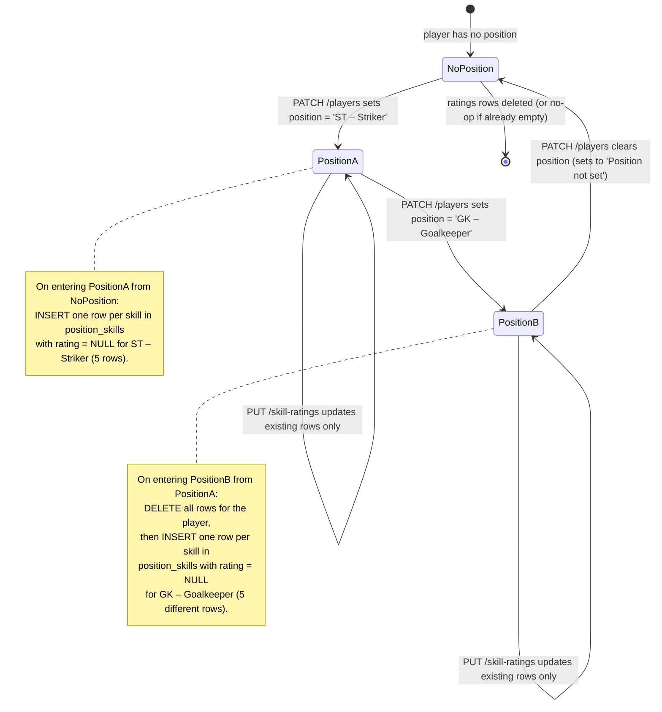

# Feature 015 — S2/S5 Player Skill Ratings

## Summary

Each player gets a per-skill rating (0–100%, nullable for "not yet rated") for every skill assigned to the player's current position. The S2 dashboard renders the table read-only; the S5 edit page lets the coach set or clear each rating. When the player's position changes, the table is replaced: rows for skills no longer in the new position are deleted (along with their ratings), and rows for skills newly in the new position are inserted as not-rated. Skills are sourced from the `position_skills` M:N table introduced in migration 015; this plan does not change `position_skills`.

## Problem Frame

The SystemAdmin-managed skill catalog (sports → positions → skills) introduced by features 010/012 lives only as a reference. There is no place to record "this player is at 78% Finishing, 65% Positioning, 92% Ball Control" against that catalog — every coach today tracks skill progress informally on paper or in spreadsheets. The dashboard reports an aggregate `skillProgress` percentage but offers no skill-by-skill breakdown, and S5 has no way to capture one.

The current `player_stats` table covers five coarse metrics (`currentLevel`, `fitness`, `skillProgress`, `averageScore`, `lastMatchScore`) and is not extensible without schema churn for each new skill a club wants to track. A separate `player_skill_ratings` table — keyed by `(player_id, skill_id)` — keeps each rating an independent row, lets the table grow as positions gain skills, and matches the `position_skills` shape on the catalog side.

A first-class "not yet rated" state matters here just as it does for the existing percentage ratings (see `docs/brainstorms/2026-07-05-s5-percentage-slider-controls-requirements.md` AE2): a player with no ratings yet must not be shown as "0%" across the board.

## Scope Boundaries

### In scope

- A new `player_skill_ratings (player_id TEXT, skill_id TEXT, rating SMALLINT, created_at, updated_at, PRIMARY KEY (player_id, skill_id))` table introduced by migration `018_player_skill_ratings.sql`. Mirrored into `apps/api/src/db/schema/tables.sql` and `deploy.sql` so a fresh database picks it up via `scripts/db-bootstrap.js`.
- A new backend helper `listSkillsForPlayer(pool, playerId)` that resolves the player's team → sport → position → position_skills and returns a normalized list of `{ skillId, skillName, rating, positionId, positionName }` rows for every skill assigned to that player's current position, plus the live rating (null when absent).
- The `players/dashboard` and `players/{playerId}/profile` responses gain a new `skillRatings: [{ skillId, skillName, rating, positionId, positionName }]` field alongside `stats`. The shape is the same on both endpoints so S2 and S5 consume one identical contract.
- Two new player-scoped write endpoints:
  - `PUT /api/v1/players/{playerId}/skill-ratings` — Coach-only. Accepts `{ ratings: [{ skillId, rating: number | null }] }`. Replaces the player's ratings **for the skills listed** (additive within the request, deleting the row when `rating: null` is sent, upserting the row when a number is sent). Skills not mentioned in the request are left untouched. Validates `rating` is an integer 0–100 or null; rejects unknown `skillId` with `400 validation_error`; rejects skills not in the player's current position's `position_skills` set with `400 validation_error`. Returns the updated `skillRatings` array.
- A `replaceSkillRatingsForPosition(pool, playerId, positionId)` helper that runs as a single transaction inside the existing `PATCH /players/{playerId}` handler **only when** the player's `position` field changes. The handler compares incoming position to the player's stored position; on a real change, it deletes all existing `player_skill_ratings` rows for the player and inserts one row per skill in the new position's `position_skills` set, all with `rating = NULL`. This is the "replace on position change" decision resolved during planning.
- `MockupApi` extensions: `listPlayerSkillRatings(playerId)`, `updatePlayerSkillRatings(playerId, payload)` — both follow the existing `shouldUseBackendPlayersMode()` dual-mode switch. Offline mode seeds `playerSkillRatings` per player with all NULLs (matches the fresh-DB state so a coach who first opens S5 in offline mode sees the same empty table).
- **S2 (`docs/ux/mockup/S2-player-dashboard.html`):** A new `<div class="section stats-section">` placed **before** "Development Progress", titled "Skill Ratings", containing a read-only table with one row per skill: `Skill | Position | Rating (%)`. The percentage cell renders the rating as `N%` when set, or a muted `Not rated` when null. When the player has no position or the position has no skills, the section renders a single muted notice: "No skills are tracked for this player yet — pick a position in Edit Player (S5)." Mirrors the existing `.stats-section` look (border, padding, section-title, metric-grid sub-block) so the new section sits cleanly above Development Progress.
- **S5 (`docs/ux/mockup/S5-player-edit.html`):** A new section with the same title "Skill Ratings" placed **before** "Development Progress". Each skill is a row with three controls: the skill name (read-only), the position label (read-only), and the same slider+number-box+"not recorded" toggle control already used by Current Level / Fitness / Skill Progress (reuses the existing `buildSliderControl` helper with `{ min: 0, max: 100, step: 1, midpoint: 50 }`). A disabled helper notice replaces the table when the player has no position or the position has no skills. Saving the form dispatches `PUT /v1/players/{playerId}/skill-ratings` with the **current** skill list (only the skills for the player's current position at save time — the form does not allow switching position from inside this section).
- Migration-sync spec `apps/api/tests/integration/db/player-skill-ratings-migration.spec.ts`.
- Backend source-text spec `apps/api/tests/integration/players/player-skill-ratings-api-mockup.spec.ts`.
- OpenAPI contract test additions to `apps/api/tests/contract/` covering the new `skillRatings` array on dashboard/profile responses and the new `PUT /v1/players/{playerId}/skill-ratings` endpoint.
- Two static-analysis specs in `apps/api/tests/integration/players/`:
  - `mockup-api-client-skill-ratings.spec.ts` — confirms `MockupApi.listPlayerSkillRatings` and `MockupApi.updatePlayerSkillRatings` exist, the offline seed includes a `playerSkillRatings` array, and the offline update path correctly writes rows.
  - `s2-s5-skill-ratings.spec.ts` — confirms S2 has a "Skill Ratings" section above "Development Progress" and S5 has the editable table with the toggle control.
- Playwright spec `tests/playwright/player-skill-ratings.spec.js` covering the full round-trip: log in as a coach, navigate S1 → S2, see read-only table; navigate to S5, set two ratings, save; verify S2 shows the new percentages; switch player position via S5, verify ratings are reset to "Not rated" and the table now reflects the new position's skills.

### Deferred to Follow-Up Work

- A dedicated "skill ratings over time" history table. Out of scope; this plan only persists the current rating.
- Per-coach author attribution on ratings. Out of scope; the plan treats the whole player as the unit.
- Auto-derive a player's `skillProgress` aggregate from `player_skill_ratings` (currently a free-form text field). Out of scope; `skillProgress` stays coach-edited.
- Adding skill ratings to `S1-player-list.html` as a column. Out of scope; the feature is intentionally S2/S5-only per the user's request.
- React mirror (`apps/web/src/features/players/`). The feature ships on the mockup first; a separate plan can mirror it once the contract stabilizes.
- Skill-level change indicators (trend arrows like `↑ Up 5%`). Out of scope; the table shows current level only.
- Allowing the user to remove a player from the catalog (deleting a skill with player ratings). Already blocked by `position_skills ON DELETE RESTRICT` + a follow-up ON DELETE rule for `player_skill_ratings` (see Risks).

### Outside this product's identity

- Changing the catalog (sports/positions/skills) behavior. The catalog continues to be SystemAdmin-managed via S8; this plan only consumes it.
- Editing the existing five `player_stats` percentages from the new table. Current Level / Fitness / Skill Progress stay separate.
- Free-text position assignment. The position is sourced from the existing sport-filtered `<select>` introduced by feature 012.

## Requirements

### Catalog and CRUD requirements

- **C1.** `player_skill_ratings` has columns `player_id TEXT NOT NULL REFERENCES players(id) ON DELETE CASCADE`, `skill_id TEXT NOT NULL REFERENCES skills(id) ON DELETE RESTRICT`, `rating SMALLINT CHECK (rating IS NULL OR (rating BETWEEN 0 AND 100))`, `created_at TIMESTAMPTZ NOT NULL DEFAULT NOW()`, `updated_at TIMESTAMPTZ NOT NULL DEFAULT NOW()`, with `PRIMARY KEY (player_id, skill_id)`. The `RESTRICT` on `skill_id` mirrors `position_skills` so deactivating + deleting a skill with ratings is blocked.
- **C2.** The migration is idempotent (`CREATE TABLE IF NOT EXISTS`, `CREATE INDEX IF NOT EXISTS`). No seed rows are inserted; every player's ratings start at null and are filled in by coaches through S5.
- **C3.** `listSkillsForPlayer(playerId)` returns one row per skill in `position_skills WHERE position_id = <player.position_id>`, LEFT JOIN'd to `player_skill_ratings`. Players without a resolvable position (no team or unknown position name) return `[]`. The query joins via the player's `player_team_assignments.team_id` → `teams.sport_id` → `positions` filtered by the stored position name (case-insensitive). When no position row matches the stored free-text position, the function returns `[]` rather than throwing — the UI surfaces a "No position tracked" notice.
- **C4.** The new write endpoint is Coach-only (same gate as `PATCH /players/{id}`). The actorEmail is required and must match an active Coach user. SystemAdmin tokens can read the ratings (the dashboard + profile endpoints are already Coach-gated but the team-management scoped coach check is reused) but only via the same gate the rest of the player endpoints use; no new SystemAdmin capability is added.
- **C5.** `PUT /players/{playerId}/skill-ratings` accepts `{ ratings: [{ skillId, rating }] }`. The server validates each row:
  - `skillId` is a non-empty string.
  - `rating` is `null` or an integer in `[0, 100]`. Floats are rejected (`400 validation_error`).
  - `skillId` exists in `skills` (status not required — an inactive skill with an existing rating can still be cleared, but adding a new rating for an inactive skill is rejected with a clear message).
  - `skillId` is in the player's current position's `position_skills` set. Skills outside that set return `400 validation_error` with message `"Skill '<name>' is not tracked for the player's position '<position>'. Add it to the position in Manage Skills (S8) or change the player's position."`. This is the strict-scope rule resolved during planning.
- **C6.** A successful save returns the full updated `skillRatings` array for the player so the client can refresh its view in one round-trip. Returns `200` with `{ data: { player: <full player>, stats: <full stats>, skillRatings: [...] } }` mirroring the shape used by `getPlayerProfile`.
- **C7.** Errors use the existing `{ code, message }` envelope: `validation_error`, `forbidden`, `not_found`, `conflict`.

### Cross-cutting requirements

- **X1.** `MockupApi.listPlayerSkillRatings(playerId)` is a Coach-authed read. Backend mode calls `GET /v1/players/{playerId}/skill-ratings`. Offline mode derives the same array from `store.playerSkillRatings` JOIN'd against the position's `store.positionSkills`. The offline result MUST include every skill assigned to the player's position, with `rating: null` for missing rows — never truncate the list.
- **X2.** `MockupApi.updatePlayerSkillRatings(playerId, ratingsPayload)` calls `PUT /v1/players/{playerId}/skill-ratings` in backend mode. Offline mode writes/updates/deletes entries in `store.playerSkillRatings` keyed by `playerId` then returns the recomputed `skillRatings` array (same shape as the read).
- **X3.** The `loadStore()` validator gains `Array.isArray(parsed.playerSkillRatings)`. Fresh-seed fallback returns `playerSkillRatings: []` so a stale local store from before this feature is reseeded cleanly.
- **X4.** The offline seed seeds `playerSkillRatings` with empty arrays for the four seeded players (no automatic ratings — every player starts "not rated", matching the fresh-DB state).
- **X5.** The existing `parseUpdateProfilePayload` (server-side) and its offline mirror `parseUpdateProfilePayload` (client-side) gain a no-op pass-through for `skillRatings`. They are NOT edited in place — the new endpoint has its own dedicated parser (`parseUpdateSkillRatingsPayload`) to keep the edit-profile validator simple.

### Page requirements (S2 + S5)

- **P1 (S2).** The "Skill Ratings" section appears above "Development Progress" inside `.content`. Its `.section-title` is `"Skill Ratings"`. The section uses the existing `.stats-section` class so the border, padding, and mobile rules carry over. The section is hidden together with the other stats-derived sections when `dashboard.performance.missingDataMessage` is set — same rule that already hides Development Progress, Match Time History, Recent Performance, and Video Assessments.
- **P2 (S2).** When `dashboard.skillRatings.length > 0`, the table renders with columns `Skill`, `Position`, `Rating`. Each `Rating` cell renders `${rating}%` when the rating is a number, or `<span class="muted">Not rated</span>` when null. Skill names render as plain text; positions render as plain text.
- **P3 (S2).** When `dashboard.skillRatings.length === 0` (no position or position has no skills), the section renders a single muted helper: `"No skills are tracked for this player yet — pick a position in Edit Player (S5)."` The same muted notice is shown when the player has no team assignment.
- **P4 (S5).** The "Skill Ratings" section appears above "Development Progress" inside `#playerEditForm`. The section is part of the same `<form>` so the save handler can dispatch both the profile update and the skill-ratings update in sequence.
- **P5 (S5).** When the player has skills to rate, the table renders one row per skill with three columns: `Skill` (read-only text), `Position` (read-only text, repeated from the catalog), `Rating` (the same slider+number-box+"Record" toggle control used by Current Level). The "Record" toggle is the null-state carrier — when off, the rating saves as null; when on, the saved value is the integer the slider/box show. The toggle is off by default for every fresh row, matching the existing S5 control pattern.
- **P6 (S5).** When the player has no skills to rate, the section renders the same muted helper used on S2.
- **P7 (S5).** Submitting the form dispatches two PATCHes in sequence: `MockupApi.updatePlayerProfile(playerId, buildPayload())` first (unchanged), then `MockupApi.updatePlayerSkillRatings(playerId, readSkillRatingsPayload())`. The second call runs only when the first succeeds — a profile-save validation error must not silently write ratings. The skill-ratings call uses the current row count at save time, so changing the team/position dropdown before save routes through the position-change replace logic on the server side (see **P8**).
- **P8 (S5).** When the coach changes the position dropdown and saves, the server's `PATCH /players/{playerId}` path detects the position change and calls `replaceSkillRatingsForPosition(playerId, newPositionId)` inside the same transaction as the rest of the update. The new ratings array returned by `updatePlayerSkillRatings` (called after the profile save) reflects the post-replace state: all skills for the new position, all with `rating: null`. The S5 form re-renders the table after save so the coach sees the reset state immediately.
- **P9 (both).** Every existing data-testid used by the static-analysis or Playwright suites stays unchanged. New testids (`skill-ratings-table`, `skill-rating-row-{skillId}`, `skill-rating-slider-{skillId}`, `skill-rating-toggle-{skillId}`, `skill-rating-value-{skillId}`) are added with the existing `data-testid` convention.

## Key Technical Decisions

- **One row per (player, skill).** No JSON column on `player_stats`, no array on `players`. Mirrors `position_skills`'s shape and keeps the per-skill query trivial: `SELECT * FROM player_skill_ratings WHERE player_id = $1`. Aggregations (`avg(rating)` for "skill progress") become a future plan, not this one.
- **Nullable rating carries the "not recorded" state.** The CHECK constraint allows NULL; the column never defaults to 0. The same pattern as the existing slider controls (AE2 of `2026-07-05-s5-percentage-slider-controls-requirements.md`).
- **Skills are scoped to the player's current position only.** Decided during planning. The "Any Position" wildcard stays an S8 catalog row; a player assigned to it sees those 5 skills. A player on ST – Striker sees those 5 different skills. This matches the user's stated "skill for the associated sport" reading because in this codebase skills are wired to positions, and the player's position is the natural team-sport-aligned assignment.
- **`PUT /players/{playerId}/skill-ratings` is a partial replace, not a full replace.** The request body is `{ ratings: [...] }`. Skills not in the array are untouched. The replace-on-position-change path is handled inside `PATCH /players/{playerId}` instead of inside this endpoint, keeping the two concerns separate.
- **Replace-on-position-change is a server-side transaction, not a client-side cascade.** Detecting position changes inside the existing `PATCH /players/{playerId}` handler keeps the client dumb and prevents a coach from forgetting to reset ratings after a position swap.
- **Offline seed keeps ratings empty.** Players start "not rated" both in fresh-DB mode and offline mode. A coach who has never opened S5 sees the same empty table on S2.
- **The new S5 control reuses `buildSliderControl`.** Already used by Current Level / Fitness / Skill Progress / Average Score / Last Match Score; extending it to a third 0–100 percentage use case is a free re-use. The toggle's "Record" label matches the existing pattern.
- **Section ordering on S2 and S5 is fixed: Identity → Skill Ratings → Development Progress → Match Time History → Recent Performance → Video Assessments.** S5 mirrors S2's order exactly so a coach moving between the two pages finds the new section in the same place. The user explicitly asked for "before Development Progress"; the plan honors that literally.
- **No OpenAPI breaking change.** The `skillRatings` array is an additive property on the existing `PlayerDashboardResponse` and `PlayerProfileResponse`. Existing consumers that ignore unknown properties continue to work.

## High-Level Technical Design

### Data flow: reading skill ratings on the dashboard

```mermaid
sequenceDiagram
  participant U as Coach
  participant S2 as S2-player-dashboard.html
  participant API as GET /v1/players/dashboard
  participant DB as PostgreSQL
  U->>S2: navigate to ?player=Lionel Messi
  S2->>API: GET /v1/players/dashboard?playerName=Lionel%20Messi&actorEmail=...
  API->>DB: SELECT players + player_team_assignments + teams + player_stats
  API->>DB: SELECT skill_id, skill_name, position_id, position_name, rating FROM listSkillsForPlayer(playerId)
  DB-->>API: 5 rows (ST – Striker: Finishing, Positioning, Strength, Heading, Ball control) with NULL ratings
  API-->>S2: 200 { data: { player, stats, metrics, matchTime, performance, clipStats, skillRatings: [...] } }
  S2->>S2: render "Skill Ratings" section above Development Progress; "Not rated" for each row
```

### Data flow: editing and saving skill ratings

```mermaid
sequenceDiagram
  participant U as Coach
  participant S5 as S5-player-edit.html
  participant API as PATCH /v1/players/{id}, PUT /v1/players/{id}/skill-ratings
  participant DB as PostgreSQL
  U->>S5: open S5; toggle "Record" on Finishing + Heading; set 78 / 65
  U->>S5: click Save Player
  S5->>API: PATCH /v1/players/{id} { ...profile fields... }
  API->>DB: UPDATE players + player_stats
  alt position changed
    API->>DB: DELETE FROM player_skill_ratings WHERE player_id = $1
    API->>DB: INSERT INTO player_skill_ratings (player_id, skill_id, rating) SELECT ... FROM position_skills WHERE position_id = $newPos
  end
  API-->>S5: 200 { data: { player, stats, skillRatings: <post-replace array> } }
  S5->>API: PUT /v1/players/{id}/skill-ratings { ratings: [{ skillId: 's_finishing', rating: 78 }, { skillId: 's_heading', rating: 65 }] }
  API->>DB: INSERT ... ON CONFLICT DO UPDATE SET rating = EXCLUDED.rating, updated_at = NOW() × 2
  API-->>S5: 200 { data: { skillRatings: [{ skillId, rating: 78 }, ...] } }
  S5->>S5: refresh skill-ratings table; show toast "Player saved successfully."
```

### Replace-on-position-change: state transitions



## Seed Data

The migration does not insert any rows. Every player starts with an empty `player_skill_ratings`. The S8 seed (migration 015) continues to own the Soccer catalog. A coach setting the player's position for the first time triggers the row-insert path inside `PATCH /players/{playerId}`.

For the Playwright round-trip test, the spec creates a synthetic test player (e.g. `QA Skill Rating Player ${Date.now().toString(36)}`) so the test does not depend on any pre-existing seed row.

## Implementation Units

### U1. DB migration: `player_skill_ratings` table

**Goal:** Land the new ratings table so the rest of the plan can build on a stable schema.

**Requirements:** C1, C2, X3.

**Files:**
- `apps/api/src/db/migrations/018_player_skill_ratings.sql` (new)
- `apps/api/src/db/schema/tables.sql` (extend with the new table + index)
- `apps/api/src/db/schema/deploy.sql` (extend with the new table + index inside the `BEGIN/COMMIT` block)
- `apps/api/tests/integration/db/player-skill-ratings-migration.spec.ts` (new)

**Approach:**
- DDL: `CREATE TABLE IF NOT EXISTS player_skill_ratings (player_id TEXT NOT NULL REFERENCES players(id) ON DELETE CASCADE, skill_id TEXT NOT NULL REFERENCES skills(id) ON DELETE RESTRICT, rating SMALLINT CHECK (rating IS NULL OR (rating BETWEEN 0 AND 100)), created_at TIMESTAMPTZ NOT NULL DEFAULT NOW(), updated_at TIMESTAMPTZ NOT NULL DEFAULT NOW(), PRIMARY KEY (player_id, skill_id))`.
- Indexes: `CREATE INDEX IF NOT EXISTS idx_player_skill_ratings_skill_id ON player_skill_ratings(skill_id)` to support the "which players have rated skill X" reverse lookup that future plans may need.
- No seed rows.
- Append the same DDL into `apps/api/src/db/schema/tables.sql` (canonical schema file) and `apps/api/src/db/schema/deploy.sql` (full idempotent provisioning script) so a fresh DB created by `scripts/db-bootstrap.js` picks the table up without re-running the migration.

**Patterns to follow:** `apps/api/src/db/migrations/015_skills_positions_sports.sql` (DDL + indexes + idempotent `IF NOT EXISTS`); `apps/api/src/db/migrations/017_players_birth_month_year.sql` (the migration-sync test pattern enforced by `players-birth-migration.spec.ts`).

**Test scenarios:**
- Migration applies cleanly on a fresh DB; re-running is a no-op (idempotency).
- After applying, `SELECT COUNT(*) FROM player_skill_ratings` returns `0`.
- `tables.sql` and `deploy.sql` both contain the `CREATE TABLE IF NOT EXISTS player_skill_ratings` block and the supporting index.
- The CHECK constraint rejects `rating = 150` and accepts `rating = 0`, `rating = 100`, `rating = NULL`.
- The PK enforces uniqueness on `(player_id, skill_id)`.

**Verification:** `scripts/db-bootstrap.js` boots a fresh DB with the new table; the migration-sync spec passes.

---

### U2. OpenAPI contract additions

**Goal:** Document the new `skillRatings` array on dashboard/profile responses and the new `PUT /players/{id}/skill-ratings` endpoint before any backend wiring lands.

**Requirements:** C3–C7, X1.

**Files:**
- `openapi/v1/schemas/players.yaml` (extend)
- `openapi/v1/openapi.yaml` (extend)
- `openapi/v1/examples/player-skill-ratings-list.json` (new)
- `openapi/v1/examples/player-skill-ratings-update-request.json` (new)
- `openapi/v1/examples/player-skill-ratings-skill-out-of-position.json` (new — 400 envelope)
- `apps/api/tests/contract/openapi.players-skills.spec.ts` (new)

**Approach:**
- New `PlayerSkillRating` schema: `{ skillId: string, skillName: string, positionId: string, positionName: string, rating: integer | null }`. The `skillName` and `positionName` are denormalized for display convenience, mirroring `PositionSkill.skillName` in `schemas/skills.yaml`.
- Add `skillRatings: PlayerSkillRating[]` to `PlayerDashboardResponse.data` and `PlayerProfileResponse.data` (both required properties, defaulting to `[]`).
- New request schema `UpdatePlayerSkillRatingsRequest { ratings: [{ skillId: string, rating: integer | null }] }`. `rating` must be 0–100 or null.
- New response wrapper `PlayerSkillRatingsResponse { data: { skillRatings: PlayerSkillRating[] } }`.
- New path `PUT /v1/players/{playerId}/skill-ratings` with the existing `bearerAuth` security scheme; documents `400 validation_error` (skill out of position), `403 forbidden`, `404 not_found`.

**Patterns to follow:** `openapi/v1/schemas/skills.yaml` for `PositionSkill` (skillName denormalization + skillId/positionId IDs).

**Test scenarios:**
- Each new schema validates against a sample payload.
- `PlayerSkillRating.rating` rejects values outside 0–100 and rejects floats.
- `UpdatePlayerSkillRatingsRequest.ratings` requires `skillId`; `rating` accepts `null`.
- `400 validation_error` is documented for the skill-out-of-position path with the planned message text.

**Verification:** OpenAPI parses cleanly; the new contract spec asserts each schema and the new endpoint.

---

### U3. Backend handlers in `serve-mockup.js`

**Goal:** Wire the four integration points: dashboard/profile response shape, the position-change replace, the new PUT endpoint, and the shared `listSkillsForPlayer` helper.

**Requirements:** C3–C7, X1.

**Files:**
- `scripts/serve-mockup.js` (extend `handlePlayersApi`, extend `parseUpdateProfilePayload` callers with a position-change detect, add `listSkillsForPlayer`, `replaceSkillRatingsForPosition`, `parseUpdateSkillRatingsPayload`, `upsertSkillRatings` helpers + new `PUT` handler)
- `apps/api/tests/integration/players/player-skill-ratings-api-mockup.spec.ts` (new)

**Approach:**
- New helper `async function listSkillsForPlayer(playerId)` near the existing position helpers. SQL:
  ```sql
  SELECT
    ps.skill_id  AS "skillId",
    s.name       AS "skillName",
    p.id         AS "positionId",
    p.name       AS "positionName",
    psr.rating   AS "rating"
  FROM players pl
  JOIN player_team_assignments a ON a.player_id = pl.id
  JOIN teams t ON t.id = a.team_id
  LEFT JOIN positions p ON LOWER(p.name) = LOWER(pl.position) AND p.sport_id = t.sport_id
  LEFT JOIN position_skills ps ON ps.position_id = p.id
  LEFT JOIN skills s ON s.id = ps.skill_id
  LEFT JOIN player_skill_ratings psr ON psr.player_id = pl.id AND psr.skill_id = ps.skill_id
  WHERE pl.id = $1
  ORDER BY p.name ASC, s.name ASC
  ```
  Returns `[]` when no team, no position match, or no position_skills rows exist.
- Extend the existing `GET /v1/players/dashboard` SELECT to LEFT JOIN `listSkillsForPlayer` results (or run the helper as a second query inside the same `try`). Wrap the array as `skillRatings` on the response payload.
- Extend the existing `GET /v1/players/{playerId}/profile` handler with the same `skillRatings` array.
- Extend `PATCH /v1/players/{playerId}`: after the existing UPDATE statements, compare incoming `position` (post-normalization) to the player's stored position. If different, call `replaceSkillRatingsForPosition(playerId, newPositionId)` inside the same `pool.connect()` client/transaction. After commit, fetch the updated `skillRatings` via `listSkillsForPlayer` and include it in the response payload.
- New helper `async function replaceSkillRatingsForPosition(client, playerId, newPositionId)`:
  ```js
  await client.query('DELETE FROM player_skill_ratings WHERE player_id = $1', [playerId]);
  await client.query(
    `INSERT INTO player_skill_ratings (player_id, skill_id, rating)
     SELECT $1, ps.skill_id, NULL
     FROM position_skills ps
     WHERE ps.position_id = $2`,
    [playerId, newPositionId]
  );
  ```
  When `newPositionId` is `null` (e.g. coach cleared the position to `'Position not set'`), skip the INSERT and only run the DELETE.
- New helper `function parseUpdateSkillRatingsPayload(payload)`:
  - Validates `payload.ratings` is an array.
  - For each entry: `skillId` non-empty string; `rating` either `null` or an integer in `[0, 100]`. Floats rejected. Out-of-range rejected.
  - Returns `{ ratings: [{ skillId, rating }] }` on success, `{ error: '...' }` on the first failure.
- New handler `if (req.method === 'PUT' && /^\/api\/v1\/players\/[^/]+\/skill-ratings$/.test(requestUrl.pathname))`:
  - Resolve actor (Coach) — same gate as `PATCH /players/{id}`.
  - Resolve player (404 if absent).
  - Run `parseUpdateSkillRatingsPayload(body)`. On error, `400 validation_error`.
  - For each row: validate `skillId` exists in `skills`; validate it's in the player's current `position_skills` set; reject with `400` and the planned message text otherwise.
  - Inside a transaction: `INSERT INTO player_skill_ratings ... ON CONFLICT (player_id, skill_id) DO UPDATE SET rating = EXCLUDED.rating, updated_at = NOW()`. When `rating` is null, `DELETE FROM player_skill_ratings WHERE player_id = $1 AND skill_id = $2` (clearing a row, not upserting NULL — explicit null clears the rating).
  - Return `{ data: { skillRatings: <listSkillsForPlayer result> } }` with status `200`.

**Patterns to follow:** `scripts/serve-mockup.js` existing PATCH player handler for actor resolution + transaction shape; existing `replaceSkillRatingsForPosition` mirrors `assignUserToClub` add-additive pattern for idempotency considerations (different semantic but same defensive transaction style); the existing position handlers in `scripts/serve-mockup.js:3000-3300` for the array-on-response shape.

**Test scenarios:**
- The four new helpers exist in source (`listSkillsForPlayer`, `replaceSkillRatingsForPosition`, `parseUpdateSkillRatingsPayload`, `upsertSkillRatings` or similar named function).
- `GET /v1/players/dashboard` SELECT includes the new LEFT JOIN against `position_skills` and `player_skill_ratings`.
- `PATCH /players/{playerId}` invokes `replaceSkillRatingsForPosition` when the position changes (source-text pattern match for the call site).
- The new `PUT /players/{id}/skill-ratings` handler is gated behind the `^\/api\/v1\/players\/[^/]+\/skill-ratings$` regex and reuses the Coach actor gate.
- The skill-out-of-position rejection message appears verbatim in source.
- The `INSERT ... ON CONFLICT DO UPDATE` upsert shape is present.
- The DELETE-clearing branch (when rating is null) is present.

**Verification:** Manual curl round-trips succeed; the source-text spec passes; the existing `s2-player-dashboard.spec.js`, `s5-position.spec.js`, `s1-create-player-position.spec.js`, `s1-bulk-assign-position.spec.js`, and `team-sport.spec.js` Playwright suites keep passing (additive contract, no existing endpoint changes).

---

### U4. Mockup API client extensions + offline seed

**Goal:** Extend `MockupApi` with the new read/write methods, mirror the new table in the offline store, and make a stale local store from before this feature reseed cleanly.

**Requirements:** X1, X2, X3, X4.

**Files:**
- `docs/ux/mockup/js/mockup-api-client.js` (extend with two methods + seed)
- `apps/api/tests/integration/players/mockup-api-client-skill-ratings.spec.ts` (new — static-analysis spec)

**Approach:**
- Extend `createSeed()` with `playerSkillRatings: []` (no rows; every player starts not rated).
- Extend `loadStore()` validation to require `Array.isArray(parsed.playerSkillRatings)`. Stale stores reseed.
- New method `MockupApi.listPlayerSkillRatings(playerId, actorRole, actorEmail)`:
  - Backend mode: `GET /v1/players/{playerId}/skill-ratings?actorEmail=...`. Returns `{ status, data: { skillRatings: [...] } }` envelope to match the new endpoint, plus a convenience top-level `skillRatings` for the dashboard's direct read shape.
  - Offline mode: derive via `store.playerSkillRatings.filter(r => r.playerId === playerId)` LEFT JOIN'd against `listSkillsForPlayerOffline(store, playerId)`. The offline helper mirrors `listSkillsForPlayer` SQL but reads from `store.teams`, `store.positions`, `store.positionSkills`, `store.skills`, `store.playerSkillRatings`.
  - Returns `[]` when the player has no team / no position / no skills for the position.
- New method `MockupApi.updatePlayerSkillRatings(playerId, payload, actorRole, actorEmail)`:
  - Backend mode: `PUT /v1/players/{playerId}/skill-ratings` with `{ ratings: [...] }`. Returns `{ status, data: { skillRatings: [...] }, message }` on success or `{ status, code, message }` on error.
  - Offline mode: parse the payload, then upsert/delete rows in `store.playerSkillRatings`, then return the recomputed array via the offline read helper.

**Patterns to follow:** `MockupApi.getPlayerProfile` and `MockupApi.updatePlayerProfile` for the dual-mode + actorEmail pattern; the existing offline seed extensions for `positionSkills` / `sports` / `skills`.

**Test scenarios:**
- Source contains `MockupApi.listPlayerSkillRatings` and `MockupApi.updatePlayerSkillRatings` method definitions.
- Both methods have a `shouldUseBackendPlayersMode()` branch and an offline fallback branch.
- `createSeed()` includes `playerSkillRatings: []`.
- `loadStore()` validator mentions `playerSkillRatings`.

**Verification:** Manual smoke against `npm run serve:mockup` shows the new table populating; the static-analysis spec passes.

---

### U5. S2 dashboard: read-only "Skill Ratings" section

**Goal:** Render the new section above "Development Progress" on S2 with the same `.stats-section` look.

**Requirements:** P1, P2, P3, X1.

**Files:**
- `docs/ux/mockup/S2-player-dashboard.html` (extend with new section)
- `apps/api/tests/integration/players/s2-s5-skill-ratings.spec.ts` (new — static-analysis spec)

**Approach:**
- Insert a new `<div class="section stats-section" data-testid="skill-ratings-section">` **before** the existing "Development Progress" section. Use the same `.section-title` class with text `"Skill Ratings"`.
- Inside the section: a `<table data-testid="skill-ratings-table">` with header `Skill | Position | Rating`. Body is rendered by a helper that walks `dashboard.skillRatings` and produces one `<tr>` per row, with `data-testid="skill-rating-row-{skillId}"` for test stability.
- The `Rating` cell renders `${rating}%` (e.g. `78%`) when set, or `<span class="muted" data-testid="skill-rating-not-rated">Not rated</span>` when null.
- When `dashboard.skillRatings.length === 0`, render a single `<p class="muted" data-testid="skill-ratings-empty">No skills are tracked for this player yet — pick a position in Edit Player (S5).</p>` instead of the table.
- The IIFE's existing `statsSections.forEach((el) => el.hidden = ...)` loop already hides every `.stats-section` when `dashboard.performance.missingDataMessage` is set. Add the new section by including it in the same `.stats-section` class list, so it inherits the no-stats-yet hide rule with zero new logic.
- The IIFE reads `dashboard.skillRatings` (now part of the dashboard payload via U3) and renders the table after the existing dashboard-render IIFE blocks.

**Patterns to follow:** The existing `<div class="section stats-section">` blocks at `docs/ux/mockup/S2-player-dashboard.html:48-134`; the existing table-row rendering helpers in the mockup pages (e.g. S8 position table).

**Test scenarios:**
- The source contains a `data-testid="skill-ratings-section"` element with `Skill Ratings` title.
- The source contains the `data-testid="skill-ratings-table"` reference.
- The new section appears **before** the "Development Progress" section in the source.
- The empty-state helper text appears verbatim.
- The new section uses the `stats-section` class.

**Verification:** Manual smoke against the running mockup server; the static-analysis spec passes; existing `s2-player-dashboard.spec.js` continues to pass (no selectors removed).

---

### U6. S5 edit page: editable "Skill Ratings" section

**Goal:** Render the same section on S5 with the slider+number-box+toggle control, wire it into the save handler.

**Requirements:** P4–P9, X2.

**Files:**
- `docs/ux/mockup/S5-player-edit.html` (extend with new section + save-handler call)
- `apps/api/tests/integration/players/s2-s5-skill-ratings.spec.ts` (extend with S5 assertions)

**Approach:**
- Insert a new `<div class="section">` with `.section-title` `Skill Ratings` **before** the existing "Development Progress" section inside `#playerEditForm`.
- The section contains a `<table data-testid="skill-ratings-table">` rendered by a helper that walks `dashboard.skillRatings`. For each row, the `Rating` cell hosts a `buildSliderControl` instance with `{ min: 0, max: 100, step: 1, midpoint: 50 }`. Per-row testids: `skill-rating-row-{skillId}`, `skill-rating-slider-{skillId}`, `skill-rating-toggle-{skillId}`, `skill-rating-value-{skillId}`.
- When `dashboard.skillRatings.length === 0`, render the same muted helper used on S2 (`No skills are tracked for this player yet — pick a position in Edit Player (S5).`).
- The save handler:
  - Run the existing profile PATCH first (`MockupApi.updatePlayerProfile`).
  - On success, build a `ratings` array by walking the controls (skip rows whose toggle is off → `rating: null`; include rows whose toggle is on → `rating: <integer>`). Call `MockupApi.updatePlayerSkillRatings(playerId, { ratings })`.
  - On ratings-save failure, surface the error in the existing `showError` element and stop (don't redirect).
- After both saves succeed, redirect to S2 (existing behavior).
- The position-change replace path runs server-side in the PATCH step; the S5 client does not call any explicit "reset" endpoint. After the profile PATCH returns, the S5 IIFE re-reads the player profile (or uses the response payload's `skillRatings` array) and re-renders the table so the coach sees the post-replace state before saving ratings.

**Patterns to follow:** `buildSliderControl` reuse from `S5-player-edit.html:456-546`; existing save-handler sequence (`profileResponse → toast → redirect`); the position-dropdown change handler at `S5-player-edit.html:733-735` for the team-change triggers a position-options reload (the new section re-renders from the post-save payload, no special handler needed).

**Test scenarios:**
- The source contains a `Skill Ratings` `.section-title` placed before the existing `Development Progress` `.section-title`.
- The save handler calls both `MockupApi.updatePlayerProfile` and `MockupApi.updatePlayerSkillRatings`.
- The empty-state helper text is present.
- The `buildSliderControl` call uses `min: 0, max: 100, step: 1` for skill ratings.

**Verification:** Manual smoke against the running mockup server; static-analysis spec passes; existing `s5-position.spec.js` continues to pass (no selectors removed).

---

### U7. Playwright E2E + documentation update

**Goal:** End-to-end coverage of the full read/edit/save round-trip and the position-change reset behavior; update the API/Mockup mapping artifact.

**Files:**
- `tests/playwright/player-skill-ratings.spec.js` (new)
- `docs/ux/mockup/API-Mockup-Mapping.md` (extend with `## Player Skill Ratings (S2/S5)` section + new row in the screen-mapping table)
- `docs/ux/mockup/S2-player-dashboard.html`, `S5-player-edit.html` (no further changes from U5/U6; the mapping doc references the data-testids they added)

**Approach:**
- New `player-skill-ratings.spec.js` mirrors the structure of `tests/playwright/s5-position.spec.js`:
  - Login as `maria@vantageiq.club` (Coach) on a fresh state.
  - Navigate S1 → S2 → S5 for a known player (`Lionel Messi`, on ST – Striker, sport Soccer).
  - Assert S2 shows the new `skill-ratings-section` above `Development Progress` with 5 rows (the ST – Striker skill set: Finishing, Positioning, Strength, Heading, Ball Control), each rendered as `Not rated`.
  - On S5, assert the same 5 rows render in editable form (slider + toggle + number box per row).
  - Toggle `Record` on for Finishing, set value to `78`; toggle `Record` on for Heading, set value to `65`. Click Save Player.
  - After redirect to S2, assert the rating cells now show `78%` and `65%` for Finishing and Heading; the other three remain `Not rated`.
  - Return to S5, change the position dropdown to `GK – Goalkeeper`, click Save Player. Assert the skill-ratings table now shows 5 different rows (Shot stopping, Reflexes, Handling, Positioning, Aerial control), all rendered as `Not rated`.
  - Reload S2 and assert the same 5 GK rows appear, all `Not rated` (the ST ratings were wiped).
- Extend `API-Mockup-Mapping.md` with a `## Player Skill Ratings (S2/S5)` section listing the new endpoint, the dashboard/profile response shape change, the role gate, the position-change replace behavior, and the test traceability bullets for the four new spec files.

**Patterns to follow:** `tests/playwright/s5-position.spec.js` (full file as the template, including the `gotoS5ForPlayer` page-evaluate helper pattern).

**Test scenarios:**
- Happy path: full round-trip (open S2 → see table → edit on S5 → save → see updated S2 → change position on S5 → see reset S5 → see reset S2).
- Edge case: a player with no position shows the muted helper on both S2 and S5; saving S5 still succeeds (the ratings PUT is a no-op when the player has no skills in scope).
- Error path: setting `rating: 150` via direct API call returns `400 validation_error` with the out-of-range message.

**Verification:** All Playwright suites pass against the live backend; CI green.

---

## Risks and Dependencies

- **Risk:** The free-text `players.position` (still TEXT, not a FK) means a player whose `position` string does not match any seeded `positions.name` will see an empty `skillRatings` array on S2 — the section renders the muted helper, but the coach has no easy way to discover why. **Mitigation:** the muted helper copy on S2 mentions "pick a position in Edit Player (S5)", which routes the coach to the position dropdown. The dropdown is already sport-filtered per feature 012, so a coach who picks `ST – Striker` immediately sees ST skills populate.
- **Risk:** Concurrent edits to the same player's skill ratings (two coaches saving at once) could race the position-change replace path. **Mitigation:** both the PATCH and the PUT run inside `pool.connect()` transactions (the existing PATCH already does so); the PUT uses `INSERT ... ON CONFLICT DO UPDATE` for last-writer-wins semantics, which matches the existing player_stats write pattern.
- **Risk:** The dashboard SELECT grows by one join. On a small dataset (four seeded players) the cost is negligible; on a large dataset the LEFT JOIN chain through `player_team_assignments → teams → positions → position_skills → skills → player_skill_ratings` could dominate. **Mitigation:** run the join as a separate query via `listSkillsForPlayer` rather than a single mega-JOIN, and rely on the existing `idx_players_normalized_name`, `idx_player_team_assignments_team_id`, `idx_position_skills_skill_id` indexes. Future plans can introduce a denormalized `player_skill_ratings_summary` materialized view if profiling shows hot paths.
- **Risk:** A position name collision in the free-text `players.position` field could let two players with the same string but different sports show different skill sets (right behavior) but also let a single player resolve to the wrong position when the team sport changes. **Mitigation:** the JOIN filters `LOWER(p.name) = LOWER(pl.position) AND p.sport_id = t.sport_id`, so position resolution is always scoped to the team's sport. The existing player position dropdown is already sport-filtered, so the data is consistent in practice.
- **Risk:** UI/API drift on the new `PUT` endpoint. **Mitigation:** the new contract spec (U2) and the mapping-doc update (U7) act as release gates.
- **Risk:** Migration not applied to the live DB before the code lands (the very issue `docs/solutions/database-issues/serve-mockup-500-birth-month-column-not-applied.md` documents for migration 017). **Mitigation:** the migration-sync spec asserts that `tables.sql` and `deploy.sql` carry the new DDL; `scripts/db-bootstrap.js` and any environment setup script that runs the migrations before serving is the operational path.

Dependencies on prior plans:

- `docs/plans/2026-07-06-010-feat-s8-manage-skills-per-position-plan.md` — `position_skills` M:N table, sport-filtered position dropdown contract.
- `docs/plans/2026-07-07-012-feat-s3-team-sport-and-s5-player-position-plan.md` — sport-filtered position dropdown on S5, the position-change path on the team side.
- `docs/brainstorms/2026-07-05-s5-percentage-slider-controls-requirements.md` — the slider+number-box+"Record" toggle control pattern reused here.
- `docs/solutions/database-issues/serve-mockup-500-birth-month-column-not-applied.md` — migration discipline (`tables.sql` + `deploy.sql` sync).

Operational dependencies:

- PostgreSQL migration execution path in development and CI (`scripts/db-bootstrap.js` for fresh DBs; the migration runner for existing).
- The new `skillRatings` field on the dashboard/profile responses is read by S2 and S5 in the same fetch; no extra round-trip is added.

---

## Open Questions

- **Should the S2 section render when the player has no team assignment at all?** The plan renders the muted helper in that case ("pick a position in Edit Player"). Alternative: hide the section entirely when there's no team. The visible helper matches the existing S2 pattern of surfacing actionable next steps inline, so the plan goes with the helper. If a future UX review prefers to hide instead, this is a one-line change in U5.
- **Should the PUT endpoint return `200` even when the request is empty (`ratings: []`)?** Yes — the partial-replace contract treats empty as a no-op. The plan documents this as the expected behavior. A future plan can add a "clear all" explicit endpoint if needed.
- **What happens when a coach sets a rating for an inactive skill?** The plan rejects the add (validation_error) but allows clearing (DELETE) of an existing rating for an inactive skill. The rationale is that historical data should still be clearable even after the catalog item is deactivated. If a stricter "no writes at all on inactive skills" rule is preferred, U3 should tighten the validator; the plan leaves the door open.

---

## Verification Strategy

- **Contract:** `apps/api/tests/contract/openapi.players-skills.spec.ts` (U2) asserts every new schema, every new endpoint, and the four error code enum values.
- **Schema bootstrap:** `apps/api/tests/integration/db/player-skill-ratings-migration.spec.ts` (U1) asserts migration 018 + the `CREATE TABLE` block in both `tables.sql` and `deploy.sql`. Mirrors `apps/api/tests/integration/db/players-birth-migration.spec.ts`.
- **Backend source-text:** `apps/api/tests/integration/players/player-skill-ratings-api-mockup.spec.ts` (U3) pattern-matches `scripts/serve-mockup.js` for the four new helpers, the dashboard/profile SELECT changes, the position-change replace call site, the new PUT handler, the out-of-position rejection message, and the upsert+clear shape.
- **Mockup client source-text:** `apps/api/tests/integration/players/mockup-api-client-skill-ratings.spec.ts` (U4) pattern-matches `mockup-api-client.js` for the two new methods + the offline seed addition.
- **Mockup HTML structure:** `apps/api/tests/integration/players/s2-s5-skill-ratings.spec.ts` (U5/U6) pattern-matches S2 and S5 for the new sections, the empty-state helper, the testid attributes, and the save-handler call sequence.
- **End-to-end:** `tests/playwright/player-skill-ratings.spec.js` (U7) covers the full read/edit/save round-trip + the position-change reset behavior + the empty-state helper visibility.
- **Regression:** existing `s1-player-list.spec.js`, `s2-player-dashboard.spec.js`, `s3-team-management.spec.js`, `s5-position.spec.js`, `s7-admin-user-management.spec.js`, `s7a-clubs.spec.js`, `s8-skills.spec.js`, `team-sport.spec.js`, `s1-create-player-position.spec.js`, `s1-bulk-assign-position.spec.js` must keep passing — the new fields and endpoint are additive and don't change existing contracts.

---

## Phased Execution Suggestion

- **Phase A:** U1 (schema) + U2 (contract). Foundation before any wiring.
- **Phase B:** U3 (backend handlers) + U4 (mockup client + offline seed). Backend + client contract in lockstep.
- **Phase C:** U5 (S2) + U6 (S5). Both pages in one pass so the section ordering is consistent across S2 and S5.
- **Phase D:** U7 (Playwright + mapping doc update). E2E gate + documentation lock-in.

This sequence locks the schema and contract first, then wires the backend and the mockup client together, then brings both surfaces (S2 read + S5 edit) online, and finally locks the behavior with Playwright and the mapping doc.