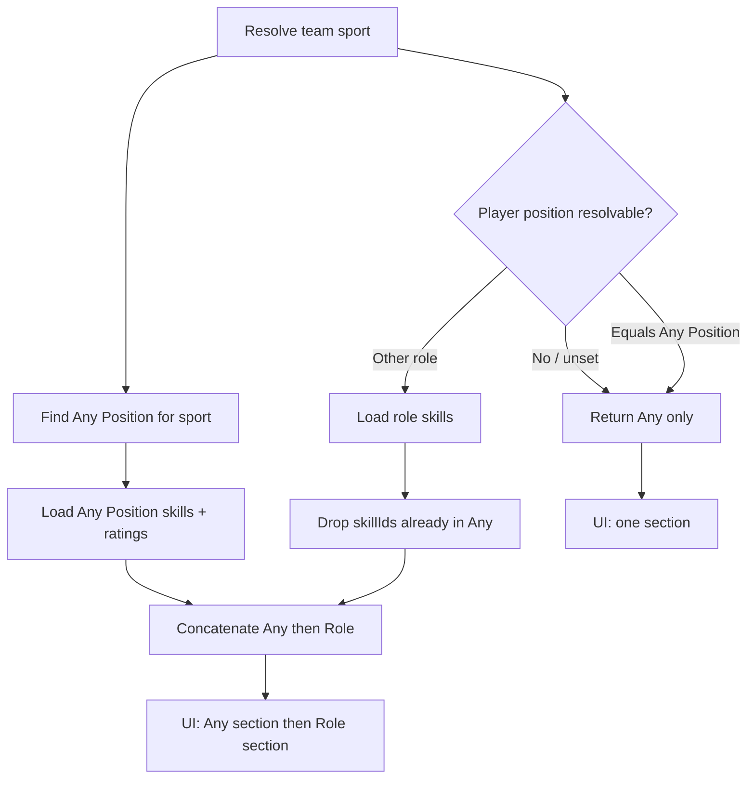
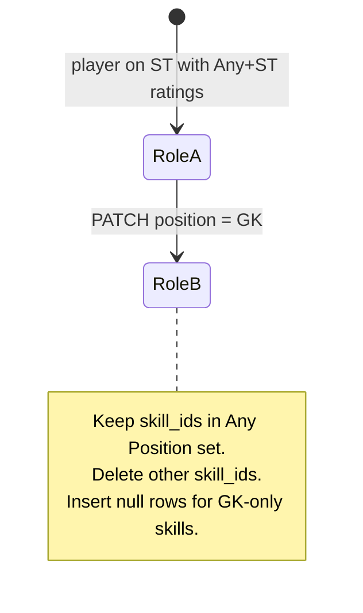

# Feature 016 — Any Position Baseline Skill Ratings

## Goal Capsule

- **Objective:** Extend feature 015 so every player always rates the sport's **Any Position** skills, and when assigned to a specific role also rates that role's unique skills — with **Any Position** rendered in its own section before the role section on S2 and S5.
- **Authority:** This plan supersedes feature 015's "current position only" list rule and its full wipe-on-position-change rule for Any Position skills. Schema (`player_skill_ratings`) stays unchanged.
- **Done when:** A player on ST sees Any Position skills first, then ST-only skills (overlaps omitted from ST); a player on Any Position sees only that section; changing ST → GK keeps Any Position ratings and resets only role-unique skills; PUT validation accepts both scopes; Playwright covers the two-section + preserve path.
- **Out:** No new DB table/migration; no React mirror; no history/attribution; no auto-derived `skillProgress`.

## Product Contract

### Problem Frame

Feature 015 rates skills for the player's assigned position only. Coaches also need a sport-wide baseline — the catalog's **Any Position** row (seeded as `pos_any` for Soccer) — so every player has shared fundamentals (e.g. Ball Control, Passing) regardless of role. When the player is on a specific role, those baseline skills must still appear, and they must appear **first** in a dedicated section so coaches always edit the common set before role-specific skills.

### Actors

- A1. Coach — reads ratings on S2, edits on S5 (unchanged gate from 015).
- A2. SystemAdmin — catalog owner via S8; not a new writer for player ratings.

### Key Flows

- F1. Player assigned to **Any Position** only → list/UI show one section (Any Position skills).
- F2. Player assigned to a role (e.g. ST) → list/UI show Any Position section first, then role section with skills **not** already in Any Position.
- F3. Coach rates an Any Position skill, then changes role ST → GK → Any Position rating is preserved; old ST-only ratings are removed; new GK-only skills appear as not rated.
- F4. Skill present on both Any Position and the role → shown only under Any Position (one stored rating via `skillId`).

### Acceptance Examples

- AE1. Soccer player on `ST – Striker`: Any Position section lists Ball Control, Passing, Game Awareness, Fitness, Speed; ST section lists Finishing, Positioning, Strength, Heading (Ball Control omitted from ST because it overlaps).
- AE2. Soccer player on `Any Position`: only the Any Position section; no second section.
- AE3. Coach sets Passing=70 on ST player, switches to GK, saves: Passing still 70%; ST-only ratings gone; GK-only skills show Not rated.
- AE4. Player with a team/sport but unset or unresolvable position: Any Position section only (per R4). Player with no team/sport: empty helper (same copy family as 015); no fabricated Any Position rows without a sport context.

### Requirements

#### List and validation

- R1. `listSkillsForPlayer` returns the union of (a) all `position_skills` for the sport's **Any Position** row and (b) when the player's assigned position is resolvable and is **not** Any Position, all `position_skills` for that role **excluding** any `skill_id` already present in (a).
- R2. Each returned row still carries `{ skillId, skillName, positionId, positionName, rating }` where `positionId`/`positionName` identify the **catalog position that owns the skill in this list** (Any Position vs role) — not a second rating key. Storage remains `(player_id, skill_id)`.
- R3. When the player is assigned to Any Position (case-insensitive name match to the sport's Any Position row), the list is Any Position skills only (no duplicate second block).
- R4. When the player has a team/sport but position is unset / unresolvable: return Any Position skills for that sport only (baseline still available). When there is no team/sport: return `[]`.
- R5. `PUT /players/{playerId}/skill-ratings` allows any `skillId` in the R1 allowed set (Any Position ∪ role-unique). Out-of-set skills still `400` with the existing guidance message shape.
- R6. Overlap rule: if a skill is on both Any Position and the role, it is **not** included under the role in the list or UI (user decision: "do not include that skill on the player's assigned position").

#### Position-change replace

- R7. On `PATCH /players/{playerId}` when `position` changes, **preserve** ratings whose `skill_id` is in the sport's Any Position `position_skills` set.
- R8. Delete ratings whose `skill_id` is **not** in that Any Position set (i.e. wipe previous role-unique skills).
- R9. Insert null rows for skills newly in scope for the new role that are not already in Any Position and not already present as a rating row. Do **not** wipe/reinsert Any Position skill rows.
- R10. Clearing position to unset: keep Any Position ratings; delete non–Any Position ratings; list falls back to R4 (Any Position only when team/sport exists).

#### UI

- R11. S2 and S5 replace the single "Skill Ratings" table with **two** subsections (still above Development Progress, still inside the existing stats/form skill-ratings region):
  1. Title **Any Position** (or "Skill Ratings — Any Position") with its table first.
  2. Title equal to the player's current role name (e.g. `ST – Striker`) with its table second — **omitted** when the player is on Any Position or the role-unique list is empty.
- R12. Empty helper when the combined list is empty (no team / no Any Position catalog row): keep actionable copy pointing the coach to pick a position / assign a team.
- R13. S5 save: profile PATCH first. Then:
  - If position string **unchanged**: PUT all visible controls (Any + role sections).
  - If position string **changed**: still PUT, but **only Any Position skillIds** from the form (filter out role-section controls). Role-unique rows were already synced by R7–R9; sending stale role skillIds would 400. This preserves same-save Any Position edits (e.g. set Passing=70 and switch ST→GK in one Save).
- R14. New testids: `skill-ratings-any-section`, `skill-ratings-role-section`, keep per-row `skill-rating-row-{skillId}` (unique because overlaps are deduped).

### Scope Boundaries

#### In scope

- Update `listSkillsForPlayer` / offline mirror, PUT allowed-set, and `replaceSkillRatingsForPosition` (rename/clarify to "sync on position change" if helpful).
- OpenAPI description updates for `skillRatings` (union semantics); no breaking schema field changes required.
- S2/S5 two-section UI + static-analysis + Playwright updates.
- Mapping doc note under Player Skill Ratings.

#### Deferred

- Multi-sport "Any Position" naming variants beyond the seeded `Any Position` name match (case-insensitive) within the team's `sport_id`.
- Live re-render of skill tables when the S5 position dropdown changes before save (known residual from 015).
- Boot-time schema check / bootstrap idempotency (still tracked via prior solutions doc).

#### Outside

- Changing S8 catalog semantics for Any Position.
- New columns or a second ratings table keyed by position.

### Key Decisions (product)

| Decision | Choice | Rationale |
|---|---|---|
| Overlap display | Any Position only | User: do not include shared skill under the assigned position |
| Role change | Preserve Any Position ratings | User option 1 — baseline is sport-level, not role-level |
| Unresolvable position with team | Still show Any Position | Baseline should not require a role pick |
| Same-save position change + Any edits | PUT Any-only after PATCH | Avoid losing Passing=70 when also switching role (R13) |
| Storage | Unchanged `(player_id, skill_id)` | One rating per skill; section is presentation |

**Product Contract preservation:** New plan (016); inherits 015 Product Contract except list-scope and replace-on-change rules above. No separate brainstorm file.

## Planning Contract

### Assumptions

- The sport's default position is identified by case-insensitive name `Any Position` within `positions` for `teams.sport_id` (seeded id `pos_any` for Soccer). No new `is_default` column in this plan.
- Feature 015 code and migration 018 are already on the branch / live DB (or applied manually). This plan does not re-ship 018.
- Applying SQL via direct migration remains the operational path when `db:bootstrap` fails on older non-idempotent migrations.

### Key Technical Decisions

- KTD1. **Union-with-dedupe in `listSkillsForPlayer`.** Resolve sport → Any Position id; load its skills; if player position resolves and differs from Any Position, append role skills whose `skill_id` not in the Any set. Order: Any Position skills (name ASC), then role skills (name ASC). Offline mirror matches.
- KTD2. **`positionId`/`positionName` on each row = owning catalog position for that list membership.** Lets the UI split sections without a second API field. Overlaps always carry Any Position ids.
- KTD3. **Replace helper becomes preserve-Any + swap-role.** Pseudocode direction (not implementation lock-in): delete ratings where `skill_id NOT IN (any_position_skills)`; insert nulls for new role-unique skills missing from ratings. Never `DELETE` all rows for the player on role change.
- KTD4. **UI splits one payload into two sections by `positionId === anyPositionId` (or `positionName` match).** Prefer matching on resolved Any Position id from the first row group / a small helper rather than hardcoding `pos_any` so multi-sport stays correct.
- KTD5. **OpenAPI:** update descriptions on `PlayerSkillRating` / dashboard `skillRatings` to document union + dedupe; keep array shape additive-compatible.

### Technical Design

Position-change:

### Risks

- **Risk:** Hardcoding `pos_any` breaks a future non-Soccer sport's default. **Mitigation:** resolve by name + `sport_id` (KTD1/KTD4).
- **Risk:** Coaches expect Ball Control under ST because S8 assigned it there. **Mitigation:** AE1 + section titles make ownership explicit; S8 can still list the skill on ST for catalog purposes.
- **Risk:** Old Playwright expects full wipe including Any skills. **Mitigation:** update U5 scenarios explicitly (preserve Passing across ST→GK).
- **Risk:** Live DB missing 018 still 500s. **Mitigation:** out of scope to fix bootstrap; document apply-018 operational note in mapping/solutions if needed.

### Dependencies and Sequencing

- Depends on shipped 015 (`docs/plans/2026-07-08-015-feat-s2-s5-player-skill-ratings-plan.md`).
- Sequence: U1 list+replace backend → U2 OpenAPI/tests → U3 MockupApi offline → U4 S2/S5 UI → U5 Playwright + mapping.

## Implementation Units

### U1. Backend: union list + preserve-Any replace

**Goal:** `listSkillsForPlayer` and position-change sync implement R1–R10.

**Requirements:** R1–R10, R5.

**Files:**
- `scripts/serve-mockup.js` (`listSkillsForPlayer`, `replaceSkillRatingsForPosition` / successor, PUT allowed-set already driven by list)
- `apps/api/tests/integration/players/player-skill-ratings-api-mockup.spec.ts` (extend)

**Approach:**
- Resolve Any Position via `positions` where `sport_id = team.sport_id` and `LOWER(name) = 'any position'`.
- Build allowed skill set as union with dedupe (Any first).
- On position change: delete ratings not in Any set; insert nulls for new role-unique skills not already rated.
- When new position is Any Position or unset: after delete of non-Any, ensure Any skills are listable (insert null Any rows only if product wants explicit NULL rows — prefer list LEFT JOIN so missing rows still show as null without mandatory insert).

**Test scenarios:**
- Source contains Any Position resolution and dedupe (role skills exclude overlapping skill ids).
- Replace path no longer issues unconditional `DELETE FROM player_skill_ratings WHERE player_id = $1` alone without a preserve filter (assert preserve-Any SQL or equivalent two-step).
- PUT out-of-position message still present for skills outside the union.

**Verification:** Extended mockup API static-analysis spec passes.

---

### U2. OpenAPI contract copy + contract tests

**Goal:** Document union semantics; keep schema fields stable.

**Requirements:** R1, R2, R6.

**Files:**
- `openapi/v1/schemas/players.yaml` (descriptions on `PlayerSkillRating`, dashboard/profile `skillRatings`)
- `openapi/v1/examples/player-skill-ratings-list.json` (example with Any + role rows)
- `apps/api/tests/contract/openapi.players-skills.spec.ts` (extend assertions on description/example if present)

**Approach:** Update descriptions; refresh example JSON to show Any Position rows before role rows and an overlap omitted from role.

**Test scenarios:**
- Example list includes an Any Position `positionName` and a role `positionName`.
- Schema still requires `skillId`, `skillName`, `positionId`, `positionName`.

**Verification:** Contract vitest passes.

---

### U3. MockupApi offline mirror

**Goal:** Offline `listSkillsForPlayerOffline` and offline replace match U1.

**Requirements:** R1–R10, X-parity with 015 dual-mode.

**Files:**
- `docs/ux/mockup/js/mockup-api-client.js`
- `apps/api/tests/integration/players/mockup-api-client-skill-ratings.spec.ts` (extend)

**Approach:** Mirror union/dedupe and preserve-Any replace in offline helpers used by profile/dashboard/update.

**Test scenarios:**
- Source mentions Any Position / preserve behavior in offline replace.
- `listSkillsForPlayerOffline` still used by list/update/dashboard paths.

**Verification:** Client static-analysis spec passes.

---

### U4. S2 + S5 two-section UI

**Goal:** Render Any Position section first, then role section; S5 edits both.

**Requirements:** R11–R14.

**Files:**
- `docs/ux/mockup/S2-player-dashboard.html`
- `docs/ux/mockup/S5-player-edit.html`
- `apps/api/tests/integration/players/s2-s5-skill-ratings.spec.ts` (extend)

**Approach:**
- Split `skillRatings` into `anyRows` / `roleRows` by matching Any Position id/name.
- S2: two titled blocks (or two tables under the skill-ratings region) before Development Progress.
- S5: two editable tables; `readSkillRatingsPayload` walks both control maps; on position change, PUT filters to Any Position skillIds only (R13).
- Hide role block when empty or when player position is Any Position.

**Test scenarios:**
- S2/S5 source contain `skill-ratings-any-section` before role section / Development Progress.
- Save handler calls `updatePlayerProfile` then `updatePlayerSkillRatings` (Any-only filter when position changed).

**Verification:** HTML static-analysis spec passes.

---

### U5. Playwright + mapping doc

**Goal:** E2E prove union UI + preserve-Any on role change; document the increment.

**Requirements:** AE1–AE4, R4, R7–R9, R11, R13.

**Files:**
- `tests/playwright/player-skill-ratings.spec.js` (extend or add focused cases)
- `docs/ux/mockup/API-Mockup-Mapping.md` (Player Skill Ratings section)

**Approach:**
- ST player: assert Any section visible with baseline skills; role section without Ball Control if overlapped.
- Same-save: set Passing=70 on Any section, change position to GK, Save once — assert Passing=70% preserved (R13).
- Any Position-only player: single section.
- Team + `Position not set`: assert Any Position section only (R4/AE4) — do **not** expect the empty helper.
- No team: empty helper.

**Test scenarios:**
- Happy path: two sections on ST; preserve Any across ST→GK including same-save Any edit.
- Edge: Any Position-only assignment → no role section.
- Edge: unset position with team → Any section only (not empty helper).
- Regression: empty helper when no team still works.

**Verification:** Playwright file passes in offline mode.

---

## Verification Contract

- `npx vitest run apps/api/tests/integration/players/player-skill-ratings-api-mockup.spec.ts apps/api/tests/integration/players/mockup-api-client-skill-ratings.spec.ts apps/api/tests/integration/players/s2-s5-skill-ratings.spec.ts apps/api/tests/contract/openapi.players-skills.spec.ts`
- `npx playwright test tests/playwright/player-skill-ratings.spec.js`
- Manual smoke: backend mode against DB with 018 applied — ST player shows two sections; change position; Any ratings persist.

## Definition of Done

- R1–R14 satisfied in code and tests.
- No new migration required; no wipe of Any Position ratings on role change.
- Mapping doc describes union + preserve-Any behavior.
- Existing 015 endpoints remain; behavior change is additive for Any Position rows.

## Appendix

### Origin decisions (this session)

1. Overlap: show under Any Position only; omit from role section.
2. Role change: preserve Any Position ratings; replace role-unique only.
3. Same-save position change: after PATCH, PUT Any Position ratings from the form only (R13).

### Related artifacts

- `docs/plans/2026-07-08-015-feat-s2-s5-player-skill-ratings-plan.md`
- `docs/solutions/database-issues/serve-mockup-500-birth-month-column-not-applied.md` (migration apply discipline; same class as 018)
- Seed Any Position skills in `docs/ux/mockup/js/mockup-api-client.js` / migration `015_skills_positions_sports.sql`
