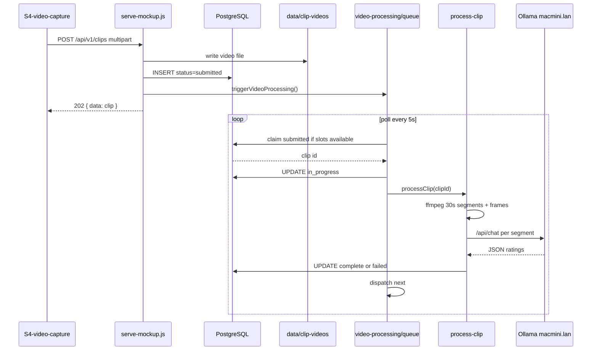

# Feature 018 — S4 Video Upload and Async LLM Assessment Pipeline

## Goal Capsule

- **Objective:** Support real video upload from `S4-video-capture.html`, persist clips in Postgres, and asynchronously assess each clip with an LLM pipeline that respects a configurable concurrency limit (default 1).
- **Authority:** Backend processing in `scripts/serve-mockup.js` + `scripts/video-processing/` when `DATABASE_URL` is set. S4/S6 mockup client wiring for multipart upload and new status labels.
- **Done when:** Upload creates clip `status=submitted`; queue claims clip → `in_progress`; successful assessment → `complete` with `skill_ratings`; failure → `failed`; only `max_parallel_video_processes` clips run at once; S4 requires a video file on submit.
- **Out (deferred):** OpenAPI clip schemas; offline/localStorage LLM processing; `player_stats` clip-count reconciliation; dedicated assessment detail screen (S7); coach scoping on clip list; retry endpoint.

## Product Contract

### Problem Frame

S4 previously submitted metadata only — the video file was previewed in the browser but never sent to the server. Coaches need situational video assessment driven by player context (sport, position, age), situation description, and selected skill focus. LLM calls must be serialized initially to avoid overloading the Ollama host.

### Actors

- A1. **Coach** — uploads a clip on S4; reviews status on S6.
- A2. **Video processing worker** — background queue inside `serve-mockup.js` (not a separate process in v1).
- A3. **Ollama server** — `gemma4:12b-mlx` at `http://macmini.lan:11434`.

### Key Flows

- F1. Coach fills S4 (video + player + situation + optional skill focus) → `POST /api/v1/clips` (multipart) → clip row `submitted`, file on disk → `202 Accepted`.
- F2. Queue polls (default 5s) or is triggered on upload → if in-progress count &lt; `max_parallel_video_processes`, claims oldest `submitted` clip (`FOR UPDATE SKIP LOCKED`) → `in_progress`.
- F3. Worker segments video (30s), extracts frames per segment, calls Ollama per segment with contextual prompt → merges ratings → early-stops per rules → `complete` with `skill_ratings`, `score`, `summary`.
- F4. On ffmpeg/Ollama/parse failure → `failed` with `error_message`.
- F5. S6 lists clips; maps `submitted`/`in_progress` as pending UI; `complete` as assessed.

### Acceptance Examples

- AE1. Coach uploads MP4 for Lionel Messi with situation + two skill focuses → response `202`, clip `status=submitted`, file exists under `data/clip-videos/`.
- AE2. With `max_parallel_video_processes=1` and two submitted clips, second clip stays `submitted` until first reaches `complete` or `failed`.
- AE3. After processing, clip has `skill_ratings` JSON keyed by skill label (0.00–0.99) and `status=complete`.
- AE4. Ollama unreachable → clip `status=failed`, `error_message` populated.

### Requirements

#### Upload and persistence

- R1. `POST /api/v1/clips` accepts `multipart/form-data` with fields: `playerId` (preferred), `playerName` (fallback), `situation`, `skillFocus` (JSON array string), `skill` (legacy primary label), `video` (file).
- R2. Video stored at `data/clip-videos/{clipId}_{sanitizedFilename}` (gitignored).
- R3. New clip inserted with `status='submitted'`, `skill_focus` JSONB array, video metadata columns populated.
- R4. JSON `POST /api/v1/clips` (no file) still supported for metadata-only creates → `submitted` (no processing without video path).
- R5. S4 requires video file before submit; sends all checked skill-focus labels (not just first).

#### Status lifecycle

- R6. Allowed statuses: `submitted`, `in_progress`, `complete`, `failed` (replaces legacy `pending`/`assessed`; migration maps old values).
- R7. Upload → `submitted`. Queue claim → `in_progress` + `processing_started_at`. Success → `complete` + `processing_completed_at`. Error → `failed` + `error_message`.

#### Processing concurrency

- R8. `processing_config.max_parallel_video_processes` (default `1`) caps concurrent `in_progress` clips.
- R9. Queue uses `FOR UPDATE SKIP LOCKED` on oldest `submitted` clip; waits for slots before claiming.
- R10. On clip completion, queue dispatches next eligible clip automatically.

#### Assessment logic

- R11. Context loaded per clip: **sport type** (team → sport name), **position**, **player age** (birth month/year), **situation**, **skill focus list** from form.
- R12. Video split into **30-second segments** via ffmpeg (`segment` muxer).
- R13. Per segment: extract sample frames → base64 → Ollama `/api/chat` with model from config (`gemma4:12b-mlx` default).
- R14. Prompt template: *"Review this video for sport {SportType} and considered the situation: {Situation} for a player at age {Age} and provide me ratings from 0.00 to 0.99 for the following skills: {SkillList}"* plus JSON response shape instruction.
- R15. **Early stop:** stop after a segment when ratings exist for **majority** of skill-focus skills; OR after **segment index ≥ 1** (second segment) when ratings exist for **≥ half** of skills.
- R16. `score` = average of rated skills (0.00–0.99); `summary` combines LLM note + skill rating lines; `skill_ratings` stored as JSONB object `{ "Skill Label": 0.75, ... }`.

#### Client integration

- R17. `MockupApi.submitClip` uses `backendMultipartRequest` when backend mode active and `videoFile` present.
- R18. `MockupApi.listClips` reads `GET /api/v1/clips` in backend mode.
- R19. S6 displays new statuses; filters `pending`/`assessed` aliases map to new lifecycle for backward compatibility in client helpers.

#### Non-goals

- R20. Separate worker process or message broker (in-process poll in v1).
- R21. True native video input to Ollama (frames extracted via ffmpeg as proxy).
- R22. Linking S4 skill checkboxes to `skills` catalog IDs (labels only in v1).
- R23. Coach/actor scoping on clip list API.

### Scope Boundaries

#### In scope (shipped)

- Migration `apps/api/src/db/migrations/019_clips_video_processing.sql`
- `scripts/video-processing/*` modules
- `scripts/serve-mockup.js` multipart route, queue startup, status seed updates
- `docs/ux/mockup/S4-video-capture.html`, `S6-assessment-list.html`
- `docs/ux/mockup/js/mockup-api-client.js` backend clip wiring
- `busboy` dependency; `.gitignore` entry for `data/clip-videos/`
- Vitest: `apps/api/tests/integration/video-processing/analyzer.spec.ts`, `apps/api/tests/integration/db/video-processing-migration.spec.ts`

#### Deferred

- OpenAPI `clips.yaml` + multipart upload schema
- `player_stats` clip count reconciliation on submit/complete
- Offline mode async simulation for localStorage clips
- `GET /api/v1/clips/{clipId}`, retry endpoint
- S7 assessment detail screen
- Server-side video duration/size validation (UI hints only today)
- Wiring skill focus to `skills` / `position_skills` catalog

### Key Decisions

| Decision | Choice | Rationale |
|---|---|---|
| Worker host | In-process inside `serve-mockup.js` | Matches existing monolithic API; smallest ops footprint |
| Concurrency control | DB config row `max_parallel_video_processes` | User requirement; tunable without redeploy |
| Claim pattern | `FOR UPDATE SKIP LOCKED` + transaction | Safe under poll; avoids double-processing |
| Video → LLM | ffmpeg segments + frame JPEGs → Ollama images | No native video API; works with existing Ollama chat |
| Status names | `submitted` / `in_progress` / `complete` / `failed` | Matches user request; clearer than `pending`/`assessed` |
| Storage | Local filesystem `data/clip-videos/` | POC-appropriate; object store deferred |
| Default parallelism | `1` | Protect Ollama host per user request |

## Planning Contract

### Architecture



### Key Technical Decisions

- KTD1. **Module layout** under `scripts/video-processing/`:
  - `config.js` — read `processing_config` + env overrides
  - `read-multipart.js` — busboy parse
  - `clip-upload.js` — persist file + row + trigger queue
  - `queue.js` — poll, claim, dispatch
  - `process-clip.js` — orchestrate assessment for one clip
  - `ffmpeg-utils.js` — segment (30s), extract frames
  - `ollama-client.js` — prompt build, `/api/chat`, JSON parse
  - `analyzer.js` — early-stop rules, merge ratings, score/summary

- KTD2. **Config keys** (`processing_config` table):

| Key | Default | Purpose |
|---|---|---|
| `max_parallel_video_processes` | `1` | Concurrency cap |
| `ollama_base_url` | `http://macmini.lan:11434` | Ollama host |
| `ollama_video_model` | `gemma4:12b-mlx` | Model name |

Env overrides: `OLLAMA_BASE_URL`, `OLLAMA_VIDEO_MODEL`, `VIDEO_PROCESSING_POLL_MS` (default 5000).

- KTD3. **Schema additions** on `clips`: `video_storage_path`, `original_filename`, `mime_type`, `file_size_bytes`, `skill_focus`, `skill_ratings`, `processing_started_at`, `processing_completed_at`, `error_message`.

- KTD4. **Early-stop implementation** (`analyzer.js`):
  - Majority: `floor(n/2) + 1` skills rated
  - Half on segment 2+: `ceil(n/2)` skills rated when `segmentIndex >= 1`

### Risks

- **ffmpeg not installed** on server host → all clips `failed`. Mitigation: `ensureFfmpegAvailable()` at process start; document prerequisite.
- **Ollama host unreachable** → clips `failed`. Mitigation: error_message surfaced; S6 shows failed filter.
- **Frame-based proxy ≠ true video understanding** → assessment quality depends on frame sampling. Deferred: native video model when available.
- **Large files** → memory pressure on multipart parse (buffer in RAM). Deferred: streaming upload to disk.

### Dependencies

- Builds on `clips` table (007), `sports`/`teams` (015/016), player birth fields (017) for age.
- Requires `DATABASE_URL`, ffmpeg on PATH, network access to Ollama host.

## Implementation Units (shipped)

### U1. Database migration

**Files:** `apps/api/src/db/migrations/019_clips_video_processing.sql`

- `processing_config` table + seed rows
- Clip video columns + status constraint migration
- Partial index on `submitted` clips by `created_at`

**Verification:** `apps/api/tests/integration/db/video-processing-migration.spec.ts`

---

### U2. Video processing modules

**Files:** `scripts/video-processing/*.js`

- Queue with configurable parallelism
- ffmpeg segmentation + frame extraction
- Ollama client with prompt template
- Early-stop analyzer logic

**Verification:** `apps/api/tests/integration/video-processing/analyzer.spec.ts`

---

### U3. API integration

**Files:** `scripts/serve-mockup.js`

- Multipart `POST /api/v1/clips` branch
- `GET /api/v1/clips` returns `skillFocus`, `skillRatings`, `errorMessage`
- `startVideoProcessingQueue(pool)` on server listen when DB enabled
- Seed clip statuses updated to `submitted`/`complete`

---

### U4. S4 upload + client wiring

**Files:**
- `docs/ux/mockup/S4-video-capture.html`
- `docs/ux/mockup/js/mockup-api-client.js`

- Video required on submit
- All checked skill focuses sent
- `backendMultipartRequest` + `listClips` backend path
- Status helpers: `isClipCompleteStatus`, `isClipPendingStatus`

---

### U5. S6 status display

**Files:** `docs/ux/mockup/S6-assessment-list.html`

- Renders `submitted`, `in_progress`, `complete`, `failed`
- Pending action for submitted/in_progress; results link for complete

---

## Verification Contract

```bash
npm run db:bootstrap   # or apply 019 migration directly
npx vitest run apps/api/tests/integration/video-processing/analyzer.spec.ts
npx vitest run apps/api/tests/integration/db/video-processing-migration.spec.ts
npx playwright test tests/playwright/s4-video-capture.spec.js
```

**Manual smoke (requires DATABASE_URL, ffmpeg, Ollama):**
1. Start `npm run serve:mockup`
2. S4: upload short MP4 for seeded player
3. Confirm clip `submitted` → `in_progress` → `complete` in DB or S6
4. Set `max_parallel_video_processes` to `2` in `processing_config` and verify two concurrent runs when queue has backlog

## Definition of Done

- R1–R19 satisfied in shipped code
- Migration 019 applied on dev database
- ffmpeg + Ollama prerequisites documented
- Analyzer unit tests green

## Appendix

### Status map (legacy → new)

| Legacy | New |
|---|---|
| `pending` | `submitted` |
| `assessed` | `complete` |
| — | `in_progress` |
| — | `failed` |

### S4 form → API fields

| S4 field | API field |
|---|---|
| `#player` value | `playerId` |
| `#player` label | `playerName` (fallback) |
| `#situation` | `situation` |
| `input[name=skill]` checked labels | `skillFocus` (JSON array) |
| `#fileInput` | `video` (multipart file) |

### Context resolution for assessment

| Context | Source |
|---|---|
| Sport type | `players` → `player_team_assignments` → `teams.sport_id` → `sports.name` |
| Position | `players.position` |
| Age | `computeAge(players.birth_month, players.birth_year)` |
| Situation | `clips.situation` |
| Skill focus | `clips.skill_focus` JSONB |

### File inventory

```
apps/api/src/db/migrations/019_clips_video_processing.sql
scripts/video-processing/analyzer.js
scripts/video-processing/clip-upload.js
scripts/video-processing/config.js
scripts/video-processing/ffmpeg-utils.js
scripts/video-processing/ollama-client.js
scripts/video-processing/process-clip.js
scripts/video-processing/queue.js
scripts/video-processing/read-multipart.js
docs/ux/mockup/S4-video-capture.html
docs/ux/mockup/S6-assessment-list.html
docs/ux/mockup/js/mockup-api-client.js
apps/api/tests/integration/video-processing/analyzer.spec.ts
apps/api/tests/integration/db/video-processing-migration.spec.ts
```
