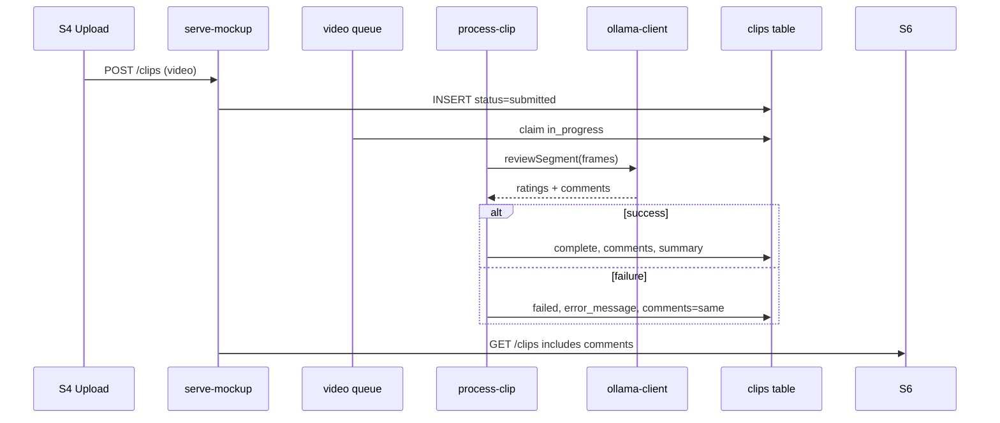

# Feature 020 — Clip Comments Field for Video Assessment

## Goal Capsule

- **Objective:** Persist a `comments` field on each clip that captures the LLM’s qualitative observation about the uploaded video, and populate it with the processing error message when assessment fails.
- **Authority:** `scripts/video-processing/` pipeline (Feature 018) + `clips` table + clip list API + S6 assessment cards.
- **Done when:** Successful assessment stores LLM `comments` on the clip row; failed assessment sets `comments` to the same text as `error_message`; Ollama prompt explicitly requests `comments` in the JSON response; API and S6 expose the field; **S6 assessment cards render `comments` above the rating row** when present.
- **Out:** OpenAPI clip schema update; S2 dashboard clip detail panel; coach editing of comments; multilingual comment templates.

## Product Contract

### Problem Frame

Feature 018 stores skill ratings and a composite `summary` string built from the LLM note plus rating lines. Coaches need a dedicated **comment about the video** that is clearly requested from the reviewing agent and visible on assessment results. When processing fails (ffmpeg, Ollama, parse errors), that same field should carry the failure reason so the UI has one place to read “what happened” without digging into server logs.

### Actors

- A1. **Coach** — uploads video on S4; reads comment text on S6 for assessed or failed clips.
- A2. **Video assessment agent (Ollama)** — returns structured JSON including `comments` describing what was observed in the segment frames.
- A3. **Video processing worker** — persists `comments` on success or copies `error_message` into `comments` on failure.

### Key Flows

- F1. Worker assesses segment(s) → Ollama prompt asks for `comments` → parser extracts `comments` → last non-empty segment comment is saved on `complete`.
- F2. Worker hits ffmpeg/Ollama/parse failure → `markClipFailed` sets `error_message` and `comments` to the same message.
- F3. Coach opens S6 → each result card shows header/meta, then **`comments` (when present) above the rating row**; assessed cards show comment then score; failed cards show error comment in that slot (no score).
- F4. `GET /api/v1/clips` returns `comments` for each clip.

### Acceptance Examples

- AE1. Successful clip assessment for a passing drill → `comments` contains a non-empty LLM sentence about the video (e.g., passing technique observed); `status=complete`.
- AE2. ffmpeg missing or segment failure → `status=failed`, `error_message` populated, `comments` equals `error_message` (e.g., “ffmpeg not found…”).
- AE3. Ollama returns valid ratings but empty `comments` → clip still `complete`; `comments` is empty string or null; `summary` still built from ratings.
- AE4. S6 assessed card renders `comments` **above** the `★ score / 5.0` rating row when present (DOM order: `result-meta` → `result-comment` → `result-rating`).
- AE5. S6 failed card renders `comments` in the same slot above where the rating would appear (muted error styling); rating row omitted.

### Requirements

#### Data model

- R1. Add nullable `comments TEXT` column to `clips` via migration `apps/api/src/db/migrations/020_clips_comments.sql`; mirror in `apps/api/src/db/schema/tables.sql`, `deploy.sql`, and `scripts/serve-mockup.js` `ensureDatabase()` (`ALTER TABLE clips ADD COLUMN IF NOT EXISTS comments TEXT`).
- R2. On `status=complete`, persist the assessment agent’s video comment in `comments`.
- R3. On `status=failed`, set `comments` to the same value written to `error_message` (single source for user-visible failure text).
- R4. Existing `summary` column remains; continue building it via `buildSummary(ratings, comments)` so S2 “last match summary” style consumers keep working. `comments` holds the raw observation; `summary` may still append skill rating lines.

#### LLM prompt and parsing

- R5. Update `buildAssessmentPrompt` in `scripts/video-processing/ollama-client.js` to request a **`comments`** field (brief observation about what was seen in the video) in the JSON response shape.
- R6. Replace the prompt’s `summary` JSON key with `comments` to avoid duplicate prose fields. Example response shape:
  `{"ratings":[{"skill":"…","rating":0.75}],"comments":"Brief observation about the video."}`
- R7. `parseRatingsFromResponse` returns `{ ratings, comments }` (rename internal handling from `summary` to `comments`).
- R8. `reviewSegment` returns `comments` to `process-clip.js`; when multiple segments run, keep the **last non-empty** segment `comments` value (same pattern as today’s `lastSummary`).

#### Processing persistence

- R9. `markClipComplete` accepts `comments` and writes `clips.comments`.
- R10. `markClipFailed` writes both `error_message` and `comments` to the same string.
- R11. `no_video` early-failure path in `processClip` also sets `comments` via `markClipFailed`.

#### API and client

- R12. `toClipResponse` / `selectClipById` include `comments` in clip API payloads.
- R13. `GET /api/v1/clips` SELECT lists `c.comments`.
- R14. `MockupApi.listClips` backend mapping passes through `comments`.
- R15. S6 result cards display `comments` when present **above the rating row** inside `result-content`:
  - **Assessed (`complete`):** `result-meta` → `result-comment` (LLM text) → `result-rating` (★ score).
  - **Failed:** `result-meta` → `result-comment` (error text, failure styling) — no rating row.
  - **Pending / in_progress:** no comment block; existing pending message below meta only.

#### Non-goals

- R16. Do not remove `error_message` — keep for machine-oriented logging and audit events.
- R17. Do not backfill historical clips automatically beyond leaving `comments` null for rows processed before this feature.

### Scope Boundaries

#### In scope

- Migration + schema mirrors
- `ollama-client.js`, `process-clip.js`, `clip-upload.js` response shaping
- `scripts/serve-mockup.js` clip queries
- `docs/ux/mockup/S6-assessment-list.html`
- `docs/ux/mockup/js/mockup-api-client.js` (backend clip mapping + optional local mock seed comments)
- Vitest: `ollama-client` parser tests; integration test for failed-clip comments persistence (mock pool or existing pattern)

#### Deferred to Follow-Up Work

- OpenAPI `clips` schemas with `comments`
- S2 dashboard surfacing latest clip comment
- `GET /api/v1/clips/{clipId}` detail endpoint
- Truncating very long LLM comments server-side (rely on prompt brevity in v1)

### Key Decisions

| Decision | Choice | Rationale |
|---|---|---|
| Separate `comments` vs reuse `summary` | New `comments` column | User asked for a named field; `summary` stays composite for backward compatibility |
| Prompt field name | `comments` not `summary` | Aligns API/DB with user vocabulary; `summary` remains derived |
| Failure text | Duplicate into `comments` and `error_message` | S6 and coaches read one field; audit/logger keep `error_message` |
| Multi-segment merge | Last non-empty `comments` wins | Matches current `lastSummary` behavior |
| UI scope v1 | S6 cards only | Smallest surface that shows assessment feedback |
| S6 comment placement | Above rating row | Coach reads observation before score; matches user layout request |

## Planning Contract

### Key Technical Decisions

- **KTD1. Prompt instruction** — Add explicit wording: *“Include a `comments` field with a brief comment about what you observed in the video.”* Keep existing sport/situation/age/skill context from Feature 018.
- **KTD2. `buildSummary` input** — Pass segment `comments` as `extraSummary` to `buildSummary` so `summary` column text remains populated for existing UI that reads `summary` indirectly.
- **KTD3. Failed clip symmetry** — Single helper or shared line in `markClipFailed`: `comments = error_message = message`.
- **KTD4. API field** — camelCase `comments` in JSON responses (matches existing `errorMessage`, `skillRatings`).
- **KTD5. S6 card DOM order** — Insert comment markup between `result-meta` and `scoreMarkup` in `S6-assessment-list.html` render loop. Use a dedicated `.result-comment` element; do not append comments after the rating.

**S6 card content stack (assessed):**

```
result-header     (player, situation, status badge)
result-meta       (submittedAt, skill, team)
result-comment    (clip.comments — NEW, above rating)
result-rating     (★ score / 5.0)
```


### High-Level Technical Design



### Risks

- **LLM omits `comments`** — Mitigation: treat as empty; `summary` still has rating lines; S6 shows score only.
- **Very long error strings** — Mitigation: store as-is in v1; prompt asks for brief comments on success path.
- **Score scale mismatch on S6** — Pre-existing (`0.82 / 5.0` display); out of scope for this feature.

### Dependencies

- Feature 018 video processing (shipped)
- Feature 019 audit logging (shipped) — no change required; `clip.failed` already logs error text

## Implementation Units

### U1. Schema — `clips.comments` column

**Goal:** Persist comments at the database layer.

**Requirements:** R1.

**Files:**
- `apps/api/src/db/migrations/020_clips_comments.sql` (new)
- `apps/api/src/db/schema/tables.sql`
- `apps/api/src/db/schema/deploy.sql`
- `scripts/serve-mockup.js` (`ensureDatabase` ALTER)

**Approach:** `ALTER TABLE clips ADD COLUMN IF NOT EXISTS comments TEXT;` No backfill.

**Test scenarios:**
- Migration applies idempotently on DB that already has column
- Fresh bootstrap creates `comments` column

**Verification:** Existing migration spec pattern if present; manual `\d clips` or query `comments` column exists.

---

### U2. LLM prompt and parser — request `comments`

**Goal:** Assessment agent returns a video comment in structured JSON.

**Requirements:** R5–R8.

**Dependencies:** U1 (column exists before persistence tests).

**Files:**
- `scripts/video-processing/ollama-client.js`
- `apps/api/tests/integration/video-processing/ollama-client.spec.ts` (new)

**Approach:**
- Update `buildAssessmentPrompt` JSON shape to use `comments`
- `parseRatingsFromResponse` returns `{ ratings, comments }`
- Update any callers expecting `.summary` on segment results

**Execution note:** Start with parser unit tests using fixture JSON strings before changing `process-clip.js`.

**Test scenarios:**
- Parses `comments` from valid JSON alongside ratings
- Missing `comments` key → empty string, ratings still parsed
- Legacy JSON with `summary` only → optional fallback: treat `summary` as `comments` for one release (document in code comment); **prefer strict `comments` only** unless tests show production model still returns `summary`

**Verification:** Vitest `ollama-client.spec.ts` green.

---

### U3. Processing — persist comments on complete and failed

**Goal:** Write `comments` during clip lifecycle completion.

**Requirements:** R2–R4, R9–R11.

**Dependencies:** U2.

**Files:**
- `scripts/video-processing/process-clip.js`
- `scripts/video-processing/analyzer.js` (no change unless `buildSummary` signature documented)

**Approach:**
- Track `lastComments` across segments (mirror `lastSummary`)
- `markClipComplete(pool, clipId, { skillRatings, score, summary, comments })`
- `markClipFailed` sets `comments = $error` alongside `error_message`
- `buildSummary(ratingsBySkill, lastComments)` for `summary` column

**Test scenarios:**
- Covers AE2. Failed clip: both `error_message` and `comments` equal failure text (mock `pool.query`, assert UPDATE params)
- Complete path passes non-empty `comments` to UPDATE

**Verification:** Vitest integration test with mocked pool; manual retry via `scripts/video-processing/retry-clip.js` on a test clip.

---

### U4. API — expose `comments` on clip responses

**Goal:** Clients receive `comments` from list and upload endpoints.

**Requirements:** R12–R13.

**Dependencies:** U1, U3.

**Files:**
- `scripts/video-processing/clip-upload.js` (`toClipResponse`, `selectClipById`)
- `scripts/serve-mockup.js` (`GET /api/v1/clips` SELECT, JSON POST clip SELECT if applicable)

**Approach:** Add `c.comments` to SQL selects; map to `comments` in `toClipResponse`.

**Test scenarios:**
- `toClipResponse` includes `comments` when row has value
- Null `comments` serializes as `null` or `""` consistently (pick one; prefer `null` in JSON)

**Verification:** Manual `GET /api/v1/clips` shows `comments` for assessed/failed clip.

---

### U5. S6 UI — display comments above rating on assessment cards

**Goal:** Coaches see the video comment or failure message on S6, positioned **above** the score/rating row.

**Requirements:** R14–R15. Covers AE4, AE5.

**Dependencies:** U4.

**Files:**
- `docs/ux/mockup/js/mockup-api-client.js`
- `docs/ux/mockup/S6-assessment-list.html`
- `docs/ux/mockup/style/site.css` (`.result-comment` for body text; `.result-comment--error` for failed clips)

**Approach:**
- In the `render()` card template, build `commentMarkup` when `clip.comments` (or `clip.errorMessage` fallback for failed) is non-empty.
- Insert `commentMarkup` **before** `scoreMarkup` in the inner HTML string (after `result-meta`, before rating).
- **Assessed:** comment block then `result-rating` with ★ score.
- **Failed:** comment block with error styling only; omit rating row.
- **Pending/in_progress:** omit comment block; keep existing pending message in score slot.
- Escape HTML in comment text when rendering (or use `textContent` via DOM APIs) to avoid XSS from LLM/error strings.

**Test scenarios:**
- Covers AE4. Assessed clip with `comments: "Strong passing"` → comment text appears in DOM before `.result-rating`.
- Covers AE5. Failed clip → `.result-comment--error` visible; no `.result-rating` on same card.
- Empty `comments` on complete clip → no `.result-comment`; rating still shown.
- Playwright: extend `tests/playwright/s6-assessment-list.spec.js` to assert comment precedes rating in card markup order.

**Verification:** Manual S6 — Y Defense One assessed card shows comment above `0.82 / 5.0` score.

---

### U6. Documentation cross-reference

**Goal:** Keep mapping notes accurate.

**Requirements:** traceability only.

**Files:**
- `docs/ux/mockup/API-Mockup-Mapping.md` (clip row fields bullet)

**Approach:** Note `comments` on clips — LLM observation or error text.

**Test expectation:** none — documentation only.

**Verification:** Mapping mentions `comments`.

## Verification Contract

- `npx vitest run apps/api/tests/integration/video-processing/ollama-client.spec.ts`
- `npx vitest run apps/api/tests/integration/video-processing/` (full video-processing folder)
- Manual: upload or retry a clip → confirm `comments` in DB and S6
- Manual: force failure (e.g., stop Ollama) → confirm `comments` matches `error_message`

## Definition of Done

- [ ] `clips.comments` exists in migration, schema mirrors, and running mockup DB
- [ ] Ollama prompt requests `comments`; parser extracts it
- [ ] Successful processing persists LLM `comments`; failures duplicate error into `comments`
- [ ] `GET /api/v1/clips` returns `comments`
- [ ] S6 shows comments **above** the rating row for assessed/failed clips
- [ ] Vitest coverage for parser and failed-clip persistence
- [ ] No regression in Feature 018 status lifecycle or Feature 019 audit logging

## Assumptions

- `comments` on success is English prose from the configured Ollama model (same as current summary language).
- Coaches do not need to edit `comments` in S5 in v1.
- Reprocessing an existing clip via `retry-clip.js` is sufficient to backfill comments for demo clips; no batch migration required.

## Sources & Research

- Feature 018 plan: `docs/plans/2026-07-09-018-feat-s4-video-processing-service-plan.md` — prompt template R14, `summary` storage R16
- Current prompt/parser: `scripts/video-processing/ollama-client.js`
- Processing persistence: `scripts/video-processing/process-clip.js`
- S6 list UI: `docs/ux/mockup/S6-assessment-list.html`
- Institutional note: clip count reconciliation was added post-018 in session work; unrelated to this feature
