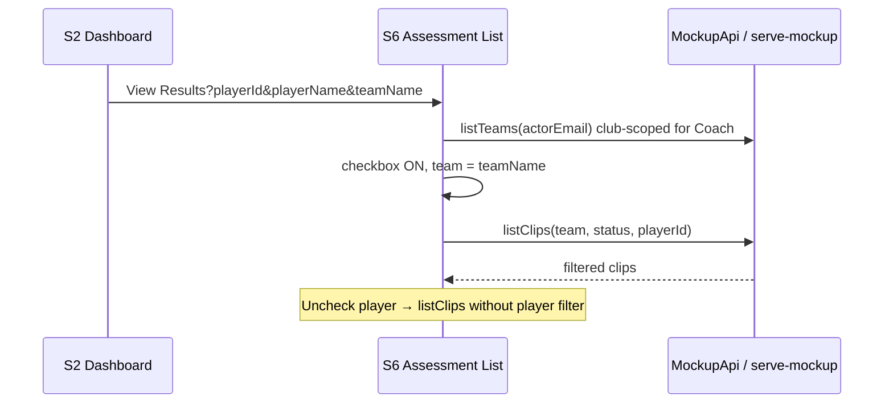

# Feature 021 — S2 → S6 View Results Player and Club-Scoped Team Filters

## Goal Capsule

- **Objective:** From S2 Video Assessments **View Results**, open S6 pre-filtered to the dashboard player (toggleable **Pre-Selected Player** checkbox default ON) and default the Team dropdown to that player's current team. Coaches may only choose teams within their assigned club(s); **All Teams** means all teams in those club(s). SystemAdmin keeps a broader team list.
- **Authority:** Mockup pages `S2-player-dashboard.html` / `S6-assessment-list.html` + `mockup-api-client.js`; reuse existing `GET /api/v1/teams?actorEmail=` club scoping. Optional thin `playerName` / `playerId` filter on `GET /api/v1/clips`.
- **Done when:** S2 deep-links with player + team context; S6 checkbox ON filters to that player and can be turned off; Team defaults to player's team; Coach dropdown only lists club-scoped teams; Playwright covers the deep-link path.
- **Out:** Changing S6 card “View Results” (back to S2); SystemAdmin multi-club UX redesign; OpenAPI clip schemas; server-side coach scoping of the full clip list beyond team/player query filters.

### Summary

Deep-link S2 → S6 with a toggleable Pre-Selected Player filter (ON from S2), default Team to the player's team, and club-scope the Coach team dropdown (All Teams = all teams in the coach's club(s)).

## Product Contract

### Problem Frame

S2 **View Results** currently navigates to a bare S6 page that shows every team's clips and has no player filter. Coaches need a one-click path from a player's dashboard into that player's assessments, with Team already set to the player's assignment and without exposing teams from other clubs.

### Actors

- A1. **Coach** — opens View Results from S2; sees club-scoped teams; can toggle Pre-Selected Player off to see other players (still within selected team / All Teams in club).
- A2. **SystemAdmin** — may use S6 with a broader team list (existing unscoped or admin-visible teams); Pre-Selected Player still works when arriving with query params.

### Key Flows

- F1. Coach on S2 for player P (team T) clicks **View Results** → S6 loads with query context → **Pre-Selected Player** checked → Team = T → grid shows only P's clips (intersected with team/status filters).
- F2. Coach unchecks **Pre-Selected Player** → grid shows all players matching Team + status filters (club-scoped team options unchanged).
- F3. Coach changes Team among club teams (or All Teams in club) → list re-filters; Pre-Selected Player remains as toggled.
- F4. Direct nav to S6 (bottom nav, no query) → Pre-Selected Player unchecked/hidden or OFF; Team defaults to All Teams (club-scoped for Coach).

### Acceptance Examples

- AE1. From S2 for “Y Defense One” on team “Y 11”, View Results opens S6 with Pre-Selected Player ON and Team = “Y 11”; only that player's clips appear.
- AE2. Unchecking Pre-Selected Player on that page shows other players' clips for the selected team (still only club teams in the dropdown for a Coach).
- AE3. Coach team dropdown does not list teams belonging only to clubs the coach is not assigned to.
- AE4. SystemAdmin (or unscoped admin path) can still see a broader team list than a Coach.
- AE5. Opening S6 without query params does not force a player filter ON.

### Requirements

#### Deep link from S2

- R1. S2 Video Assessments **View Results** href includes at least `playerId` (preferred) and/or `playerName`, plus `teamName` from the loaded dashboard player.
- R2. Prefer building the href after dashboard load (set `href` in JS) so ids/names are accurate; keep a safe fallback `./S6-assessment-list.html` before load.

#### Pre-Selected Player control

- R3. S6 toolbar adds a **Pre-Selected Player** checkbox (`[data-testid="preselected-player-filter"]`) with visible label including the player name when a player is in context.
- R4. When arriving with player query params, checkbox defaults **ON**.
- R5. Checkbox is **toggleable** (user may turn OFF to clear the player-only filter without leaving the page).
- R6. When no player context in the URL, checkbox is OFF (and may be hidden or disabled with no player name).

#### Team dropdown

- R7. On deep-link with `teamName`, select that team if it exists in the allowed team list; otherwise fall back to All Teams.
- R8. For **Coach**, populate Team options via `MockupApi.listTeams` with `actorEmail` so results are limited to teams in the coach's club(s) (existing backend `GET /teams?actorEmail=` behavior).
- R9. **All Teams** for a Coach means all teams returned by that club-scoped list (not global all teams).
- R10. For **SystemAdmin**, keep a broader team list (call without coach-only restriction / existing admin path).

#### Clip filtering

- R11. `MockupApi.listClips` accepts optional `playerId` and/or `playerName` and filters accordingly (backend query param + offline filter).
- R12. When Pre-Selected Player is ON, clip list and header counts use the player filter; when OFF, player filter is omitted.
- R13. Status filter buttons continue to work with the combined team + optional player filters.

#### Non-goals

- R14. Do not change the per-card S6 “View Results” link that returns to S2.
- R15. Do not add a full player picker dropdown in this feature (checkbox + deep-link context only).

### Scope Boundaries

#### In scope

- `docs/ux/mockup/S2-player-dashboard.html`
- `docs/ux/mockup/S6-assessment-list.html`
- `docs/ux/mockup/js/mockup-api-client.js` (`listClips`, offline `listTeams` coach scoping if missing)
- `scripts/serve-mockup.js` — optional `playerName` / `playerId` on `GET /api/v1/clips`
- Playwright: `tests/playwright/s6-assessment-list.spec.js` and/or `s2-player-dashboard.spec.js`
- Short note in `docs/ux/mockup/API-Mockup-Mapping.md`

#### Deferred to Follow-Up Work

- Server-enforced coach scoping on `GET /clips` beyond query filters (Feature 018 deferred item)
- Persisting S6 filter state in `localStorage`
- Multi-player picker on S6

### Key Decisions

| Decision | Choice | Rationale |
|---|---|---|
| Player filter UI | Toggleable checkbox, ON from S2 | Confirmed option 1 |
| Coach All Teams | All teams in coach club(s) | Confirmed option 1 |
| SystemAdmin teams | Broader list | Confirmed option 1 |
| Deep-link params | `playerId`, `playerName`, `teamName` | Matches existing S2/S5 query patterns |
| Team scoping mechanism | Reuse `GET /teams?actorEmail=` | Already implements coach_clubs filter |

## Planning Contract

### Key Technical Decisions

- **KTD1. Query contract** — `S6-assessment-list.html?playerId=&playerName=&teamName=`. Prefer `playerId` for filtering when present; use `playerName` for checkbox label and offline fallback.
- **KTD2. Coach teams on S6** — `MockupApi.listTeams('actorEmail=' + encodeURIComponent(email) + '&status=active')` for Coach; SystemAdmin may call without coach restriction (or with admin email that does not apply coach filter).
- **KTD3. Offline parity** — If offline `listTeams` currently returns all teams, mirror coach club membership filtering when `actorEmail` is present (same rules as `listClubs` coach path).
- **KTD4. Header counts** — When Pre-Selected Player is ON, header “N submitted • M assessed” reflects the player-filtered set (within current team filter or all club teams as selected); when OFF, counts match the team-scoped list without player filter.
- **KTD5. Clip API** — Add optional `playerId` / `playerName` query params to `GET /api/v1/clips`; keep existing `teamName` + `status`.

### High-Level Technical Design

### Risks

- **Team name mismatch** — Player `teamName` not in club-scoped list (stale assignment) → fall back to All Teams and keep player filter ON.
- **Offline team leak** — Unscoped offline `listTeams` would violate R8 → must fix offline path in same change.
- **Header vs grid inconsistency** — If counts ignore player filter while grid applies it, coaches get confused → KTD4.

### Dependencies

- Existing club/team APIs and `coach_clubs` membership (Features 008/009 area).
- Feature 018/020 clip list + S6 card rendering (shipped).

### Assumptions

- A coach may belong to multiple clubs; “same club” for the dropdown means the union of teams in all clubs assigned to that coach (matches `GET /teams?actorEmail=`).
- S2 dashboard always has `player.teamName` when View Results is shown.

## Implementation Units

### U1. Deep-link View Results from S2

**Goal:** Pass player and team context into S6.

**Requirements:** R1–R2.

**Files:**
- `docs/ux/mockup/S2-player-dashboard.html`

**Approach:** After dashboard payload loads, set the Video Assessments View Results anchor `href` to `./S6-assessment-list.html?playerId=…&playerName=…&teamName=…` using `encodeURIComponent`. Add `data-testid="view-results-link"` for tests.

**Test scenarios:**
- Covers AE1 (partial). Loaded S2 sets href containing the current player's id/name and teamName.

**Verification:** Manual click from S2 lands on S6 with query string; Playwright from S2 optional in U4.

---

### U2. S6 Pre-Selected Player + team default + club-scoped teams

**Goal:** Wire toolbar controls and initial filter state.

**Requirements:** R3–R10, R12–R13.

**Dependencies:** U1 (for deep-link params); U3 for listClips player filter.

**Files:**
- `docs/ux/mockup/S6-assessment-list.html`
- `docs/ux/mockup/style/site.css` (toolbar checkbox spacing if needed)

**Approach:**
- Parse URL params on load.
- Render Pre-Selected Player checkbox; default checked when player context exists.
- Load teams with actorEmail for Coach; keep All Teams as first option meaning “all returned teams.”
- Default `teamFilter.value` to `teamName` when present in options.
- `render()` applies team + status + optional player filters; re-render on checkbox change.

**Test scenarios:**
- Covers AE1, AE2, AE5. Deep-link ON filters player; uncheck widens list; bare S6 has checkbox OFF.

**Verification:** Playwright deep-link + toggle tests.

---

### U3. listClips / GET clips player filter + offline team scoping

**Goal:** Support player filtering and coach-safe team lists in both modes.

**Requirements:** R8, R11, KTD2–KTD3, KTD5.

**Dependencies:** none (can land before or with U2).

**Files:**
- `docs/ux/mockup/js/mockup-api-client.js`
- `scripts/serve-mockup.js` (`GET /api/v1/clips`)

**Approach:**
- `listClips({ teamName, status, playerId, playerName })` — backend query params; offline filter by id/name.
- Offline `listTeams`: when query includes `actorEmail` for a Coach, filter teams to clubs in `coachClubs` (mirror backend).
- Backend clips SELECT adds optional `AND (c.player_id = $n OR LOWER(p.name) = LOWER($n))` as appropriate.

**Test scenarios:**
- Covers AE3. Offline/backend Coach team list excludes out-of-club teams.
- listClips with playerName returns only that player's clips.

**Verification:** Vitest or Playwright offline-forced case if practical; otherwise Playwright against mockup server + mapping note.

---

### U4. Playwright + mapping docs

**Goal:** Lock AE1–AE2 and document the contract.

**Requirements:** AE1–AE5 traceability; R14–R15 documented as out.

**Dependencies:** U1–U3.

**Files:**
- `tests/playwright/s6-assessment-list.spec.js` (and/or `s2-player-dashboard.spec.js`)
- `docs/ux/mockup/API-Mockup-Mapping.md`

**Approach:**
- Test: goto S6 with query params for a seeded player → checkbox checked → only that player visible (or assert filter applied).
- Test: uncheck → additional players may appear for All Teams / team.
- Test: Coach session team options do not include a known out-of-club team when multi-club seed exists; if seed is single-club only, assert `listTeams` called with `actorEmail` / document limitation and assert All Teams + player's team present.
- Mapping: S2 View Results deep-link; S6 Pre-Selected Player; Coach team scoping.

**Execution note:** Prefer smoke/runtime Playwright verification; extend existing S6 suite.

**Verification:** Playwright green for new cases; mapping mentions the contract.

## Verification Contract

- Playwright: deep-link Pre-Selected Player ON; toggle OFF; S6 without params does not force player filter
- Manual Coach login: Team dropdown only club teams; default team from S2 matches player
- Manual SystemAdmin (if used on S6): broader team list still available
- `GET /api/v1/clips?playerName=…` (or playerId) returns filtered rows when backend mode on

## Definition of Done

- [ ] S2 View Results deep-links with player + team context
- [ ] S6 Pre-Selected Player checkbox defaults ON from deep-link and is toggleable
- [ ] Team defaults to player's team when present in club-scoped options
- [ ] Coach team dropdown limited to club-scoped teams; All Teams = those teams
- [ ] listClips / GET clips support player filter
- [ ] Offline listTeams respects coach club membership when actorEmail present
- [ ] Playwright + API-Mockup-Mapping updated
- [ ] S6 card View Results → S2 behavior unchanged

## Sources & Research

- Current S2 link: `docs/ux/mockup/S2-player-dashboard.html` (static `./S6-assessment-list.html`)
- Current S6 filters: `docs/ux/mockup/S6-assessment-list.html` (team + status only)
- Coach team scoping: `scripts/serve-mockup.js` `GET /api/v1/teams` + `coach_clubs`
- Clip list: `MockupApi.listClips` / `GET /api/v1/clips` (Feature 018/020)
