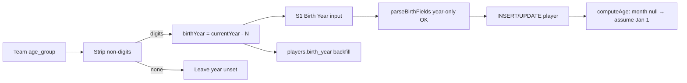

# Feature 026 — Default Birth Year from Team Age Group

## Goal Capsule

- **Objective:** On S1 Add Player, prefill **Birth Year** from the selected team’s Age Group (`currentYear − numericAge`), stripping non-digits from the age-group label; allow **year without month**; set `birth_year` for **all existing** assigned players from their team’s age group; **derive `age` from year-only** by assuming birth date **January 1** of that year.
- **Authority:** S1 mockup UI + shared birth validation / age helpers (`parseBirthFields`, `computeAge` in mockup server and offline client; video-processing age helper if duplicated) + one-time DB backfill; OpenAPI / mapping docs stay in sync.
- **Done when:** Selecting a team on Add Player fills Birth Year (month left unset); year-only create/update succeeds; existing players have `birth_year` derived from team age group where digits exist; year-only players expose a non-null `age` as if born Jan 1; tests and docs no longer require the strict month+year pair.
- **Out:** Persisting a default birth month in the DB; renaming age-group labels; changing how Age Group is edited on teams; mid-year (July 1) assumption (Jan 1 chosen).

### Summary

Prefill Add Player Birth Year from the team Age Group, relax validation to year-only, backfill existing players’ birth years, and compute age for year-only records as if the birthday were January 1.

## Product Contract

### Problem Frame

Coaches leave Birth Year blank or guess. Age Group already encodes the intended cohort (e.g. `U17`, `18+`). The product should default Birth Year from that label and apply the same rule to players already in the database. Today `parseBirthFields` rejects year without month, which blocks a year-only default, and `computeAge` returns null without a month — so year-only players never show an age on S2.

### Actors

- A1. **Coach** — opens Add Player on S1 with a team selected; may override the prefilled year or leave month blank; sees age on dashboards when only year is known.
- A2. **Operator** — expects existing DB players to receive a derived `birth_year` after deploy/restart backfill.

### Key Flows

- F1. Coach selects a specific team → Add Player Birth Year is set to `currentYear − digits(ageGroup)`; Birth month stays “Not set.”
- F2. Coach submits create with year only (month blank) → player persists with `birth_year` set and `birth_month` null; derived `age` uses Jan 1 assumption.
- F3. Backfill runs → every player with a team assignment whose age group yields digits gets `birth_year` overwritten; month unchanged; no-digit age groups skipped; read paths then show age via year-only rule.
- F4. Coach still may set both month and year (exact month wins for age), or leave both blank (age null).

### Acceptance Examples

- AE1. Team Age Group `U17` in calendar year 2026 → default Birth Year `2009` on Add Player.
- AE2. Age Group `18+` → digits `18` → Birth Year `2008` in 2026.
- AE3. Create player with Birth Year set and Birth month “Not set” succeeds (no pair error).
- AE4. After backfill, a player on `U19` has `birth_year = currentYear - 19` (overwrite even if previously set).
- AE5. Age Group with no digits → Birth Year not auto-filled / player not updated by backfill.
- AE6. Player with `birthYear = 2009`, `birthMonth = null`, reference date 2026-07-10 → `age = 17` (as if born 2009-01-01).
- AE7. Player with both month and year set continues to use the real month for the birthday-passed adjustment (unchanged formula).

### Requirements

- R1. Extract a positive integer from Age Group by removing all non-digit characters; if none remain, treat as unusable.
- R2. Default Birth Year = current calendar year minus that integer, clamped to the existing `1960`–current-year bounds (if clamp would be needed, still apply clamp; if unusable after clamp, leave unset).
- R3. On S1 Add Player, when a specific team is selected (not “all”), set the Birth Year input from that team’s Age Group; do not set Birth month.
- R4. Recompute the default when the selected team changes while the Add Player panel is relevant.
- R5. Allow year-only payloads: `birthMonth` null/blank + valid `birthYear` is accepted. Month-only remains an error. Both blank remains allowed.
- R6. When `birthYear` is set and `birthMonth` is null, `computeAge` treats the birthday as **January 1** of that year (assumed month = 1). When both are set, keep today’s month-aware formula. When year is null, age remains null.
- R7. Backfill **all** existing players that have a team assignment: overwrite `birth_year` from the assigned team’s Age Group when digits exist; leave `birth_month` as-is; skip players with no assignment or no usable digits.
- R8. Offline/local `mockup-api-client.js` `parseBirthFields` / `computeAge` must match server rules; any duplicate `computeAge` in video-processing must match; offline seed/demo players should reflect the same year-from-age-group idea where practical.
- R9. Update OpenAPI player create/update / age descriptions, `API-Mockup-Mapping.md`, and S1 hint copy so they no longer claim the strict pair rule and document year-only age (Jan 1 assumption).

### Scope Boundaries

#### In scope

- S1 Add Player defaulting behavior
- `parseBirthFields` (server + offline) year-only allowance
- `computeAge` year-only Jan 1 assumption (all copies that feed UI/API age)
- One-time / boot-safe backfill of `players.birth_year`
- Contract/source tests and docs that encode the old pair rule / age-null-without-month rule

#### Out of scope

- Writing a default `birth_month` into the database (month stays null; assumption is compute-time only)
- Mid-year (July 1) birthday assumption
- Changing team Age Group editing UX
- Multi-team assignment model changes (`player_id` remains PK on assignments)

#### Deferred to Follow-Up Work

- Re-deriving birth year automatically when a player is moved to a different team after this feature ships (backfill is one-shot; Add Player only covers create-time default)

## Planning Contract

### Assumptions

- Product Contract preservation: changed R6 / Goal / Out — user amended 2026-07-10 to derive age from year-only with Jan 1 assumption (supersedes earlier “age stays null without month”).
- One team per player via `player_team_assignments.player_id` PRIMARY KEY — backfill joins that single assignment.
- “Add Player page” means the S1 inline Add Player panel (`docs/ux/mockup/S1-player-list.html`).
- Jan 1 chosen over mid-year for a single clear rule; age before January 1 in the birth year is impossible for living players, so year-only age is effectively `currentYear - birthYear` once the calendar year has started (and still uses the month comparison with assumed month 1).

### Key Technical Decisions

- KTD1. **Shared digit extraction + year formula** — one small pure helper (or duplicated identical helpers in server and offline client) used by UI defaulting and backfill so `U17` / `18+` behave the same everywhere.
- KTD2. **Relax pair rule to “month-only forbidden”** — year-only OK; both blank OK; both set OK. Update source-level Vitest assertions that currently require the strict-pair error string.
- KTD3. **Backfill via SQL migration and/or `ensureDatabase`** — prefer a numbered migration under `apps/api/src/db/migrations/` using `regexp_replace(age_group, '[^0-9]', '', 'g')` plus year arithmetic, and mirror a boot-time idempotent UPDATE in `ensureDatabase` if that is how other data fixes land for the mockup DB (follow existing migration + ensureDatabase dual pattern from birth columns / clip_segments). Overwrite all matching rows (not null-only).
- KTD4. **UI fills year only** — do not auto-select January in the form; leave month “Not set” so year-only persistence is exercised; age still appears via R6.
- KTD5. **Year-only age = assume month 1 (Jan 1)** — in `computeAge`, if year is present and month is null, use month `1` for the existing birthday-passed logic. Do not invent or persist `birth_month`. Rejected alternative: mid-year (July 1).

### High-Level Technical Design

### Risks & Dependencies

- Overwriting existing accurate birth years for named demo players (Messi etc.) — accepted per “all existing players.”
- OpenAPI / Playwright / Vitest still encode strict-pair or “age null without month” language — must update in the same change or CI fails.
- Clamped years for unusual age groups (e.g. very large digit strings) — clamp to bounds; document in verification.
- Video-processing `computeAge` in `scripts/video-processing/process-clip.js` must stay consistent or Ollama age context drifts from S2.

## Implementation Units

### U1. Year-only birth validation, age-from-year, age-group → year helper

- **Goal:** Accept year without month; derive age for year-only as Jan 1; provide Age Group → birth year formula.
- **Requirements:** R1, R2, R5, R6, R8, R9
- **Dependencies:** None
- **Files:**
  - Modify: `scripts/serve-mockup.js` (`parseBirthFields`, `computeAge`, new helper)
  - Modify: `docs/ux/mockup/js/mockup-api-client.js` (`parseBirthFields`, `computeAge`, matching helper)
  - Modify: `scripts/video-processing/process-clip.js` (`computeAge` parity if still duplicated)
  - Modify: `apps/api/tests/integration/players/parse-birth-fields.spec.ts`
  - Modify: `openapi/v1/schemas/players.yaml` (descriptions asserted by `apps/api/tests/contract/openapi.players.spec.ts`)
  - Modify: `docs/ux/mockup/API-Mockup-Mapping.md`
- **Approach:** Change blank-month + present-year from error to `{ birthMonth: null, birthYear }`. Keep month-only as error. Add `birthYearFromAgeGroup(ageGroup, now)` that strips `\D`, parses int, subtracts from current year, clamps. Update `computeAge`: if year set and month null, use assumed month `1`; if both null/missing year, return null; if both set, unchanged. Mirror in offline client and process-clip.
- **Patterns to follow:** Existing dual `parseBirthFields` / `computeAge` parity between server and offline client; source-slice Vitest style in `parse-birth-fields.spec.ts`.
- **Test scenarios:**
  - Happy path: year-only payload `{ birthYear: 2009 }` → `{ birthMonth: null, birthYear: 2009 }`.
  - Happy path: Covers AE1/AE2. `birthYearFromAgeGroup('U17', 2026-ref)` → `2009`; `'18+'` → `2008`.
  - Happy path: Covers AE6. `computeAge(null, 2009, 2026-07-10)` → `17`.
  - Happy path: Covers AE7. `computeAge(6, 2009, 2026-07-10)` still applies month adjustment (age 17 if July ≥ June).
  - Edge: Age group with no digits → `null` / unset.
  - Edge: Both blank → null/null; both set → both returned; `computeAge` with year null → null.
  - Error: Month-only still returns a clear validation error (updated message if needed).
  - Integration: OpenAPI / mapping docs allow year-only and document Jan 1 age assumption; Vitest `computeAge` assertions no longer require null when month is null if year is present.
- **Verification:** Updated Vitest parse-birth + openapi.players specs pass; server, offline, and process-clip age helpers agree.

### U2. S1 Add Player default Birth Year from selected team

- **Goal:** Prefill Birth Year when a specific team is selected; leave month unset.
- **Requirements:** R3, R4, R9
- **Dependencies:** U1
- **Files:**
  - Modify: `docs/ux/mockup/S1-player-list.html`
  - Test: `tests/playwright/s1-player-list.spec.js` and/or `tests/playwright/s1-add-player-position.spec.js` (extend; add a focused case if neither covers birth defaults)
- **Approach:** When `selectedTeam !== 'all'`, resolve the team’s `ageGroup` from `MockupApi.listTeams()`, compute default year via the shared helper (or inline identical formula if helper is not exported to the page), set `#addPlayerBirthYear`. Trigger on team filter change and when opening the Add Player panel. Update the birth-fields hint to describe year-only + age-group default + that age uses Jan 1 when month is blank. On team change, reset year to the new default.
- **Patterns to follow:** Existing `loadPositionsForSelectedTeam` / team-filter change handlers in S1.
- **Test scenarios:**
  - Happy path: Covers AE1. Select team with Age Group `U17` → Birth Year input shows `currentYear - 17`; month remains empty.
  - Edge: Team filter “all” → do not invent a year (clear or leave prior; prefer clear/disable consistent with position handling).
  - Edge: Covers AE5. Team age group without digits → Birth Year left blank.
- **Verification:** Manual or Playwright: team select updates Birth Year; submit with month unset succeeds; S2/list shows age for that player.

### U3. Backfill existing players’ birth_year from team Age Group

- **Goal:** Set `birth_year` for all assigned players from their team’s Age Group (overwrite).
- **Requirements:** R7
- **Dependencies:** U1 (formula semantics)
- **Files:**
  - Create: `apps/api/src/db/migrations/022_backfill_player_birth_year_from_age_group.sql` (number = next free migration)
  - Modify: `scripts/serve-mockup.js` `ensureDatabase` if mockup DBs rely on boot-time fixes
  - Modify: `apps/api/tests/integration/db/players-birth-migration.spec.ts` or add a focused migration content spec
  - Optionally align offline seed players in `docs/ux/mockup/js/mockup-api-client.js`
- **Approach:** `UPDATE players SET birth_year = … FROM player_team_assignments JOIN teams` where `regexp_replace(teams.age_group, '[^0-9]', '', 'g')` is non-empty; compute `EXTRACT(YEAR FROM NOW())::int - digits::int`, clamp to 1960–current year; do not modify `birth_month`. Idempotent re-run OK (same overwrite). Unassigned players unchanged. After backfill, year-only age (U1) surfaces on reads without further DB changes.
- **Execution note:** Prefer a migration content/characterization test plus a one-shot SQL dry-read of expected digit extraction before applying in local DB.
- **Patterns to follow:** `017_players_birth_month_year.sql` + `players-birth-migration.spec.ts`; `ensureDatabase` ALTER/CREATE IF NOT EXISTS style for mockup.
- **Test scenarios:**
  - Happy path: Covers AE4. Migration SQL contains overwrite of `birth_year` from team `age_group` digits and year subtraction.
  - Edge: Covers AE5. Rows with no digits in age_group are not updated by the WHERE clause.
  - Integration: After ensureDatabase/migration on a DB with U17-assigned player, `birth_year` equals currentYear − 17 and API `age` is non-null under Jan 1 rule.
- **Verification:** Migration applied (or mockup restarted); sample players show expected years and ages; month columns unchanged.

## Verification Contract

- Vitest: `apps/api/tests/integration/players/parse-birth-fields.spec.ts`, `apps/api/tests/contract/openapi.players.spec.ts`, birth migration spec(s).
- Playwright or manual S1: team select prefills year; year-only add succeeds; age visible where UI shows it.
- DB: after backfill, assigned players with digit age groups have non-null `birth_year` matching the formula.

## Definition of Done

- U1–U3 complete with requirements R1–R9 satisfied.
- Year-only create/update works; month-only still rejected; year-only age uses Jan 1 assumption; both-set age unchanged.
- All existing assigned players with usable age groups have overwritten `birth_year`.
- Docs/OpenAPI/S1 hint no longer mandate the strict pair rule; year-only age is documented.
- Server, offline client, and process-clip `computeAge` stay aligned.
