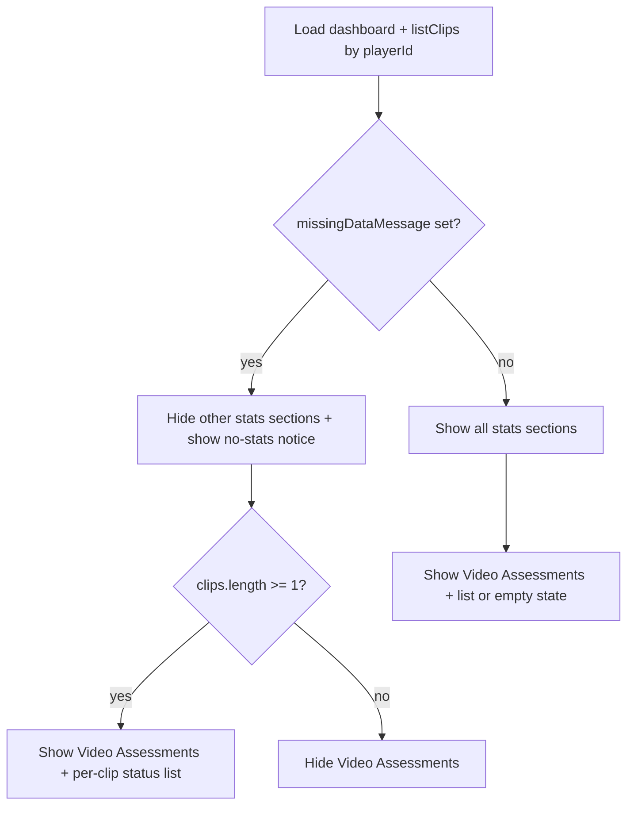

# Feature 029 — S2 Video Assessments Visible When Clips Exist

## Goal Capsule

- **Objective:** On S2, show **Video Assessments** whenever the player has at least one real clip (any status), even when other performance stats are missing; list each clip with its status. Keep other stats sections gated by `missingDataMessage`. Leave S5 alone.
- **Authority:** Gate on live `MockupApi.listClips({ playerId })`, not cached `clipStats`. Reuse S6 status badge/label mapping. Restructure the S2 early `return` so clip rendering still runs when stats are missing.
- **Done when:** No-stats player with ≥1 clip sees Video Assessments + per-clip statuses; no-stats player with 0 clips still hides it; has-stats players keep the section and see the per-clip list; Playwright covers both no-stats cases; S5 unchanged.
- **Out:** S5 clip-count fields; enriching the dashboard API with a clips array; changing S6; auto-expanding the section.

## Product Contract

### Summary

Decouple S2 Video Assessments from the missing-stats hide rule so submitted clips (any status) always surface there as a per-clip status list, while other dashboard stats sections stay hidden when performance metrics are unavailable.

### Problem Frame

S2 hides every `.stats-section` — including Video Assessments — when `dashboard.performance.missingDataMessage` is set, then returns before rendering clip summary. A player can already have real clips in the `clips` table while growth stats are still missing; coaches never see those submissions or their status on the dashboard. Cached `player_stats` clip counts are also unreliable for this gate (deferred live reconcile from plan `docs/plans/2026-07-04-005-fix-s2-dashboard-missing-stats-default-player-plan.md`).

### Actors

- A1. **Coach** — opens a player dashboard (S2) and needs to see whether clips exist and what status each is in, including for players without growth metrics yet.

### Key Flows

- F1. Player has missing stats and ≥1 clip → identity + no-stats notice + **Video Assessments** visible with a row/card per clip showing status; other stats sections stay hidden.
- F2. Player has missing stats and 0 clips → Video Assessments stays hidden (same as today for that section).
- F3. Player has stats → all stats sections visible as today; Video Assessments shows the per-clip status list (empty-state copy + CTAs when no clips).
- F4. View Results / Submit New Clip CTAs remain in the section when it is shown.

### Acceptance Examples

- AE1. No-stats player with at least one clip in `submitted`, `in_progress`, `complete`, or `failed` → Video Assessments is visible and lists that clip with a status label matching S6 conventions.
- AE2. No-stats player with zero clips → Video Assessments remains hidden; `#noStatsNotice` still shows.
- AE3. Player with full stats and clips → Video Assessments lists each clip with status (not only the old aggregate count line).
- AE4. Expanding Video Assessments still exposes View Results and Submit New Clip.

### Requirements

- R1. When `missingDataMessage` is set, hide Skill Ratings, Development Progress, Match Time History, and Recent Performance as today; **do not** hide Video Assessments solely because of that flag.
- R2. Show Video Assessments for a missing-stats player **if and only if** `listClips({ playerId })` returns ≥1 clip (any status).
- R3. When Video Assessments is shown, render **each** of that player’s clips with a visible status (reuse S6 label/class mapping: complete/assessed, submitted/pending, in progress, failed).
- R4. Gate visibility and list content on **live clips** via `MockupApi.listClips({ playerId })`, not on cached `dashboard.clipStats`.
- R5. Preserve View Results and Submit New Clip when the section is shown; keep existing `playerId` deep-links.
- R6. Do not change S5 Edit Player clip-count fields in this plan.

### Scope Boundaries

#### In scope

- `docs/ux/mockup/S2-player-dashboard.html` visibility + per-clip list UI
- `tests/playwright/s2-player-dashboard.spec.js`
- Light note in `docs/ux/mockup/API-Mockup-Mapping.md` if the missing-stats / Video Assessments rule is documented there

#### Out of scope

- S5 Video Assessments / clip count form fields
- Writing live clip aggregates back into `player_stats`
- New dashboard payload fields (optional later; client `listClips` is enough)
- S6 layout or filter changes
- Auto-expanding Video Assessments on first visit

#### Deferred to Follow-Up Work

- Reconciling `player_stats.clip_*_count` from the live `clips` table for all players (still deferred from plan 005)

## Planning Contract

### Product Contract preservation

Product Contract unchanged after bootstrap (no upstream brainstorm file).

### Assumptions

- Confirmed scope: per-clip status list; S5 left alone.
- `MockupApi.listClips({ playerId })` already returns live clips in backend and offline modes (same path S6 uses).
- Compact list rows (situation + status badge + optional submittedAt) are enough on S2; full S6 cards are not required.

### Key Technical Decisions

- KTD1. **Gate on `listClips`, not `clipStats`** — backend dashboard counts are cached in `player_stats` and can be zero while real clips exist; the visibility rule must use the live list.
- KTD2. **Restructure the missing-stats early return** — hide non-video stats sections and show `#noStatsNotice`, then still run Video Assessments render + section toggles for visible sections; do not `return` before clip work.
- KTD3. **Reuse S6 status mapping** — same complete/pending/failed classes and `in_progress` → “in progress” label; include `failed` clips in the list (they are real submissions).
- KTD4. **Replace the aggregate-only summary with a per-clip list** when rendering; optional short header count is fine if cheap, but each clip’s status must be visible. Empty list (has-stats, zero clips) shows a short empty message plus CTAs.

### High-Level Technical Design

### Risks & Dependencies

- Existing Playwright “Rookie Carter” case expects Video Assessments hidden — keep that only when Carter has **no** clips; add a sibling case with a seeded clip.
- Section toggles currently initialize only after the early return path that skips missing-stats players — must still bind toggles when Video Assessments is the only visible stats section.
- Offline seed may need a one-off clip attached to a no-stats player inside the test (prefer test-local `localStorage` mutation over changing global seed permanently).

## Implementation Units

### U1. S2 Video Assessments visibility + per-clip status list

- **Goal:** Decouple Video Assessments from the missing-stats hide group; list each live clip with status.
- **Requirements:** R1–R5, AE1–AE4
- **Dependencies:** None
- **Files:**
  - Modify: `docs/ux/mockup/S2-player-dashboard.html`
  - Modify: `docs/ux/mockup/API-Mockup-Mapping.md` (missing-stats / Video Assessments rule)
- **Approach:** After dashboard load, call `MockupApi.listClips({ playerId: player.id })`. If `missingDataMessage`, hide non-video `.stats-section`s and show the notice; show Video Assessments only when `clips.length >= 1`. If no missing message, show all sections and always render the Video Assessments body (list or empty). Replace `#dashboardClipSummary` (or add a sibling container with a test id) with a rendered list of clips: situation (or skill) + status badge using S6’s status class/label rules. Keep View Results / Submit New Clip. Initialize collapse toggles for any visible stats section.
- **Patterns to follow:** S6 `render()` statusClass/statusLabel; existing S2 View Results / Submit Clip href wiring; collapsible `data-section="video-assessments"`.
- **Test scenarios:** Covered in U2.
- **Verification:** Manual or Playwright: no-stats + clip → section visible with status; no-stats + no clip → section hidden; has-stats → list renders.

### U2. Playwright coverage for no-stats + clips

- **Goal:** Lock the new visibility rule and per-clip status display.
- **Requirements:** AE1, AE2, AE3
- **Dependencies:** U1
- **Files:**
  - Modify: `tests/playwright/s2-player-dashboard.spec.js`
- **Approach:** Keep the existing Rookie Carter no-clips assertion (Video Assessments hidden). Add an offline-mode test that seeds at least one clip for a no-stats player (or Carter after attaching a clip in `localStorage`), opens S2, asserts Video Assessments visible, and asserts a status label for that clip (e.g. `submitted` or `in progress`). Optionally assert a has-stats player still shows a per-clip row when clips exist.
- **Execution note:** Prefer offline/`__USE_MOCK_LOCAL__` for deterministic clip seeding without depending on backend `player_stats` cache.
- **Test scenarios:**
  - Happy path: no-stats player with one `submitted` clip → Video Assessments visible; clip status text visible; other stats sections still hidden; notice still visible.
  - Edge: no-stats player with zero clips → Video Assessments hidden (existing Carter case).
  - Edge: clip with `failed` or `in_progress` → corresponding status label appears.
  - Integration: View Results link still present when the section is shown.
- **Verification:** `npx playwright test tests/playwright/s2-player-dashboard.spec.js` passes.

## Verification Contract

- Playwright: `tests/playwright/s2-player-dashboard.spec.js` green.
- Spot-check: player with missing stats + real clip shows Video Assessments with status; player with missing stats and no clips does not.

## Definition of Done

- R1–R6 and AE1–AE4 satisfied.
- U1 and U2 complete; S5 untouched.
- API-Mockup-Mapping notes the new Video Assessments exception to the missing-stats hide rule.
- No new dashboard API required unless implementation discovers `listClips` cannot run with the available player id (unlikely — defer only if proven).

## Appendix

### Sources & Research

- Confirmed product scope: per-clip status list; S5 out of scope (user option 2).
- Local research: S2 early return + cached `clipStats`; live `GET /v1/clips?playerId=`; S6 status mapping; plan 005 deferred live Video Assessments for no-stats players.
- External research: skipped — strong local patterns.
- Institutional learnings: none specific to missingDataMessage / Video Assessments.
