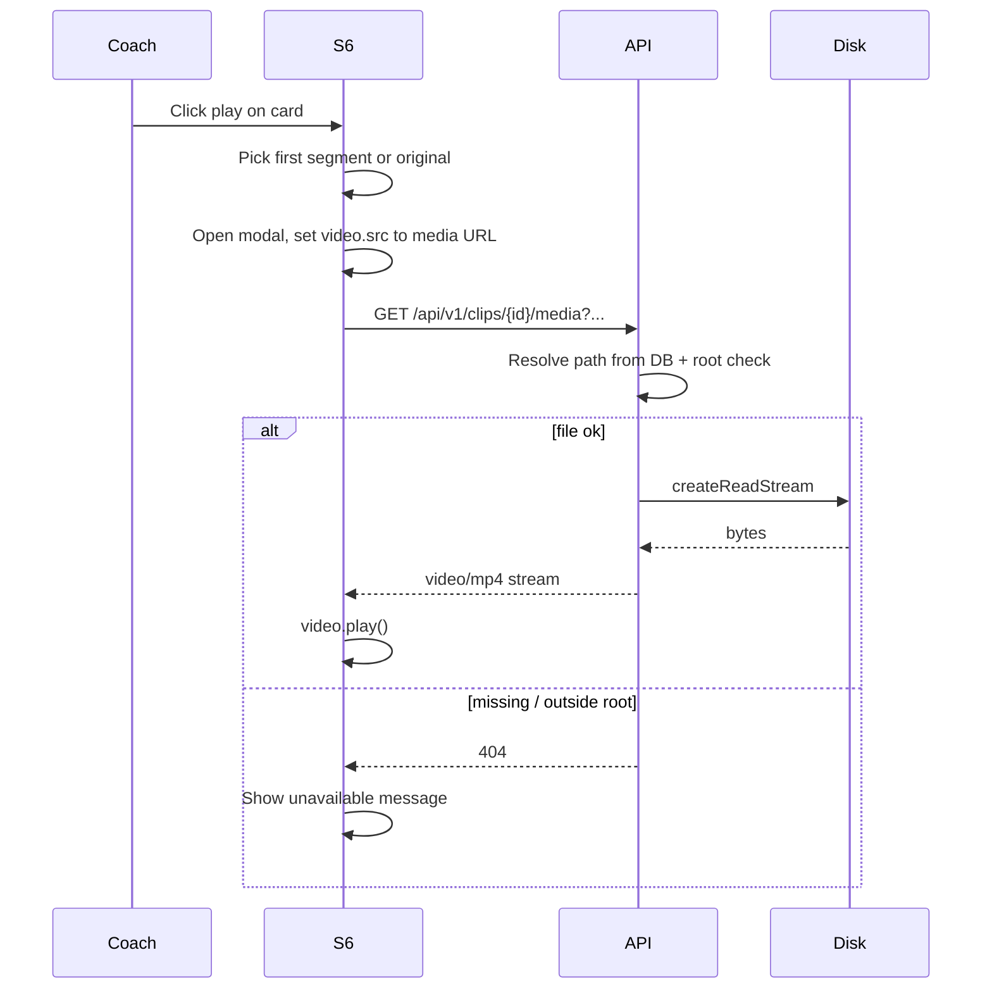

# Feature 030 — S6 Play Icon Plays First Segment

## Goal Capsule

- **Objective:** On S6 assessment cards, clicking the play icon opens an in-page modal and autoplays the clip’s **first segment** (lowest `segment_index`). If the clip has no segments, play the **original** upload instead. If neither file exists, show a short unavailable message.
- **Authority:** Resolve media only via `clipId` (+ optional segment index) from DB paths under `getVideoRoot()`; stream over a new mockup API media route. Reuse existing S7/S8 `.modal` patterns for the player shell.
- **Done when:** Play is clickable; modal shows `<video>` with a URL that streams the first segment (or original); path traversal is blocked; Playwright covers open/close and src selection; thumbnails remain out of scope.
- **Out:** Thumbnail generation (backlog 006); multi-segment playlist / next-segment controls; offline localStorage fake video files; hardening auth on media beyond current mockup API norms.

## Product Contract

### Summary

Wire S6’s decorative play control to a modal video player that streams the first processed segment, falling back to the original clip file when no segments exist.

### Problem Frame

S6 cards show a ▶ play affordance that does nothing. Feature 025 already stores originals and segments under `c:/vantageiq_videos` and returns filesystem `path` / `segments[]` on `GET /clips`, but the browser cannot play those paths and no HTTP media route exists.

### Actors

- A1. **Coach** — on S6, clicks play on a result card to watch the assessed (or original) video without leaving the list.

### Key Flows

- F1. Clip has ≥1 segment → play opens modal → streams segment with lowest `index` → autoplay starts (browser policy permitting).
- F2. Clip has 0 segments but has an original `path` → same modal streams the original.
- F3. Neither segment nor original is available on disk / in DB → modal (or inline notice) explains video is unavailable; no broken `<video>`.
- F4. Close modal (backdrop / close control / Escape) stops playback and clears the source.

### Acceptance Examples

- AE1. Complete clip with segments → play → modal video `src` targets the media URL for that clip’s first segment; playback can start.
- AE2. Submitted / in-progress clip with original only → play → modal uses original media URL.
- AE3. Clip with no resolvable file → play → unavailable message; no arbitrary file fetch.
- AE4. Closing the modal stops the video (no audio continuing in the background).

### Requirements

- R1. Play control on each S6 card must be activatable (button/role, keyboard-reachable) and scoped to that card’s clip.
- R2. Prefer first segment by ascending `segment_index` / `segments[0]` after sort; if `segments` is empty, use clip original `path`.
- R3. Browser must load video via an **HTTP media URL**, not a filesystem path. Do not put absolute Windows paths in `<video src>`.
- R4. Media route resolves files **only** from DB (`clip_segments` or `clips.video_storage_path`) for a given `clipId` (+ optional segment index); reject paths outside `getVideoRoot()`.
- R5. Stream `video/mp4` (prefer `fs.createReadStream`; support Range if cheap / needed for scrubbing).
- R6. In-page modal with autoplay attempt; close stops and clears media.
- R7. Thumbnail / poster frame generation is out of scope (backlog 006).

### Scope Boundaries

#### In scope

- New media stream route on `scripts/serve-mockup.js` (helper under `scripts/video-processing/` if useful)
- `docs/ux/mockup/S6-assessment-list.html` play wiring + modal
- Light CSS in `docs/ux/mockup/style/site.css`
- Client URL helper in `docs/ux/mockup/js/mockup-api-client.js` if needed
- `docs/ux/mockup/API-Mockup-Mapping.md`
- `tests/playwright/s6-assessment-list.spec.js` (+ optional API/integration test for path containment)

#### Out of scope

- S6 card thumbnails (006)
- Playing every segment in sequence / segment picker
- Changing ffmpeg segmentation
- Offline seed binary video files in localStorage

#### Deferred to Follow-Up Work

- Auth-gated media URLs if mockup APIs gain real auth
- Dedicated player page alternative (rejected for this plan)

## Planning Contract

### Product Contract preservation

N/A (ce-plan-bootstrap). Confirmed: modal + original fallback.

### Assumptions

- `GET /clips` already returns `segments: [{ index, path }]` ordered by `segment_index` and original `path` (Feature 025).
- Playwright can assert modal + `video` src URL shape using route fulfillment or a tiny fixture; full ffmpeg-produced files are not required in CI.
- Autoplay may be blocked by some browsers without user gesture — click-to-open **is** the user gesture; call `video.play()` from the click handler.

### Key Technical Decisions

- KTD1. **Media URL by id, not raw path** — e.g. `GET /api/v1/clips/{clipId}/media?segment=first|original|{index}` (exact shape left to implementer; client encodes first-segment vs original per KTD2). Server looks up DB path, verifies under `getVideoRoot()`, streams file.
- KTD2. **Client selects source** — if `clip.segments.length > 0`, request first segment; else request original. Server still validates existence; 404 → unavailable UI.
- KTD3. **Modal pattern** — reuse `.modal` / `.modal.open` from S7/S8; one shared player modal on S6, not per-card modals.
- KTD4. **Offline mode** — when `__USE_MOCK_LOCAL__` and no backend, play shows unavailable (or skip) unless a media URL can be built; do not invent fake filesystem paths. Prefer Playwright tests that enable backend mode or stub `fetch`/route the media URL.

### High-Level Technical Design

### Risks & Dependencies

- Absolute `path` already in JSON is a disclosure concern; media route must not accept client-supplied paths.
- Large files: never `readFile` entire MP4 into memory.
- Early-stop processing may yield fewer segments — still use lowest index; else original.
- CI without `DATABASE_URL` / video root: rely on stubs for UI tests; optional integration test when DB + fixture file present.

## Implementation Units

### U1. Stream media for clip segment or original

- **Goal:** Add a safe HTTP route that streams the first segment or original MP4 for a clip id.
- **Requirements:** R3–R5, AE1–AE3
- **Dependencies:** None
- **Files:**
  - Modify: `scripts/serve-mockup.js`
  - Optional create/modify: `scripts/video-processing/` helper (resolve media path + root check)
  - Optional test: `apps/api/tests/integration/video-processing/` (path containment / 404)
  - Modify: `docs/ux/mockup/API-Mockup-Mapping.md`
- **Approach:** Implement `GET` under `/api/v1/clips/{clipId}/…` that (1) loads clip + segments from DB, (2) chooses segment by index or original when none / when query asks for original, (3) `path.resolve` + ensure under `getVideoRoot()`, (4) `fs.createReadStream` with `Content-Type: video/mp4` (Range optional but preferred). Never take a filesystem path from the query string.
- **Patterns to follow:** `listSegmentsForClips` / `toClipResponse`; `isInsideRoot` style checks on mockup static files; `getVideoRoot()` from `scripts/video-processing/config.js`.
- **Test scenarios:**
  - Happy: clip with segment row → 200 + video/mp4 body (or stream headers).
  - Happy: clip with no segments but original path → streams original.
  - Error: unknown clipId → 404.
  - Error: path outside video root (if injectable in test) → 404/403, not file contents.
- **Verification:** Manual curl/fetch against a known processed clip; integration assertion if fixture available.

### U2. S6 play modal + autoplay wiring

- **Goal:** Clicking play opens a modal and plays the selected media URL.
- **Requirements:** R1–R2, R6, AE1–AE4
- **Dependencies:** U1 (URL contract)
- **Files:**
  - Modify: `docs/ux/mockup/S6-assessment-list.html`
  - Modify: `docs/ux/mockup/style/site.css`
  - Optional: `docs/ux/mockup/js/mockup-api-client.js` (`clipMediaUrl(clipId, options)` helper)
- **Approach:** Add `data-testid="clip-play-button"` on the play control with `data-clip-id`. On click (stop card bubbling), compute media URL from clip’s `segments` / fallback flag, open shared modal, set `<video controls autoplay>`, call `play()`. On close, `pause()`, clear `src`, load(). Show unavailable copy when URL cannot be built or media errors.
- **Patterns to follow:** S7/S8 modal open/close; S6 card render loop status badges.
- **Test scenarios:** Covered in U3.
- **Verification:** Manual play on a processed clip in backend mode.

### U3. Playwright coverage for play modal

- **Goal:** Lock play → modal → correct media src (and close stops playback intent).
- **Requirements:** AE1, AE2, AE4
- **Dependencies:** U1, U2
- **Files:**
  - Modify: `tests/playwright/s6-assessment-list.spec.js`
- **Approach:** Prefer stubbing `GET /api/v1/clips` to return one clip with `segments: [{ index: 0, path: '…' }]` and route-fulfilling the media URL with a tiny valid mp4 (or 200 empty with correct content-type if play() isn’t asserted). Assert play button visible, click opens modal (`data-testid="clip-player-modal"`), `video` src matches first-segment media URL; second case with empty `segments` + `path` uses original media URL; close hides modal.
- **Execution note:** Do not require real `C:\vantageiq_videos` files in CI; stub network.
- **Test scenarios:**
  - Happy: Covers AE1. Stubbed clip with segment → play → modal visible → video src contains clip id and first-segment indicator.
  - Happy: Covers AE2. Stubbed clip with no segments → video src requests original.
  - Edge: Covers AE3. Stubbed clip with neither → unavailable message (or play disabled).
  - Integration: Covers AE4. Close modal → modal hidden; video paused or src cleared.
- **Verification:** `npx playwright test tests/playwright/s6-assessment-list.spec.js` passes.

## Verification Contract

- Playwright S6 suite green with new play/modal cases.
- Spot-check against a real processed clip when `DATABASE_URL` + video root are available: play opens and video moves.
- Confirm media route rejects path-query / traversal attempts.

## Definition of Done

- R1–R7 and AE1–AE4 satisfied.
- U1–U3 complete; no thumbnail work.
- API mapping documents the media route and S6 play behavior.
- Fallback to original when no segments is implemented and tested.

## Appendix

### Sources & Research

- Confirmed scope: modal + original fallback (user option 2).
- Local: `GET /clips` already returns `path` + `segments`; no stream route; S6 play is decorative; S7/S8 modals exist; Feature 025 storage layout.
- External research: skipped — Node stream + HTML5 video are well-established locally.
- Institutional learnings: none on video serving.
