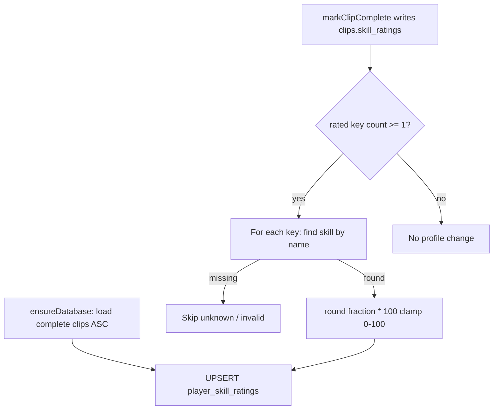

# Feature 031 — Sync Profile Skill Ratings From Video Assessments

## Goal Capsule

- **Objective:** When a clip finishes assessment with at least one skill rating, write those ratings into `player_skill_ratings` for that player. Retroactively apply the same rule to existing complete clips so every player’s profile reflects the **most recent** complete clip that rated each skill.
- **Authority:** Clip JSON `skill_ratings` (name → 0–1) is the source; profile rows use `skill_id` + 0–100. Overwrite on conflict. Skip unknown skill names. Do not clear skills the clip did not rate.
- **Done when:** New completes upsert matching catalog skills; one-shot backfill leaves each (player, skill) at the latest complete clip’s value; unit tests cover scale/map/skip/gate and backfill ordering; S2/S5 continue to read profile ratings unchanged.
- **Out:** Assessor attribution, rating history, offline mockup bridge, inventing skills not in `skills`, averaging or fill-nulls-only policies.

---

## Product Contract

### Summary

Bridge completed video assessments into the player’s profile skill ratings so S2/S5 show the latest video-derived scores, including a one-time catch-up for clips already marked complete.

### Problem Frame

Video processing stores ratings on `clips.skill_ratings` (display-name keys, 0–1 fractions). Profile ratings live in `player_skill_ratings` (`skill_id`, 0–100 integers) and are only written today by coach PUT on S5. Completing an assessment never updates the profile, so coaches see video scores on S6 but not on the player dashboard skill section—and historical completes never backfilled.

### Actors

- A1. **Coach** — expects S2 Skill Ratings to reflect recent video assessment outcomes for catalog skills.
- A2. **System (video pipeline)** — after a successful complete (and once for historical completes), syncs ratings into the profile store.

### Key Flows

- F1. Clip processing succeeds with ≥1 rated skill whose names match `skills` → those profile rows are upserted (0–100); unmatched names skipped.
- F2. Clip completes with empty `{}` or zero rated skills → profile unchanged.
- F3. Later clip rates the same skill again → profile overwritten with the newer clip’s value.
- F4. Startup/backfill walks existing `complete`/`assessed` clips oldest→newest → final profile state equals most recent complete clip per skill.
- F5. Clip rates only a subset of focus skills → only present keys upsert; other profile skills left alone.

### Acceptance Examples

- AE1. Complete clip `{ "Passing": 0.84 }` for a player → `player_skill_ratings` has Passing’s `skill_id` with rating `84` (or nearest integer).
- AE2. Second complete later with `{ "Passing": 0.5 }` → profile Passing becomes `50`.
- AE3. Complete with `{ "General": 0.9 }` and no `skills` row named General → no insert; no error abort of clip complete.
- AE4. Complete with `{}` → no profile writes.
- AE5. After backfill, player with older clip Passing=0.8 and newer Passing=0.6 ends at `60`; a skill only on the older clip keeps the older value.

### Requirements

- R1. After a successful `markClipComplete` with ≥1 entry in `skill_ratings`, sync those entries into `player_skill_ratings` for the clip’s `player_id`.
- R2. Convert each value with integer percent semantics (`round(fraction * 100)`, clamped to 0–100).
- R3. Resolve keys via case-insensitive match on `skills.name` (same idea as `findSkillByName`); skip unknowns; log skip.
- R4. Upsert overwrites existing profile rating for that `(player_id, skill_id)`; never DELETE skills absent from this clip’s payload.
- R5. Gate: zero rated keys → no sync call side effects on profile.
- R6. Retroactive backfill: for all players with complete/assessed clips, apply ratings so each skill reflects the **most recent** complete clip that rated it (confirmed: chronological upsert ASC by completion time).
- R7. Do not change S2/S5 UI contracts; they already read `player_skill_ratings`.

### Scope Boundaries

#### In scope

- New video-processing helper (sync + backfill), modeled on `reconcilePlayerClipStats`
- Hook after successful complete in `scripts/video-processing/process-clip.js`
- Idempotent backfill invocation from mockup `ensureDatabase` (and/or a thin migration note if the repo expects numbered SQL companions)
- Unit/integration tests under `apps/api/tests/integration/video-processing/`

#### Out of scope

- Assessor / who-rated metadata (`docs/backlog/010-skill-assessment-assessor.md`)
- Assessment history / audit of prior values (`docs/backlog/012-skill-rating-assessment-history.md`)
- Offline `mockup-api-client.js` bridge from clip ratings → `playerSkillRatings`
- Creating new `skills` rows for unknown focus labels
- Changing coach PUT validation or S5 edit UX
- Averaging multiple clips or fill-nulls-only

#### Deferred to Follow-Up Work

- Offline parity for demo mode without Postgres
- Restricting video upserts to skills in the player’s position set (today coach PUT enforces that; video may write catalog skills outside the position list—S2 still only *displays* position-scoped skills)

---

## Planning Contract

### Product Contract preservation

Bootstrap from user confirmation (option 1); no upstream brainstorm file.

### Assumptions

- Clip `skill_ratings` keys are skill-focus **display names**; values are 0–1 fractions as produced by `process-clip` / Ollama normalize.
- `skills.name` UNIQUE + case-insensitive lookup is sufficient mapping.
- Statuses `complete` and `assessed` both count as finished assessments for backfill (same as clip-stats reconcile).
- Ordering key: `processing_completed_at` ascending, with a documented fallback (`updated_at` / `created_at`) when null on older rows.
- Overwriting coach-entered ratings for the same skill is intentional product behavior for this feature.

### Key Technical Decisions

- KTD1. **Overwrite with this clip’s present keys** on live complete; do not recompute the player’s full skill set from all clips on every complete (cheaper; matches “latest clip wins” for skills this clip rated).
- KTD2. **Backfill = chronological ASC upsert** over complete/assessed clips so last write per skill is the most recent clip—same end state as “pick max completion time per skill,” simpler to implement and re-run.
- KTD3. **Self-contained helper in `scripts/video-processing/`** with its own name→id query and upsert SQL mirroring `upsertSkillRatings` / `findSkillByName`, avoiding a require cycle into `serve-mockup.js`.
- KTD4. **Scale at the boundary:** `Math.round(value * 100)` then clamp 0–100 before INSERT; never store 0–1 fractions in `player_skill_ratings`.
- KTD5. **Skip + log unknown names**; never invent skills; clip complete must still succeed if sync skips all keys.
- KTD6. **Backfill from `ensureDatabase`** (idempotent re-run OK) because the transform needs JSONB key iteration in JS. Skip a numbered SQL migration unless a separate API migration runner must record the change; logic stays in JS.
- KTD7. **Sync failure after complete: log and continue** — do not flip the clip to failed or roll back `skill_ratings` on the clip; assessment result stays durable even if profile upsert fails.

### High-Level Technical Design

### Risks & Dependencies

- **Coach overwrite:** Video sync uses the same ON CONFLICT update as S5; manual ratings for that skill are replaced—accepted.
- **Orphan profile rows:** Skills outside the player’s position set may be stored but not shown on S2 until deferred follow-up.
- **Partial early-stop ratings:** Only keys present in JSON sync—correct per R4.
- **Scale bug:** Writing 0.84 into SMALLINT would be wrong; tests must lock percent conversion.
- **Backfill volume:** POC clip counts are small; full-table chronological walk is fine.

### Alternative Approaches Considered

- Fill-nulls-only / average — rejected by user (option 1 = overwrite latest).
- Pure SQL migration for backfill — rejected; JSONB key→skill_id mapping is clearer in JS beside the live path.

---

## Implementation Units

### U1. Sync helper + post-complete hook

- **Goal:** After a successful complete with ≥1 rating, upsert catalog-matched skills onto the player profile at 0–100.
- **Requirements:** R1–R5, AE1–AE4
- **Dependencies:** None
- **Files:**
  - Create: `scripts/video-processing/sync-player-skill-ratings-from-clip.js` (name flexible; keep beside reconcile)
  - Modify: `scripts/video-processing/process-clip.js` — call sync after successful `markClipComplete` (not on fail path)
- **Approach:** Export something like `syncPlayerSkillRatingsFromClip(pool, { playerId, skillRatings })`. If no ratings object or zero keys, return early. For each entry: resolve skill by `LOWER(name)`; on miss log and continue; on hit upsert rating. Call only on the success path after complete (before or after `reconcilePlayerClipStats` in `finally` is fine as long as fail path does not sync). Prefer calling explicitly after successful complete so failed clips never write ratings.
- **Patterns to follow:** `reconcile-player-clip-stats.js` module shape; `findSkillByName` / `upsertSkillRatings` SQL semantics in `scripts/serve-mockup.js`.
- **Test scenarios:** Covered primarily in U3; smoke via process-clip success path if a thin integration already exists.
- **Verification:** Completing a clip with known skill names updates `player_skill_ratings`; unknown-only payload leaves table unchanged.

### U2. Retroactive backfill on database ensure

- **Goal:** Existing complete/assessed clips update profiles so each skill equals the most recent clip that rated it.
- **Requirements:** R6, AE5
- **Dependencies:** U1
- **Files:**
  - Modify: `scripts/video-processing/sync-player-skill-ratings-from-clip.js` — add `backfillPlayerSkillRatingsFromClips(pool)`
  - Modify: `scripts/serve-mockup.js` `ensureDatabase` — invoke backfill once after schema is ready
- **Approach:** Query clips with status in (`complete`, `assessed`) ordered by `processing_completed_at ASC NULLS LAST`, then stable secondary timestamp. For each row, call the same per-clip sync with that clip’s `player_id` + `skill_ratings`. Idempotent: re-running yields the same end state. Do not delete profile skills that never appear in any clip. No new SQL migration file by default (KTD6).
- **Patterns to follow:** Feature 026 birth-year backfill living in `ensureDatabase`; reconcile status lists for complete/assessed.
- **Test scenarios:** Covered in U3.
- **Verification:** Restart mockup against DB with historical completes; profile ratings match latest clip per skill.

### U3. Unit tests for sync + backfill ordering

- **Goal:** Lock scale conversion, skip/gate behavior, overwrite, and chronological backfill.
- **Requirements:** AE1–AE5, R2–R6
- **Dependencies:** U1, U2
- **Files:**
  - Create: `apps/api/tests/integration/video-processing/sync-player-skill-ratings-from-clip.spec.ts`
  - Optionally extend: `apps/api/tests/integration/video-processing/reconcile-player-clip-stats.spec.ts` patterns only (do not overload)
- **Approach:** Mock `pool.query` like reconcile tests. Cover: empty ratings no-op; fraction→percent; unknown name no upsert; two clips ASC leave latest value; single-clip sync issues expected INSERT/UPSERT SQL shape.
- **Execution note:** Prefer pure unit tests with mocked pool; no Playwright required for this backend-only bridge unless a quick S2 assertion is cheap later.
- **Test scenarios:**
  - Happy: `{ Passing: 0.84 }` → upsert with skill id for Passing and rating 84.
  - Edge: `{ Passing: 1.2 }` or negative → clamped to 0–100 after scale.
  - Edge: `{}` or null → zero profile writes.
  - Edge: `{ General: 0.9 }` with no skill row → no upsert; no throw.
  - Integration/backfill: older Passing 0.8 then newer 0.6 → final 60; skill only on older clip remains from older.
  - Error path: sync/DB failure after complete → log + continue (KTD7); clip remains `complete`.
- **Verification:** Vitest file green under the video-processing integration suite.

---

## Verification Contract

- Vitest: new sync/backfill spec green.
- Manual/DB: after mockup restart, a player with prior complete clips shows matching S2 skill ratings for catalog skills those clips rated; process a new clip and confirm overwrite for overlapping skills.
- No requirement to change Playwright S2 skill-rating specs unless a regression appears.

## Definition of Done

- R1–R7 and AE1–AE5 satisfied.
- U1–U3 complete.
- Live complete path and ensureDatabase backfill both use the same conversion/upsert rules.
- Unknown skill names never block clip completion.
- Assessor/history/offline explicitly still out of scope.

## Appendix

### Sources & Research

- Confirmed product scope: overwrite latest; retroactive most-recent-per-skill (user option 1).
- Local: `markClipComplete` / ratings shape in `scripts/video-processing/process-clip.js`; `upsertSkillRatings` + `findSkillByName` in `scripts/serve-mockup.js`; `reconcile-player-clip-stats.js` side-effect pattern; migration 018 `player_skill_ratings`; latest migration 022.
- Institutional learnings: none for this sync path.
- Related backlog (not in this plan): `docs/backlog/010-skill-assessment-assessor.md`, `docs/backlog/012-skill-rating-assessment-history.md`.
