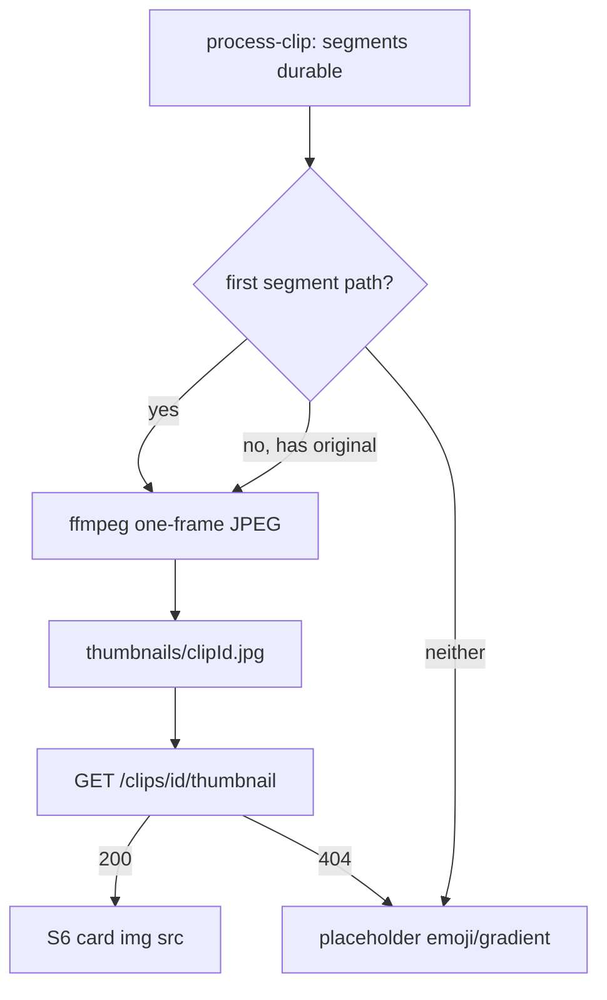

# Feature 032 — S6 Video Thumbnail on Assessment Cards

## Goal Capsule

- **Objective:** Each S6 assessment card shows a **poster thumbnail** of that clip’s video so coaches can recognize clips at a glance without opening play.
- **Authority:** Generate a durable JPEG at process time under `{videoRoot}/thumbnails/{clipId}.jpg` from the **first segment** (else original). Serve via `GET /api/v1/clips/{id}/thumbnail` (path under `getVideoRoot()` only). S6 cards load that URL in the existing `.result-thumbnail` slot; offline keeps the current gradient/emoji placeholder.
- **Done when:** Processed clips with a resolvable video produce a thumbnail file; S6 shows the image (play control still on top); missing thumb falls back to the existing placeholder; Playwright covers present/missing poster; API-Mockup-Mapping documents the route.
- **Out:** On-demand ffmpeg per card; DB `thumbnail_path` column; S3 cold storage; changing which segment is “first” beyond play’s rule; offline binary seed images.

---

## Product Contract

### Summary

Show a video poster on each S6 result card, generated once during clip processing and loaded over HTTP, with the existing decorative tile as fallback when no poster exists.

### Problem Frame

S6 cards already have a `.result-thumbnail` media rail, but it only shows a decorative emoji. Feature 025 stores originals/segments and Feature 030 streams video in a modal; coaches still cannot visually distinguish clips in the list without playing them. Backlog `docs/backlog/006-s6-video-thumbnail.md` deferred this from plan 010.

### Actors

- A1. **Coach** — scans S6 assessment cards and uses thumbnails to recognize clips before clicking play.

### Key Flows

- F1. Clip processing completes with ≥1 durable segment → write `thumbnails/{clipId}.jpg` from first segment frame → S6 card `` loads thumbnail URL.
- F2. Clip has original but no segments when thumbnail is generated (or generation uses original fallback) → poster from original.
- F3. Thumbnail file missing / generation failed → card keeps gradient + emoji (or empty poster) and play still works.
- F4. Offline / no backend thumbnail → same placeholder as today; play behavior unchanged.

### Acceptance Examples

- AE1. After a successful process that produced segments, S6 card for that clip shows an `` (or equivalent) whose `src` is the clip thumbnail HTTP URL; play button remains usable.
- AE2. Clip with no thumbnail file on disk → card still renders with the non-image placeholder; no broken-image chrome that blocks play.
- AE3. Thumbnail route rejects paths outside the video root and returns 404 when the JPEG is absent.
- AE4. Offline mode S6 cards still show the decorative thumbnail area without requiring real image files.

### Requirements

- R1. Generate a durable JPEG poster during (or immediately after successful) video processing, not on each S6 list paint.
- R2. Poster source order matches play: **first segment** by ascending index; if none, **original** upload.
- R3. Store at convention path `{getVideoRoot()}/thumbnails/{clipId}.jpg` (no new DB column by default).
- R4. Expose `GET /api/v1/clips/{clipId}/thumbnail` that streams `image/jpeg` only if the file exists under the video root; otherwise 404.
- R5. S6 `.result-thumbnail` shows the poster when available; keep play control (`data-testid="clip-play-button"`) overlaid and functional.
- R6. Thumbnail generation failure must **not** fail clip completion (log and continue), same spirit as skill-rating sync side effects.
- R7. Offline mockup keeps placeholder; do not invent fake filesystem thumbnail paths in seed data.

### Scope Boundaries

#### In scope

- `scripts/video-processing/config.js` — thumbnails dir helper
- `scripts/video-processing/ffmpeg-utils.js` (or sibling) — one-frame extract helper
- `scripts/video-processing/process-clip.js` — write poster after durable segment/original is known
- `scripts/video-processing/clip-media.js` (or sibling) — resolve + stream thumbnail
- `scripts/serve-mockup.js` — route wiring
- `docs/ux/mockup/S6-assessment-list.html` — img in `.result-thumbnail`
- `docs/ux/mockup/style/site.css` — object-fit / fallback if needed
- `docs/ux/mockup/js/mockup-api-client.js` — `clipThumbnailUrl(clipId)` helper when backend mode
- `docs/ux/mockup/API-Mockup-Mapping.md`
- `tests/playwright/s6-assessment-list.spec.js`
- Optional unit test for path resolve / containment

#### Out of scope

- On-demand generation at request time
- DB column for thumbnail path
- Backfill script for all historical clips as a hard requirement (nice-to-have; see deferred)
- Skill-linked “best action” segment as poster source (`docs/backlog/005-skill-linked-player-action-segments.md`)
- S3 cold storage (`docs/backlog/014-s3-cold-storage-for-videos.md`)

#### Deferred to Follow-Up Work

- One-shot backfill of posters for already-complete clips (can call the same extract helper from `ensureDatabase` or a small script)
- Poster from a smarter segment once skill-linked segments exist

---

## Planning Contract

### Product Contract preservation

Bootstrap from backlog 006 + user confirmation (option 1).

### Assumptions

- First frame (`t≈0` or first extracted JPEG) is an acceptable poster for the POC.
- Convention path is enough; list API need not embed absolute FS paths for images (HTTP URL by clip id only).
- Auth on thumbnail route follows the same mockup norms as the media route (Feature 030).

### Key Technical Decisions

- KTD1. **Process-time generation** — avoids N ffmpeg spawns when S6 loads many cards; reuses pipeline that already has ffmpeg and knows first segment vs original.
- KTD2. **Convention path, no migration** — `{root}/thumbnails/{clipId}.jpg`; existence check at serve time.
- KTD3. **HTTP thumbnail route** — mirror `…/media` pattern; never put Windows FS paths in ``.
- KTD4. **Source order = play** — first segment else original (aligns with Feature 030 and backlog 005 until smarter segments exist).
- KTD5. **Fail soft** — poster write errors log only; clip still completes.
- KTD6. **Offline placeholder** — keep CSS gradient + emoji; no required offline image assets.

### High-Level Technical Design

### Risks & Dependencies

- ffmpeg must be available at process time (already required for assessment).
- Large S6 lists: many image GETs — acceptable for POC; ensure 404s are cheap.
- Incomplete clips never get posters until (re)processed — expected; deferred backfill covers history.
- Restart mockup server after route changes (same class of issue as Feature 030 media).

---

## Implementation Units

### U1. Generate durable thumbnail during process-clip

- **Goal:** After durable first segment (or original) is known on a successful process path, write `{videoRoot}/thumbnails/{clipId}.jpg`.
- **Requirements:** R1–R3, R6
- **Dependencies:** None
- **Files:**
  - Modify: `scripts/video-processing/config.js` — `getThumbnailsDir` / `ensureThumbnailPathForClip`
  - Modify: `scripts/video-processing/ffmpeg-utils.js` — one-frame extract helper (directional: `-frames:v 1` from input path)
  - Modify: `scripts/video-processing/process-clip.js` — call after segments saved / before or after `markClipComplete`; try/catch log-only
- **Approach:** Prefer first segment file under `segments/{clipId}/`; else `videoStoragePath`. Write JPEG outside the temp frames dir so cleanup does not delete it. Overwrite on reprocess.
- **Patterns to follow:** `ensureSegmentsDirForClip`; existing `runCommand(ffmpeg, …)` in `ffmpeg-utils.js`; skill-rating sync fail-soft try/catch.
- **Test scenarios:** Covered in U3 (unit or integration for extract path / process hook if practical); otherwise verified via file existence in U2/U3 Playwright with routed fixture.
- **Verification:** Processing a clip with a real/local sample produces `thumbnails/{clipId}.jpg`.

### U2. Thumbnail HTTP route + S6 card wiring

- **Goal:** Serve the JPEG by clip id; S6 cards display it in `.result-thumbnail` with play overlay intact.
- **Requirements:** R4, R5, R7, AE1–AE4
- **Dependencies:** U1
- **Files:**
  - Modify: `scripts/video-processing/clip-media.js` (or small sibling) — resolve convention path + containment check; stream image
  - Modify: `scripts/serve-mockup.js` — `GET /api/v1/clips/{id}/thumbnail`
  - Modify: `docs/ux/mockup/js/mockup-api-client.js` — `clipThumbnailUrl(clipId)` for backend mode
  - Modify: `docs/ux/mockup/S6-assessment-list.html` — `` inside `.result-thumbnail`; `onerror` hide img / keep placeholder
  - Modify: `docs/ux/mockup/style/site.css` — `object-fit: cover` on poster if needed
  - Modify: `docs/ux/mockup/API-Mockup-Mapping.md`
- **Approach:** Resolve `{root}/thumbnails/{clipId}.jpg`; 404 if missing or outside root. Card always includes img when in backend mode (or always with URL helper); onerror falls back to emoji. Do not change play modal wiring.
- **Patterns to follow:** Feature 030 media route + `isPathUnderVideoRoot`; S6 play button overlay CSS.
- **Test scenarios:** Covered in U3.
- **Verification:** Manual: complete clip shows poster; play still opens modal.

### U3. Playwright (+ light unit) coverage

- **Goal:** Lock poster presence, fallback, and non-regression of play.
- **Requirements:** AE1–AE4
- **Dependencies:** U2
- **Files:**
  - Modify: `tests/playwright/s6-assessment-list.spec.js`
  - Optional: `apps/api/tests/integration/video-processing/` unit for path resolve / missing file
- **Approach:** Offline: assert placeholder / no required img, or route-fulfill a fake JPEG for one card and assert `clip-thumbnail` visible. Backend-oriented: stub `**/api/v1/clips/*/thumbnail` 200 vs 404. Keep existing play-modal tests green.
- **Execution note:** Prefer route fulfillment so tests do not depend on real ffmpeg output in CI.
- **Test scenarios:**
  - Happy: fulfilled 200 JPEG → `[data-testid="clip-thumbnail"]` visible on a card; play button still present.
  - Edge: thumbnail 404 / onerror → placeholder still visible; play still works.
  - Integration: existing play modal test still passes with thumbnail markup present.
- **Verification:** `npx playwright test tests/playwright/s6-assessment-list.spec.js` green.

---

## Verification Contract

- Playwright S6 suite green including new thumbnail cases.
- Spot-check: process a clip → file under `thumbnails/` → S2/S6 list shows poster; play still works.
- Restart mockup after implementing the new route before manual checks.

## Definition of Done

- R1–R7 and AE1–AE4 satisfied.
- U1–U3 complete.
- Backlog `docs/backlog/006-s6-video-thumbnail.md` marked `planned` with link to this plan (then `done` after ship).
- No DB migration required; no offline seed binary images required.

## Appendix

### Sources & Research

- Origin: `docs/backlog/006-s6-video-thumbnail.md`; confirmed process-time option 1.
- Related: Feature 025 durable originals/segments; Feature 030 play/media (thumbnails were out of scope there).
- Local: `.result-thumbnail` in `S6-assessment-list.html`; `clip-media.js`; `ffmpeg-utils.extractSegmentFrames` (temp only); `config.getVideoRoot`.
- Institutional learnings: none specific to thumbnails.
