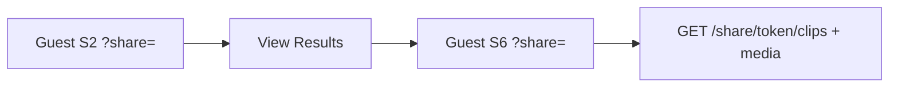

# Feature 035 — Guest Share → S6 (Player-Scoped)

## Goal Capsule

- **Objective:** From a guest S2 share link, **View Results** opens `S6-assessment-list.html` with the same share token so the guest can list and **play** videos **only for that shared player** — still read-only, no login.
- **Authority:** Reuse Feature 034 share token + share-scoped clip/media (and thumbnail) APIs. Do not trust free `playerId` as authority; S6 guest loads clips via `listClipsByShareToken` / share media URLs. Filters locked to the bound player.
- **Done when:** Guest View Results → S6 shows that player’s clips and play works; team/player filters inert/locked; write/nav CTAs inert; coach S6 without `share` unchanged; Playwright + mapping updated.
- **Out:** Guest S1/club; social buttons; new share create UX; locking down world-readable legacy `/clips/*/media` (still deferred).

---

## Product Contract

### Summary

Guests who hold a player share link can open Assessment List (S6) for that player only, browse results, and play videos — without broadening access to other players or write actions.

### Problem Frame

Feature 034 shipped guest S2 with Video Assessments + play, but **View Results** is inert and guest S6 was explicitly out of scope. Guests still need the full results list surface (S6 cards, comments, play modal) without coach login.

### Actors

- A1. **Guest** — holder of a valid share token; read-only S2 + S6 for the bound player.
- A2. **Coach / SystemAdmin** — unchanged editor share create/revoke; S6 without `share` unchanged.

### Key Flows

- F1. Guest on `S2-player-dashboard.html?share=<token>` → clicks **View Results** → `S6-assessment-list.html?share=<token>` (+ optional playerId/name/teamName for labels) → Pre-Selected Player on and locked.
- F2. Guest on S6 lists clips via share-scoped API; play and thumbnails use share-scoped URLs.
- F3. Guest **Back** (to S2) keeps `share` so they return to the guest dashboard.
- F4. Invalid/revoked `share` on S6 → same closed failure as guest S2 (no coach fallback list).
- F5. Signed-in coach S6 without `share` behaves as today.

### Acceptance Examples

- AE1. Guest View Results opens S6; only the shared player’s clips appear; play works in the S6 modal.
- AE2. Guest cannot change team/player filters to see another player’s clips.
- AE3. Revoked share → S6 shows unavailable notice; no clip list from offline/coach fallback.
- AE4. Coach opens S6 without `share` → full existing filter/play behavior.

### Requirements

- R1. Guest **View Results** is active (not inert) and navigates to S6 carrying the share token.
- R2. Guest S6 shows assessments for the **bound player only** and allows **play**.
- R3. Guest S6 locks Pre-Selected Player / team-status filter UI so guests cannot broaden scope in the UI.
- R4. Guest write/capture/nav destinations on S6 stay visible but inert (same posture as guest S2).
- R5. Guest S6 Back returns to guest S2 with the same `share` token.
- R6. Document in `docs/ux/mockup/API-Mockup-Mapping.md`; extend Playwright coverage.

### Scope Boundaries

#### In scope

- S2 guest View Results href + stop inert on that control
- S6 guest mode (`?share=`) using existing share clip/media/thumbnail APIs
- Optional client helper for share thumbnail URL if S6 posters need it
- Lock filters / inert write chrome on guest S6
- Back → guest S2 with share
- Tests + mapping; backlog 007 note that S6 guest view is Feature 035

#### Out of scope

- Creating share links from S6
- Guest access to S1 / club / capture upload
- Changing editor share create/revoke model (034)
- Global lockdown of unauthenticated clip media routes

#### Deferred to Follow-Up Work

- Direct editor-issued “share S6 only” URL without visiting S2 (S6 already accepts `?share=` once built; separate product UX can come later)

---

## Planning Contract

### Assumptions

- Feature 034 share APIs (`GET /share/{token}/clips`, `/media`, `/thumbnail`, `/dashboard`) remain the data path — no new share table.
- Opening `S6-assessment-list.html?share=<token>` alone is supported (View Results uses it); resolving player identity for labels can use share dashboard or first clip payload.
- Bottom-nav My Clips stays inert for guests (no open club-wide S6); primary path is View Results.

### Key Technical Decisions

- KTD1. **Carry `share` in query** — `S6-assessment-list.html?share=<token>&playerId=&playerName=&teamName=` from guest View Results; `share` is required for guest S6 authority.
- KTD2. **Share-scoped data only in guest mode** — `MockupApi.listClipsByShareToken` + `clipMediaUrlForShare` (+ thumbnail share URL if posters used); never call open `listClips` / `clipMediaUrl` while `share` is present.
- KTD3. **Lock filters** — Pre-Selected Player checked, control disabled/inert; team/status selects disabled or ignored when building guest filters.
- KTD4. **Fail closed** — invalid/revoked share → notice, empty list; no offline store fallback for guest S6.
- KTD5. **Back preserves share** — S6 Back link to `S2-player-dashboard.html?share=<token>` (and player query if useful for labels).

### High-Level Technical Design

### Risks & Dependencies

| Risk | Mitigation |
|------|------------|
| Guest accidentally uses open `/clips` media | Gate all S6 media/list calls on `share` present → share helpers only |
| Filter UI still mutates list | Disable handlers + ignore select changes in guest mode |
| Depends on 034 | Confirm share create/list/media work before UI wiring |

### Sources & Research

- Origin ask + Feature 034 plan/backlog 007
- Local: `S2-player-dashboard.html` (View Results currently `makeInert`); `S6-assessment-list.html` (playerId deep-link + play modal); share client helpers in `mockup-api-client.js`

---

## Implementation Units

### U1. Guest S2 → S6 View Results with share

**Goal:** Enable View Results for guests and pass `share` (plus player context params).
**Requirements:** R1, R5
**Dependencies:** None (034 already shipped)
**Files:**
- `docs/ux/mockup/S2-player-dashboard.html`
**Approach:** Build View Results href with `share` when `isGuest`; do **not** call `makeInert` on `viewResultsLink`. Keep other write CTAs inert.
**Test scenarios:** Covered in U3 Playwright (happy: guest View Results URL contains `share=`).
**Verification:** Guest View Results navigates to S6 with token; Edit/Submit remain inert.

### U2. Guest S6 mode — list, play, lock filters, Back

**Goal:** S6 operates read-only under `?share=` for the bound player only.
**Requirements:** R2, R3, R4, R5, AE1–AE4
**Dependencies:** U1
**Files:**
- `docs/ux/mockup/S6-assessment-list.html`
- `docs/ux/mockup/js/mockup-api-client.js` (add `clipThumbnailUrlForShare` if S6 posts thumbnails)
- `docs/ux/mockup/style/site.css` only if inert styling needs a shared class
**Approach:** Detect `share`. Resolve identity via `getDashboardByShareToken` (or clip list). Load clips with `listClipsByShareToken`; play/thumbnail via share URLs. Lock Pre-Selected / team / status UI. Inert Capture nav and write-like controls. Back → S2 with `share`. Fail closed on bad token.
**Execution note:** Prefer a smoke Playwright path against live backend after wiring list+play.
**Test scenarios:**
- Happy: valid share → only bound player’s cards; play opens modal with share media URL
- Edge: status filter changes do not reveal other players (list still share-scoped)
- Error: revoked/unknown share → notice, no cards
- Integration: Back returns to S2 guest dashboard for same token
**Verification:** Guest S6 scoped + playable; coach S6 without share unchanged.

### U3. Tests and API-Mockup-Mapping

**Goal:** Automated coverage and docs.
**Requirements:** R6
**Dependencies:** U1, U2
**Files:**
- `tests/playwright/s2-guest-share.spec.js` (extend) and/or `tests/playwright/s6-guest-share.spec.js`
- `docs/ux/mockup/API-Mockup-Mapping.md`
- `docs/backlog/007-guest-readonly-social-share.md` (note Feature 035 / S6 guest path)
**Approach:** Playwright: guest create→S2→View Results→S6 assert cards + play control; revoke→S6 fails. Mapping Screen rows for guest S6.
**Test scenarios:**
- Happy: F1–F3
- Error: F4
- Integration: AE4 regression smoke (coach S6 still loads without share) if cheap
**Verification:** Specs green; mapping documents guest View Results → S6.

---

## Verification Contract

- Playwright covers guest View Results → S6 list + play + locked filters + revoke fail-closed
- Coach S6 without `share` still works
- Mapping updated; backlog 007 references Feature 035 for S6 guest view
- Restart `scripts/serve-mockup.js` only if API helpers change (UI-only may not require restart)

---

## Definition of Done

- [x] U1–U3 complete with cited scenarios passing
- [x] Guest can open S6 from shared S2 and play that player’s videos only
- [x] Guest cannot broaden to other players via filters
- [x] Write/nav on guest S6 inert; Back keeps share
- [x] Coach S6 unchanged without `share`

---

## Appendix

### Product Contract preservation

New plan; extends 034 scope that previously excluded guest S6. Product Contract above supersedes 034 R1’s “S2 only” for this follow-on feature.
