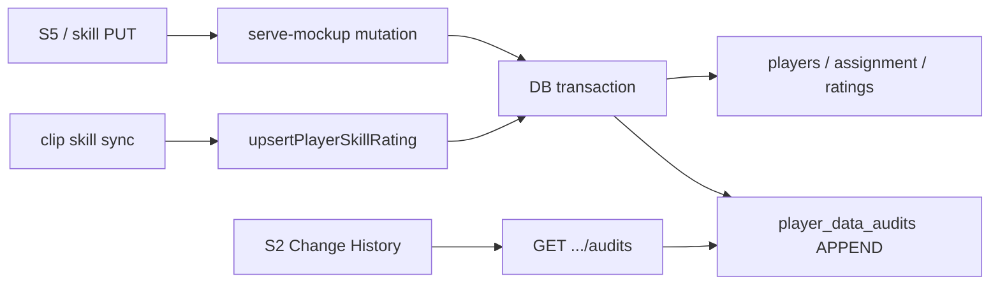

# Feature 036 — Player Data Change Audit

## Goal Capsule

- **Objective:** Persist an **append-only database** audit of **who** changed **what** and **when** for player **profile** fields, **team assignment**, and **skill ratings** (manual edits **and** automatic clip→profile skill sync), and expose a **read-only history UI** for Coach and SystemAdmin.
- **Authority:** Writes happen only as a side effect of existing authorized mutations (same coach/system paths as today). History **read** is gated like player profile access: Coach (scoped to assigned team) and SystemAdmin (any player). Guests do not see history.
- **Done when:** Manual profile/team/skill saves and clip skill sync insert audit rows with actor + timestamp + old/new; Coach/SA can open history on S2 for that player; file structured logging remains complementary only; mapping + tests cover write + read + guest hide.
- **Out:** Match-stats field audit; clip/media lifecycle events; guest-share events; file-only history store; rewriting past ratings on current tables into backfilled history (no historical backfill required).

---

## Product Contract

### Summary

Every in-scope player-data mutation leaves a durable DB trail (actor, time, field, before/after). Coaches and admins can review that trail on the player dashboard. Auto-applied skill updates from video assessment sync are audited with a system/assessor attribution, not silently overwritten.

### Problem Frame

Profile skill ratings and other player fields change over time with no attributed history — especially painful for subjective skills. Feature 022 structured logging records coarse API events to a file and explicitly deferred DB player-data history to backlog 008. Skill sync from clips already emits file audit events but does not store who/what for profile ratings in the DB.

### Actors

- A1. **Coach** — edits players via S5 / skill APIs; views history for players in scope; appears as `actor_user_id` on manual mutations.
- A2. **SystemAdmin** — views history for any player; may appear as actor where SA mutation paths exist today or are extended for parity.
- A3. **System (clip sync)** — `syncPlayerSkillRatingsFromClip` / related upserts; audited with nullable `actor_user_id` and a stable system attribution (assessor/source), optional `clip_id`.
- A4. **Guest** — must not see audit history on shared S2.

### Key Flows

- F1. Coach saves S5 (profile and/or skills) → mutation succeeds → audit rows for changed profile fields, team assignment, and/or skill ratings.
- F2. Clip assessment completes and syncs a profile skill rating → audit row with system attribution (+ clip id when available).
- F3. Coach or SystemAdmin on S2 opens Change History → list of recent audits for that player (newest first).
- F4. Guest S2 → history control/section absent or empty fail-closed (never loads admin history API without auth).

### Acceptance Examples

- AE1. Coach changes a skill rating on S5 → history shows skill id/name, old and new rating, coach identity, timestamp.
- AE2. Clip sync overwrites a skill → history shows new value with system/clip attribution distinct from coach rows.
- AE3. Coach reassigns team on S5 → history shows previous and new team.
- AE4. Guest share view does not expose history UI or data.
- AE5. Unauthorized actor cannot list another club's player history (403/404 per existing coach scoping).

### Requirements

- R1. Append-only **DB** rows for changes to **player profile** identity fields (name, position, trend, birth month/year, avatar URL), **team assignment**, and **skill ratings**.
- R2. Each row records **actor** (user id/email or system kind), **timestamp**, **entity/field**, **old value**, **new value**; skill rows include skill identity; sync rows include source/clip when known.
- R3. Instrument **manual** mutation paths and **automatic clip→skill sync** writes.
- R4. **Read-only history UI** on S2 for Coach (scoped) and SystemAdmin; hide from guests.
- R5. Complements Feature 022 file logging — logging alone is not the history store.
- R6. Document API + S2 surface in `docs/ux/mockup/API-Mockup-Mapping.md`; mark backlog 008 planned/done appropriately.

### Scope Boundaries

#### In scope

- Migration `024_*` + `tables.sql` / `deploy.sql` / `ensureDatabase`
- Insert helper + wiring at profile PATCH, skill PUT/replace, team assignment updates on those paths, clip skill upsert/sync
- Attribute S1 create/assign team moves when `actorEmail` can be wired cheaply; otherwise only audit when actor is known (document assumption)
- `GET` history API + mockup client helper
- S2 collapsible Change History (or equivalent) read-only list
- Integration + Playwright coverage; OpenAPI note if contract file is the project convention for player routes

#### Out of scope

- Auditing `player_stats` / match time / development progress fields
- Clip create/process/media audit beyond profile skill side effects
- Guest share / revoke events
- Full historical backfill of past `updated_at` into audit rows
- Dedicated S5/S6 history UIs (S2 is enough this round)
- Replacing Feature 022 file logging

#### Deferred to Follow-Up Work

- Backlog **012** skill-only history UX refinements (assessor badges 010/011) — this feature already stores skill change rows; 012 may narrow to richer assessor metadata later rather than a second table
- Broader SystemAdmin write parity on all player PATCH/PUT paths if still Coach-only today (history **read** for SA is in scope; SA write attribution only where mutations already allow SA)

---

## Planning Contract

### Assumptions

- Next feature number is **036**; next migration is **024**.
- “Player profile” for audit = identity/assignment-adjacent columns on `players` + team assignment, **not** `player_stats` columns saved on the same PATCH.
- System attribution for sync: `actor_kind = system` (or equivalent), `actor_user_id` null, `source = clip_sync`, optional `clip_id` / assessor label string — not inventing a fake `users` row (aligns with Feature 022 background-job `userId` unset).
- No backfill of pre-feature changes.
- History list is newest-first, reasonable page size default (e.g. last 50–100); pagination polish can stay minimal.

### Key Technical Decisions

- KTD1. **Single append-only table** (e.g. `player_data_audits`) for profile, team, and skill events — one shape with `entity` / `field_key` / optional `skill_id`, rather than three tables.
- KTD2. **Write in the same DB transaction** as the mutation when the mutation already uses a client transaction; for sync upserts, insert audit immediately after successful upsert in the same connection/transaction when practical.
- KTD3. **Diff-only rows** — write an audit row only when old and new values differ (including null↔value); skip no-ops.
- KTD4. **History read gate** — Coach via existing scope helpers; SystemAdmin via `resolveSystemAdminActor` (or combined resolver). Guests never call this API.
- KTD5. **UI on S2** — new collapsible section (or footer under Skill Ratings) listing human-readable lines; Coach/SA only; reuse section collapse localStorage pattern.
- KTD6. **S1 team moves** — prefer passing `actorEmail` on create/assign client calls so team-assignment audits are attributable; if a path stays anonymous, skip audit rather than inventing an actor.

### High-Level Technical Design

### Risks & Dependencies

| Risk | Mitigation |
|------|------------|
| PATCH profile already writes stats + skills in one handler — over-auditing stats | Explicit allowlist of profile fields; ignore stats keys |
| Position change mass-replaces skill rows | Audit replace as per-skill diffs or one “position change reset” event — prefer per-skill null/value diffs for reconstructability |
| Sync fires often on backfill | Diff-only; avoid audit spam when rating unchanged; optional skip audit on startup backfill if values already match (prefer: still use diff-only) |
| SA cannot PATCH today but should view history | Separate read path using SystemAdmin resolver |
| Overlap with backlog 012 | Document 012 as follow-up; do not create a second skill history table |

### Sources & Research

- Origin: `docs/backlog/008-player-data-change-audit.md` (confirmed UI + auto-sync)
- Complementary: Feature 022 `docs/plans/2026-07-10-002-feat-structured-logging-fields-plan.md`; related open `docs/backlog/012-skill-rating-assessment-history.md`
- Local: `scripts/serve-mockup.js` PATCH/PUT/sync call sites; `scripts/video-processing/sync-player-skill-ratings-from-clip.js`; `023_player_share_links.sql` migration pattern; S2 skill-ratings section; `resolveCoachActor` / `resolveSystemAdminActor`

---

## Implementation Units

### U1. Schema — `player_data_audits`

**Goal:** Add durable append-only audit table mirrored across migration, schema, deploy, and ensureDatabase.
**Requirements:** R1, R2, R5
**Dependencies:** None
**Files:**
- Create: `apps/api/src/db/migrations/024_player_data_audits.sql`
- Modify: `apps/api/src/db/schema/tables.sql`, `apps/api/src/db/schema/deploy.sql`, `scripts/serve-mockup.js` (`ensureDatabase`)
- Test: `apps/api/tests/integration/db/player-data-audits-migration.spec.ts` (or extend playbook pattern from share/skill migrations)
**Approach:** Columns at minimum: `id`, `player_id` FK, `entity` (`profile` \| `team_assignment` \| `skill_rating`), `field_key`, optional `skill_id`, `old_value` / `new_value` (text or jsonb), `actor_user_id` nullable FK, `actor_kind` (`user` \| `system`), `source` (`coach_ui` \| `clip_sync` \| …), optional `clip_id`, `created_at`. Indexes on `(player_id, created_at DESC)`. No UPDATE/DELETE APIs.
**Patterns to follow:** `023_player_share_links.sql` idempotent CREATE + FK style.
**Test scenarios:**
- Happy: migration SQL + tables/deploy/ensureDatabase declare the table and indexes.
- Edge: `actor_user_id` nullable for system rows allowed by schema.
**Verification:** Artifact strings present in all four mirrors; DB create succeeds on empty ensureDatabase path.

### U2. Write path — insert audits on mutations + sync

**Goal:** Persist audit rows for in-scope changes including clip skill sync.
**Requirements:** R1, R2, R3, AE1–AE3
**Dependencies:** U1
**Files:**
- Modify: `scripts/serve-mockup.js` (PATCH profile, PUT skill-ratings, team assignment updates on create/assign if actor present)
- Modify: `scripts/video-processing/sync-player-skill-ratings-from-clip.js`
- Modify if needed: `docs/ux/mockup/js/mockup-api-client.js` (pass `actorEmail` on create/assign)
- Test: `apps/api/tests/integration/players/player-data-audits-write.spec.ts` and/or assert sync helper inserts; extend `sync-player-skill-ratings-from-clip.spec.ts`
**Approach:** Shared helper `insertPlayerDataAudit(client, row)` used inside mutations. Capture before-image, apply write, emit one row per changed field/skill. Profile allowlist only. Sync path sets system actor_kind + clip_id. Diff-only.
**Execution note:** Prefer asserting helper + call-site wiring with integration/source tests; add a live DB write assertion where existing sync tests already mock/query.
**Test scenarios:**
- Happy: skill PUT with changed rating inserts row with coach actor and old/new.
- Happy: clip sync change inserts system-attributed row.
- Edge: unchanged rating → no new audit row.
- Edge: team reassignment → team_assignment row with old/new team ids or names.
- Error: mutation failure rolls back audit when in same transaction.
**Verification:** Manual S5 skill change and a sync upsert each produce queryable audit rows.

### U3. Read API + client

**Goal:** Authorized callers can list a player’s audit history.
**Requirements:** R4, AE5
**Dependencies:** U1, U2
**Files:**
- Modify: `scripts/serve-mockup.js` — e.g. `GET /api/v1/players/{id}/audits?actorEmail=`
- Modify: `docs/ux/mockup/js/mockup-api-client.js` — `listPlayerDataAudits(playerId)`
- Test: `apps/api/tests/integration/players/player-data-audits-api.spec.ts`
- Optionally: `apps/api/tests/contract/openapi.players-skills.spec.ts` if OpenAPI lists player subroutes
**Approach:** Coach gate via `resolveCoachActor` + `findPlayerProfileForCoach`; SystemAdmin via admin resolver (any player). Return newest-first array with display-friendly fields. 403/404 consistent with profile GET.
**Test scenarios:**
- Happy: coach lists audits for in-scope player → 200 with rows.
- Happy: SystemAdmin lists any player → 200.
- Error: coach for out-of-scope player → forbidden/not found.
- Edge: empty history → 200 `[]`.
**Verification:** Client helper returns array; unauthorized case does not leak rows.

### U4. S2 read-only Change History UI

**Goal:** Coach/SA can review history on the player dashboard; guests cannot.
**Requirements:** R4, AE1, AE4
**Dependencies:** U3
**Files:**
- Modify: `docs/ux/mockup/S2-player-dashboard.html`
- Modify if needed: `docs/ux/mockup/style/site.css`
- Test: `tests/playwright/player-data-audit.spec.js` (new) and/or extend `s2-player-dashboard.spec.js` / `player-skill-ratings.spec.js`
**Approach:** Collapsible section (preferred: dedicated Change History under content, or link from Skill Ratings). Render timestamp, actor label, field/skill, old → new. Load via `listPlayerDataAudits` when signed-in Coach/SA. Guest mode: hide section; never call history API with share token alone.
**Test scenarios:**
- Happy: after seeded audit (or live edit), expanding section shows actor + skill change.
- Edge: guest share dashboard → no history section / no audits request.
- Integration: empty state message when no rows.
**Verification:** Playwright shows history for coach path and hides for guest share path.

### U5. Mapping + backlog close-out docs

**Goal:** Traceability and backlog status.
**Requirements:** R6
**Dependencies:** U1–U4
**Files:**
- Modify: `docs/ux/mockup/API-Mockup-Mapping.md`
- Modify: `docs/backlog/008-player-data-change-audit.md` (`status: planned` at plan time; `done` after ship)
- Modify lightly: `docs/backlog/012-skill-rating-assessment-history.md` note that skill rows are covered by Feature 036 storage (UI overlap deferred)
**Approach:** Screen rows for S2 history + GET audits; note write side effects on PATCH/PUT/sync.
**Test expectation:** none — docs only.
**Verification:** Mapping documents route and guest exclusion; 008 references this plan.

---

## Verification Contract

- Migration / schema mirrors present for `024_player_data_audits`
- Integration tests for write + read gates green
- Playwright: coach history visible with at least one skill change; guest share hides history
- Manual smoke: S5 skill edit + (if available) clip sync → rows appear on S2
- Mapping updated; backlog 008 linked to this plan

---

## Definition of Done

- [ ] U1–U5 complete with cited scenarios passing
- [ ] Profile, team, and skill (manual + sync) changes produce DB audit rows with actor/time/old/new
- [ ] S2 Change History usable by Coach and SystemAdmin; hidden from guests
- [ ] Stats/clip-media/share events not incorrectly treated as in-scope audit entities
- [ ] API-Mockup-Mapping and backlog 008 updated

---

## Appendix

### Product Contract preservation

Bootstrap from backlog 008; Product Contract encodes confirmed answers (history UI + auto skill-sync audit). No separate brainstorm artifact.
