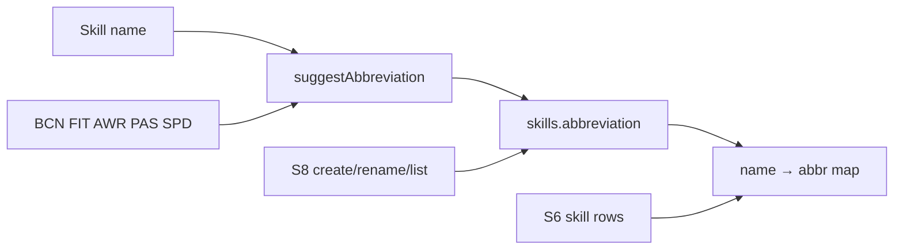

# Feature 037 — Skill Abbreviations

## Goal Capsule

- **Objective:** Persist a short **abbreviation** (1–3 characters) on every skill; SystemAdmin manages it on **S8** (table, Add Skill with auto-suggest, Rename editable); **S6** assessment cards display abbreviations for the per-skill list.
- **Authority:** Abbreviation is catalog data on `skills`. Clip rating JSON keys remain full skill names; S6 resolves display labels via catalog lookup.
- **Done when:** Column + backfill shipped; S8 create/rename/list show abbr; Add Skill suggests from name; S6 skill rows show abbr; Playwright/API assertions cover CRUD + S6 display; mapping updated.
- **Out:** S2/S5 skill-rating tables; unique constraint on abbreviation; changing clip `skillRatings` / `skillFocus` keys to abbreviations.

---

## Product Contract

### Summary

Skills carry a short uppercase-ish abbreviation for compact UI (especially S6 cards). Admins set or accept suggestions on S8; existing soccer catalog gets a one-time backfill with five fixed codes and algorithm-derived codes for the rest. Duplicate abbreviations are allowed.

### Problem Frame

S6 skill lists and dense UIs need short labels. Today skills only have full names; admins cannot store or edit a compact code.

### Actors

- A1. **SystemAdmin** — creates/renames skills on S8 including abbreviation.
- A2. **Coach / guest viewers of S6** — see abbreviations on assessment cards (read-only).

### Key Flows

- F1. Admin opens Add Skill → types name → abbreviation auto-suggests → may edit → save → row shows abbr.
- F2. Admin opens Update Skill → edits name and/or abbreviation (suggest may refresh when name changes if user has not dirty-edited abbr, or always offers re-suggest control — prefer: re-suggest on name input while leaving current value editable).
- F3. Coach opens S6 → assessed cards’ skill rows show abbreviation (tooltip or accessible name for full skill when practical).
- F4. Migration/startup backfills existing skills with fixed map + algorithm.

### Acceptance Examples

- AE1. Ball Control / Fitness / Game Awareness / Passing / Speed backfill to **BCN / FIT / AWR / PAS / SPD**.
- AE2. Add Skill “Long shots” suggests a 3-char code (e.g. LSS or LSH per algorithm); admin can override before save.
- AE3. S6 complete card skill list shows abbreviations instead of (or in preference to) full names in the compact row label.
- AE4. Two skills may share the same abbreviation without validation error.
- AE5. Rename Skill can change abbreviation without requiring a name change.

### Requirements

- R1. `skills.abbreviation` column: non-null after backfill; max length **3**; validate on write (trim, length 1–3; normalize case to uppercase A–Z / digits as decided in KTD).
- R2. S8 skills table shows Abbreviation column.
- R3. Add Skill modal: abbreviation field + **auto-suggest** from name as the user types; user can edit.
- R4. Rename/Update Skill modal: editable abbreviation (pre-filled); may re-suggest when name changes.
- R5. Backfill: fixed codes for the five named skills; algorithm for all other seeded (and existing empty) rows.
- R6. S6 assessment card per-skill list displays abbreviation (full name available via `title`/aria when swapping label).
- R7. Document in `docs/ux/mockup/API-Mockup-Mapping.md`; tests cover S8 + S6.

### Scope Boundaries

#### In scope

- Migration `025_*` + `tables.sql` / `deploy.sql` + `ensureDatabase` ALTER
- Seed / backfill UPDATE for existing skills
- Shared suggest helper (server seed + client suggest)
- POST/PATCH `/skills` + `toSkillPayload` + mockup client offline seeds
- S8 UI (table, create, rename)
- S6 `buildSkillListMarkup` display via skills catalog map
- Playwright s8 + s6 assertions; skills migration/API source tests; optional OpenAPI/`apps/web` admin-skills parity if cheap (see Deferred if large)

#### Out of scope

- S2 / S5 skill rating table abbreviations
- Unique abbreviation constraint
- Renaming clip JSON keys to abbreviations
- Showing abbr in S6 meta “primary skill” span (card meta can keep full `clip.skill`) unless trivial one-liner

#### Deferred to Follow-Up Work

- Broader React `apps/web` Admin Skills parity if not done in-unit (OpenAPI + CreateSkillDialog) when mockup path is enough for POC
- S2/S5 compact labels

---

## Planning Contract

### Assumptions

- Feature number **037**; migration **025**.
- Abbreviations stored **UPPERCASE**; input coerced on write.
- Required on create/update (empty → validation_error); backfill ensures no nulls for catalog rows.
- Suggest algorithm lives in one shared module usable from S8 JS (inline or `mockup-api-client`) and from migration/backfill script or SQL UPDATEs with known map + Node backfill in ensureDatabase.

### Key Technical Decisions

- KTD1. **Column:** `abbreviation VARCHAR(3) NOT NULL` after backfill; for additive migration use `ADD COLUMN … NULL` then UPDATE then `SET NOT NULL` (or leave nullable only before backfill completes in same migration).
- KTD2. **Duplicates allowed** — no UNIQUE index on `abbreviation`.
- KTD3. **Suggest algorithm:** hardcoded overrides for the five confirmed names (case-insensitive); else multi-word = first letters of up to 3 tokens, pad with consonants from last token to length 3; single-word = first letter + following consonants to 3, else first 3 letters. Always uppercase, max 3.
- KTD4. **S6 display:** load `MockupApi.listSkills()` (or cached map) keyed by lowercased name → abbreviation; render abbr in `.result-skill-name` with `title` = full name; offline/local seeds include abbreviations.
- KTD5. **S8 rename:** abbreviation field editable; on name input change, refresh suggest into the field unless the admin has edited abbreviation since last suggest (dirty flag) — implement dirty-flag to avoid clobbering intentional edits.
- KTD6. **Primary POC surfaces:** mockup S8/S6 + serve-mockup. Touch OpenAPI / apps/web only if unit budget allows; otherwise note Deferred.

### High-Level Technical Design

### Risks & Dependencies

| Risk | Mitigation |
|------|------------|
| Algorithm ≠ human taste for remaining 26 skills | Document algorithm in plan; admin can Rename; fixed five locked |
| S6 offline mode lacks catalog | Extend offline `skills` seed with abbreviations |
| Name rename breaks S6 lookup if clip still uses old name | Lookup still by rating key (= clip stored name); abbr follows catalog by name match — orphan clip names fall back to full name |

### Sources & Research

- User ask + confirmed scopes (S8+S6, duplicates OK, rename editable)
- Local: `015_skills_positions_sports.sql`, `S8-skills.html`, `S6-assessment-list.html` `buildSkillListMarkup`, `serve-mockup.js` skills CRUD, `tests/playwright/s8-skills.spec.js`

---

## Implementation Units

### U1. Schema + backfill

**Goal:** Add `abbreviation` and populate existing skills.
**Requirements:** R1, R5, AE1
**Dependencies:** None
**Files:**
- Create: `apps/api/src/db/migrations/025_skill_abbreviation.sql`
- Modify: `apps/api/src/db/schema/tables.sql`, `apps/api/src/db/schema/deploy.sql`, `scripts/serve-mockup.js` (`ensureDatabase` ALTER + optional backfill UPDATE)
- Create or modify: shared suggest helper e.g. `scripts/skills/suggest-abbreviation.js` (used by backfill + documented for client mirror)
- Test: `apps/api/tests/integration/db/skills-abbreviation-migration.spec.ts` (or extend `skills-migration.spec.ts`)
**Approach:** ADD COLUMN; UPDATE fixed five by name; UPDATE others via helper or explicit SET list produced by running algorithm once in migration comments / Node ensureDatabase backfill for empty abbreviations; enforce NOT NULL when safe. Mirror into tables/deploy.
**Test scenarios:**
- Happy: migration declares column length 3; five fixed codes present in UPDATE statements or ensureDatabase backfill.
- Edge: algorithm unit test covers Ball Control→BCN, Fitness→FIT, Speed→SPD, multi-word Long shots, single-word Pace.
**Verification:** Schema mirrors contain `abbreviation`; helper matches AE1 overrides.

### U2. API + client payloads

**Goal:** Create/update/list skills carry abbreviation.
**Requirements:** R1, R3, R4, AE2, AE4, AE5
**Dependencies:** U1
**Files:**
- Modify: `scripts/serve-mockup.js` (`toSkillPayload`, POST/PATCH skills validation)
- Modify: `docs/ux/mockup/js/mockup-api-client.js` (`createSkill`, `updateSkill`, offline seed abbreviations, `suggestSkillAbbreviation` export)
- Test: `apps/api/tests/integration/skills/skills-api-mockup.spec.ts`, `mockup-api-client.spec.ts`
**Approach:** Require abbreviation on create/update (or auto-fill from name if omitted). Coerce uppercase; 1–3 chars; no uniqueness check. Offline seeds include abbreviations for all catalog skills.
**Test scenarios:**
- Happy: POST with abbr returns it; PATCH updates abbr only.
- Edge: duplicate abbr accepted.
- Error: empty or >3 chars → validation_error.
**Verification:** List skills returns abbreviation for seeded rows.

### U3. S8 UI — table, Add, Rename + suggest

**Goal:** Admins manage abbreviations with auto-suggest.
**Requirements:** R2, R3, R4, AE2, AE5
**Dependencies:** U2
**Files:**
- Modify: `docs/ux/mockup/S8-skills.html`
- Test: `tests/playwright/s8-skills.spec.js`
**Approach:** Abbreviation column; create/rename inputs (`maxlength=3`); on name input, set suggested abbr unless dirty. Save includes abbreviation in payload.
**Execution note:** Prefer Playwright smoke for suggest-on-type + rename keeps editable abbr.
**Test scenarios:**
- Happy: Add Skill shows suggest after typing name; save shows abbr in table.
- Happy: Rename can change abbr.
- Edge: editing abbr then changing name does not overwrite if dirty flag set.
**Verification:** Playwright Add Skill path asserts abbreviation cell visible.

### U4. S6 cards show abbreviation

**Goal:** Assessment skill rows use compact labels.
**Requirements:** R6, AE3
**Dependencies:** U2
**Files:**
- Modify: `docs/ux/mockup/S6-assessment-list.html` (`buildSkillListMarkup`)
- Test: `tests/playwright/s6-assessment-list.spec.js`
**Approach:** Build name→abbr map once from `listSkills()`; display abbr with `title`=full name; fallback to full name if unknown.
**Test scenarios:**
- Happy: offline or seeded mode shows known abbr (e.g. PAS/BCN) on a card with that skill.
- Edge: unknown skill name falls back to full name.
**Verification:** Playwright or DOM assertion on `.result-skill-name` text for an overridden skill when present.

### U5. Mapping + docs

**Goal:** Traceability.
**Requirements:** R7
**Dependencies:** U1–U4
**Files:**
- Modify: `docs/ux/mockup/API-Mockup-Mapping.md`
**Approach:** Note abbreviation on Skill resource, S8 columns, S6 display behavior, backfill overrides.
**Test expectation:** none — docs only.
**Verification:** Mapping mentions abbreviation and S6 display.

---

## Verification Contract

- Migration/ensureDatabase + algorithm unit tests pass
- Skills API create/update list return abbreviation
- Playwright: S8 create/rename with abbr; S6 skill row shows abbr when catalog available
- Mapping updated

---

## Definition of Done

- [ ] U1–U5 complete with cited scenarios
- [ ] Five fixed abbreviations correct; remaining skills have non-empty ≤3 codes
- [ ] S8 manage + suggest + rename editable
- [ ] S6 skill list uses abbreviations
- [ ] Duplicates allowed; S2/S5 unchanged

---

## Appendix

### Product Contract preservation

Bootstrap from user query; Product Contract encodes confirmed answers (S8+S6 display, duplicates OK, rename editable).

### Algorithm note (directional)

Overrides win for Ball Control→BCN, Fitness→FIT, Game Awareness→AWR, Passing→PAS, Speed→SPD. Multi-word Ball Control also yields BCN under the first-letter + consonant-pad rule — good coincidence for suggest UX.
