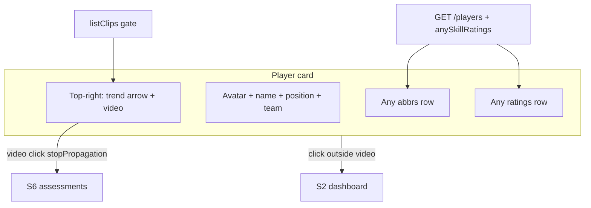

# Feature 038 — S1 Player Card Redesign

## Goal Capsule

- **Objective:** Redesign the S1 roster card so the whole card opens that player’s S2 dashboard (remove **View**), drop “Updated …” meta, show an arrow-only trend glyph with the video control clustered at the far top-right, and fill the bottom of the card with two rows of **Any Position** skills (abbreviations over percent ratings).
- **Authority:** Clip presence stays live `listClips` (Feature 033). Any-skill set follows the same sport-scoped “Any Position” resolution as S2 skill ratings (Feature 016). Abbreviations reuse Feature 037 catalog codes.
- **Done when:** Card click → S2; video → S6 without opening S2; no Updated/View; top-right trend+video; Any skills show abbr + `%`/`—`; Playwright + mapping updated.
- **Out:** S2/S5 skill abbreviation columns; Reporting spider (backlog 013); changing trend computation; unique abbreviation rules.

---

## Product Contract

### Summary

Coaches scan the S1 roster for name, trend, optional videos, and a compact Any-position skill strip, then open the dashboard by clicking anywhere on the card (except the video control).

### Problem Frame

Cards still rely on a **View** button, show low-value “Updated …” text, mix trend words into the meta row, park the video icon lower-right, and hide skill ratings until S2 — so roster scanning is slower than it needs to be.

### Actors

- A1. **Coach** — browses S1, opens dashboards and S6 from cards.
- A2. **SystemAdmin** — same roster affordances when on S1.

### Key Flows

- F1. Click card (not video) → `S2-player-dashboard.html?player={name}` (same target as today’s View).
- F2. Player has ≥1 clip → video icon at **far top-right**; click → S6 deep-link (`playerId` / `playerName` / `teamName`); card click must not fire.
- F3. Trend shows **arrow only** at top-right (near video): green ↗ improving, yellow ↘ declining, gray → plateau.
- F4. Bottom of card: row of Any-position skill abbreviations; row beneath with matching ratings (`{n}%` or `—`).

### Acceptance Examples

- AE1. Click Messi’s card (away from video) lands on S2 with `player=Lionel%20Messi` (or encoded equivalent); no **View** button present.
- AE2. Messi (has clips) shows video at top-right; click video opens S6 Pre-Selected Player for that player; URL remains on S6 (not S2).
- AE3. Card has no “Updated …” text.
- AE4. Improving / declining / plateau players show green ↗ / yellow ↘ / gray → respectively (no Improving/Declining/Plateau words).
- AE5. Any-position skills (e.g. BCN PAS AWR FIT SPD for soccer seed) appear as abbreviations on line 1; ratings as `%` or `—` on line 2 in the same order; role-only skills are absent.

### Requirements

- R1. Entire `.player-card` is the primary navigation control to S2 for that player; remove the **View** button.
- R2. Remove the “Updated …” / `player.updated` label from the card UI (API may still return the field).
- R3. Trend control is **arrow-only**, top-right cluster: green ~45° up (improving), yellow ~45° down (declining), gray horizontal (plateau). Accessible name retains the trend meaning (e.g. `aria-label`).
- R4. Video icon (Feature 033 presence rules) moves to the **farthest top-right**, adjacent to the trend glyph; click opens S6 via existing `buildS6Href`; must not navigate to S2.
- R5. Bottom two lines show **only** skills assigned to the team’s sport **Any Position**: line 1 = abbreviations (Feature 037); line 2 = player rating as integer percent like S2, or `—` when unrated. Show **all** Any skills even when unrated.
- R6. Keyboard/accessibility: card has a clear accessible name for dashboard navigation; video remains a distinct focusable control; trend is announced by meaning, not color alone.
- R7. Update Playwright S1 specs and `docs/ux/mockup/API-Mockup-Mapping.md`.

### Scope Boundaries

#### In scope

- S1 card markup/CSS and `renderPlayers` behavior
- Data for Any-position ratings (+ abbreviations) available to the roster without N× silent failure
- Offline seed/client parity
- Playwright + mapping

#### Out of scope

- Abbreviation columns on S2/S5 tables
- Changing how `trend` is computed or stored
- Reporting / spider chart (backlog 013)
- Removing `updated` from the API contract (UI-only drop is enough)

#### Deferred to Follow-Up Work

- Optional dedicated `hasClips` on list payload (still using live `listClips` is fine)
- S2 adopting abbreviations in skill-rating tables

---

## Planning Contract

### Assumptions

- Feature number **038**; plan file sequence **007** for 2026-07-13.
- Soccer seed Any Position still exposes five skills with codes BCN / PAS / AWR / FIT / SPD after Feature 037.
- Rating display matches S2 integer percent (`84%`), not 0–1 floats.
- Empty Any catalog (missing Any Position for sport) → omit skill lines or show empty strip without breaking the card.
- Product Contract preservation: bootstrap from user query; confirmed answers recorded in Requirements / call-outs (all Any skills with `—`; video relocated with trend to far top-right).

### Key Technical Decisions

- KTD1. **Primary card action:** Prefer a single navigational surface (card click / keyboard) to S2 using the same `?player=` name query as today’s View. Nested video link uses `stopPropagation` (and `preventDefault` only as needed for the video’s own navigation) so S6 wins over S2.
- KTD2. **Top-right cluster:** Absolute-positioned `card-actions` (or equivalent) at top-right: trend glyph then video to its right (video farthest right). Replaces lower-right video CSS from Feature 033.
- KTD3. **Trend visuals:** CSS classes + `transform: rotate(±45deg)` (or equivalent) on a horizontal arrow base; token colors: green improving, **yellow** declining, **gray** plateau (explicit override of current rose/sky trend pills). Hide word labels; keep `aria-label` / `title`.
- KTD4. **Any-skill data on roster:** Enrich `GET /v1/players` (and offline `listPlayers`) with a compact `anySkillRatings` (or equally named) array of `{ skillId, skillName, abbreviation, rating }` for the player’s team sport Any Position skills, ordered like S2 Any section (skill name ASC). Avoid per-card N+1 `GET …/skill-ratings` on every S1 render. Abbreviation from `skills.abbreviation` (backfill/suggest when missing).
- KTD5. **Unrated:** `rating === null` → render `—` (not “Not rated”).
- KTD6. **Filter:** Only Any-position rows — never role-unique skills on the card.

### High-Level Technical Design

### Risks & Dependencies

| Risk | Mitigation |
|------|------------|
| Nested clickables open S2 when intending S6 | Explicit target guard / stopPropagation; Playwright asserts S6 URL after video click |
| N+1 skill-ratings on large rosters | Enrich list payload once (KTD4) |
| Prior Feature 033 placement docs drift | Update mapping + CSS; keep clip gating + deep-link query |
| Feature 015/016 marked S1 ratings out-of-scope | This plan supersedes that boundary for the compact Any strip only |

### Sources & Research

- User 2026-07-13 confirmed scope + call-outs
- Local: `S1-player-list.html` `renderPlayers`, `site.css` `.player-card*`, Feature 033 plan, S2 Any ratings render, Feature 037 abbreviations, `listSkillsForPlayer` / offline mirror
- Institutional: `docs/solutions/` has no S1-card-specific learnings; follow Feature 033 `data-playerid` / live `listClips` patterns

---

## Implementation Units

### U1. Card chrome — clickable surface, trend+video top-right

**Goal:** Whole card opens S2; remove View and Updated; restyle trend arrow-only; move video to far top-right with trend.
**Requirements:** R1–R4, R6, AE1–AE4
**Dependencies:** None
**Files:**
- Modify: `docs/ux/mockup/S1-player-list.html`
- Modify: `docs/ux/mockup/style/site.css`
- Test: `tests/playwright/s1-player-list.spec.js` (interaction cases land with U4; structure ready here)
**Approach:** Drop `view-btn` and `player.updated` from markup. Add top-right action cluster. Wire card activation to S2 (click + Enter/Space if using `div`/`role=link` or wrap carefully without nesting anchors illegally). Video link `stopPropagation`. Update trend helper to arrow-only + new color classes. Relocate `.player-card-video-link` CSS to top-right.
**Patterns to follow:** Feature 033 clip gate + `buildS6Href`; stable `data-player-id`.
**Test scenarios:**
- Happy: card click navigates to S2 for that player name; View absent.
- Happy: trend improving shows green rotated-up arrow without the word “Improving”.
- Happy: video present at top-right; click yields S6 query with `playerId`.
- Edge: video click does not leave S6 / does not open S2.
- Edge: no clips → no video; card still opens S2; trend still visible.
**Verification:** Manual/Playwright smoke on card vs video navigation; no Updated text in DOM.

### U2. Any-position ratings on player list payload

**Goal:** Each list player includes Any-position skills with abbreviation + rating for the card footer.
**Requirements:** R5, AE5
**Dependencies:** None (parallelizable with U1; needed before U3 wiring)
**Files:**
- Modify: `scripts/serve-mockup.js` (`listPlayers` / `toPlayerPayload` or adjacent enrichment using Any resolution + `player_skill_ratings` + `skills.abbreviation`)
- Modify: `docs/ux/mockup/js/mockup-api-client.js` (offline `listPlayers` / store path mirrors the same `anySkillRatings` shape)
- Test: `apps/api/tests/integration/players/` source or behavior assert for list enrichment (extend existing players/list mockup tests if present; else add focused source/contract assert)
**Approach:** Reuse Any Position name resolution within the player’s team sport; left-join ratings; attach abbreviation; order stable (name ASC). Offline: filter `listSkillsForPlayerOffline` Any section and map abbreviations from skill catalog. Do not require S1 to call per-player skill-ratings.
**Patterns to follow:** `listSkillsForPlayer` sectioning; Feature 037 `abbreviation` on skills.
**Test scenarios:**
- Happy: list player with soccer team includes five Any skills with expected abbreviations when DB/seed has Feature 037 codes.
- Happy: unrated skill has `rating: null` (UI turns into `—`).
- Edge: role-only skills excluded from `anySkillRatings`.
- Edge: player/team without Any Position yields empty array (not error).
**Verification:** GET /players (or offline list) sample includes `anySkillRatings` with abbreviation fields.

### U3. Card footer — abbreviation and rating rows

**Goal:** Render the two-line Any skill strip from list payload.
**Requirements:** R5, AE5
**Dependencies:** U1, U2
**Files:**
- Modify: `docs/ux/mockup/S1-player-list.html`
- Modify: `docs/ux/mockup/style/site.css`
- Test: `tests/playwright/s1-player-list.spec.js`
**Approach:** In `renderPlayers`, consume `player.anySkillRatings`; build two aligned rows (flex/grid columns). Line 1 abbreviation (`title`/aria full name when helpful); line 2 `%` or `—`. Hide strip when array empty.
**Test scenarios:**
- Happy (offline): Messi/card for seeded soccer shows Any abbrevs including PAS/BCN/etc. and corresponding values/`—`.
- Edge: empty `anySkillRatings` → no strip / no error.
**Verification:** Visual + Playwright assert on `data-testid` cells for abbr and rating rows.

### U4. Mapping + Playwright regression

**Goal:** Document the new card contract; update tests that assumed View / bottom-right video.
**Requirements:** R7
**Dependencies:** U1–U3
**Files:**
- Modify: `docs/ux/mockup/API-Mockup-Mapping.md`
- Modify: `tests/playwright/s1-player-list.spec.js`
**Approach:** Replace View assertions with card-click; assert video top-right cluster still deep-links; assert Updated absent; add trend arrow + skill strip asserts where stable under offline/`__USE_MOCK_LOCAL__` if used. Keep Feature 033 clip presence semantics.
**Test scenarios:**
- Covers AE1–AE5 via focused Playwright cases (may combine for speed).
- Regression: existing roster filters / avatar / role gates still pass.
**Verification:** `npx playwright test tests/playwright/s1-player-list.spec.js` green; mapping mentions Feature 038.

---

## Verification Contract

- Playwright: `tests/playwright/s1-player-list.spec.js` covers card→S2, video→S6 without S2, no Updated/View, trend arrow colors/labels, Any abbr + rating/`—`
- API/client: list payload enrichment covered by integration/source tests added in U2
- Mapping documents Feature 038 card layout + `anySkillRatings`

---

## Definition of Done

- [ ] U1–U4 complete with cited scenarios
- [ ] View and Updated removed from cards; click opens S2
- [ ] Trend + video clustered top-right (video farthest right); colors match product contract
- [ ] Any-position abbr + ratings rows on card; unrated = `—`
- [ ] Mapping + Playwright updated; Feature 033 deep-link/clip gate preserved

---

## Appendix

### Product Contract preservation

Bootstrap from user query; Product Contract encodes confirmed answers (all Any skills with dash when unrated; video relocated with trend to far top-right).
