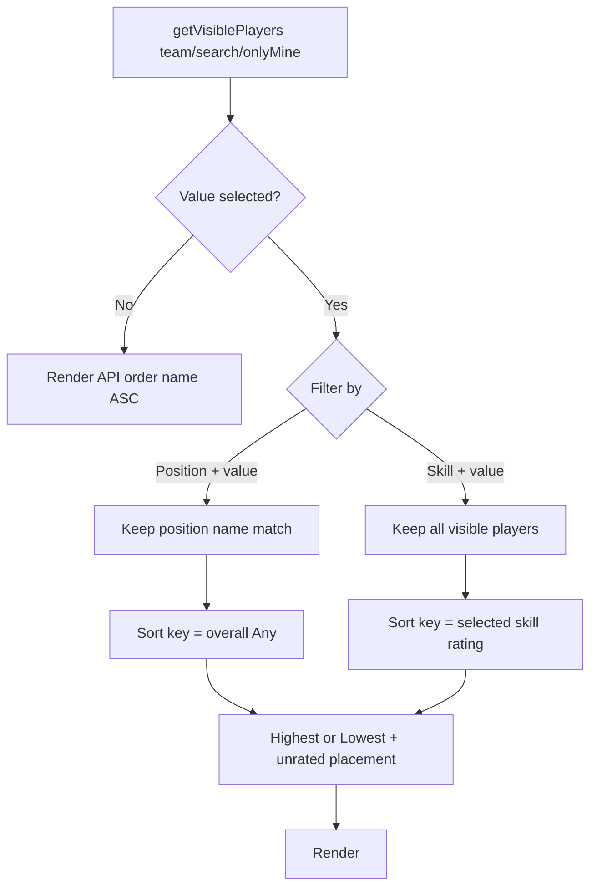

# Feature 040 — S1 Advanced Filter

## Goal Capsule

- **Objective:** Give **Coach** and **SystemAdmin** an **Advanced Filter** on S1 to narrow by **Position** or orient by **Skill**, then **Sort by** Highest or Lowest Rating (default Highest), without changing Parent/Player/Guest UI.
- **Authority:** Compose after existing team / search / Only My Players visibility. Position sort key = Feature 039 overall Any average. Skill sort key = rating for the selected skill. Reuse Feature 038 list enrichment patterns; enlarge ratings payload as needed for non-Any skills.
- **Done when:** Editors see the control; Parent/Player do not; Position and Skill modes behave as specified; unrated placement matches defaults; Playwright + mapping updated.
- **Out:** Persisting filter prefs; Parent/Player advanced filter; S2/S6 advanced filters; server-side rating sort query params (client-side after list is enough for this mockup).

---

## Product Contract

### Summary

Editors open Advanced Filter on the S1 roster, pick Position or Skill, choose a value, and sort by highest or lowest rating so they can find stronger or weaker players faster within the teams they already see.

### Problem Frame

S1 filters by team, search, and (for Coach) Only My Players, but offers no position/skill lens and no rating order — scanners must eyeball Feature 039 yellow overalls and the Any-skill strip.

### Actors

- A1. **Coach** — uses Advanced Filter on club-scoped roster (with Only Mine still applying).
- A2. **SystemAdmin** — same Advanced Filter on full roster visibility.
- A3. **Parent / Player / Guest** — no Advanced Filter control (unchanged list ordering).

### Key Flows

- F1. Editor opens Advanced Filter → sees **Filter by** (Position | Skill), a value dropdown for the chosen mode, and **Sort by** (Highest Rating | Lowest Rating; default Highest).
- F2. **Position** + selected catalog position → list keeps only players whose roster `position` matches that catalog name; sort by overall Any average (Feature 039 rules).
- F3. **Skill** + selected skill → list is not narrowed by “has rating”; sort by that skill’s rating (finite numbers); overall not used.
- F4. Unrated for the active sort key stay visible: **after** all rated for Highest; **before** all rated for Lowest. Rated ties break by player name ascending.
- F5. Advanced Filter applies on top of team / search / Only Mine. Closing or clearing resets to pre–Advanced Filter visibility order (backend name ASC among the still-visible set).

### Acceptance Examples

- AE1. As Coach, Advanced Filter is visible; as a non-editor role session, it is hidden.
- AE2. Position = catalog winger-equivalent name shows only matching roster-position players; Highest puts higher Feature 039 overall first; players with `—` overall last.
- AE3. Skill = Ball Control; Highest orders by that skill’s percent; players with null/missing/non-finite rating sort last; Lowest puts those unrated first.
- AE4. With a team filter already set, Advanced Filter only reorders/narrows that subset.
- AE5. Default Sort by is Highest Rating when Advanced Filter is first opened.

### Requirements

- R1. Advanced Filter UI visible only when actor role is **Coach** or **SystemAdmin**.
- R2. **Filter by** options: **Position** | **Skill**.
- R3. Position mode: value dropdown = active positions for the sport resolved from the selected team (same sport resolution as Add Player); when team is All Teams, use the same sport fallback as Add Player (`sport_soccer` unless implementer finds a clearer club-sport source).
- R4. Skill mode: value dropdown = **all active skills** linked to any active position of that sport (Any Position + role-unique), deduped by `skillId`, labeled by skill name (abbr optional as secondary).
- R5. Position mode with a selected value: filter `player.position === selectedPosition.name` (exact). Align demo/seed/test players that exercise this path to catalog names.
- R6. Position mode sort key = Feature 039 `computeOverallAnyRating(anySkillRatings)` (numeric average of Any ratings > 0); unrated overall = no sort key.
- R7. Skill mode sort key = that skill’s rating from the list payload enrichment; unrated = no sort key. Selecting a skill does **not** hide unrated players.
- R8. Sort by Highest (default) / Lowest Rating with unrated placement per F4; stable name ASC among equal keys.
- R9. Layering: run after existing `listPlayers` / Only Mine visibility; do not weaken Coach club scoping or SystemAdmin bypass.
- R10. Playwright coverage + `docs/ux/mockup/API-Mockup-Mapping.md` Feature 040 notes.

### Scope Boundaries

#### In scope

- S1 Advanced Filter UI (expandable panel or equivalent toolbar secondary panel)
- Client filter + sort helpers
- List payload enrichment so Skill mode can read any sport-linked skill rating without N+1
- Offline `listPlayers` parity for that enrichment
- Tests + mapping

#### Out of scope

- Saving Advanced Filter state across reloads
- Fuzzy / alias matching for free-text legacy positions beyond exact catalog name (seed alignment is in-scope for demos/tests)
- Changing Feature 039 overall formula
- Parent/Player-facing sort controls

#### Deferred to Follow-Up Work

- Multi-role `data-role-visible-to` attribute parsing if other screens need Coach|SystemAdmin gates
- Persisted `positionId` on players to replace free-text position matching

---

## Planning Contract

### Assumptions

- Product Contract summary from confirmed scoping 2026-07-13 stands.
- Client-side filter/sort after `getVisiblePlayers()` is sufficient; no new `GET /players` query params required for this feature.
- “Clear / close Advanced Filter” restores name ASC (API order) for the current visibility set.

### Product Contract preservation

Product Contract written in this bootstrap plan; confirmed call-outs locked as R5–R8.

### Key Technical Decisions

- KTD1. **Apply after visibility fetch.** Keep `listPlayers` team/query/onlyMine behavior; add `applyAdvancedFilterAndSort(players)` before card render. Avoids fighting coach_clubs scoping.
- KTD2. **Enrich list payload for Skill mode.** Today `anySkillRatings` is Any-position only. Add a compact per-player map or array of `{ skillId, rating }` covering ratings for skills linked to the player’s team sport (or all ratings for those skillIds). Backend batch join + offline mirror; do not call `GET …/skill-ratings` per card.
- KTD3. **Skill dropdown construction.** Resolve `sportId` from selected team (Add Player pattern); `listPositions(…, sportId, 'active')` then union `listPositionSkills` (or equivalent) for active links; dedupe skills. Do not use global `listSkills` alone (no sport filter).
- KTD4. **Role gate in page hydrate.** `hidden = !(role === 'Coach' || role === 'SystemAdmin')` — current `data-role-visible-to` is single-role only.
- KTD5. **UI pattern.** Toolbar toggle + panel (mirror `#addPlayerPanel`), with Filter-by select, value select, Sort-by select; default sort Highest on first open.
- KTD6. **Exact position match + fixture alignment.** Catalog names ≠ older seed strings (`Forward - Left Wing` vs `RW / LW – Winger`). Tests/demo data used for Position mode must use catalog `position.name` values.

### High-Level Technical Design

Until a Position or Skill **value** is selected, leave API order (name ASC). Sort + Position filter apply only when the value dropdown has a concrete selection.

### Risks

- **Position name drift** — free-text player positions may not match catalog; mitigate with fixture alignment and documented exact-match rule.
- **Payload size** — sport-wide skill ratings per player is still small for POC; keep map keyed by skillId only.
- **Stale offline store** — missing enrichment → treat as unrated sort keys.

### Open Questions

- None blocking. Deferred: fuzzy position matching.

---

## Implementation Units

### U1. List payload: sport skill ratings for sort

**Goal:** Each player on `GET /v1/players` (and offline `listPlayers`) carries enough skill ratings to sort by any active sport-linked skill without N+1.

**Requirements:** R7, R10

**Dependencies:** None

**Files:**
- `scripts/serve-mockup.js` — extend or sibling of `listAnySkillRatingsByPlayerIds`; attach to `toPlayerPayload` / list mapping
- `docs/ux/mockup/js/mockup-api-client.js` — offline `listPlayers` parity
- `docs/ux/mockup/API-Mockup-Mapping.md` — document new field
- `tests/playwright/s1-player-list.spec.js` — seed/assert enrichment as needed for later units

**Approach:** Batch-load ratings for skillIds linked to positions of each player’s team sport (or one club-sport set). Prefer a compact `skillRatingsById: { [skillId]: number|null }` alongside existing `anySkillRatings` (keep Any for Feature 038/039 UI). Ratings use existing `player_skill_ratings` / offline `playerSkillRatings` store.

**Patterns to follow:** Feature 038 `listAnySkillRatingsByPlayerIds` + offline mirror; avoid per-player fetches.

**Test scenarios:**
- Happy path: seeded Messi has Ball Control rating available from list payload without dashboard call.
- Edge: player with no ratings → empty/null entries; consumers treat as unrated.
- Integration: offline and backend list shapes agree on field name and keying by `skillId`.

**Verification:** List responses include the enrichment; Playwright or smoke evaluate can read a skill rating for a seeded player.

---

### U2. Advanced Filter UI + role gate on S1

**Goal:** Editors can open Advanced Filter controls; non-editors cannot see them.

**Requirements:** R1–R4, R8 (default), AE1, AE5

**Dependencies:** None (can land before U1 if Skill dropdown lists catalog only; sorting needs U1)

**Files:**
- `docs/ux/mockup/S1-player-list.html`
- `docs/ux/mockup/style/site.css`
- `tests/playwright/s1-player-list.spec.js`

**Approach:** Toolbar control + expandable panel: Filter by (Position|Skill), dynamic value `<select>`, Sort by (Highest|Lowest, default Highest). Populate positions/skills via sport resolution from `state.selectedTeam` (reuse Add Player sportId path). Gate visibility in `hydrateActor`. Use stable `data-testid`s (e.g. `advanced-filter-toggle`, `advanced-filter-by`, `advanced-filter-value`, `advanced-filter-sort`).

**Patterns to follow:** `#addPlayerPanel` / `#toggleAddPlayer`; S3 manual Coach-only wrap for multi-role visibility.

**Test scenarios:**
- Happy: Coach sees toggle; SystemAdmin sees toggle after login switch.
- Happy: default Sort option is Highest Rating.
- Happy: switching Filter by swaps value options (positions vs skills).
- Edge: All Teams selected still populates value dropdown (soccer fallback).
- Error/permission: Parent/Player (or non-editor seeded user if present) does not see the panel/toggle.

**Verification:** Role visibility and control defaults asserted in Playwright.

---

### U3. Client filter + sort pipeline

**Goal:** Apply Position filter and rating sort on the visible roster per Product Contract.

**Requirements:** R5–R9, AE2–AE4

**Dependencies:** U1 (Skill sort), U2 (controls/state)

**Files:**
- `docs/ux/mockup/S1-player-list.html` — helpers + `renderPlayers` integration
- `tests/playwright/s1-player-list.spec.js`
- `docs/ux/mockup/API-Mockup-Mapping.md` — Feature 040 behavior notes

**Approach:** After `getVisiblePlayers()`, if Advanced Filter has a selected value, filter (Position only) then sort. Position sort key = `computeOverallAnyRating`. Skill sort key = enrichment map lookup. Comparator implements Highest/Lowest + unrated placement + name ASC tie-break. Clearing panel or clearing value restores unsorted visible list. Align at least one offline seed player’s `position` to a catalog name for AE2.

**Patterns to follow:** Existing `computeOverallAnyRating`; compose with Only Mine without reimplementing coach scope.

**Execution note:** Prefer a focused failing Playwright case for Position Highest and Skill Highest before wiring the comparator.

**Test scenarios:**
- Happy: Position filter + Highest orders by overall; yellow overall values consistent with order.
- Happy: Skill Highest / Lowest order by selected skill; unrated last / first.
- Edge: All players unrated → order remains name ASC among that visibility set.
- Integration: Team filter + Advanced Filter jointly narrow/reorder; Only Mine still restricts Coach set first.
- Edge: Clear Advanced Filter returns name ASC among the same visibility set.

**Verification:** Focused Playwright specs pass; mapping documents composition and sort rules.

---

## Verification Contract

- Focused Playwright: Advanced Filter visibility by role; Position filter + sort; Skill sort + unrated placement; layering with team filter.
- Offline mode (`__USE_MOCK_LOCAL__`) is sufficient for core proofs; live backend optional if enrichment is mirrored.
- Manual smoke: Coach opens panel, Position filter, Skill Highest/Lowest, clear.

## Definition of Done

- R1–R10 satisfied on S1 mockup (offline + backend list enrichment).
- U1–U3 complete with test scenarios above green.
- Mapping documents Feature 040.
- No regression to Feature 038/039 card display or Coach/SystemAdmin scoping.

## Appendix

### Research notes

- S1 today: `getVisiblePlayers` → `renderPlayers` with no client rating sort; API `ORDER BY p.name ASC`.
- `anySkillRatings` is Any-only (Feature 038/039); role-unique ratings need U1 enrichment for confirmed “all sport skills” dropdown.
- Position seed strings historically diverge from S8 catalog names — exact match requires fixture alignment (KTD6).
- External research skipped — strong local filter/role/rating patterns.
