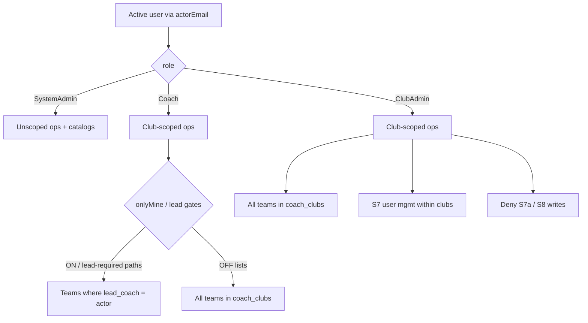

# feat: Add Club Admin role with coach access plus club user and team management

## Goal Capsule

- **Objective:** Introduce a **Club Admin** role that inherits Coach capabilities for assigned clubs, always covers all teams in those clubs (not lead-only), and can manage Coach users and club memberships within those clubs — without SystemAdmin global powers.
- **Authority:** Confirmed scoping synthesis (2026-07-14) + `docs/backlog/009-club-admin-role.md`. Prefer existing `coach_clubs` membership + actorEmail gates over inventing a parallel assignment table.
- **Stop when:** Role exists end-to-end (schema/API/mockup/UI/tests); Club Admin can list/edit club players and teams, manage in-club Coaches via Users; Clubs catalog + Skills admin remain SystemAdmin-only; Definition of Done checks pass.

---

## Product Contract

### Summary

Add Club Admin so clubs have local administrative power: same operational access as a Coach for their clubs, visibility and management of **all** teams in those clubs, and user management limited to that club scope. SystemAdmin remains the only global admin. Many Club Admins per club are allowed; SystemAdmin assigns the role and club memberships.

### Requirements

- R1. A third role value `ClubAdmin` exists alongside `SystemAdmin` and `Coach` in persistence, OpenAPI, validators, seed data, and mockup offline store.
- R2. Club Admin membership uses the existing `coach_clubs` join (user ↔ club), same as Coach/SystemAdmin members of clubs today.
- R3. Club Admin gets Coach-equivalent operational access for players, assessments UI, and capture **within their clubs**, including teams they do not lead. Hardening historically ungated clip POST APIs for all roles is deferred unless already actor-gated; extend those gates to include ClubAdmin when present.
- R4. Club Admin always sees all teams (and their players) in assigned clubs; they do not use the Coach "Only My Players" lead-only narrowing (toggle stays Coach-only / hidden for Club Admin).
- R5. Club Admin can create and update teams in their clubs and reassign lead coaches among users eligible for those clubs.
- R6. Club Admin can use Users (S7) to list/create/edit **Coach** users and assign/remove club memberships **only for clubs they belong to**; list results are limited to users who share at least one club (plus users they just created as needed for the flow); they cannot create or promote SystemAdmin or ClubAdmin, cannot edit SystemAdmin users, and cannot touch users with no overlapping club membership.
- R7. Clubs catalog CRUD (S7a) and sports/skills catalog writes (S8) remain SystemAdmin-only.
- R8. SystemAdmin retains global unscoped access and full user/club/catalog management.
- R9. Nav gates show Users to SystemAdmin and ClubAdmin; Clubs and Skills remain SystemAdmin-only; Only My Players remains Coach-only.

### Actors

- A1. SystemAdmin — global admin; assigns Club Admin role and club memberships.
- A2. ClubAdmin — club-scoped admin with Coach ops + in-club user/team management.
- A3. Coach — unchanged club-scoped ops; Only My Players lead narrowing remains.

### Key Flows

- F1. SystemAdmin creates a Club Admin user, assigns one or more clubs via `coach_clubs`, and the Club Admin signs in.
- F2. Club Admin opens S1 and sees all players on teams in their clubs (no lead-only filter); team dropdown lists all club teams.
- F3. Club Admin opens S3, creates/updates any team in their clubs, and can pick a lead coach from eligible club coaches.
- F4. Club Admin opens S7, creates a Coach, assigns them to a club they administer; attempts to mint SystemAdmin or edit an out-of-club user are rejected.
- F5. Club Admin is denied Clubs (S7a) and Skills (S8) admin chrome and corresponding write APIs.

### Acceptance Examples

- AE1. Seeded Club Admin on `c_default` sees Messi, Neymar, Ronaldo, and Mbappe on S1 (all club teams), with no Only My Players toggle.
- AE2. Club Admin can open Senior Squad on S3a and change the lead coach; navigating to S7a club create or S8 skill writes is denied. (Coach lead-reassignment within a shared club may already work today — do not use that as the Club Admin differentiator.)
- AE3. Club Admin creates Coach "New Coach" and assigns `c_default`; cannot set role to SystemAdmin; cannot assign a foreign club they are not on.
- AE4. Club Admin nav shows Users; hides Clubs and Skills; Coach nav still hides Users/Clubs/Skills.

### Scope Boundaries

#### In scope

- Role vocabulary blast radius: DB CHECK, OpenAPI `Role`, `apps/api` types/validators/services, mockup seed + offline store, S7 role select.
- Server enforcement in `scripts/serve-mockup.js` and offline parity in `docs/ux/mockup/js/mockup-api-client.js`.
- Player/profile/dashboard mutation guards widened for Club Admin to club scope (not lead-only).
- S1/S3/S7 UX + Playwright; Vitest/static contract updates for Role enum and scoping helpers.
- Multi-role nav attribute support (comma-separated `data-role-visible-to`).

#### Out of scope / deferred

- React web feature parity beyond shared OpenAPI/`apps/api` role types already present.
- Renaming `coach_clubs` table.
- Billing, Assessor badge, Parent role, and other backlog roles.
- Club Admin creating other Club Admins (SystemAdmin-only for now).
- Club Admin managing global club create/archive on S7a.

#### Outside this product's identity

- Multi-tenant RBAC frameworks; fine-grained permission matrices beyond the three roles.

---

## Planning Contract

**Product Contract preservation:** Product Contract defined in this bootstrap run from backlog 009 + confirmed scoping synthesis — no separate brainstorm file to diff.

### Assumptions

- Product Contract unchanged from confirmed scoping synthesis (call-outs 1–4 accepted).
- Mockup + `serve-mockup.js` remain the primary permission surfaces for S1/S3/S7; `apps/api` and OpenAPI must still accept `ClubAdmin` so contracts do not diverge.
- Club Admin “same as Coach” for player mutation means **club membership**, replacing lead-coach-only checks when the actor is ClubAdmin (Coaches stay lead-scoped where they are today).
- `GET /users` today returns the full directory without an admin gate; Club Admin must receive a **club-overlapping filtered** directory (or empty for users with no shared club) so user management cannot enumerate the whole tenant.

### Key Technical Decisions

- KTD1. **Reuse `coach_clubs` for Club Admin club membership** — avoids a second junction table; membership already drives team/player scope for coaches.
- KTD2. **Introduce shared “club-scoped editor” helpers** — e.g. treat Coach and ClubAdmin as club-scoped actors for reads; ClubAdmin skips `onlyMine` / lead predicates; keep SystemAdmin unscoped. Prefer named helpers (`isClubScopedActor`, `isLeadScopedActor`) over sprinkling string compares.
- KTD3. **Widen player profile access for ClubAdmin to club scope** — extend beyond `resolveCoachActor` + `findPlayerProfileForCoach` (lead-only) so Club Admin can edit/view players on any team in their clubs; Coaches remain lead-gated unless an existing path already club-scopes them.
- KTD4. **Nav gating accepts comma-separated roles** — `data-role-visible-to="SystemAdmin,ClubAdmin"` for Users; keep exact-match semantics per token so Coach-only and SystemAdmin-only chips stay simple.
- KTD5. **S7 writes resolve actor from `actorEmail` (DB role), not trusted client `actorRole`** — when granting Club Admin write paths, close the spoofable-payload gap at least for those handlers (SystemAdmin paths may harden in the same pass if touching the same code).
- KTD6. **User-management ceiling** — Club Admin may create/change role only to `Coach`; may assign/remove `coach_clubs` only for clubs in their membership set; may deactivate/reactivate/reset password only for active/inactive Coaches who share at least one club. Reject SystemAdmin/ClubAdmin targets and out-of-club users with 403.

### High-Level Technical Design

### Alternative Approaches Considered

| Approach | Why not |
|---|---|
| Separate `club_admins` table | Duplicate membership mechanics already in `coach_clubs`; more migrations for little gain |
| Club Admin as SystemAdmin flag-on-user | Would inherit global catalog powers R7 forbids |
| Soften Coach onlyMine instead of new role | Does not grant user management; conflates lead coaches with club admins |

### Risks & Dependencies

| Risk | Mitigation |
|---|---|
| Lead-only player APIs leave Club Admin able to list but not edit club teammates | U3 widens club-scope accessors before UI claims full Coach parity |
| Role enum CHECK / OpenAPI / UI selects drift | U1 lands schema + OpenAPI + validators together; contract tests assert three values |
| Spoofable `actorRole` on S7 | KTD5: resolve email → DB role on Club Admin–touching paths |
| Widespread allowlists still say Coach/SystemAdmin only | Grep-driven pass in U2/U5; tests for Club Admin happy + deny paths |

---

## Implementation Units

### U1. Role vocabulary and seed Club Admin

**Goal:** Persist and expose `ClubAdmin` as a first-class role with at least one seed user on `c_default`.

**Requirements:** R1, R2

**Dependencies:** None

**Files:**
- `apps/api/src/db/schema/tables.sql`
- `apps/api/src/db/migrations/` (new additive migration altering `users.role` CHECK)
- `openapi/v1/schemas/users.yaml`
- `apps/api/src/modules/auth/policies/role-policy.ts`
- `apps/api/src/modules/users/validators/` (create/change-role allowlists)
- `apps/api/src/modules/users/` (repository/service types as needed)
- `apps/web/src/features/admin-users/types.ts` (if Role union lives here)
- `scripts/serve-mockup.js` (seed user + CHECK-compatible inserts)
- `docs/ux/mockup/js/mockup-api-client.js` (seed user + coachClubs row)
- `apps/api/tests/unit/users/admin-validators.spec.ts`
- `apps/api/tests/contract/openapi.user-admin.spec.ts`

**Approach:** Add `ClubAdmin` to every Role enum/CHECK/union. Seed e.g. `u_clubadmin_rita` / `rita@vantageiq.club` / `ClubAdmin` / active / `SecurePass123`, with `coach_clubs` → `c_default`. SystemAdmin create/change-role validators accept assigning `ClubAdmin`; document that only SystemAdmin may assign that role (enforced in U4 for Club Admin callers).

**Patterns to follow:** Existing seed shape for `u_coach_joao`; migration style used for prior CHECK alterations.

**Test scenarios:**
- Happy path: OpenAPI Role enum lists SystemAdmin, Coach, ClubAdmin.
- Happy path: create-user validator accepts `ClubAdmin` for SystemAdmin callers.
- Error path: change-role to an unknown role string still fails validation.
- Integration: seed Club Admin authenticates via mock login like other seeds.

**Verification:** Schema/OpenAPI/seed agree on three roles; unit/contract tests green.

---

### U2. Club-scoped actor helpers and list/team scoping

**Goal:** Treat Club Admin like Coach for club membership predicates; never apply lead-only / `onlyMine` narrowing to Club Admin.

**Requirements:** R3, R4, R8

**Dependencies:** U1

**Files:**
- `scripts/serve-mockup.js` (`listPlayers`, `GET /teams`, `GET /clubs` coach branches)
- `docs/ux/mockup/js/mockup-api-client.js` (offline `listPlayers` / team filters)
- `apps/api/tests/integration/players/players-list-scoping.spec.ts`
- `apps/api/tests/integration/players/mockup-list-players-scoping.spec.ts`
- `apps/api/tests/integration/clubs/clubs-api-mockup.spec.ts` (as applicable)

**Approach:** Replace bare `role === 'Coach'` club-scope branches with a helper that includes `ClubAdmin`. Keep `onlyMine` / `lead_coach_user_id` predicates Coach-only. SystemAdmin remains unscoped. Offline mirror matches.

**Patterns to follow:** Post-fix coach club scoping in `listPlayers` (always `coach_clubs`, optional lead filter).

**Test scenarios:**
- Happy path: Club Admin `GET /players` without `onlyMine` returns all `c_default` players.
- Edge: Club Admin with `onlyMine=true` still returns all club teams (param ignored).
- Happy path: Coach + `onlyMine=true` still lead-narrowed (no regression).
- Happy path: Club Admin `GET /clubs` returns only clubs in their `coach_clubs` (must not fall through to tenant-wide list).
- Error/integration: Club Admin not assigned any club receives empty player/team lists.

**Verification:** Scoping tests cover Club Admin club-wide and Coach lead-only side by side.

---

### U3. Player profile / dashboard mutations for Club Admin

**Goal:** Club Admin can load and mutate players on any team in their clubs (profile, dashboard, skill ratings, share editor paths that today use lead-only coach resolution).

**Requirements:** R3

**Dependencies:** U2

**Files:**
- `scripts/serve-mockup.js` (`resolveCoachActor`, `findPlayerProfileForCoach`, callers ~profile/dashboard/share)
- `docs/ux/mockup/js/mockup-api-client.js` (offline equivalents if any)
- Integration tests under `apps/api/tests/integration/` mirroring coach player access (extend or add club-admin cases)
- Optional Playwright smoke on S2 edit as Club Admin

**Approach:** Introduce club-scoped player lookup (team.club_id ∈ actor’s `coach_clubs`) for ClubAdmin actors; keep existing lead-coach lookup for Coach. Prefer one resolver that branches by role over duplicating every handler. Do not widen SystemAdmin-only catalog routes.

**Execution note:** Characterize one existing coach-denied path (player on another coach’s team) before widening Club Admin, so Coach regressions stay obvious.

**Test scenarios:**
- Happy path: Club Admin GET/PATCH profile for a Senior Squad player succeeds.
- Error path: Coach who does not lead that team still gets 403/404 as today.
- Error path: Club Admin for club A cannot PATCH a player whose team is in club B.
- Integration: share/create revoke paths available to Club Admin for in-club players if currently Coach-gated via `resolveCoachActor`.

**Verification:** Club Admin can complete an S2 edit for a non-led club teammate; Coach lead rules unchanged.

---

### U4. Club-scoped user management (S7 + APIs)

**Goal:** Club Admin manages Coaches inside their clubs; SystemAdmin remains full user admin; ceilings in KTD6 are enforced server-side.

**Requirements:** R6, R8, R9

**Dependencies:** U1, U2

**Files:**
- `scripts/serve-mockup.js` (POST users, role, password, deactivate/reactivate, user↔club assign/remove)
- `docs/ux/mockup/js/mockup-api-client.js` (offline mirrors)
- `docs/ux/mockup/S7-admin-user-management.html` (role options, actor gates, hide SystemAdmin-only affordances as needed)
- `apps/api/src/modules/users/services/users-admin.service.ts` (align assert rules if exercised)
- `tests/playwright/s7-admin-user-management.spec.js`
- `tests/playwright/s7-user-club-assignment.spec.js`
- `apps/api/tests/unit/users/users-admin.service.spec.ts` (if present)

**Approach:** Resolve actor by email. Allow SystemAdmin full access. Allow ClubAdmin when target and memberships satisfy KTD6. Filter `GET /users` (and offline `listUsers`) for ClubAdmin to club-overlapping users so the directory is not tenant-wide. Keep Clubs page / assign-from-S7a SystemAdmin-only. Cap role picker for Club Admin session to Coach only.

**Patterns to follow:** S7 club assignment UI from plan `2026-07-06-008`; prefer DB-resolved role over payload `actorRole`.

**Test scenarios:**
- Happy path: Club Admin creates Coach and assigns `c_default`.
- Happy path: Club Admin `listUsers` omits Coaches who only belong to a foreign club.
- Error path: Club Admin create with role SystemAdmin → 403/validation.
- Error path: Spoofed `actorRole=ClubAdmin` without a resolvable matching `actorEmail` → 403 (KTD5).
- Error path: Club Admin assigns user to a club not in their `coach_clubs` → 403.
- Error path: Club Admin deactivates a Coach with no shared club → 403.
- Happy path: SystemAdmin can still create ClubAdmin and assign clubs.
- Integration: Club Admin does not see / cannot complete S7a club create.
- Integration: Club Admin sports/skills catalog write → 403 (automated, not only manual smoke).

**Verification:** Playwright covers Club Admin happy path + forbidden role/club; SystemAdmin regression green.

---

### U5. Teams UX and APIs for Club Admin

**Goal:** Club Admin manages all teams in their clubs (create/update/lead reassignment) without SystemAdmin global club CRUD.

**Requirements:** R5, R7

**Dependencies:** U2

**Files:**
- `scripts/serve-mockup.js` (team create/update allowlists + club scope checks)
- `docs/ux/mockup/js/mockup-api-client.js`
- `docs/ux/mockup/S3-team-management.html`
- `docs/ux/mockup/S3a-team-update.html`
- `tests/playwright/s3-team-management.spec.js`
- `tests/playwright/manage-club.spec.js` (deny Club Admin if present)

**Approach:** Add ClubAdmin to team write allowlists. Scope writes like Coach (must own club). Unlike Coach create-self-as-lead default, allow Club Admin to pick lead coach among club-eligible coaches (SystemAdmin-like picker, club-filtered). Reject team moves into clubs outside membership.

**Test scenarios:**
- Happy path: Club Admin creates team in `c_default` with Joao (active Coach) as lead.
- Happy path: Club Admin updates Senior Squad lead.
- Error path: Club Admin cannot create team for foreign club.
- Error path: Club Admin cannot update/move a team into or within a foreign club.
- Regression: Coach create still self-leads / club-defaults as today.

**Verification:** S3 Playwright for Club Admin create/update; Coach/SystemAdmin regressions pass.

---

### U6. Nav gating, S1 UX, mapping, and cross-role Playwright

**Goal:** Wire multi-role nav, S1 Club Admin experience, and document the contract.

**Requirements:** R4, R7, R9, AE1–AE4

**Dependencies:** U2, U4, U5

**Files:**
- `docs/ux/mockup/js/mockup-api-client.js` (`applyRoleGatedNav`)
- `docs/ux/mockup/*.html` (Users `data-role-visible-to`, Only My Players stays Coach)
- `docs/ux/mockup/S1-player-list.html` (`isCoach` vs club-admin list semantics)
- `docs/ux/mockup/API-Mockup-Mapping.md`
- `apps/api/tests/integration/mockup/nav-clubs-role-gating.spec.ts`
- `tests/playwright/s1-player-list.spec.js` (Club Admin cases)
- `docs/backlog/009-club-admin-role.md` (status → planned/done when shipped)

**Approach:** Parse comma-separated `data-role-visible-to`. Set Users to `SystemAdmin,ClubAdmin`. S1: Club Admin uses club-wide teams/players without Only My Players; status copy can reuse “in your clubs”. Advanced Filter stays available to Club Admin (same as Coach editors). Update mapping with Club Admin matrix.

**Test scenarios:**
- Happy path: Club Admin sees Users; hides Clubs and Skills (AE4).
- Happy path: Club Admin S1 shows all club players; no Only My Players control (AE1).
- Regression: Coach still sees Only My Players and hides Users.
- Regression: SystemAdmin still sees Clubs + Skills + Users.

**Verification:** Nav gating Vitest + S1 Playwright green; mapping updated.

---

## Verification Contract

- Playwright: Club Admin flows on S1, S3, S7; Coach/SystemAdmin regressions on scoping and nav.
- Vitest/static: Role enum/OpenAPI; list/team scoping includes ClubAdmin; nav multi-role attribute.
- Manual smoke: login as seeded Club Admin; confirm S7a/S8 writes denied; S2 edit on non-led club player works after U3.

## Definition of Done

- R1–R9 and AE1–AE4 satisfied with server-side enforcement (not UI-only).
- U1–U6 complete; Verification Contract gates pass.
- No Club Admin path can write sports/skills catalog or create/archive clubs.
- `docs/ux/mockup/API-Mockup-Mapping.md` documents Club Admin permissions.
- Backlog `009` marked planned/done when implementation lands.

### Deferred to Follow-Up Work

- Club Admin promoting other Club Admins.
- Renaming `coach_clubs` to a neutral membership table.
- Full React admin-users UI for Club Admin.

### Open Questions

- Deferred: Whether Club Admin may reset passwords for Coaches they manage (default **yes** under KTD6) — revisit if security posture differs.
- Deferred: Multi-club Club Admin seeing a merged user list (union of clubs) vs club-filter required first — default **union**, filter optional in S7 if already present for SystemAdmin.
- Deferred: Whether Coach (and other non-admin) `GET /users` should also stop returning the full tenant directory — out of scope here; only Club Admin list filtering is required now (accept temporary Coach vs Club Admin list asymmetry).
- Deferred: KTD5 SystemAdmin path hardening is optional nicety when touching shared handlers — not required for DoD.
