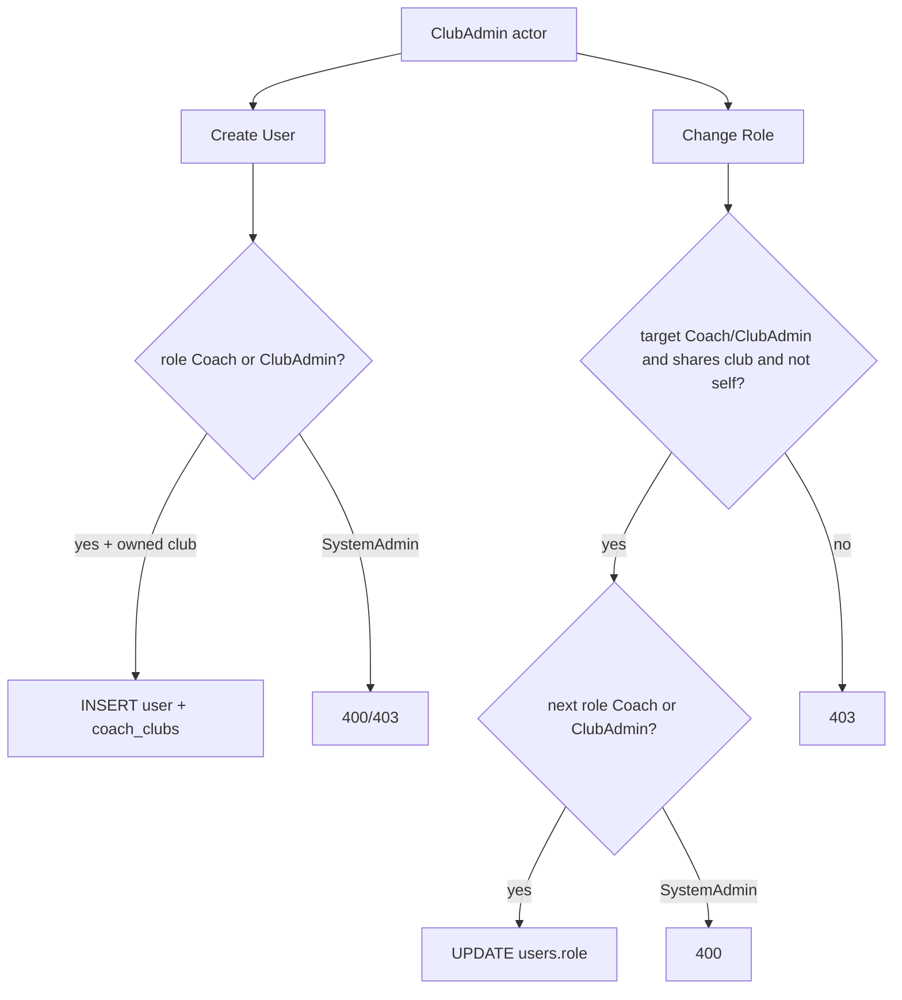

# feat: ClubAdmin assign Coach or ClubAdmin roles

## Goal Capsule

- **Objective:** Let ClubAdmin create and change-role users as **Coach** or **ClubAdmin** within clubs they belong to, while still blocking SystemAdmin assignment, self-role changes, and out-of-club targets.
- **Authority:** User request 2026-07-15 (confirmed scoping); supersedes Coach-only ClubAdmin create/edit in `docs/plans/2026-07-14-001-feat-club-admin-role-plan.md` R6 and `docs/plans/2026-07-15-001-feat-s7-create-user-assign-club-plan.md` R9 for this surface.
- **Stop when:** Live + offline create/change-role and S7 selects match the rules; Playwright covers create ClubAdmin, change Coach↔ClubAdmin, denies SystemAdmin / self / foreign-club; DoD passes.

---

## Product Contract

### Summary

Today ClubAdmin may only create/change users to **Coach**, and may only manage targets whose current role is Coach (`clubAdminMayManageUser`). Product now allows ClubAdmin to assign **Coach** or **ClubAdmin** on Create User and Change Role for other users in shared clubs. ClubAdmin↔Coach demotion/promotion is allowed. Self-role change and SystemAdmin remain forbidden. Create still requires club for Coach/ClubAdmin targets (existing assign-club-on-create rules).

### Requirements

- R1. ClubAdmin Create User role picker offers **Coach** and **ClubAdmin** only (SystemAdmin still hidden/stripped).
- R2. Live `POST /api/v1/users` and offline `createUser` accept `role` in `{Coach, ClubAdmin}` for ClubAdmin actors (unchanged SystemAdmin full allowlist).
- R3. ClubAdmin Change Role picker offers **Coach** and **ClubAdmin** only.
- R4. Live `POST /users/{email}/role` and offline `changeRole` accept the same allowlist for ClubAdmin actors.
- R5. ClubAdmin may change role for another user who **shares at least one club** and whose current role is **Coach or ClubAdmin** (not SystemAdmin).
- R6. ClubAdmin may promote Coach → ClubAdmin and demote ClubAdmin → Coach.
- R7. ClubAdmin cannot change their **own** role (403).
- R8. ClubAdmin cannot assign or change anyone to **SystemAdmin** (400/403 as existing validation patterns dictate).
- R9. Password / deactivate / reactivate continue to use the same manage-target predicate as change-role (Coach and ClubAdmin peers in shared clubs) so peer ClubAdmins are operable after create.
- R10. Prior create-club rules remain: Coach/ClubAdmin create requires club; ClubAdmin only assigns owned clubs; SystemAdmin create optional club (`docs/plans/2026-07-15-001-feat-s7-create-user-assign-club-plan.md`).

### Actors

- A1. ClubAdmin — creates/changes Coach or ClubAdmin within owned clubs; cannot self-promote/demote; cannot touch SystemAdmin.
- A2. SystemAdmin — unchanged full role allowlist.
- A3. Target user (Coach or ClubAdmin sharing a club) — may be created as ClubAdmin or have role flipped Coach↔ClubAdmin.

### Key Flows

- F1. ClubAdmin creates ClubAdmin with an owned club → 201 + membership; user appears in ClubAdmin-scoped S7 list.
- F2. ClubAdmin creates Coach (existing path) still works.
- F3. ClubAdmin changes Coach → ClubAdmin (shared club) → success.
- F4. ClubAdmin demotes ClubAdmin → Coach (shared club) → success.
- F5. ClubAdmin attempts SystemAdmin role or own email → rejected; foreign-club / SystemAdmin target → rejected.

### Acceptance Examples

- AE1. Rita (ClubAdmin, `c_default`) opens Create User → options are Coach and ClubAdmin only; creating ClubAdmin with `c_default` succeeds with chip.
- AE2. Rita Change Role on a club Coach → ClubAdmin succeeds; Change Role back to Coach succeeds.
- AE3. Rita Change Role options never include SystemAdmin; selecting SystemAdmin via forged API payload fails.
- AE4. Rita cannot Change Role on her own row; cannot Change Role a SystemAdmin; cannot manage a Coach only on a foreign club.

### Scope Boundaries

#### In scope

- Mockup S7 create + change-role UI option filtering.
- `scripts/serve-mockup.js` allowlists + `clubAdminMayManageUser` (and password/deactivate/reactivate gates sharing it).
- Offline `MockupApi.createUser` / `changeRole` (+ offline manage checks for password/deactivate/reactivate if they gate on Coach-only).
- Mapping doc note; Playwright (`club-admin-role.spec.js`, extend as needed).
- Optional backlog note that 009 “Coach only” is superseded by this plan.

#### Out of scope / deferred

- React `AdminUsersPage` / Nest `UsersAdminService` ClubAdmin parity (still SystemAdmin-gated scaffolding).
- Allowing ClubAdmin to assign SystemAdmin.
- Self-service role change.
- New “Update User” screen beyond existing Change Role modal.
- Changing ClubAdmin multi-club create UX beyond existing assign-club plan.

---

## Planning Contract

### Assumptions

- “Update” means the existing S7 Change Role modal, not a separate profile editor.
- Peer ClubAdmins who share a club are manageable for role/password/status the same way Coaches are today after widening the manage predicate.
- Offline `changeRole` should gain shared-club + self checks to match live (today offline only checks `user.role === 'Coach'`).

### Key Technical Decisions

- KTD1. Widen ClubAdmin `allowedRoles` on create and change-role from `['Coach']` to `['Coach', 'ClubAdmin']` in live and offline — do not invent a new endpoint.
- KTD2. Replace `clubAdminMayManageUser`’s `targetUser.role !== 'Coach'` with allow `{Coach, ClubAdmin}`, plus explicit `targetUser.id !== actor.id` (and email-equivalent if needed) for self-block on role change; keep `usersShareClub`.
- KTD3. S7: for ClubAdmin session, strip only `SystemAdmin` from `#createRole` / `#updatedRole` (keep Coach + ClubAdmin).
- KTD4. Mockup-first; React/Nest stay deferred (same posture as assign-club-on-create).
- KTD5. Product Contract supersedes 2026-07-14-001 R6 / 2026-07-15-001 R9 “Coach only” for ClubAdmin create — cite this plan as authority when implementing.

### Product Contract preservation

Bootstrap from user request + confirmed scoping (peer ClubAdmin manageable, demotion allowed, no self, no SystemAdmin). Product intent recorded above.

### High-Level Technical Design

---

## Implementation Units

### U1. Widen live + offline create/change-role allowlists and manage predicate

**Goal:** ClubAdmin API and offline client accept Coach/ClubAdmin create and change-role; manage peer ClubAdmins; block self and SystemAdmin targets.

**Requirements:** R2, R4–R9

**Dependencies:** None

**Files:**

- `scripts/serve-mockup.js` — `POST /users`, `POST .../role`, `clubAdminMayManageUser` (and callers)
- `docs/ux/mockup/js/mockup-api-client.js` — `createUser`, `changeRole`, and Coach-only offline manage gates if present

**Approach:**

- ClubAdmin `allowedRoles` → `['Coach', 'ClubAdmin']` for create and role change.
- `clubAdminMayManageUser`: allow Coach/ClubAdmin targets sharing a club; return false for SystemAdmin or self.
- Align offline `changeRole` with shared-club + self checks (parity with live).
- Keep SystemAdmin allowlist `ALL_ROLES`.

**Patterns to follow:** Existing `resolveUserAdminActor`, `usersShareClub`, assign-club-on-create validation order.

**Test scenarios:**

- Happy: ClubAdmin creates ClubAdmin with owned club → 201 + membership.
- Happy: ClubAdmin changes Coach → ClubAdmin → 200; demotes → Coach → 200.
- Error: ClubAdmin create/change with role SystemAdmin → rejected.
- Error: ClubAdmin changeRole on own email → 403.
- Error: ClubAdmin changeRole on user outside clubs → 403.
- Error: ClubAdmin changeRole on SystemAdmin target → 403.

**Verification:** Live and offline behave the same on allow/deny matrix above.

---

### U2. S7 Create / Change Role pickers for ClubAdmin

**Goal:** UI exposes Coach + ClubAdmin for ClubAdmin actors.

**Requirements:** R1, R3, R8 (UI half)

**Dependencies:** U1

**Files:**

- `docs/ux/mockup/S7-admin-user-management.html`
- `docs/ux/mockup/API-Mockup-Mapping.md`

**Approach:**

- Change ClubAdmin option strip from “keep only Coach” to “remove SystemAdmin only” on `#createRole` and `#updatedRole`.
- Document ClubAdmin may create/manage Coach and ClubAdmin in shared clubs (update the Coach-only mapping sentence).

**Test scenarios:** covered under U3.

**Verification:** ClubAdmin session shows two role options; SystemAdmin option absent.

---

### U3. Playwright coverage

**Goal:** Lock AE1–AE4 style behavior.

**Requirements:** R1–R8; AE1–AE4

**Dependencies:** U1, U2

**Files:**

- `tests/playwright/club-admin-role.spec.js`
- Optionally `tests/playwright/s7-admin-user-management.spec.js` if a focused SystemAdmin regression is needed (prefer extend club-admin suite)

**Approach:**

- Update create test: expect ClubAdmin option present; SystemAdmin still count 0; add create ClubAdmin with auto club + chip assertion.
- Add Change Role Coach → ClubAdmin (and optionally demote) under offline Rita login.
- Optional: forged SystemAdmin option via DOM still fails toast/modal stays.

**Execution note:** Prefer unique emails; offline ClubAdmin suite already forces local mock.

**Test scenarios:**

- Covers AE1. Create ClubAdmin as Rita → row + VantageIQ Club chip; SystemAdmin option absent.
- Covers AE2. Change Role Coach↔ClubAdmin succeeds for a club-scoped coach.
- Covers AE3/AE4. SystemAdmin option absent / self or foreign target rejected if exposed in UI or via evaluate.

**Verification:** `club-admin-role.spec.js` green (and any added cases).

---

### U4. Backlog / docs authority housekeeping

**Goal:** Avoid conflicting “Coach only” docs after ship.

**Requirements:** KTD5

**Dependencies:** None (can land with first commit)

**Files:**

- `docs/backlog/009-club-admin-role.md` (note superseded create/edit scope) and/or new short backlog closed-by-plan if preferred
- Optional one-line note in `docs/backlog/015-create-user-assign-club.md` that ClubAdmin create roles widen in this plan

**Approach:** Record that ClubAdmin user-mgmt roles are Coach + ClubAdmin per this plan; link plan path.

**Test expectation:** none — metadata only.

**Verification:** Frontmatter/body no longer claims Coach-only as current intent without pointing here.

---

## Verification Contract

- Playwright: `tests/playwright/club-admin-role.spec.js` (extended); smoke SystemAdmin S7 create still works if touched.
- Manual: Rita create ClubAdmin; change Joao-like club Coach ↔ ClubAdmin; confirm SystemAdmin option gone.

---

## Definition of Done

- R1–R10 and AE1–AE4 satisfied.
- U1–U4 complete; ClubAdmin cannot assign SystemAdmin or change self.
- Mapping doc and backlog authority no longer advertise Coach-only without this plan’s supersession.

---

## Risks & Dependencies

| Risk | Mitigation |
|------|------------|
| Password/deactivate still Coach-only → orphan peer ClubAdmins | KTD2 expands shared manage helper for those verbs |
| Offline weaker than live | Parity checks in U1 |
| Docs 009 / prior plans still say Coach-only | U4 housekeeping |

**Depends on:** Assign club on create (`2026-07-15-001`) already shipped — ClubAdmin create of ClubAdmin needs clubId path.
