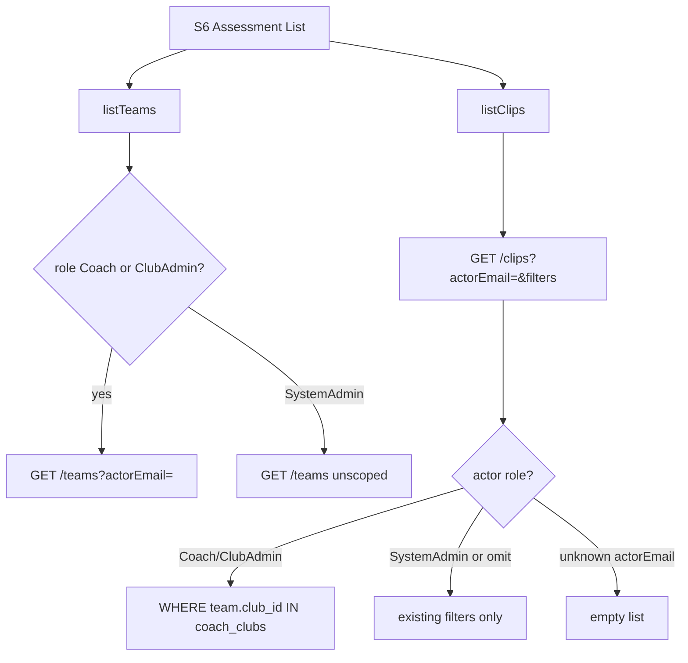

# feat: Club-scope S6 clips for non-SystemAdmin

## Goal Capsule

- **Objective:** On S6 Assessment List, signed-in Coach and ClubAdmin users only see clips whose players’ teams belong to clubs they are assigned to; SystemAdmin still sees every club’s clips.
- **Authority:** User request 2026-07-15 (confirmed: API list + team filter; guest/share unchanged).
- **Stop when:** Live + offline `listClips` enforce club scope from `actorEmail`; S6 always sends that actor for club-scoped roles (including ClubAdmin team dropdown); Playwright proves foreign-club clips/teams stay hidden; DoD passes.

---

## Product Contract

### Summary

`GET /api/v1/clips` today has **no** actor/club filter, and `MockupApi.listClips` never forwards `actorEmail`. S6 already club-scopes the **team** dropdown for Coach via `listTeams?actorEmail=`, but ClubAdmin loads teams with only `status=active` (all clubs), and “All Teams” clip fetch returns every clip in the DB/store. This plan closes that leak for every non-SystemAdmin signed-in role that uses `coach_clubs`.

### Requirements

- R1. For an active **Coach** or **ClubAdmin** (`actorEmail`), `GET /api/v1/clips` returns only clips whose player’s assigned team’s `club_id` is in that user’s `coach_clubs`.
- R2. **SystemAdmin** (or requests without a club-scoped actor) keep the current unscoped list behavior for S6 admin viewing — SystemAdmin may omit or supply `actorEmail` and still see all clubs’ clips.
- R3. Offline `MockupApi.listClips` mirrors R1/R2 when `actorEmail` / session resolves to Coach or ClubAdmin.
- R4. `listClips` clients that hit the backend must forward `actorEmail` when a signed-in club-scoped user is viewing S6 (and any other mockup caller that already has an actor and would otherwise over-fetch).
- R5. S6 team filter for **Coach and ClubAdmin** loads teams with `actorEmail` (fix ClubAdmin’s unscoped team list); SystemAdmin keeps the broader active-team list.
- R6. “All Teams” for club-scoped actors means all teams **in their clubs**, not all teams in the system — achieved by R1 (clip list) even when the filter value is `all`.
- R7. Guest/share S6 (`listClipsByShareToken`) is **unchanged** and stays share-player scoped.
- R8. Deep-link filters (`playerId` / `playerName` / `teamName`) still apply **inside** the club-scoped set; they must not widen scope beyond the actor’s clubs.

### Actors

- A1. Coach — S6 team list + clip list club-scoped via `coach_clubs`.
- A2. ClubAdmin — same club-scoped rules as Coach on S6.
- A3. SystemAdmin — full clip/team visibility on S6.
- A4. Guest (share token) — out of scope; existing share APIs only.

### Key Flows

- F1. Coach on default club opens S6 → All Teams shows only that club’s clips; foreign-club team names absent from the team dropdown.
- F2. ClubAdmin on default club opens S6 → same as F1 (unlike today, team list is scoped).
- F3. SystemAdmin opens S6 → teams/clips across clubs remain visible.
- F4. Club-scoped actor with `playerId` for a foreign-club player → empty list (no leak).

### Acceptance Examples

- AE1. Seed a clip on a team in `c_other` (not in Joao’s clubs). Joao on S6 with All Teams does not see that clip; Rita (ClubAdmin on `c_default` only) does not either.
- AE2. Joao’s team filter options are only teams in his clubs; Rita’s options are only her clubs’ teams.
- AE3. Maria (SystemAdmin) still sees the foreign-club clip when present.
- AE4. Guest share S6 still lists only the shared player’s clips.

### Scope Boundaries

#### In scope

- `scripts/serve-mockup.js` `GET /clips` club predicate.
- Offline `listClips` + forward `actorEmail` on backend path.
- `docs/ux/mockup/S6-assessment-list.html` team query + clip filters actor wiring.
- Mapping note + Playwright (`s6-assessment-list.spec.js` and/or a focused club-scope case).

#### Out of scope / deferred

- Guest/share clip routes (already player-bound).
- Nest/React assessment list parity.
- Hardening `GET /clips/{id}/media` and `/thumbnail` against clip-ID guessing (IDOR) — preferred follow-up; list scoping alone stops S6 from *showing* foreign cards.
- Changing S1/S2 clip indicators beyond what they already do when they call `listClips` (if they omit `actorEmail`, call out in Implementation Units to pass actor where session exists so S1 video icons do not count foreign-club clips).

---

## Planning Contract

### Assumptions

- Club membership continues to mean rows in `coach_clubs` for Coach and ClubAdmin (`isClubScopedActor`).
- Clips join players → `player_team_assignments` → `teams.club_id` the same way other club-scoped queries do; players without a team assignment are invisible to club-scoped actors (consistent with “associated to a club”).
- SystemAdmin detection: active SystemAdmin by `actorEmail`, or no actorEmail for admin/dev paths that already list unscoped — prefer: if `actorEmail` resolves to SystemAdmin → no club filter; if Coach/ClubAdmin → filter; if unknown/non-admin with actorEmail → empty (fail closed), matching teams list behavior.

### Key Technical Decisions

- KTD1. Add optional `actorEmail` to `GET /clips` and apply the same club IN-subquery pattern used by `GET /teams` / players list for `isClubScopedActor`.
- KTD2. Fail closed when `actorEmail` is present but actor is not SystemAdmin and not an active club-scoped user (empty result), not open list.
- KTD3. S6: for `Coach` **and** `ClubAdmin`, pass `actorEmail` into both `listTeams` and `listClips`; SystemAdmin omits club narrowing on teams as today.
- KTD4. Offline: resolve actor from `filters.actorEmail` or session; filter clips whose `player.teamName` maps to a team whose `clubId` is in the actor’s clubs.
- KTD5. Mockup-first; media IDOR deferred per Scope Boundaries.

### Product Contract preservation

Bootstrap from confirmed user scope; Product Contract above is the source of truth for this plan.

### High-Level Technical Design

---

## Implementation Units

### U1. Club-scope GET /clips + offline listClips

**Goal:** Server and offline clip lists honor actor club membership.

**Requirements:** R1–R4, R6, R8

**Dependencies:** None

**Files:**

- `scripts/serve-mockup.js` — `GET /api/v1/clips`
- `docs/ux/mockup/js/mockup-api-client.js` — `listClips`

**Approach:**

- Parse `actorEmail`; resolve actor; if club-scoped, add `t.club_id IN (SELECT club_id FROM coach_clubs WHERE user_id = $n)`; if unknown non-admin actorEmail → `FALSE`; SystemAdmin → no club clause.
- Offline: accept `filters.actorEmail`; when session/actor is Coach/ClubAdmin, keep only clips whose player’s team `clubId` is in actor’s clubs.
- Forward `actorEmail` on the backend `URLSearchParams` path when provided.

**Patterns to follow:** `GET /teams` actor branch (~2620); players club predicate; `isClubScopedActor`.

**Test scenarios:**

- Happy: Club-scoped actor with clip on own club → returned.
- Happy: SystemAdmin sees clips from multiple clubs.
- Error/empty: Club-scoped actor + only foreign-club clips → [].
- Edge: `playerId` of foreign-club player → [] for club-scoped actor.
- Edge: offline seed mirrors live.

**Verification:** Live GET and offline `listClips` match the matrix above.

---

### U2. S6 wiring for actorEmail (clips + ClubAdmin teams)

**Goal:** S6 never asks for an unscoped clip list or unscoped team list as ClubAdmin/Coach.

**Requirements:** R4, R5, R7

**Dependencies:** U1

**Files:**

- `docs/ux/mockup/S6-assessment-list.html`
- `docs/ux/mockup/API-Mockup-Mapping.md`
- Optionally other signed-in callers of `listClips` that imply club UI (e.g. S1 video icon) if they omit actor today — pass session email when role is club-scoped so icons match S6.

**Approach:**

- Extend `buildClipFilters` (or equivalent) to include `actorEmail` from `currentUser` for Coach/ClubAdmin.
- Change team query from “Coach only” to “any club-scoped role” (`Coach` || `ClubAdmin`).
- Document mapping: S6 clips are club-scoped like teams for non-SystemAdmin.

**Test scenarios:** covered under U3.

**Verification:** ClubAdmin S6 team dropdown excludes foreign clubs; clip cards match.

---

### U3. Playwright coverage for foreign-club isolation

**Goal:** Lock AE1–AE3 (and AE4 regression if cheap).

**Requirements:** AE1–AE4; R1, R5

**Dependencies:** U1, U2

**Files:**

- `tests/playwright/s6-assessment-list.spec.js` and/or `tests/playwright/club-admin-role.spec.js`
- Prefer offline seed of `c_other` team + clip for Rita/Joao, or backend insert if suite already uses DB.

**Approach:**

- Coach (Joao) and ClubAdmin (Rita offline): foreign-club clip/team not shown; own-club clip still shown when seeded.
- SystemAdmin (Maria) sees foreign clip when using backend or admin session.
- Leave guest share specs green (no intentional change).

**Execution note:** Prefer unique clip ids / offline store mutation so shared DB pollution does not flake.

**Test scenarios:**

- Covers AE1. Joao All Teams hides foreign-club clip.
- Covers AE2. Rita team filter lacks Other Club United (or equivalent).
- Covers AE3. SystemAdmin still lists foreign clip (if testable in suite).
- Regression: existing deep-link / Pre-Selected Player cases still pass.

**Verification:** Named Playwright suites green.

---

## Verification Contract

- Playwright: S6 assessment list + ClubAdmin S6/team visibility cases as added.
- Manual smoke: Rita and Joao on S6 All Teams vs Maria.

---

## Definition of Done

- R1–R8 and AE1–AE4 satisfied (AE4 by non-regression).
- U1–U3 complete; ClubAdmin no longer gets unscoped S6 team options; club-scoped clip lists cannot return foreign-club rows.
- Mapping documents the `actorEmail` club rule for `GET /clips`.

---

## Risks & Dependencies

| Risk | Mitigation |
|------|------------|
| Media URL still playable by raw clip id | Deferred IDOR; list will not advertise ids |
| S1 video icons still over-count without actorEmail | U2 optional pass-through when touching callers |
| LEFT JOIN team null → clip dropped for club actors | Acceptable; align with “must belong to a club” |

**Depends on:** Existing `coach_clubs` / `isClubScopedActor` behavior shipped with Club Admin.
