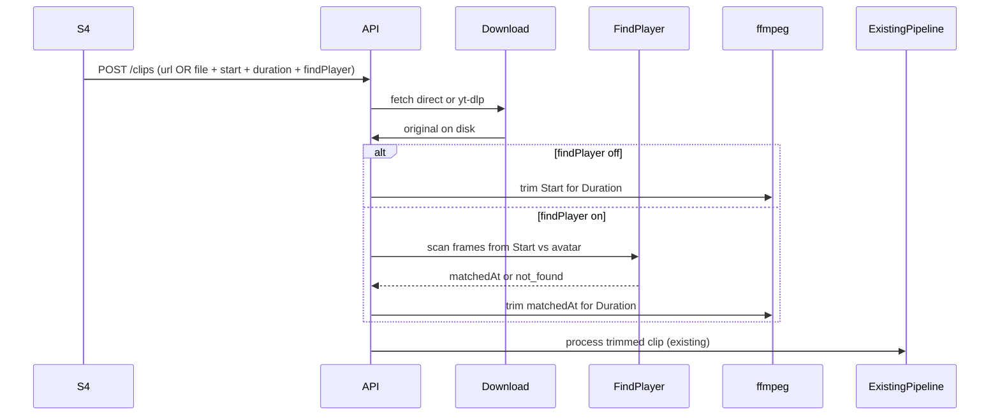

# feat: S4 video link ingest with find-player window

## Goal Capsule

Let coaches submit a clip from a **video URL** (direct file or YouTube/hosted), with **start** and **duration** in `mm:ss` (duration default `01:00`, max `02:00`), and optionally **Find player** using the roster player's **current avatar**. When Find player is on, processing seeks to start, waits until the player is detected, then extracts only that detection-aligned window for the requested duration before the existing assessment pipeline. Stop when S4 + API + download/trim/find path work end-to-end and Playwright covers the form rules.

**Authority:** this plan; origin `docs/backlog/018-video-link-ingest-player-id.md`; user scope answers (2026-07-17).

**Product Contract preservation:** bootstrap from backlog + user answers (no prior brainstorm).

## Product Contract

### Summary

Coaches often already have footage online. They need to paste a link, set where to look, and tell the app to lock onto the selected player's photo before cutting the assessment clip.

### Requirements

- R1. S4 accepts video source as **file upload** (existing) **or** **URL** (direct downloadable file URL **or** YouTube / other yt-dlp-supported hosts).
- R2. Link mode requires **Start** (`mm:ss`) and **Duration** (`mm:ss`). Duration defaults to `01:00` and must be ≥ `00:01` and ≤ `02:00`.
- R3. After a player is selected, show checkbox **Find player**. Default **ON** when that player has a stored avatar (`avatarUrl` / `player_avatar_url`); otherwise **OFF** and cannot be turned ON until a photo exists.
- R4. Find player always uses the **current player photo** on the selected roster player (no separate photo upload in this feature).
- R5. When Find player is **OFF**: download/source the video, seek to Start, extract Duration seconds, then run the existing clip processing pipeline on that extract.
- R6. When Find player is **ON**: download/source the video, seek to Start, **scan forward until the player is found** (match against avatar), then extract Duration seconds **from the first match moment**, then run existing processing. Do not extract from Start alone if Find player is on.
- R7. If Find player is ON and the player is **never found** after Start through the end of available media (or a documented search bound), the clip **fails** with a clear error (no silent fallback to Start).
- R8. Existing file-upload path remains available; link fields apply only in link mode.

### Actors

- A1. Coach / ClubAdmin / SystemAdmin submitting clips on S4 (same roles that can submit today).

### Key Flows

- F1. Link + Find player OFF → download → trim Start..Start+Duration → assess.
- F2. Link + Find player ON (avatar present) → download → seek Start → detect player → trim match..match+Duration → assess.
- F3. Select player without avatar → Find player off/disabled; coach can still submit link with Start/Duration only.

### Acceptance Examples

- AE1. Coach pastes a YouTube URL, Start `01:30`, Duration default `01:00`, player with photo, Find player ON → extract begins at first match ≥ 1:30 and lasts 60s; S6 shows a submitted/processed clip.
- AE2. Same with Find player OFF → extract is exactly 1:30–2:30 of the source.
- AE3. Duration `02:01` rejected client- and server-side.
- AE4. Player without photo: Find player cannot be enabled; submit still works with Start/Duration.
- AE5. Find player ON but no match after Start → clip status failed with user-visible reason.

### Scope Boundaries

**In scope:** S4 UI for link + timing + Find player; API ingest for URL sources; yt-dlp (or equivalent) download for hosted platforms; ffmpeg extract; vision match using existing Ollama multimodal path + player avatar; schema fields for source metadata; tests + mapping note.

**Out of scope:** Separate photo upload for matching (backlog originally offered this; superseded by “use current photo”); skill-linked multi-segment cutting (backlog `005`); changing assessment prompt quality; camera record path.

### Deferred to Follow-Up Work

- Richer face-embedding / dedicated CV model if Ollama match quality is insufficient in production.
- Progress UI for long downloads / find scans beyond existing clip status.

## Planning Contract

### Key Technical Decisions

- KTD1. **Extend S4** with an explicit source mode (Upload vs Link) rather than a new screen. Rationale: same player/situation/skills submit flow; least navigation churn.
- KTD2. **Download with yt-dlp** for hosted platforms; **HTTP(S) fetch** for direct media URLs. Persist the full downloaded original under the existing originals root, then write a trimmed working file for processing (same storage conventions as Feature 025 originals/segments).
- KTD3. **Find player via Ollama vision** (same stack as `reviewSegment`): sample frames from Start forward at a fixed interval; prompt returns whether the reference avatar appears in the frame; first positive frame timestamp becomes extract start. Rationale: no new ML stack; frames + images already supported on `/api/chat`.
- KTD4. **Persist ingest metadata on `clips`** (`source_url`, `source_start_ms`, `source_duration_ms`, `find_player`, optional `find_player_matched_ms`) so retries/audit can explain behavior. Keep file-upload rows with null URL fields.
- KTD5. **Fail closed on miss** when Find player is ON (R7). Do not fall back to Start.
- KTD6. **Duration max 02:00** applies to link extracts even though legacy upload copy still says 60s — document the link-mode exception on S4; do not silently raise the upload file limit in this plan.

### Assumptions

- `yt-dlp` is installable on the mockup/server host (PATH or config key analogous to `ffmpeg_path`); missing binary fails with an actionable error like ffmpeg.
- Avatar URLs served by the mockup are resolvable by the processor (local path or fetchable URL) when matching.
- Direct URLs must yield a media file ffmpeg can read after download; exotic streams without a downloadable representation fail with validation/processing error.

### High-Level Technical Design

### Patterns to follow

- Upload + queue: `scripts/video-processing/clip-upload.js`, `queue.js`, `process-clip.js`
- Frame + Ollama images: `ffmpeg-utils.js` (`extractSegmentFrames`, `readFramesAsBase64`), `ollama-client.js` (`reviewSegment`)
- Avatar field: `players.player_avatar_url` / client `avatarUrl`
- S4 form + `MockupApi.submitClip`: `docs/ux/mockup/S4-video-capture.html`, `mockup-api-client.js`
- Playwright: `tests/playwright/s4-video-capture.spec.js`

## Implementation Units

### U1. Schema + clip ingest API for URL / timing / find-player flags

**Goal:** Accept link submissions with validated Start/Duration/Find player and store metadata + original media.

**Requirements:** R1, R2, R4, R8

**Dependencies:** None

**Files:**
- Modify: `scripts/serve-mockup.js` (clips create route / ensureDatabase ALTER)
- Modify: `scripts/video-processing/clip-upload.js` (or sibling ingest module)
- Create: `apps/api/src/db/migrations/0NN_clip_link_ingest.sql` (next migration number)
- Modify: `apps/api/src/db/schema/tables.sql` / `deploy.sql` if those are kept in sync in this repo’s convention

**Approach:** Additive columns on `clips`. Multipart or JSON+download job: prefer keeping multipart for file mode; for link mode accept fields `videoUrl`, `startMmSs`, `durationMmSs`, `findPlayer`, `playerId`, etc. Validate duration ≤ 120s. Enqueue processing after original is stored. Offline mock mode: accept and store stub metadata without real download if backend is off (or document backend-only for link mode — prefer **backend-required for link**, file upload still works offline).

**Test scenarios:**
- Happy: valid URL fields persist; duration default applied when omitted.
- Error: duration `02:01` → 400.
- Error: Find player true but player has no avatar → 400.
- Error: neither file nor URL → 400.

**Verification:** Migration applies; create-clip with URL fields returns 201 and row columns populated.

### U2. Download + trim + find-player extract stage

**Goal:** Produce the assessment input file: downloaded original, then trimmed window per R5/R6/R7.

**Requirements:** R5, R6, R7

**Dependencies:** U1

**Files:**
- Create: `scripts/video-processing/link-ingest.js` (download + time parse helpers)
- Create: `scripts/video-processing/find-player.js` (frame scan + Ollama match prompt)
- Modify: `scripts/video-processing/process-clip.js` or `queue.js` to run extract stage before segmentation
- Modify: `scripts/video-processing/config.js` (optional `ytdlp_path` / env)
- Modify: `scripts/video-processing/ffmpeg-utils.js` (trim-by-time helper)

**Approach:**
1. Parse `mm:ss` → seconds (reject malformed).
2. Download to originals.
3. If Find player OFF: `ffmpeg` `-ss start -t duration`.
4. If ON: from Start, sample frames every N seconds (implementation chooses N, e.g. 1s); Ollama yes/no match vs avatar image; on first yes, trim from that timestamp for Duration; on never → `markClipFailed`.
5. Hand trimmed path into existing `segmentVideo` / assessment flow.
6. Audit-log download start/end, match found/missed, trim bounds.

**Execution note:** Prefer unit-testing time parsing and duration caps without network; integration/smoke for yt-dlp and Ollama when available.

**Test scenarios:**
- Happy: Find OFF trims exact window (characterization with a local fixture file).
- Happy: Find ON sets extract start to mocked match timestamp.
- Failure: Find ON + never found → failed status + error message.
- Edge: Start near EOF such that Duration cannot be fulfilled → fail or clamp? **Decide at impl:** fail with clear message if remaining media &lt; Duration after match (recommended).

**Verification:** Fixture-based tests pass; manual smoke with a short local MP4 URL optional.

### U3. S4 UI — link mode, timing fields, Find player checkbox

**Goal:** Coach-facing controls matching R1–R4 and client validation for R2/R3.

**Requirements:** R1–R4, R8, AE1–AE4

**Dependencies:** U1 (API contract)

**Files:**
- Modify: `docs/ux/mockup/S4-video-capture.html`
- Modify: `docs/ux/mockup/js/mockup-api-client.js` (`submitClip` / multipart fields)
- Modify: `docs/ux/mockup/style/site.css` only if needed for new controls
- Modify: `docs/ux/mockup/API-Mockup-Mapping.md`

**Approach:** Source toggle Upload | Link. Link shows URL, Start, Duration (default `01:00`). On player change, read `avatarUrl` from list payload; set Find player checked+enabled iff avatar present. Submit sends either file or URL+timing+findPlayer. Client mirrors duration max and Find player rules before POST.

**Test scenarios:** Covered in U4.

**Verification:** Manual UI check of defaults and disable rules.

### U4. Playwright coverage for S4 link + Find player rules

**Goal:** Lock form defaults, validation, and role of Find player without requiring live YouTube in CI.

**Requirements:** AE2–AE4 (and AE1/AE5 mocked where possible)

**Dependencies:** U3

**Files:**
- Modify: `tests/playwright/s4-video-capture.spec.js`

**Approach:** Offline/mock-local tests for UI: duration default, reject &gt; 02:00, Find player ON only when fixture player has avatar, OFF/disabled without. Backend-gated optional test if `DATABASE_URL` present for URL submit smoke (skip when unset), matching other backend-gated specs.

**Test scenarios:**
- Happy: Duration field defaults to `01:00` in link mode.
- Edge: Entering `02:01` shows validation and blocks submit.
- Happy: Player with avatar → Find player checked by default.
- Edge: Player without avatar → Find player unchecked and not enableable.
- Integration (backend-gated): submit link mode fields reaches API without client error (download may be stubbed/skipped in mock).

**Verification:** Spec updates pass under Playwright mockup config.

## Verification Contract

- Playwright: `tests/playwright/s4-video-capture.spec.js` (UI rules always; backend smoke when configured).
- Processor unit/integration tests for mm:ss parse, duration cap, find-miss failure (new or adjacent under `scripts/video-processing/` / `apps/api/tests` per repo convention).
- Manual smoke (optional): YouTube URL + Find player with a player that has an avatar on a host with `DATABASE_URL`, ffmpeg, yt-dlp, Ollama.

## Definition of Done

- Link mode works for direct URL and yt-dlp hosts; Start/Duration rules enforced; Find player defaults and avatar gating match R3–R4.
- Extract semantics match R5–R7; existing assessment pipeline still runs on the trimmed file.
- Migration + mapping doc updated; backlog `018` marked planned/done with plan link.
- Tests for UI rules and extract failure/success paths as above.

## Risks & Dependencies

| Risk | Mitigation |
|------|------------|
| Ollama match unreliable in busy footage | Tunable sample interval + clear fail; follow-up dedicated CV (deferred) |
| yt-dlp breakage / geo blocks | Actionable error; support direct URL fallback |
| Long downloads block request | Prefer create clip as `submitted` then download in queue worker (same async pattern as processing) |
| Host missing yt-dlp | Config + error message mirroring ffmpeg hint |

## Open Questions (deferred, non-blocking)

- Exact frame sample interval and Ollama yes/no prompt wording — tune during U2 implementation.
- Whether link mode is backend-only in offline mock (recommended yes).
