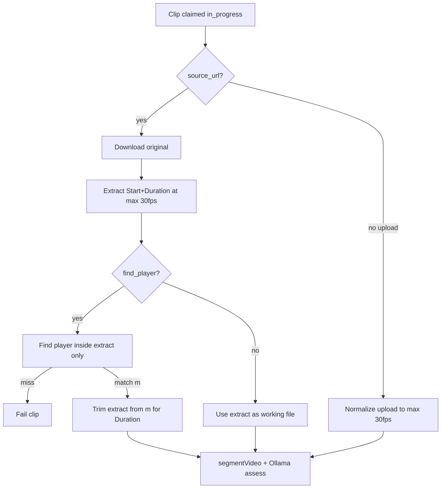

# feat: Pre-AI extract window and 30fps normalize

## Goal Capsule

Before any AI work (Find player or assessment), produce a working video that is (a) the exact Start+Duration window when those fields exist, and (b) capped at **≤ 30 fps** when the source is higher. Find player runs **only inside** that prepared clip. Uploaded files get the same fps normalize before assessment. Stop when link and upload paths both feed AI from a normalized extract and Playwright/unit coverage locks the ffmpeg contract.

**Authority:** this plan; user answers (2026-07-17): extract-first then Find player; normalize uploads too.

## Product Contract

### Summary

AI should not see the full high-fps source. Coaches already supply Start/Duration for links; the pipeline must cut that window and downscale frame rate first. Uploads get fps normalize even without a time window.

### Requirements

- R1. When Start and Duration are provided (link ingest): **first** extract exactly that window into a working file, re-encoding so output fps is **at most 30** (if source fps ≤ 30, do not upscale fps).
- R2. **Find player** (when enabled) runs **only on that extracted ≤30 fps clip**, not on the full downloaded original.
- R3. After Find player matches (or when Find player is off), assessment uses a clip that is already ≤30 fps. If Find player is on, further trim from match timestamp for Duration **within** the already-extracted window (or re-extract a Duration-length slice from the match point inside the prepared clip — see KTD2).
- R4. **File upload** path: before AI assessment, normalize the stored original to ≤30 fps (same fps rule as R1). No Start/Duration required.
- R5. Stream-copy-only trims that preserve 60 fps (or any fps > 30) are not acceptable for the AI input file.
- R6. Existing assessment / segmentation behavior after the working file is ready stays unchanged.

### Actors

- A1. Processing pipeline (mockup backend with `DATABASE_URL`).

### Acceptance Examples

- AE1. Link, Start `01:00`, Duration `01:00`, Find player OFF, source 60 fps → working file is ~60s starting at 1:00 and ≤30 fps before Ollama assessment.
- AE2. Link, Find player ON → extract Start+Duration at ≤30 fps first; scan frames only inside that file; on match, assessment input is from match for remaining Duration (or Duration capped by end of extract); on miss → fail (unchanged fail-closed).
- AE3. File upload at 60 fps → before assessment, working path is ≤30 fps.

### Scope Boundaries

**In scope:** `trimVideoWindow` / prepare stage in `process-clip` + `link-ingest`; upload normalize step; Find player ordering change; tests; short mapping note.

**Out of scope:** Changing S4 UI fields; changing max Duration 02:00; Ollama prompt quality; SystemAdmin settings page (backlog 019).

## Planning Contract

### Key Technical Decisions

- KTD1. **Always re-encode** the AI working file with ffmpeg `fps=30` (or `fps='min(30,source)'` via `fps=30` filter which caps without inventing frames when lower — use `-filter:v fps=30` which outputs at most 30; for sources under 30, prefer probing and skipping the filter or using `fps=min(30\,SOURCE_FPS)`). Practical approach: probe input fps; if > 30 apply `-vf fps=30`; else copy/re-encode without fps change as needed for a stable mp4.
- KTD2. **Find player ordering:** Download original → extract Start+Duration at ≤30 fps → Find player on extract → if match at offset `m` within extract, produce assessment file as trim from `m` for `min(Duration, extractLength - m)` at ≤30 fps (already normalized; trim may stream-copy or light re-encode). If Find player OFF, assessment file **is** the Start+Duration extract.
- KTD3. **Uploads:** After claim, if no `source_url`, run `normalizeFpsMax30(original → {clipId}_norm.mp4)` and point `video_storage_path` at the normalized file before `segmentVideo` (keep original on disk under originals for audit).
- KTD4. Replace current `-c copy` primary path in `trimVideoWindow` when this plan’s normalize is required; keep a dedicated `extractWindowMax30Fps(...)` helper so callers are explicit.

### Assumptions

- ffprobe is available alongside ffmpeg (already assumed for duration probe).
- “Most 30 fps” means **ceiling 30**, not force exactly 30 when source is lower.

### High-Level Technical Design

### Patterns to follow

- `scripts/video-processing/link-ingest.js` (`trimVideoWindow`, `probeDurationSeconds`)
- `scripts/video-processing/process-clip.js` (`prepareLinkSourceIfNeeded`)
- `scripts/video-processing/find-player.js`
- `scripts/video-processing/ffmpeg-utils.js`

## Implementation Units

### U1. ffmpeg helpers: extract window + max-30fps normalize

**Goal:** Reliable helpers that produce ≤30 fps working media for a time window or full file.

**Requirements:** R1, R4, R5

**Dependencies:** None

**Files:**
- Modify: `scripts/video-processing/link-ingest.js` (or `ffmpeg-utils.js` if preferred for shared use)
- Modify: `scripts/video-processing/link-ingest.selftest.js` (extend) or small unit coverage for probe/fps decision

**Approach:** Add `probeFps`, `normalizeMaxFps(input, output, maxFps=30)`, `extractWindowMaxFps(input, output, startSec, durationSec, maxFps=30)`. Always write a new mp4 suitable for `segmentVideo`. Do not rely on `-c copy` for the AI working file when fps must be capped.

**Test scenarios:**
- Happy: mocked/probe path chooses fps filter when fps > 30.
- Edge: fps ≤ 30 → no upscale (filter skipped or no-op).
- Happy: extract window args pass `-ss` / `-t` with re-encode.

**Verification:** Self-test or unit assertions on helper decision logic; optional ffmpeg smoke if available.

### U2. Reorder link prepare: extract first, Find player inside extract

**Goal:** Change `prepareLinkSourceIfNeeded` to match R1–R3 / KTD2.

**Requirements:** R1, R2, R3, AE1, AE2

**Dependencies:** U1

**Files:**
- Modify: `scripts/video-processing/process-clip.js`
- Modify: `scripts/video-processing/find-player.js` only if scan bounds need to be “0 → extract duration” instead of absolute source times

**Approach:** Download → `extractWindowMaxFps(start, duration)` → if find_player, scan from 0 to end of extract → on match trim from matched offset → set `video_storage_path` / `find_player_matched_ms` (document whether matched_ms is absolute from original Start or offset within extract — prefer **absolute** = `source_start_ms + matchedOffsetMs` for audit).

**Test scenarios:**
- Happy: Find player OFF uses extract as assessment path.
- Happy: Find player ON scans only extract length.
- Failure: miss still fails closed.

**Verification:** Logic review + existing fail message preserved; optional fixture test.

### U3. Normalize uploaded files before assessment

**Goal:** Upload path gets ≤30 fps working file before `segmentVideo`.

**Requirements:** R4, AE3

**Dependencies:** U1

**Files:**
- Modify: `scripts/video-processing/process-clip.js`

**Approach:** When `!sourceUrl` and `videoStoragePath` set, normalize to `{clipId}_norm.mp4` under originals (or temp then durable), update `video_storage_path`, then continue. Skip re-normalize if already processed (e.g. path ends with `_norm.mp4` or a flag — keep simple: always normalize once per process run from original path stored at submit).

**Test scenarios:**
- Happy: upload process invokes normalize before segment.
- Edge: source already ≤30 fps still produces a valid working mp4.

**Verification:** Code path + audit log event `clip.fps.normalized`.

### U4. Docs + lightweight Playwright/regression note

**Goal:** Document pipeline order; keep S4 UI tests green (no UI change expected).

**Requirements:** R1–R4

**Dependencies:** U2, U3

**Files:**
- Modify: `docs/ux/mockup/API-Mockup-Mapping.md` (S4 link ingest bullet)
- Modify: `tests/playwright/s4-video-capture.spec.js` only if needed (likely none)

**Test expectation:** none for pure docs; Playwright unchanged unless a regression appears.

**Verification:** Mapping describes extract-first + ≤30 fps + upload normalize.

## Verification Contract

- Helper self-test / unit coverage for fps decision and extract ordering.
- Manual smoke (optional): 60 fps sample with Start/Duration; confirm working file fps ≤ 30 via ffprobe before assessment logs.
- Playwright S4 suite still passes for form rules (no intentional UI change).

## Definition of Done

- Link: extract Start+Duration at ≤30 fps before Find player; Find player only inside that clip.
- Upload: ≤30 fps normalize before AI.
- Mapping updated; no stream-copy high-fps AI inputs remain on these paths.

## Risks & Dependencies

| Risk | Mitigation |
|------|------------|
| Re-encode slower / CPU | Expected; only ≤2 min windows for links; uploads already size-capped in UI |
| Find player quality on 30 fps | Acceptable; matches AI input |
| Absolute vs relative matched_ms confusion | Document in audit fields (KTD2) |
