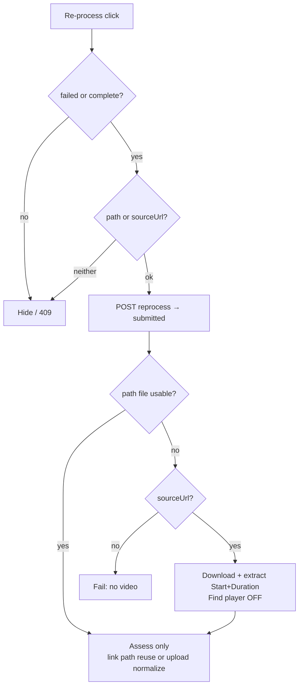

# feat: S6 reprocess assess-only or extract-then-assess

## Goal Capsule

Extend S6 **Re-process** so editors can re-run assessment on **failed and complete** clips: when `video_storage_path` / `path` is set, skip download/extract/Find player and assess that file; when it is not, extract Start+Duration from `source_url` (always skip Find player) then assess. Hide Re-process when neither path nor usable source exists. Guests unchanged. Stop when API, pipeline branch, S6 UI, Playwright, and mapping match this contract.

**Authority:** this plan; user answers (2026-07-17): failed+complete; always skip Find player on extract reprocess; hide when neither path nor source; exclude pending/in_progress.

**Product Contract preservation:** N/A (ce-plan-bootstrap).

---

## Product Contract

### Summary

Coaches need to re-score clips that already have local media without re-downloading, and recover link clips that never got a stored file by re-extracting the window then assessing.

### Requirements

- R1. S6 shows **Re-process** for signed-in Coach / ClubAdmin / SystemAdmin when clip status is `failed` or `complete`/`assessed`, and the clip has a usable local media path **or** a non-empty `sourceUrl`.
- R2. Guests never see Re-process (failed stays disabled Failed; complete keeps Back only).
- R3. Pending / `submitted` / `in_progress` never show Re-process.
- R4. If local path is set (`path` / `video_storage_path`) and the file is usable → reprocess **assess-only**: no download, no Start/Duration extract, no Find player; segment + skill assessment (+ thumbnail) on that file.
- R5. If local path is missing/unusable and `sourceUrl` is set → reprocess **extract-then-assess**: download (as today), extract Start+Duration using `sourceStartMs` / `sourceDurationMs` at ≤30 fps, **always skip Find player**, then assess; persist resulting `video_storage_path` as today.
- R6. If neither usable path nor `sourceUrl` → **hide** Re-process (do not offer a dead control).
- R7. `POST /v1/clips/{id}/reprocess` accepts `failed` and `complete`/`assessed`; still editor-scoped; still resets to `submitted` and triggers the queue; still rejects other statuses with conflict.
- R8. First-time submit behavior (honor `find_player` on initial link ingest) remains unchanged.

### Actors

- A1. Coach / ClubAdmin / SystemAdmin — Re-process on eligible failed/complete cards.
- A2. Guest — no Re-process.

### Acceptance Examples

- AE1. Complete clip with `path` set → Re-process visible; click → pending → assessment runs without yt-dlp/extract/Find player.
- AE2. Failed link clip with null path + `sourceUrl` + start/duration → Re-process visible; click → extract window (no Find player) then assess.
- AE3. Complete upload with null `sourceUrl` but `path` set → Re-process → assess-only.
- AE4. Clip with neither path nor `sourceUrl` → no Re-process button.
- AE5. Guest failed card with `sourceUrl` → Open original OK; no Re-process.

### Scope Boundaries

**In scope:** reprocess status gate; prepare/process branching; S6 visibility; offline mock parity; Playwright; mapping.

**Out of scope:** changing Open original; SystemAdmin processing_config UI (019); changing first-submit Find player; guest write actions.

### Deferred to Follow-Up Work

- Explicit “reprocess mode” DB column if mutating `find_player=false` on extract-reprocess proves too blunt in ops.

---

## Planning Contract

### Assumptions

- Public clip payloads already expose `path` (alias of `video_storage_path`) and `sourceUrl` / start / duration; S6 can gate on `path` and `sourceUrl` without a new response field.
- “Usable path” means non-empty path string; if the file is missing on disk at process time, treat as unusable and fall through to extract when `sourceUrl` exists, else fail the clip with a clear error (same family as today’s “no video”).
- On extract-needed reprocess, forcing Find player off for that run by setting `find_player=false` in the reprocess UPDATE (no migration) is acceptable; first submit still honors the flag at create time.
- `assessed` is treated like `complete` for status gates (existing S6 complete check).

### Key Technical Decisions

- KTD1. **UI eligibility:** `(failed || complete || assessed) && editor && (path || sourceUrl)`. Keep Back on complete/assessed cards; add Re-process beside it when eligible.
- KTD2. **API status gate:** widen `reprocessClip` from failed-only to `failed | complete | assessed`. Keep auth via `resolveShareEditorForPlayer`. Do not clear `video_storage_path` / `source_*` on reset.
- KTD3. **Assess-only in pipeline:** When `sourceUrl` is set **and** `videoStoragePath` is set and the file exists, `prepareLinkSourceIfNeeded` (or an early branch in `processClip`) returns the existing path immediately — no download, extract, or Find player. Upload clips without `sourceUrl` already go through normalize-or-reuse; ensure reprocess does not wipe path so that path continues to work.
- KTD4. **Extract-then-assess on reprocess:** When path missing/unusable and `sourceUrl` set, run download + window extract as today but **force Find player off** for that preparation (via KTD5).
- KTD5. **Skip Find player without migration:** On reprocess when path is empty, UPDATE sets `find_player = false` before queueing so prepare honors stored false. When path is present (assess-only), leave `find_player` unchanged (unused).
- KTD6. **Do not change first submit:** create/upload path still sets `find_player` from the form; only reprocess forces false when extract is needed.

### High-Level Technical Design

### Patterns to follow

- Reprocess API/UI: plan `docs/plans/2026-07-17-008-feat-s6-open-original-reprocess-plan.md` and current `reprocessClip` / S6 card actions
- Link prepare: `scripts/video-processing/process-clip.js` `prepareLinkSourceIfNeeded`
- Playwright: `tests/playwright/s6-assessment-list.spec.js` localStorage fixtures

### Risks

- Assess-only on a corrupt partial file: accepted per product (path set ⇒ trust path); process failure surfaces as failed again.
- Setting `find_player=false` on extract-reprocess mutates clip metadata; documented in Assumptions / deferred column.

---

## Implementation Units

### U1. Widen reprocess API and force extract-without-Find-player

**Goal:** Editors can reprocess failed and complete clips; extract-needed reprocess disables Find player for the run; path and source fields preserved.

**Requirements:** R7, R5, R8

**Dependencies:** None

**Files:**
- Modify: `scripts/video-processing/clip-upload.js` (`reprocessClip`)
- Modify: `docs/ux/mockup/js/mockup-api-client.js` (offline `reprocessClip` status gate + find_player)
- Optionally touch: `scripts/serve-mockup.js` only if error messages need route-level wording

**Approach:** Accept `failed` / `complete` / `assessed`. Keep field clears for scores/errors/timestamps; **do not** clear `video_storage_path` or `source_*`. If path empty after normalize, set `find_player = false` in the same UPDATE. Update 409 conflict copy from "Only failed clips can be re-processed." to reflect the widened status gate (e.g., "Only failed or complete clips can be re-processed.") in `clip-upload.js` and offline `mockup-api-client.js`. Offline mock mirrors status + find_player behavior.

**Test scenarios:**
- Happy: complete clip → 202, status `submitted`, path unchanged.
- Happy: failed null path + sourceUrl → 202, `find_player` false.
- Error: pending clip → 409.
- Error: missing actor / out of club → 403 (existing).

**Verification:** Manual or targeted call against backend when `DATABASE_URL` set; offline mock returns 202 for complete.

### U2. Pipeline: assess-only vs extract-without-Find-player

**Goal:** Processing respects path reuse vs extract; Find player never runs when path was reused or when `find_player` is false after U1.

**Requirements:** R4, R5, R8

**Dependencies:** U1

**Files:**
- Modify: `scripts/video-processing/process-clip.js`
- Optionally: `scripts/video-processing/link-ingest.selftest.js` or a small prepare-focused selftest if branching is pure enough

**Approach:** At start of link prepare (or before calling it): if `videoStoragePath` exists on disk, return it immediately. Otherwise download + extract Start+Duration; only enter Find player when `clip.findPlayer` is true (reprocess extract path will have false). Preserve first-submit behavior when path is null and `findPlayer` true. Missing path + missing sourceUrl → existing no-video failure.

**Test scenarios:**
- Happy: path exists + sourceUrl → no download/extract (assert via audit events or stubbed helpers if tests mock them).
- Happy: no path + sourceUrl + findPlayer false → extract window only, no find-player call.
- Regression: no path + sourceUrl + findPlayer true (first submit) → Find player still runs.
- Error: path missing on disk, no sourceUrl → failed with no-video style message.

**Verification:** Selftest or vitest where present; otherwise smoke one assess-only and one extract reprocess against a known clip.

**Execution note:** Prefer characterizing prepare branching with a focused unit/selftest before wiring S6, if helpers are exportable.

### U3. S6 UI eligibility + Playwright + mapping

**Goal:** Card shows Re-process for eligible failed/complete editors; hides when media/source unusable; docs/tests lock AE1–AE5.

**Requirements:** R1–R3, R6 (verifies AE1–AE5)

**Dependencies:** U1 (API/mock), U2 for end-to-end smoke only

**Files:**
- Modify: `docs/ux/mockup/S6-assessment-list.html`
- Modify: `tests/playwright/s6-assessment-list.spec.js`
- Modify: `docs/ux/mockup/API-Mockup-Mapping.md`

**Approach:** Keep `canReprocess` as the editor-role gate (Coach / ClubAdmin / SystemAdmin, non-guest). Add `isReprocessEligible = (isFailed || isComplete) && (path || sourceUrl)` where `isComplete` includes `assessed`. Show Re-process when `canReprocess && isReprocessEligible`; complete/assessed cards keep Back and add Re-process beside it when eligible. Keep Open original independent. Update mapping bullet for failed+complete and assess-only vs extract paths. Playwright: complete+path shows reprocess; neither path nor source hides it; guest still hides; failed+source still shows.

**Test scenarios:**
- Covers AE1: complete + path → reprocess visible (offline).
- Covers AE2: failed + null path + sourceUrl + start/duration → reprocess visible; click → extract path (no Find player) then assess.
- Covers AE3: complete upload + null sourceUrl + path → reprocess → assess-only (no yt-dlp/extract/Find player).
- Covers AE4: no path, no sourceUrl → no reprocess.
- Covers AE5: guest failed + sourceUrl → no reprocess.
- Edge: complete + sourceUrl only (no path) → reprocess visible.

**Verification:** Playwright S6 suite for new cases; run as part of Definition of Done.

---

## Verification Contract

- Playwright: S6 reprocess visibility for complete / hide-when-unusable / guest.
- Pipeline: assess-only does not re-download when path exists; extract reprocess skips Find player.
- Mapping documents failed+complete and both processing branches.

## Definition of Done

- Editors can Re-process failed and complete clips with path or sourceUrl.
- Path present → assess-only; path absent + sourceUrl → extract without Find player then assess.
- Neither → no button; guests unchanged; pending excluded.
- First-submit Find player behavior preserved.
- Tests and mapping updated.
