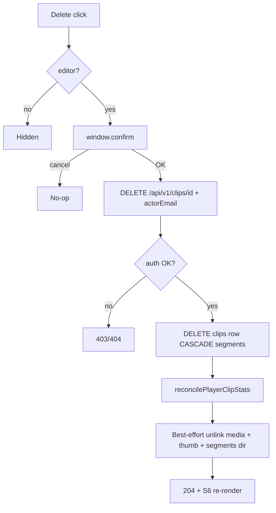

# feat: S6 hard-delete clip for editors

## Goal Capsule

On S6, editors (Coach / ClubAdmin / SystemAdmin) can **Delete** any visible clip after confirm; guests never see Delete. Hard-delete removes the clip row (segments cascade), best-effort deletes stored media/thumbnail files, reconciles player clip stats, and refreshes the list. Stop when API, UI, offline mock, Playwright, and mapping match this contract.

**Authority:** this plan; user answers (2026-07-17): hard delete; any status; confirm dialog; allow while in_progress.

**Product Contract preservation:** N/A (ce-plan-bootstrap).

---

## Product Contract

### Summary

Editors need to permanently remove mistaken or unwanted video assessments from S6 without CLI or DB access.

### Requirements

- R1. S6 shows **Delete** (`[data-testid="delete-clip"]`) for signed-in Coach / ClubAdmin / SystemAdmin on every card the editor can see (any status: failed, complete/assessed, pending/submitted/in_progress).
- R2. Guests never see Delete.
- R3. Clicking Delete shows a confirm dialog; cancel leaves the clip unchanged.
- R4. Confirm → `DELETE /api/v1/clips/{clipId}` with `actorEmail`; on success the card disappears (re-render list).
- R5. Hard delete: remove `clips` row; `clip_segments` cascade; best-effort unlink `video_storage_path`, known segment paths / segments dir, and `thumbnails/{clipId}.jpg` under the video root. File failures must not leave the API succeeding without DB delete — prefer DB delete then best-effort files (orphan files acceptable).
- R6. After delete, call `reconcilePlayerClipStats` for the clip’s player.
- R7. Auth mirrors reprocess: active SystemAdmin or club-scoped Coach/ClubAdmin for that player; missing/unauthorized actor → 403; unknown clip → 404.
- R8. Allow delete while `in_progress` (worker may race; processing no-ops if row gone).

### Actors

- A1. Coach / ClubAdmin / SystemAdmin — Delete with confirm.
- A2. Guest — no Delete.

### Acceptance Examples

- AE1. Coach on complete card → Delete visible; cancel confirm → card remains.
- AE2. Coach confirm Delete → clip gone from grid; Open original / Re-process for that id gone.
- AE3. Guest share S6 → no Delete even on failed cards.
- AE4. Coach deletes pending/in_progress card → accepted; list updates.

### Scope Boundaries

**In scope:** DELETE API; file best-effort cleanup; S6 UI + confirm; offline mock; Playwright; mapping.

**Out of scope:** soft delete; bulk delete; undo; changing Re-process / Open original rules; guest write; processing_config UI.

---

## Planning Contract

### Assumptions

- `clip_segments.clip_id` has `ON DELETE CASCADE` (migration 021 / serve-mockup bootstrap) — no manual segment row deletes required.
- Best-effort file cleanup may miss intermediate files (`_window.mp4`, downloads); deleting `video_storage_path`, thumbnail convention path, and `segments/{clipId}` directory (if present) is enough for DoD.
- Confirm uses `window.confirm` (same family as other mockup confirms); no custom modal required.
- DELETE returns **204** (match other DELETE routes) or **200** with empty body — prefer **204**.

### Key Technical Decisions

- KTD1. **Route:** `DELETE /api/v1/clips/{clipId}` with `actorEmail` in JSON body (or query, matching share-revoke flexibility — prefer body for consistency with reprocess). Auth via `resolveShareEditorForPlayer`.
- KTD2. **Helper:** `deleteClip(pool, clipId)` in `scripts/video-processing/clip-upload.js` (alongside `reprocessClip`): load paths → DELETE clip → reconcile stats → unlink files best-effort → audit `clip.deleted`.
- KTD3. **UI:** Same `canReprocess` role gate renamed or shared as `canEditClips`; show Delete on all non-guest editor cards; place in `.result-actions` beside Re-process / Back / Pending. Confirm then `MockupApi.deleteClip` then `render()`.
- KTD4. **Offline mock:** remove clip from store; club-scope check mirrors reprocess.

### High-Level Technical Design

### Patterns to follow

- Auth/route: `POST .../reprocess` and `DELETE /players/{id}/share` in `scripts/serve-mockup.js`
- Stats: `reprocessClip` → `reconcilePlayerClipStats`
- Paths: `scripts/video-processing/config.js` (`thumbnailPathForClip`, `segmentsDirForClip`)
- S6 actions: `docs/ux/mockup/S6-assessment-list.html` reprocess button + click handler
- Playwright: `tests/playwright/s6-assessment-list.spec.js`

### Risks

- Worker race on in_progress: accepted; loadClip may 404/no-op.
- Orphan files if paths outside video root: only unlink paths under video root (reuse media path safety if available).

---

## Implementation Units

### U1. DELETE clip API + hard delete helper

**Goal:** Editors can hard-delete any clip for a scoped player; segments cascade; stats reconcile; files best-effort removed.

**Requirements:** R4–R8

**Dependencies:** None

**Files:**
- Modify: `scripts/video-processing/clip-upload.js` (add `deleteClip`)
- Modify: `scripts/serve-mockup.js` (DELETE route + export/import)
- Modify: `docs/ux/mockup/js/mockup-api-client.js` (`deleteClip`)
- Reuse: `scripts/video-processing/config.js`, `reconcile-player-clip-stats.js`

**Approach:** Auth like reprocess. Capture `video_storage_path`, segment paths (query before delete), and `playerId`. `DELETE FROM clips WHERE id = $1`. Reconcile. Unlink captured paths + thumbnail path; remove `segmentsDirForClip(clipId)` recursively (best-effort). Export `deleteClip` from `clip-upload.js` module.exports. Offline: splice clip from store after scope check. Return 204.

**Test scenarios:**
- Happy: editor deletes complete clip → 204; subsequent GET list omits id.
- Happy: delete in_progress → 204.
- Error: guest/missing actor → 403.
- Error: unknown id → 404.
- Error: coach outside club → 403.

**Verification:** Manual DELETE with `DATABASE_URL` when available; offline mock removes from list.

### U2. S6 Delete control + confirm + Playwright + mapping

**Goal:** Editors see Delete on every card; guests never; confirm then refresh; docs/tests lock AE1–AE4.

**Requirements:** R1–R3, AE1–AE4

**Dependencies:** U1

**Files:**
- Modify: `docs/ux/mockup/S6-assessment-list.html`
- Modify: `tests/playwright/s6-assessment-list.spec.js`
- Modify: `docs/ux/mockup/API-Mockup-Mapping.md`
- Optionally: `docs/ux/mockup/style/site.css` if destructive button needs a quiet variant

**Approach:** Shared editor gate; always append Delete for editors. `window.confirm` before API. On failure, alert and keep card. Playwright: coach sees delete; cancel keeps card; confirm removes; guest has zero delete buttons. Mapping documents DELETE + visibility.

**Test scenarios:**
- Covers AE1: cancel confirm → card still present.
- Covers AE2: confirm → card count drops / situation text gone.
- Covers AE3: guest → `delete-clip` count 0.
- Covers AE4: pending card shows Delete for coach.

**Verification:** Playwright S6 cases for Delete.

---

## Verification Contract

- Playwright: Delete visibility, cancel, confirm remove, guest hidden.
- Backend smoke when available: DELETE returns 204; clip absent; stats reconciled.
- Mapping documents editor-only hard delete.

## Definition of Done

- Editors can confirm-delete any S6 clip; guests cannot.
- Hard delete: DB + cascade segments + best-effort files + stats reconcile.
- Offline mock, Playwright, and mapping updated.
