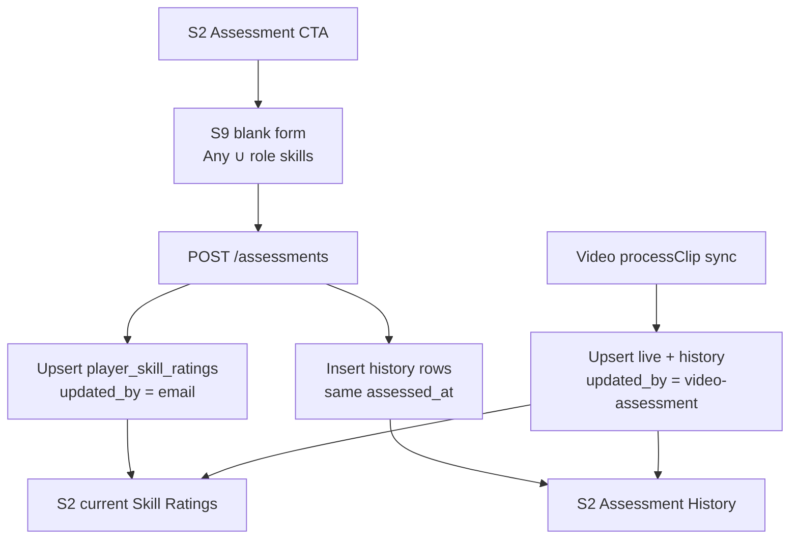

# feat: player Assessment screen and skill ratings history

## Goal Capsule

Add a dedicated **Assessment** flow (new `S9-assessment.html`) so Coach / ClubAdmin / SystemAdmin can enter a fresh set of skill ratings for a player (same skill union as S2), without prefilling prior values. Saving upserts `player_skill_ratings` for rated skills only, stamps text `updated_by`, and inserts matching rows into `player_skill_ratings_history` sharing one event timestamp. S2 gains an Assessment History section (non-guest) styled like S1 Any-Position skills. Video assessment sync also writes history with `updated_by = 'video-assessment'`. S5 skill-rating writes become read-only so Assessment is the sole coach UI write path. Stop when schema, API, S9, S2 history, video sync, Playwright, and mapping match this contract.

**Authority:** this plan; user answers (2026-07-18): new S9 screen; editors = Coach/ClubAdmin/SystemAdmin; text actor field; partial ratings OK; Assessment-only UI writes; S2 ratings stay display-only; video events share one timestamp; screen id S9.

**Product Contract preservation:** N/A (ce-plan-bootstrap).

---

## Product Contract

### Summary

Coaches need a first-class Assessment entry point and a durable history of every assessment event (manual or video), while the live `player_skill_ratings` table continues to hold the current snapshot.

### Requirements

- R1. S2 toolbar: add an Assessment action **immediately after** the Edit icon; navigates to `S9-assessment.html?playerId=…` for the current player. Guests: control absent or inert (same family as Edit).
- R2. S9 Assessment form lists all skills from the same logic as S2 / `listSkillsForPlayer` (Any Position ∪ role-unique). Inputs start **empty** (do not show previously saved ratings).
- R3. Save allowed with **partial** ratings: only skills with a numeric rating are written; blank skills are skipped (no delete of existing current ratings for blanks).
- R4. On Save: upsert those ratings into `player_skill_ratings` with `updated_by` = actor text (session user email or stable user id string — prefer **email** for display); insert one `player_skill_ratings_history` row per rated skill, all sharing the **same** `assessed_at` timestamptz for that Save.
- R5. New table `player_skill_ratings_history` mirrors rating fields plus history keys (`assessed_at`, `updated_by`, and enough identity to group an event). Include `player_id`, `skill_id`, `rating`, timestamps as needed.
- R6. Add text column `updated_by` to `player_skill_ratings` (who last updated the live row).
- R7. S2 **Assessment History** section (hidden for guests): each event shows Date, Time, User (`updated_by`), and **Any Position / “core” skills** in the same visual pattern as S1 player-card skill abbr + rating grids (not the full role skill set).
- R8. Video pipeline (`syncPlayerSkillRatingsFromClip`): when upserting live ratings, also write history rows for that sync with one shared `assessed_at` and `updated_by = 'video-assessment'`.
- R9. Manual Assessment API/UI restricted to active Coach / ClubAdmin / SystemAdmin with existing club scope rules for the player.
- R10. S5 player-edit **stops writing** skill ratings (display-only or remove save of ratings); Assessment is the only coach UI that mutates ratings. Existing PUT skill-ratings may be reused/replaced by a dedicated Assessment endpoint that also writes history.

### Actors

- A1. Coach / ClubAdmin / SystemAdmin — start Assessment from S2; save; view Assessment History.
- A2. Guest — no Assessment CTA; no Assessment History.
- A3. Video assessment system — writes live ratings + history with actor `video-assessment`.

### Acceptance Examples

- AE1. Editor on S2 clicks Assessment after Edit → S9 loads for that player with empty rating fields for Any+role skills.
- AE2. Editor rates a subset and Saves → live ratings update only for those skills; history has N rows with identical `assessed_at`; S2 history shows one event with Date/Time/User and Any-Position skill strip.
- AE3. Guest S2 → no Assessment button; Assessment History hidden.
- AE4. Completed video clip sync → history event with User `video-assessment` and shared timestamp for skills written from that clip.
- AE5. S5 Save no longer changes skill ratings (Assessment-only writes).

### Scope Boundaries

**In scope:** migration; Assessment API; S9 screen; S2 CTA + history section; S5 read-only ratings; video sync history; Playwright; mapping.

**Out of scope:** editing/deleting past history events; guest-initiated assessments; requiring all skills rated; Change History (`player_data_audits`) redesign (may continue to receive audits if existing helpers still fire — do not block on removing audits).

### Deferred to Follow-Up Work

- Drill-in from a history event to full Any+role skill list for that event.
- Filtering/pagination if history grows large.

---

## Planning Contract

### Assumptions

- Actor text for humans = session **email** (readable in History “User” column). Video = literal `video-assessment`.
- History event identity = `(player_id, assessed_at, updated_by)` grouping; no separate `assessment_id` UUID required for v1 (add later if needed).
- “Core Skills” in History = sport’s **Any Position** skills only (S1 card pattern), even when the Assessment also rated role skills.
- Blank on Save does **not** clear existing live ratings for that skill.
- Next migration number continues after current max under `apps/api/src/db/migrations/` (implementer picks next `NNN_…sql` and mirrors serve-mockup bootstrap / `tables.sql` / `deploy.sql` as this repo does today).

### Key Technical Decisions

- KTD1. **Screen:** `docs/ux/mockup/S9-assessment.html` (+ Playwright `tests/playwright/s9-assessment.spec.js`).
- KTD2. **Schema:** migration adds `updated_by TEXT` to `player_skill_ratings`; creates `player_skill_ratings_history` with `(player_id, skill_id, rating, updated_by, assessed_at, created_at)` and index on `(player_id, assessed_at DESC)`.
- KTD3. **API:** prefer `POST /api/v1/players/{playerId}/assessments` with `{ actorEmail, ratings: [{ skillId, rating }] }` that upserts live + inserts history in one transaction with `const assessedAt = new Date()` / `NOW()` once. Deprecate or stop using coach PUT skill-ratings from UI (keep PUT only if needed for back-compat tests — S5 must not call it).
- KTD4. **History list API:** `GET /api/v1/players/{playerId}/assessment-history` returns events grouped by `assessed_at` + `updated_by`, each with Any-Position skill ratings for that event (join skills / Any Position catalog).
- KTD5. **Video:** extend `upsertPlayerSkillRating` / `syncPlayerSkillRatingsFromClip` to set `updated_by` and batch-insert history with one `assessedAt` per sync call.
- KTD6. **S2 CTA:** icon/button `data-testid="assessment-link"` after `#editPlayerLink`; S2 section `data-testid="assessment-history-section"` hidden for guests.
- KTD7. **S5:** skill rating inputs become read-only (or remove from save payload); document in mapping.

### High-Level Technical Design

### Patterns to follow

- Skill union: `listSkillsForPlayer` in `scripts/serve-mockup.js`
- Live upsert + audits: `upsertSkillRatings` / S5 `updatePlayerSkillRatings`
- Video sync: `scripts/video-processing/sync-player-skill-ratings-from-clip.js`
- S1 visual: `buildAnySkillsMarkup` in `docs/ux/mockup/S1-player-list.html`
- Guest gating: S2 Change History section pattern
- Editor auth: `resolveShareEditorForPlayer` / club-scoped coach patterns

### Risks

- S5 currently saves ratings — must update S5 + Playwright that expect rating writes from S5.
- History without `assessment_id` relies on timestamp equality; use a single DB `timestamptz` bound in the transaction.
- Large history: defer pagination (Deferred).

---

## Implementation Units

### U1. Schema: `updated_by` + `player_skill_ratings_history`

**Goal:** Persist actor on live ratings and append-only history rows.

**Requirements:** R5, R6

**Dependencies:** None

**Files:**
- Create: `apps/api/src/db/migrations/028_player_skill_ratings_history.sql`
- Modify: `apps/api/src/db/schema/tables.sql`, `apps/api/src/db/schema/deploy.sql` as repo convention
- Modify: `scripts/serve-mockup.js` bootstrap `CREATE TABLE` / `ALTER` for local DB

**Approach:** Add nullable `updated_by TEXT` to live table. History table mirrors player/skill/rating + `updated_by` + `assessed_at`. Indexes for player timeline queries.

**Test scenarios:**
- Happy: migration applies idempotently on empty DB.
- Edge: existing rating rows get `updated_by` NULL until next write.

**Verification:** Migration runs against project DB; serve-mockup bootstrap creates tables.

### U2. Assessment write API + history helper + video sync

**Goal:** One transactional write path for manual Assessment and video sync that updates live + history.

**Requirements:** R3, R4, R8, R9

**Dependencies:** U1

**Files:**
- Modify: `scripts/serve-mockup.js` (POST assessments; GET assessment-history; wire auth)
- Modify: `scripts/video-processing/sync-player-skill-ratings-from-clip.js`
- Modify: `docs/ux/mockup/js/mockup-api-client.js` (`submitAssessment`, `listAssessmentHistory`)
- Optionally extract shared helper module under `scripts/video-processing/` or `scripts/` if serve-mockup and sync both need it

**Approach:** Shared helper `recordSkillAssessment(pool, { playerId, ratings, updatedBy, assessedAt?, source? })`. Manual route supplies `actorEmail` → `updatedBy`. Video passes `updatedBy: 'video-assessment'` and ratings from clip map. GET history groups by `(assessed_at, updated_by)` and attaches Any-Position skill ratings for display.

**Test scenarios:**
- Happy: POST two ratings → live upserted; 2 history rows same `assessed_at`.
- Happy: blank skills omitted; prior live rating for blank skill unchanged.
- Error: non-editor → 403; unknown player → 404; rating out of 0–100 → 400.
- Happy: sync from clip → history `updated_by = video-assessment`.

**Verification:** Offline mock + backend smoke when `DATABASE_URL` set.

**Execution note:** Prefer a focused unit/selftest around history timestamp equality if helpers are extractable.

### U3. S9 Assessment screen + S2 CTA; S5 ratings read-only

**Goal:** Editors can open Assessment from S2 and save a blank-slate form; S5 no longer writes ratings.

**Requirements:** R1, R2, R3, R10, AE1, AE5

**Dependencies:** U2

**Files:**
- Create: `docs/ux/mockup/S9-assessment.html`
- Modify: `docs/ux/mockup/S2-player-dashboard.html` (CTA after Edit)
- Modify: `docs/ux/mockup/S5-player-edit.html` (ratings display-only; stop `updatePlayerSkillRatings` on save)
- Modify: `docs/ux/mockup/style/site.css` if needed
- Create: `tests/playwright/s9-assessment.spec.js`
- Modify: existing S5 Playwright if it asserts rating saves

**Approach:** S9 loads skills via dashboard/listSkillsForPlayer; empty number inputs; Save → `submitAssessment`; redirect back to S2. Toolbar Assessment control `data-testid="assessment-link"`. Guests: hide/inert Assessment like Edit.

**Test scenarios:**
- Covers AE1: CTA order Edit then Assessment; S9 empty fields.
- Happy: partial save → success toast/redirect; S2 shows updated live ratings.
- Covers AE5: S5 save does not call skill-ratings write.
- Guest: Assessment CTA not actionable.

**Verification:** Playwright S9 + updated S5 specs.

### U4. S2 Assessment History section + mapping

**Goal:** Non-guest S2 shows history events with Date, Time, User, Any-Position skill strip (S1 style).

**Requirements:** R7, AE2, AE3, AE4

**Dependencies:** U2, U3

**Files:**
- Modify: `docs/ux/mockup/S2-player-dashboard.html`
- Modify: `docs/ux/mockup/style/site.css` (reuse / lightly extend `.player-card-skills` patterns)
- Modify: `tests/playwright/s2-*.spec.js` or new cases in existing S2/guest specs
- Modify: `docs/ux/mockup/API-Mockup-Mapping.md`

**Approach:** Section after Skill Ratings or near Change History; `hidden` for guests; render events newest-first; User column shows `updated_by` (`video-assessment` literal OK).

**Test scenarios:**
- Covers AE2: after Assessment save, history shows one event with user email.
- Covers AE3: guest → section hidden.
- Covers AE4: mock/fixture video history row displays User `video-assessment`.

**Verification:** Playwright guest + editor history visibility.

---

## Verification Contract

- Migration + bootstrap create history table and `updated_by`.
- POST assessment + video sync write live + history with shared timestamps.
- S9 blank form; S2 CTA; S2 history; S5 no rating writes; guests gated.
- Mapping documents Assessment, history API, and video actor string.

## Definition of Done

- Editors can assess a player from S2 → S9 and see grouped history on S2.
- Live ratings + history + `updated_by` populated for manual and `video-assessment` paths.
- Guests cannot assess or view Assessment History.
- S5 no longer mutates skill ratings.
- Tests and mapping updated.
