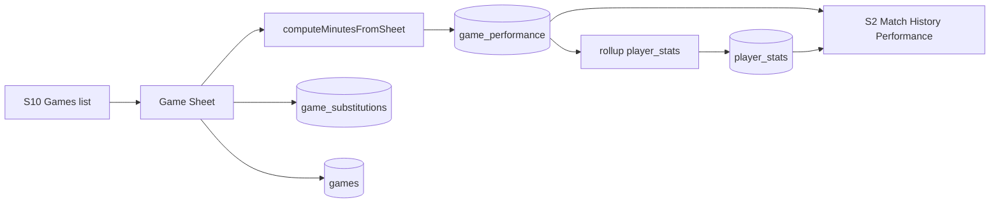

# feat: coach games ledger, Game Sheet, and Match History Performance

## Goal Capsule

Give Coach / ClubAdmin / SystemAdmin a **Games** surface (S10) to manage upcoming and past fixtures, complete a post-match **Game Sheet** (starters, substitution events with who out / who in / minute, per-player game rating 0–10), persist `game_performance` with event-sourced minutes, roll up season fields on `player_stats`, and show **Match History Performance** on S2 (replacing aggregate-only Match Time History content). Stop when schema, API, S10 sheet, S2 section, rollup, mapping, and Playwright match this contract.

**Authority:** this plan; user confirmations (2026-07-18): full v1 with sub graph; S10 Games screen; S2 replaces Match Time History (season totals as summary strip); rating scale 0–10; ideation top pick.

**Product Contract preservation:** N/A (ce-plan-bootstrap from ideation). Locked defaults for scoping forks recorded under Assumptions.

---

## Product Contract

### Summary

Today match minutes and scores are coach-edited aggregates on `player_stats` with no game ledger. Coaches need fixtures, a Game Sheet that records lineup/subs/ratings, durable per-game rows, and a player dashboard history that reflects real matches — without conflating game ratings with S9 skill Assessment.

### Requirements

- R1. New screen `S10-games.html` with bottom-nav **Games**; list fixtures for teams in actor scope (upcoming + past), filter by team when multiple.
- R2. Create/edit fixture: team, kickoff date/time, opponent, home/away, planned duration minutes (default 90), status `upcoming` | `complete` (v1: skip live `in_progress` clock).
- R3. Game Sheet (complete or edit complete game): roster from team assignments; mark **starters**; log ordered **substitutions** as (minute, playerOutId, playerInId); optional notes; per participating player **game rating** 0–10 (blank allowed = no rating yet).
- R4. Minutes are **event-sourced**: starters on from 0; each sub ends out-player interval and starts in-player; whistle at `durationMinutes` closes open intervals. Persist computed minutes on `game_performance`. Do not treat free-typed minutes as source of truth (optional display of computed value only).
- R5. Persist `game_performance` one row per player who started or entered via sub: `game_id`, `player_id`, `started` bool, `minutes`, `rating` nullable, timestamps. Upsert on sheet save.
- R6. On sheet save (status → complete or update complete): recompute affected players’ `player_stats.total_minutes`, `appearances`, `recent_avg` (last N completed games), `average_score` / `last_match_score` from game ratings where present; clear `missing_data_message` when at least one completed game performance exists.
- R7. S2: replace **Match Time History** section with **Match History Performance** (`data-testid="match-history-performance-section"`): season summary strip (total minutes, appearances, recent avg) + list of completed games for that player (date, opponent, minutes, rating). Hidden for guests like other editor-only history sections when appropriate; guests may see read-only if share dashboard includes stats — match existing guest rules for match-time visibility.
- R8. S5 match-time / last-match score fields become **display-only** (or removed from save payload); Game Sheet is the write path for match participation metrics.
- R9. Game rating must not write `player_skill_ratings` or Assessment history.
- R10. Editors: active Coach / ClubAdmin / SystemAdmin with existing club/team scope patterns (`resolveShareEditorForPlayer` / team list scoping). Guests: no Games nav write; no Game Sheet mutate.

### Actors

- A1. Coach / ClubAdmin / SystemAdmin — manage fixtures, complete sheets, view S2 history.
- A2. Guest — no write; S2 history visibility follows existing share dashboard stats rules.

### Key Flows

- F1. Create upcoming game → open sheet after match → set starters → add subs → rate players → Save → `game_performance` + rollup → S2 shows event.
- F2. Edit completed sheet → recompute minutes + rollup idempotently.
- F3. Open S2 for player → Match History Performance lists games newest-first.

### Acceptance Examples

- AE1. Coach creates fixture for U19 Prime vs “Rivals FC”, duration 90; completes sheet with 11 starters; no subs; all rated 7 → each starter has 90 minutes; S2 shows one row 90' / 7.0; `player_stats.total_minutes` increases by 90 for those players.
- AE2. Starter A subbed out at 60 for B → A minutes 60, B minutes 30; sheet shows A out / B in.
- AE3. Guest cannot open mutable Game Sheet; Games write CTAs inert or hidden.
- AE4. Saving S5 profile does not change `total_minutes` / appearances.
- AE5. Completing an Assessment (S9) does not create `game_performance` rows.

### Scope Boundaries

**In scope:** migration; Games API; S10 list + sheet; minutes engine; rollup; S2 section; S5 read-only match fields; nav; mapping; Playwright.

**Out of scope:** live sideline timer; formation canvas; parent fairness reports; clip↔game linking; multi-period quarter clocks; injury-without-replacement special UI beyond “sub out with no in” if needed as deferred edge; pre-match lineup draft as separate saved state (deferred — sheet can still set starters on complete).

### Deferred to Follow-Up Work

- Pre-match lineup draft that seeds the sheet (#7 ideation).
- Live `in_progress` match clock mode.
- Soft-link video clips to a game.
- Injury/red-card without replacement as first-class event types.
- Club-wide fixture calendar beyond team-filtered list.

---

## Planning Contract

### Assumptions

- Confirmed defaults: **S10** Games screen + nav; S2 **replaces** Match Time History with Match History Performance (summary strip + per-game list); rating **0–10** (one decimal allowed, e.g. 7.5).
- Table name: `game_performance` (snake_case; user said `Game_Performance`).
- Substitution “by whom” = `player_out_id` replaced by `player_in_id` at `minute`.
- Duration is a single integer `duration_minutes` on the game (default 90); no half-time pause modeling in v1 (subs use absolute match clock 0…duration).
- Origin ideation: `docs/ideation/2026-07-18-match-game-performance-ideation.html`.

### Key Technical Decisions

- KTD1. **Schema:** `games` (team_id, kickoff_at, opponent, home_away, duration_minutes, status, created_by…); `game_substitutions` (game_id, minute, player_out_id, player_in_id, seq); `game_performance` (game_id, player_id PK, started, minutes, rating NUMERIC). Migration `029_…`. Mirror `tables.sql` / `deploy.sql` / serve-mockup bootstrap.
- KTD2. **Minutes engine:** pure function `computeMinutesFromSheet({ durationMinutes, starterIds, substitutions })` → Map playerId → minutes; shared by API save and tests.
- KTD3. **API (serve-mockup):**  
  - `GET/POST /api/v1/games`  
  - `GET/PATCH /api/v1/games/{gameId}`  
  - `PUT /api/v1/games/{gameId}/sheet` body: `{ actorEmail, starters[], substitutions[], ratings: [{ playerId, rating }] }`  
  - `GET /api/v1/players/{playerId}/match-history` → events for S2  
  Auth: club-scoped coach patterns; SystemAdmin unrestricted.
- KTD4. **Rollup:** after sheet save, for each touched player recompute from all completed `game_performance` rows (not incremental blind add) so edits stay correct.
- KTD5. **S2:** rename section to Match History Performance; keep `data-section` slug migration (`match-time` → `match-history` or keep slug and change title — prefer new slug `match-history` and update localStorage key consumers carefully).
- KTD6. **Offline mock:** `store.games`, `store.gameSubstitutions`, `store.gamePerformances` in mockup-api-client with same shapes.
- KTD7. **S5:** stop writing match-time fields on profile save (mirrors Assessment-only skill writes).

### High-Level Technical Design

### Patterns to follow

- Assessment write path: `scripts/player-skill-assessment.js` + S9 / S2 history
- Club scope: `resolveShareEditorForPlayer`, team list `GET /teams?actorEmail=`
- Collapsible S2 sections + guest gating
- Migration + bootstrap + dual-mode client

### Risks

- Sub validation (same player twice on pitch, sub before 0 / after duration, out player not on pitch) — enforce on save with clear 400s.
- localStorage section slug rename may reset collapse state — acceptable.
- Seeded demo `player_stats` vs new empty games — rollup may zero fabricated minutes when first real game saved for that player only; do not wipe unrelated players.

---

## Implementation Units

### U1. Schema: games, substitutions, game_performance

**Goal:** Persist fixtures, sub events, and per-player game rows.

**Requirements:** R2, R3, R5

**Dependencies:** None

**Files:**
- Create: `apps/api/src/db/migrations/029_games_and_game_performance.sql`
- Modify: `apps/api/src/db/schema/tables.sql`, `apps/api/src/db/schema/deploy.sql`
- Modify: `scripts/serve-mockup.js` (bootstrap CREATE/ALTER)
- Create: `apps/api/tests/integration/db/games-migration.spec.ts` (artifact mirror checks)

**Approach:** `games` FK `teams(id)`; substitutions FK players; `game_performance` composite PK `(game_id, player_id)`; indexes on `(team_id, kickoff_at DESC)` and `(player_id)`.

**Test scenarios:**
- Happy: migration idempotent CREATE IF NOT EXISTS.
- Edge: rating CHECK 0–10 nullable; minutes >= 0.

**Verification:** Artifact test passes; bootstrap creates tables locally.

### U2. Minutes engine + player_stats rollup helper

**Goal:** Deterministic minutes from starters+subs; idempotent season rollup.

**Requirements:** R4, R6

**Dependencies:** U1

**Files:**
- Create: `scripts/game-sheet-minutes.js` (or `scripts/games/…`)
- Modify: callers in serve-mockup (U3)
- Create: focused unit/selftest next to helper or vitest under `apps/api/tests` / `scripts` per repo norm

**Approach:** Sort subs by minute then seq; simulate on-pitch set; close at duration. Rollup: sum minutes, count appearances (minutes > 0), recent avg of last 5 games’ minutes, average/last rating from non-null ratings.

**Test scenarios:**
- Covers AE1: 11 starters, no subs, duration 90 → all 90.
- Covers AE2: A start, sub A→B at 60, duration 90 → A=60, B=30.
- Edge: double-sub same out rejected by validation layer (engine assumes valid input).
- Happy: rollup after edit changes totals correctly (recompute, not double-count).

**Verification:** Unit tests for engine + rollup pure functions.

### U3. Games + sheet + match-history API + offline client

**Goal:** Backend and MockupApi support full sheet lifecycle.

**Requirements:** R1–R6, R9, R10

**Dependencies:** U1, U2

**Files:**
- Modify: `scripts/serve-mockup.js`
- Modify: `docs/ux/mockup/js/mockup-api-client.js`
- Modify: `docs/ux/mockup/API-Mockup-Mapping.md` (partial OK here or finalize in U6)

**Approach:** CRUD games; PUT sheet transactional (replace subs, upsert performances, set status complete, rollup). GET match-history joins games + game_performance for player. Offline mirrors store arrays.

**Test scenarios:**
- Happy: PUT sheet → 200 with performances; GET match-history returns row.
- Error: non-editor 403; invalid sub (out not on pitch) 400.
- Covers AE5: Assessment endpoints untouched.

**Verification:** Offline smoke + backend when DATABASE_URL set.

### U4. S10 Games list + Game Sheet UI

**Goal:** Editors manage fixtures and complete sheets.

**Requirements:** R1–R4, R10, AE1–AE3

**Dependencies:** U3

**Files:**
- Create: `docs/ux/mockup/S10-games.html` (list + sheet views or `S10a-game-sheet.html` if split — prefer one file with modes/query `?gameId=` first)
- Modify: bottom-nav across mockup screens + `index.html`
- Modify: `docs/ux/mockup/style/site.css` as needed
- Create: `tests/playwright/s10-games.spec.js`

**Approach:** List upcoming/past; create modal/form; sheet: starters checkboxes, sub rows (minute, out, in), rating inputs 0–10, Save. Show computed minutes preview before save.

**Test scenarios:**
- Covers AE1/AE2 offline: create game, sheet with one sub, assert performances via MockupApi.
- Guest/inert: Games nav write hidden or sheet save blocked without session editor.

**Verification:** Playwright S10 passes.

### U5. S2 Match History Performance + S5 read-only match fields

**Goal:** Player dashboard shows per-game history; S5 stops writing match aggregates.

**Requirements:** R7, R8, AE4

**Dependencies:** U3

**Files:**
- Modify: `docs/ux/mockup/S2-player-dashboard.html`
- Modify: `docs/ux/mockup/S5-player-edit.html`
- Modify: `tests/playwright/s2-player-dashboard.spec.js`
- Modify: existing S5 specs if they assert match-field writes

**Approach:** Replace Match Time History markup/title; load `listMatchHistory`; render summary + rows. S5: display totals from profile; omit match fields from PATCH payload / disable inputs.

**Test scenarios:**
- Covers AE1: after sheet save, S2 section shows opponent + minutes + rating.
- Covers AE4: S5 save does not call match aggregate mutation.
- Section collapse toggle still works under new testid.

**Verification:** Playwright S2 updated cases pass.

### U6. Mapping + nav consistency + residual tests

**Goal:** Docs and cross-screen nav document Games + match history APIs.

**Requirements:** R1, R7

**Dependencies:** U4, U5

**Files:**
- Modify: `docs/ux/mockup/API-Mockup-Mapping.md`
- Modify: remaining mockup HTML navs missing Games link
- Modify: `docs/ux/mockup/README.md` if screen list exists

**Approach:** Table rows for S10 + S2 match-history; note game rating ≠ skill Assessment.

**Test scenarios:**
- Test expectation: none for pure mapping — covered by U4/U5 Playwright.

**Verification:** Mapping mentions endpoints and testids; nav present on primary coach screens.

---

## Verification Contract

- Migration 029 + bootstrap create games / substitutions / game_performance.
- Minutes engine unit tests cover AE1/AE2.
- PUT sheet writes performances + rollup; S2 lists history; S5 does not overwrite minutes.
- S9 Assessment path unchanged.
- Playwright S10 + S2 (+ guest inert as feasible).

## Definition of Done

- Editors can create fixtures, complete Game Sheets with starters/subs/ratings, and see event-sourced minutes on S2 Match History Performance.
- `game_performance` is the per-game source of truth; `player_stats` match fields are rolled up.
- Guests cannot mutate games; game ratings never touch skill Assessment tables.
- Tests and mapping updated.

## Sources & Research

- Ideation: `docs/ideation/2026-07-18-match-game-performance-ideation.html`
- Scope promise: `docs/plan/scope/project-scope-plan.md` (minutes, appearances, substitutions)
- Patterns: Assessment history plans `docs/plans/2026-07-18-001-…`, `002-…`; `player_stats` source-of-record plans
