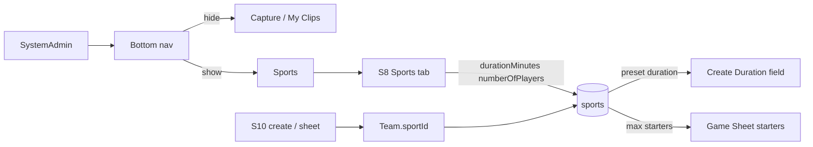

# feat: SystemAdmin Sports nav, sport duration/players, S10 presets

## Goal Capsule

For **SystemAdmin**, remove Capture and My Clips from the bottom nav and add a **Sports** entry that opens sports catalog management. Sport create/update gains **Duration** and **Number of players**; those values preset S10 create-game Duration and cap how many starters can start a match. Stop when SystemAdmin nav matches that shape, Soccer seed carries sensible defaults, and Playwright covers nav gating plus S10 preset/cap behavior.

**Authority:** this plan; user confirmation (2026-07-18) of scope and call-outs (Sports reuses S8 Sports tab; Capture/My Clips hidden only for SystemAdmin; Number of players is a hard starter cap).

**Product Contract preservation:** N/A (ce-plan-bootstrap).

---

## Product Contract

### Summary

SystemAdmins do not need Capture / My Clips in the bottom bar; they need a first-class Sports entry. Sports already exist under Skills (S8) as name-only entities. Extending each sport with duration and player-count presets lets Games (S10) open create/sheet flows with sport-aware defaults instead of hardcoded 90 minutes and unlimited starters.

### Requirements

- R1. When the signed-in user is **SystemAdmin**, bottom-nav items **Capture** and **My Clips** are not shown on mockup screens that carry the bottom nav.
- R2. When the signed-in user is **SystemAdmin**, bottom nav includes a **Sports** item (`data-testid="nav-sports"`) that opens sports management on the existing S8 Sports tab (deep-link / tab restore). ClubAdmin and Coach do not see Sports.
- R3. Coach and ClubAdmin continue to see Capture and My Clips (unchanged for those roles).
- R4. Sport create and update collect **Duration** (minutes) and **Number of players**, persisted with the sport (API + offline store + DB).
- R5. Seeded Soccer includes Duration `90` and Number of players `11` (or equivalent persisted defaults for existing rows missing values).
- R6. On S10 create-game, Duration field presets from the **selected team’s sport** Duration; changing Team refreshes the preset when the form is open.
- R7. On S10 Game Sheet, starters cannot exceed the team’s sport **Number of players**; validation blocks save beyond that max.
- R8. Saved games keep their own `durationMinutes`; later sport edits do not rewrite historical games.

### Actors

- A1. SystemAdmin — Sports nav; no Capture / My Clips; manages sport fields.
- A2. Coach / ClubAdmin — Capture / My Clips unchanged; no Sports nav; consume presets on S10 via team sport.

### Key Flows

- F1. SystemAdmin opens any bottom-nav screen → sees Sports; does not see Capture or My Clips; opens Sports → S8 Sports tab.
- F2. SystemAdmin creates/updates a sport with Duration and Number of players → values persist and appear in list/detail.
- F3. Coach on S10 selects a team whose sport has Duration 90 / players 11 → create form Duration shows 90; Game Sheet refuses a 12th starter.

### Acceptance Examples

- AE1. Offline login as `maria@vantageiq.club` (SystemAdmin) → S1 → `nav-sports` visible; Capture and My Clips not visible; `nav-skills` still available.
- AE2. Offline login as `joao@vantageiq.club` (Coach) → S1 → Capture and My Clips visible; `nav-sports` not visible.
- AE3. SystemAdmin creates a sport with Duration 70 and Number of players 7 → list/API shows those values; update can change them.
- AE4. Coach on S10 with team sport Duration 90 → create Duration field is 90 (not a leftover hardcode independent of sport).
- AE5. Game Sheet with sport Number of players 11 → selecting 12 starters is blocked (UI and/or save validation); 11 starters can save when otherwise valid.

### Scope Boundaries

**In scope:** Bottom-nav markup across mockup pages that already share the bar; sport Duration / Number of players end-to-end (schema, OpenAPI, serve-mockup, mockup-api-client offline, S8 forms); S10 create Duration preset and starter max; Playwright + nav contract tests; API mapping note.

**Out of scope:** Shared HTML nav partial extraction; hiding Capture/My Clips for ClubAdmin/Coach; React `apps/web` admin-skills parity (defer unless already trivial); changing Skills catalog beyond Sports fields; rewriting historical games when sports change.

### Deferred to Follow-Up Work

- Shared bottom-nav partial to stop copy-paste drift.
- React SPA sport field parity.
- Optional: store `numberOfPlayers` snapshot on the game row at create time (live team→sport lookup is enough for this plan).

---

## Planning Contract

### Assumptions

- Confirmed (2026-07-18): Sports home = **nav item → S8 Sports tab** (reuse CRUD; no new S11 page).
- Confirmed: Capture / My Clips hidden **only for SystemAdmin** (allowlist Coach, ClubAdmin).
- Confirmed: Number of players = **hard max starters** on Game Sheet, not create-form display-only.
- API field names: `durationMinutes` and `numberOfPlayers` (camelCase), UI labels “Duration” and “Number of players”.
- Existing sports rows without columns get defaults Duration `90`, Number of players `11` via migration default and/or decorate-time fallback.
- ClubAdmin does **not** get Sports nav (parity with Skills = SystemAdmin-only).

### Key Technical Decisions

- KTD1. **Hide via allowlist, not a new invert API** — put `data-role-visible-to="Coach,ClubAdmin"` on Capture and My Clips; keep using `MockupApi.applyRoleGatedNav` (no `data-role-hidden-from`).
- KTD2. **Sports nav deep-links S8 Sports tab** — `href` to `S8-skills.html` plus existing `vantageiq_s8_active_tab` / query or hash convention so the Sports tab opens; keep Skills nav for the full catalog.
- KTD3. **Persist sport presets on `sports`** — new migration columns + OpenAPI `Sport` / create / update; keep offline seed and `toSportPayload` in lockstep (triple schema sync: migration, `tables.sql`, `deploy.sql`).
- KTD4. **S10 resolves presets via team → sportId** — create form reads selected team’s sport; Game Sheet max starters from current team’s sport; game duration remains the value saved on the game.
- KTD5. **Enforce starter max in sheet validation** (client `validateGameSheet` / save path) and in UI (disable further checks or clear error) so Playwright and offline/backend stay aligned.

### High-Level Technical Design

### Patterns to follow

- `MockupApi.applyRoleGatedNav` + `data-role-visible-to` / `data-testid="nav-skills"` on Skills
- S8 sport modals and `tests/playwright/s8-skills.spec.js`
- Games duration validation 1–180 in mockup-api-client / serve-mockup
- Migration + tables + deploy mirror (e.g. skills/sports 015 pattern); boot-time apply awareness from `docs/solutions/database-issues/serve-mockup-500-birth-month-column-not-applied.md`
- Nav contract Vitest lists: extend pages that currently omit S8/S10 where Sports/Capture gating is asserted

### Risks

- Nav copy-paste drift (S10 already missing some admin links) — update **all** bottom-nav pages in one unit.
- Stale offline localStorage sports without new fields — decorate with defaults in `listSports` / create/update.
- Migration present but not applied on live DB — document apply / bootstrap step in verification.
- Coach Playwright paths that click Capture must keep using Coach login.

---

## Implementation Units

### U1. Persist Duration and Number of players on sports

**Goal:** Sports carry `durationMinutes` and `numberOfPlayers` through DB, OpenAPI, serve-mockup, and offline client/seed.

**Requirements:** R4, R5

**Dependencies:** None

**Files:**
- Create: `apps/api/src/db/migrations/030_sports_duration_players.sql`
- Modify: `apps/api/src/db/schema/tables.sql`, `apps/api/src/db/schema/deploy.sql` (or repo’s deploy mirror path)
- Modify: `openapi/v1/schemas/skills.yaml`
- Modify: `docs/ux/mockup/js/mockup-api-client.js` (seed, createSport, updateSport, listSports decorate, backend payloads)
- Modify: `scripts/serve-mockup.js` (`toSportPayload`, POST/PATCH sports)
- Test: existing OpenAPI/skills contract tests under `apps/api/tests/` (extend as needed)

**Approach:** Add integer columns with defaults (90 / 11). Validate positive integers on create/update (duration aligned with games 1–180 unless product needs a wider sport range — prefer same 1–180). Decorate offline reads so old stores still expose defaults.

**Patterns to follow:** Migration 015 sports; existing `createSport` name uniqueness.

**Test scenarios:**
- Happy: create sport with durationMinutes 70, numberOfPlayers 7 → GET returns them.
- Edge: omit fields on create → defaults 90 / 11 applied.
- Error: durationMinutes 0 or numberOfPlayers 0 → rejected.
- Integration: offline `listSports` after seed includes Soccer 90 / 11.

**Verification:** API create/update/list round-trip shows new fields; offline seed Soccer has 90/11.

---

### U2. S8 Sports create/update UI for new fields

**Goal:** SystemAdmin can set Duration and Number of players when creating or renaming/updating a sport; table surfaces the values.

**Requirements:** R4, R5, AE3

**Dependencies:** U1

**Files:**
- Modify: `docs/ux/mockup/S8-skills.html`
- Modify: `tests/playwright/s8-skills.spec.js`
- Modify: `docs/ux/mockup/API-Mockup-Mapping.md` (sports fields)

**Approach:** Extend create and update modals with labeled number inputs; include fields in submit payloads; show columns or detail text in the Sports table. Keep Positions/Skills tabs unchanged.

**Patterns to follow:** Existing S8 sport modals and Playwright `loginAs` + sports table assertions.

**Test scenarios:**
- Covers AE3. Create sport with Duration 70 and Number of players 7 → visible in Sports table / reload.
- Happy: Update those values → persisted after refresh.
- Error: empty/invalid numbers show validation and do not submit.

**Verification:** Playwright S8 sports field coverage passes.

---

### U3. SystemAdmin bottom nav: Sports in, Capture/My Clips out

**Goal:** SystemAdmin nav shows Sports and hides Capture/My Clips; Coach/ClubAdmin keep Capture/My Clips; Sports opens S8 Sports tab.

**Requirements:** R1–R3, AE1, AE2

**Dependencies:** None (can parallel U1; finish before relying on AE1 deep-link in full suite)

**Files:**
- Modify: bottom-nav blocks on mockup pages that already include Capture / My Clips / Skills (at least S1–S10 and S7/S7a/S8 as present today), including backfilling S10 admin links where missing
- Modify: `tests/playwright/s8-skills.spec.js` and/or `tests/playwright/s1-player-list.spec.js` / `tests/playwright/club-admin-role.spec.js`
- Modify: `apps/api/tests/integration/mockup/nav-clubs-role-gating.spec.ts` and skills nav page lists if they assert Capture/Sports

**Approach:** Add `nav-sports` with `data-role-visible-to="SystemAdmin"` `hidden`; set Capture and My Clips to `data-role-visible-to="Coach,ClubAdmin"` `hidden`; ensure Sports navigation selects the Sports tab via existing tab storage/query. Call `applyRoleGatedNav` remains required on each page.

**Execution note:** Prefer a failing nav Playwright assertion for SystemAdmin before editing every HTML file.

**Patterns to follow:** Skills `nav-skills` gating; Clubs nav Vitest contract.

**Test scenarios:**
- Covers AE1. SystemAdmin on S1: `nav-sports` visible; Capture and My Clips absent; clicking Sports lands on S8 Sports tab.
- Covers AE2. Coach on S1: Capture and My Clips visible; `nav-sports` absent.
- Edge: ClubAdmin does not see `nav-sports`; still sees Capture/My Clips if in allowlist.

**Verification:** Role-gated Playwright/Vitest nav assertions green across updated page lists.

---

### U4. S10 Duration preset and starter max from team sport

**Goal:** Create-game Duration presets from team sport; Game Sheet enforces Number of players as max starters.

**Requirements:** R6–R8, AE4, AE5

**Dependencies:** U1

**Files:**
- Modify: `docs/ux/mockup/S10-games.html`
- Modify: `docs/ux/mockup/js/mockup-api-client.js` (sheet validation / save if not already shared)
- Modify: `scripts/serve-mockup.js` (backend sheet validation parity if applicable)
- Modify: `tests/playwright/s10-games.spec.js`
- Modify: `docs/ux/mockup/API-Mockup-Mapping.md` (S10 presets note)

**Approach:** Resolve sport from selected `teamFilter` / game’s `teamId` via `listTeams` + `listSports` (or get helpers). On create form open and team change, set `#fieldDuration`. On sheet, refuse checking beyond `numberOfPlayers` and fail `saveGameSheet` / `validateGameSheet` if over max. Do not mutate past games when sport defaults change.

**Patterns to follow:** Existing duration 1–180 validation; coach team default `fillTeams` on S10.

**Test scenarios:**
- Covers AE4. Joao offline → S10 create Duration matches Soccer (90) for U19 Prime’s sport.
- Covers AE5. With numberOfPlayers 11, 12th starter blocked; 11 starters can complete a valid sheet.
- Edge: Team with missing sport fields uses decorate defaults 90/11.
- Regression: Existing create + minutes rollup tests still pass.

**Verification:** `npx playwright test tests/playwright/s10-games.spec.js` and S8 nav/sports tests green.

---

## Verification Contract

- Playwright: `tests/playwright/s8-skills.spec.js`, `tests/playwright/s10-games.spec.js`, plus nav role specs touched in U3
- Vitest nav/skills contracts if page lists updated
- Manual: SystemAdmin Maria — no Capture/My Clips, Sports → S8 Sports tab, edit Duration/players; Coach Joao — Capture present, S10 Duration preset and starter cap
- If using backend mode: apply migration `030_…` (or latest) before API checks

## Definition of Done

- U1–U4 complete; AE1–AE5 covered by automated tests where listed
- U19/Soccer hardcodes for duration/starters on S10 replaced by sport-driven presets
- Capture/My Clips gated for SystemAdmin on all updated bottom-nav pages; Sports nav present for SystemAdmin
- Mapping doc notes sport fields and S10 preset behavior
- React admin-skills parity explicitly deferred unless pulled in during U1/U2 as a tiny follow-on
