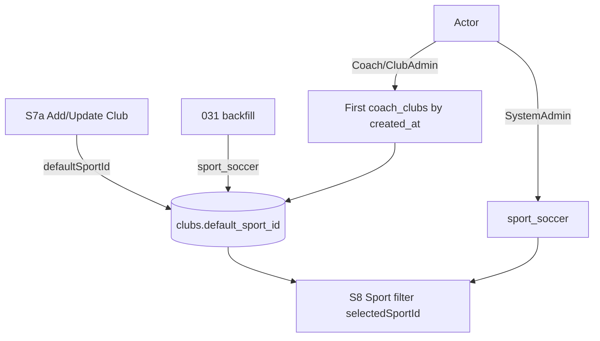

# feat: club defaultSport and S8 Sport filter defaults

## Goal Capsule

Clubs carry a **Default sport** (seeded/backfilled to Soccer). S7a Add/Update Club collect it. On S8 Skills, the Sport filter defaults to **Soccer** for SystemAdmin and to the actor’s club **default sport** for club-assigned users. Stop when existing clubs are Soccer-backed, S7a persists the field, and S8 opens with the correct Sport preset for SystemAdmin vs club users.

**Authority:** this plan; user confirmation (2026-07-18) of scope and call-outs (assumptions below).

**Product Contract preservation:** N/A (ce-plan-bootstrap).

---

## Product Contract

### Summary

Clubs today have name/status only. Adding `defaultSport` lets each club declare its primary sport catalog. S8 already hardcodes Soccer as `selectedSportId`; that becomes role-aware: SystemAdmin stays on Soccer; Coach/ClubAdmin land on their club’s default sport. Existing clubs backfill to Soccer.

### Requirements

- R1. Club create and update (S7a) require or accept a **Default sport** field bound to an active sport (UI select + API).
- R2. Club payloads expose `defaultSportId` (and display name when useful); persisted as FK to `sports`.
- R3. Migration backfills **all existing clubs** to `default_sport_id = 'sport_soccer'` (Soccer).
- R4. Offline seed clubs also set `defaultSportId: 'sport_soccer'`.
- R5. On S8 Skills, a Sport filter is present (reuse/elevate `#positionSportFilter` or a page-level Sport control that drives Positions and related panels); initial selection:
  - **SystemAdmin** → Soccer (`sport_soccer`) when that sport exists; else first active sport.
  - **ClubAdmin / Coach** (club-assigned) → that user’s primary club’s `defaultSportId`; if missing/inactive, fall back to Soccer then first active sport.
- R6. Multi-club actors: **primary club** = earliest `coach_clubs.created_at` for the user (same “first assignment” pattern as team create without `clubId`).
- R7. S8 **catalog mutations** (create/update/deactivate sports, positions, skills, assignments) remain **SystemAdmin-only**. ClubAdmin/Coach may **view** S8 with the sport filter defaulted (nav + page access), without write controls.

### Actors

- A1. SystemAdmin — sets club default sport on S7a; S8 Sport filter defaults to Soccer; full Skills write access.
- A2. ClubAdmin / Coach — assigned to clubs; S8 Sport filter defaults to club default sport; no Skills writes.
- A3. Existing clubs — all receive Soccer as default sport via backfill.

### Key Flows

- F1. SystemAdmin creates/updates a club with Default sport Basketball → persisted; club list/detail shows it.
- F2. SystemAdmin opens S8 → Sport filter = Soccer.
- F3. Coach Joao (assigned to default club with Soccer) opens S8 → Sport filter = Soccer; if club default were changed to another active sport, filter opens on that sport.
- F4. Fresh DB / migration: every club row has `default_sport_id = sport_soccer`.

### Acceptance Examples

- AE1. Offline/API create club with `defaultSportId: sport_soccer` → GET club returns it; omit on create → defaults to Soccer.
- AE2. After migration, seeded `c_default` (and any other clubs) have Soccer as default sport.
- AE3. SystemAdmin → S8 → Positions sport filter selected value is Soccer / `sport_soccer`.
- AE4. ClubAdmin or Coach with a single club whose default is Soccer → S8 filter opens on Soccer; changing the club’s default sport and reopening S8 updates the preset (no stale hardcode).
- AE5. Non–SystemAdmin on S8 cannot successfully create a sport (403 / UI hidden).

### Scope Boundaries

**In scope:** Migration `031`; OpenAPI clubs; serve-mockup + mockup-api-client; S7a create/update + table column; S8 access for ClubAdmin/Coach (read) + Sport filter default resolution; Playwright for S7a field and S8 defaults; mapping note.

**Out of scope:** ClubAdmin/Coach writing the global skills catalog; React SPA parity (defer unless trivial); changing team.sportId automatically from club default; multi-club picker UI (use first-assignment rule).

### Deferred to Follow-Up Work

- Explicit club switcher for multi-club actors on S8.
- Optional: team create defaulting `sportId` from club `defaultSportId`.
- React `admin-clubs` forms.

---

## Planning Contract

### Assumptions

- Confirmed call-outs (2026-07-18): store **sport id** (`defaultSportId` / `default_sport_id`); multi-club → **first `coach_clubs.created_at`**; S8 defaults apply to club users → **open S8 for ClubAdmin/Coach as read-only viewers**, SystemAdmin-only writes.
- Field label in UI: “Default sport”; API camelCase `defaultSportId`.
- Inactive default sport on a club: resolve fallback Soccer → first active sport in list order.

### Key Technical Decisions

- KTD1. **Column** `clubs.default_sport_id TEXT NOT NULL REFERENCES sports(id) ON DELETE RESTRICT`, default/backfill `'sport_soccer'`.
- KTD2. **Primary club helper** shared in mockup client / serve-mockup: given actor email, load `coach_clubs` ordered by `created_at ASC`, take first club’s `default_sport_id`.
- KTD3. **S8 init:** replace bare `selectedSportId = 'sport_soccer'` with `resolveDefaultSportId(currentUser)` implementing R5–R6; apply to Positions sport filter and any page-level Sport filter introduced.
- KTD4. **Access:** `data-role-visible-to="SystemAdmin,ClubAdmin,Coach"` on Skills (and Sports nav if it remains S8 entry); S8 page gate allows those roles to view; keep mutation buttons / submit handlers SystemAdmin-only (existing API already 403s non-admin writes).
- KTD5. **No product DELETE of sports** required; RESTRICT on club FK if sport deleted later is acceptable (sports are soft-disabled).

### High-Level Technical Design

### Patterns to follow

- Teams `sportId` + S3 sport select (`listSports` active)
- `coach_clubs` first-assignment for team create without clubId
- S8 existing `positionSportFilter` / `selectedSportId`
- ClubAdmin role gating plans (Skills stayed SystemAdmin — this plan **narrowly** opens read access only)

### Risks

- Opening S8 nav to Coach may surprise product owners who locked Skills to SystemAdmin — mitigate with read-only UI and AE5.
- Multi-club without picker may pick a non-preferred club — document first-assignment rule; defer picker.
- RESTRICT FK: cannot hard-delete Soccer while clubs reference it (already true for teams).

---

## Implementation Units

### U1. Persist club defaultSportId (schema + API + offline)

**Goal:** Clubs store and return `defaultSportId`; existing rows = Soccer.

**Requirements:** R1–R4, AE1, AE2

**Dependencies:** None

**Files:**
- Create: `apps/api/src/db/migrations/031_clubs_default_sport.sql`
- Modify: `apps/api/src/db/schema/tables.sql`, `apps/api/src/db/schema/deploy.sql`
- Modify: `openapi/v1/schemas/clubs.yaml`
- Modify: `scripts/serve-mockup.js` (`toClubPayload`, POST/PATCH clubs)
- Modify: `docs/ux/mockup/js/mockup-api-client.js` (seed, createClub, updateClub, listClubs decorate)
- Test: clubs OpenAPI/integration specs under `apps/api/tests/` as present

**Approach:** Add NOT NULL column with default + `UPDATE clubs SET default_sport_id = 'sport_soccer'`. Validate create/update against active sports. Omit → Soccer.

**Test scenarios:**
- Happy: create with `defaultSportId` of an active sport → returned on list/get.
- Edge: omit field → Soccer.
- Error: unknown/inactive sport id → 400.
- Integration: after migrate, all clubs have Soccer.

**Verification:** Migration applied; create/update/list round-trip shows `defaultSportId`.

---

### U2. S7a Add/Update Club Default sport UI

**Goal:** SystemAdmin sets Default sport on create and update; table shows it.

**Requirements:** R1, R2, AE1

**Dependencies:** U1

**Files:**
- Modify: `docs/ux/mockup/S7a-clubs.html`
- Modify: `tests/playwright/` clubs-related specs (e.g. clubs / S7a coverage if present; else extend nearest clubs Playwright)
- Modify: `docs/ux/mockup/API-Mockup-Mapping.md`

**Approach:** Sport `<select>` from `listSports(..., 'active')` on create/update modals; submit `defaultSportId`; column in clubs table; prefill on rename/update.

**Test scenarios:**
- Happy: Add Club with Default sport Soccer → row shows Soccer / sport id.
- Happy: Update club default sport → persists after reload.
- Error: empty sport rejected if required in UI.

**Verification:** Playwright S7a create/update with Default sport green.

---

### U3. S8 Sport filter defaults + read access for club users

**Goal:** Resolve initial Sport filter per R5–R7; ClubAdmin/Coach can open S8 read-only.

**Requirements:** R5–R7, AE3–AE5

**Dependencies:** U1

**Files:**
- Modify: `docs/ux/mockup/S8-skills.html` (gate, `resolveDefaultSportId`, filter init, hide write controls for non–SystemAdmin)
- Modify: bottom-nav Skills/Sports `data-role-visible-to` on mockup pages that gate Skills
- Modify: `tests/playwright/s8-skills.spec.js` (and club-admin / coach nav specs)
- Modify: `docs/ux/mockup/API-Mockup-Mapping.md`

**Approach:** Implement `resolveDefaultSportId(user)` using `getCurrentUser`, `listClubs` / coach membership + club `defaultSportId`. Init `selectedSportId` from that. Allow page load for ClubAdmin/Coach; keep `#roleNotice` or a milder read-only notice; hide Add/Edit/Deactivate/Assign actions unless SystemAdmin. Update nav allowlists. Playwright: SystemAdmin → Soccer; ClubAdmin/Coach → club default; Coach create sport still blocked.

**Execution note:** Prefer a failing Playwright assertion for ClubAdmin S8 sport default before expanding the gate.

**Test scenarios:**
- Covers AE3. SystemAdmin S8 → filter Soccer.
- Covers AE4. Club user → filter matches club `defaultSportId`.
- Covers AE5. Coach cannot create sport (UI hidden and/or API 403).
- Edge: club default sport inactive → fallback Soccer.
- Regression: SystemAdmin S8 mutations still work.

**Verification:** `npx playwright test tests/playwright/s8-skills.spec.js` (+ clubs specs) green.

---

## Verification Contract

- Apply migration `031_clubs_default_sport.sql`
- Playwright: S7a club default sport; S8 SystemAdmin Soccer preset; club-user preset; non-admin write blocked
- Manual: set club default ≠ Soccer, login as club user, open S8 → filter matches

## Definition of Done

- U1–U3 complete; AE1–AE5 covered
- All existing clubs default to Soccer; S7a collects Default sport
- S8 Sport filter defaults per role/club rules; catalog writes remain SystemAdmin-only
- React SPA club forms deferred unless pulled in as a tiny follow-on
