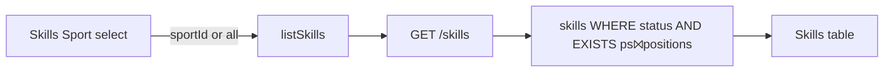

# feat: S8 Skills tab Sport filter

## Goal Capsule

Add a **Sport** filter on S8’s Skills tab so the table lists only skills assigned to at least one position under the selected sport. Stop when GET `/skills` (and offline client) honor optional `sportId`, the Skills UI defaults like Positions (role/club resolve), offers **All sports**, and Playwright covers filter + unassigned edge cases.

**Authority:** this plan; user confirmation (2026-07-18) of scope call-outs (membership via position assignments; default sport + All option).

**Product Contract preservation:** N/A (ce-plan-bootstrap).

---

## Product Contract

### Summary

Skills remain a global catalog (no `skills.sport_id`). “Assigned to a sport” means the skill appears in `position_skills` for a position whose `sport_id` matches the filter. The Skills tab gains a Sport control parallel to Positions’ sport filter, defaulting via existing `resolveDefaultSportId`, with an **All sports** option so unassigned skills remain discoverable.

### Requirements

- R1. Skills tab shows a **Sport** `<select>` (label “Sport”) that filters the skills table.
- R2. With a concrete sport selected, list only skills that have ≥1 `position_skills` row on a position of that sport.
- R3. Initial Sport selection uses the same resolver as Positions (`MockupApi.resolveDefaultSportId` / SystemAdmin → Soccer; club users → primary club default).
- R4. Offer an **All sports** option that restores today’s unfiltered list (status filter still applies).
- R5. When a sport is selected, `# Positions` (`assignedPositionCount`) counts only assignments under that sport; under All, keep global count.
- R6. No schema change; no skill→sport FK; Add Skill / rename / deactivate / delete behavior unchanged (create still global).
- R7. Read-only Coach/ClubAdmin viewers get the same filter; writes stay SystemAdmin-only.

### Actors

- A1. SystemAdmin — filters Skills by sport; full catalog writes.
- A2. ClubAdmin / Coach — same filter defaults; read-only Skills tab.

### Key Flows

- F1. Open Skills tab → Sport preset = resolved default → table shows only skills linked under that sport.
- F2. Choose **All sports** → full skill list (status-aware) including skills with zero assignments.
- F3. Choose another sport that has no assigned skills → empty table (not an error).

### Acceptance Examples

- AE1. SystemAdmin, Soccer selected → seeded Soccer-linked skills appear; a skill assigned only under a disposable QA sport does not.
- AE2. Switch to All → newly created unassigned skill appears.
- AE3. Filter to QA sport after assigning a skill to a QA position → that skill appears; count reflects QA positions only.
- AE4. Initial Skills Sport value matches `resolveDefaultSportId` for the actor (Soccer for Maria).

### Scope Boundaries

**In scope:** OpenAPI `GET /skills?sportId=`; serve-mockup + mockup-api-client; S8 Skills tab UI; Playwright; mapping note.

**Out of scope:** Migrating skills to sport-owned rows; changing Assign Skills checklist semantics beyond list visibility; filtering Sports/Positions/Position-Skills tabs further; KPI strip sport-scoping (keep global `# Skills` unless trivial).

### Deferred to Follow-Up Work

- Optional shared Sport control across Positions + Skills (single control driving both).
- Sport-scoped KPI counts.

---

## Planning Contract

### Assumptions

- Confirmed (2026-07-18): membership = ≥1 position-skill under the sport; default = Positions-style resolve; **All sports** included; unassigned skills only under All.
- Skills Sport filter is **independent state** from Positions’ `#positionSportFilter` (Positions has no All; sharing would break Positions when All is chosen). Both initialize from the same resolver.
- Unknown `sportId` → empty list (200), not 400 — matches positions “no rows” UX; invalid id need not 404.
- Empty `sportId` / omitted / explicit `all` → unfiltered (All).

### Key Technical Decisions

- KTD1. **Filter semantics:** `EXISTS (position_skills ⨝ positions WHERE positions.sport_id = :sportId AND skill_id = skills.id)`. Offline: join `positionSkills` → `positions` by `positionId` then `sportId`.
- KTD2. **API:** optional query `sportId` on `GET /v1/skills`. Omit or `all` = no sport predicate. Concrete id applies EXISTS filter. Status filter composes with sport filter.
- KTD3. **Count when filtered:** `assignedPositionCount` subquery (or offline decorate) restricted to positions of that sport when `sportId` is concrete.
- KTD4. **UI:** `#skillSportFilter` / `[data-testid="skill-sport-filter"]` on Skills tab header beside Add Skill; options = All + sports list; state `skillsSportId` default `resolveDefaultSportId(...)`.
- KTD5. **Client:** `listSkills(actorRole, actorEmail, statusFilter, sportId)` — keep `statusFilter` before `sportId` (unlike `listPositions`, which takes `sportId` before status) so existing 3-arg callers stay back-compat; document the intentional order difference.

### High-Level Technical Design

### Patterns to follow

- Positions: `GET /positions?sportId=` + `#positionSportFilter` + `listPositions(..., sportId, ...)`
- Club default resolve: `MockupApi.resolveDefaultSportId` (plan 007)
- S8 read-only write gating already on Skills tab

### Risks

- Sharing Positions’ `selectedSportId` with Skills would force All onto Positions — mitigate with separate `skillsSportId`.
- Filtering only in the UI without API would drift offline/backend — keep filter in API + client.
- Existing Skills-tab Playwright tests assume unassigned skills appear under the default view — they must select **All** (or assign under Soccer) after the default becomes Soccer-filtered.

---

## Implementation Units

### U1. GET /skills sportId filter (API + client)

**Goal:** List skills optionally scoped to a sport via position assignments; sport-scoped assignment counts.

**Requirements:** R2, R4, R5, AE1–AE3

**Dependencies:** None

**Files:**
- Modify: `openapi/v1/openapi.yaml` (`GET /skills` parameters + description for optional `sportId` membership filter and sport-scoped `assignedPositionCount`)
- Modify: `scripts/serve-mockup.js` (`listSkillsWithCounts`, GET `/skills` handler)
- Modify: `docs/ux/mockup/js/mockup-api-client.js` (`listSkills`)
- Test: `tests/playwright/s8-skills.spec.js` (API-level asserts via page `fetch` and/or UI in U2)

**Approach:** Extend `listSkillsWithCounts(statusFilter, sportId)` with optional EXISTS join on `position_skills`/`positions`. When `sportId` set, narrow the assignment-count subquery to that sport. Client passes `sportId` query param; offline mirrors with Set of skill ids from positionSkills×positions. Update OpenAPI summary/description so `GET /skills` no longer reads as “every skill” without mentioning the filter.

**Test scenarios:**
- Happy: `GET /skills?sportId=sport_soccer&status=active` returns only Soccer-linked skills; includes a known seed skill (e.g. Ball Control).
- Happy: omit `sportId` → includes a skill with zero assignments (create then list).
- Edge: `sportId` of sport with no positions/assignments → `data: []`.
- Edge: unknown `sportId` (e.g. `sport_nonexistent`) → 200 with `data: []`.
- Integration: count for a multi-sport skill (if assigned under two sports) drops when filtered to one sport.

**Verification:** Round-trip list with/without `sportId` matches membership rules; OpenAPI documents the param.

---

### U2. S8 Skills tab Sport UI + Playwright

**Goal:** Skills tab Sport control defaults correctly, filters the table, offers All.

**Requirements:** R1, R3, R4, R7, AE1–AE4

**Dependencies:** U1

**Files:**
- Modify: `docs/ux/mockup/S8-skills.html` (filter markup, `skillsSportId`, `renderSkills`, populate options)
- Modify: `tests/playwright/s8-skills.spec.js`
- Modify: `docs/ux/mockup/API-Mockup-Mapping.md`

**Approach:** Mirror Positions sport filter layout on Skills header. Init `skillsSportId` from `resolveDefaultSportId`. On change, re-`renderSkills`. Pass sport id into `listSkills` (map All → omit/`all`). Do not change Positions filter wiring. Update existing Skills-tab tests that assert newly created unassigned skills in the table so they select **All sports** (or assign under Soccer) before asserting row visibility.

**Execution note:** Prefer a failing Playwright assertion for Skills Sport default / Soccer filter before wiring the select if useful; otherwise extend existing Skills-tab tests.

**Test scenarios:**
- Covers AE4. SystemAdmin opens Skills tab → `[data-testid="skill-sport-filter"]` value is `sport_soccer` (or resolved default).
- Covers AE1. With Soccer selected, a skill assigned only under a disposable QA sport is absent; after selecting that QA sport it appears.
- Covers AE2. All sports → unassigned new skill visible.
- Covers F3. Select a sport with zero assigned skills → `#skillsTableBody` empty, no error/toast.
- Regression: existing Add Skill / abbreviation tests updated for default Soccer filter (assert via All or after Soccer assignment).
- Coach read-only: `[data-testid="skill-sport-filter"]` visible with resolved default; Add Skill still hidden.

**Verification:** `npx playwright test tests/playwright/s8-skills.spec.js` green.

---

## Verification Contract

- Playwright: Skills Sport default; Soccer vs QA sport membership; All shows unassigned; existing Skills CRUD tests updated for default filter
- Manual: create skill → hidden under Soccer until assigned to a Soccer position or All selected

---

## Definition of Done

- U1–U2 complete; AE1–AE4 covered
- Skills stay global; no sport FK migration
- Skills Sport filter independent of Positions filter; both default via `resolveDefaultSportId`
- Catalog writes remain SystemAdmin-only
- Existing Skills-tab Playwright coverage still green under the new default filter
