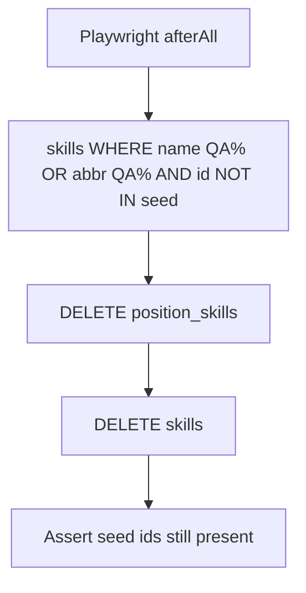

# test: purge QA leftover skills; keep Soccer seed catalog

## Goal Capsule

Remove automated-test skill leftovers (name starts with `QA` and/or abbreviation starts with `QA`) and their `position_skills` rows, without adding any skills and without deleting the seeded Soccer skill catalog. Stop when a purge script (and Playwright teardown) leave only migration-015 seed skills linked under Soccer for non-QA work, and S8 skill-create/assign tests no longer leave Soccer-linked QA skills behind.

**Authority:** this plan; user confirmation (2026-07-18) of scope call-outs (broader name/`QA%` abbr match; purge all matching leftovers; include Playwright prevention).

**Product Contract preservation:** N/A (ce-plan-bootstrap).

---

## Product Contract

### Summary

Playwright S8 tests create skills whose names start with `QA …` (abbreviations often `QA1`/`QA2`/`QSM`/…). Many remain assigned to seeded Soccer positions (especially `pos_gk`). Soccer’s skill catalog must stay the migration-015 seed set only — no new product skills. Cleanup hard-deletes matching leftovers after clearing assignments; tests must stop polluting Soccer.

### Requirements

- R1. Identify leftover skills where `name` ILIKE `'QA%'` **or** `UPPER(abbreviation)` LIKE `'QA%'`, and `id` is **not** in the seed skill allowlist.
- R2. Purge deletes `position_skills` for those skill ids first, then deletes the `skills` rows (respect `ON DELETE RESTRICT` / API 409 precondition).
- R3. **Never** INSERT/seed new skills as part of this work; **never** delete a seed allowlist skill id.
- R4. After purge, no remaining skill matches R1; seeded Soccer assignments for seed skills remain intact.
- R5. Playwright S8 tests that create skills either clean up those skills (and assignments) or assign only under disposable QA sports/positions — and `afterAll` (or shared teardown) re-runs the purge helper so Soccer stays clean across runs.
- R6. Shared allowlist + purge helper (mirror `purge-soccer-position-orphans.js` / `_soccer-positions.js`).

### Actors

- A1. Test author / CI — long-lived Postgres + Playwright.
- A2. Implementer — purge script + test hygiene.

### Key Flows

- F1. One-shot CLI purge removes current QA leftovers and prints deleted counts / remaining seed check.
- F2. S8 Assign Skills / Add Skill tests create QA skills → assert → teardown removes them or relies on purge; Soccer GK assignments no longer accumulate QA rows.

### Acceptance Examples

- AE1. After purge, `SELECT id FROM skills WHERE name ILIKE 'QA%' OR UPPER(abbreviation) LIKE 'QA%'` returns zero rows (or only false positives that are also seed ids — should be none).
- AE2. Every migration-015 seed skill id still exists; Soccer `position_skills` for seed skills unchanged in membership (no seed skill missing from its seeded positions).
- AE3. Re-running `s8-skills.spec.js` then purge (or afterAll purge) does not leave new Soccer-linked QA skills.
- AE4. Grep/assert: Assign Skills path does not leave durable `pos_gk` assignments to QA-named skills after the suite finishes.

### Scope Boundaries

**In scope:** Seed skill id allowlist; purge script + export; one-shot DB cleanup; Playwright S8 skill-create/assign teardown or disposable-sport assign; brief mapping note.

**Out of scope:** Product DELETE API changes beyond existing skill delete; purging QA sports/positions (except as already covered by plan 006); renaming “Long shots QA …” / `ZZ1` leftovers that do **not** match R1; adding any new Soccer catalog skills.

### Deferred to Follow-Up Work

- Optional: broaden matcher to names containing ` QA ` mid-string (e.g. `Long shots QA …` / renamed abbrevs).
- Optional: product guard rejecting skill names/`QA%` abbrevs in non-test environments.

---

## Planning Contract

### Assumptions

- Confirmed defaults (2026-07-18): match **name `QA%` OR abbreviation `QA%`**; purge **all** matching leftovers (not only Soccer-assigned); include **Playwright prevention**.
- Seed allowlist = the 31 skill ids from `015_skills_positions_sports.sql` (same as offline `createSeed` skill ids).
- Hard delete via SQL/script is acceptable (same posture as Soccer position orphan purge).

### Key Technical Decisions

- KTD1. **Allowlist** `SOCCER_SEED_SKILL_IDS` (31 ids) in `tests/playwright/_soccer-skills.js` (or extend `_soccer-positions.js` if preferred — prefer dedicated `_soccer-skills.js` for clarity).
- KTD2. **Purge order:** `DELETE FROM position_skills WHERE skill_id = ANY(matched)` then `DELETE FROM skills WHERE id = ANY(matched)`; match clause excludes allowlist ids even if a seed name ever matched (defense in depth).
- KTD3. **Script** `scripts/purge-qa-skills.js` exporting `purgeQaSkills(pool)`; CLI uses `DATABASE_URL`; exit non-zero if any seed id missing after purge.
- KTD4. **Playwright prevention:** (a) Assign Skills test: after assertions, DELETE assignments then DELETE skills (or call purge); (b) `afterAll` in `s8-skills.spec.js` invokes `purgeQaSkills`; (c) prefer not assigning new QA skills to `pos_gk` when a disposable position on a QA sport suffices — for Assign Skills coverage that needs a seeded position, explicit teardown is mandatory.
- KTD5. **No new skills** in seed, migration, or offline `createSeed`.

### High-Level Technical Design

### Patterns to follow

- `scripts/purge-soccer-position-orphans.js` + `tests/playwright/_soccer-positions.js` (plan 006)
- Existing `DELETE /skills` precondition (assignments first) — script does the same at SQL layer

### Risks

- Over-broad `QA%` name match could hit a future legitimate skill named “QA …” — mitigate with allowlist exclusion and documenting that product skills must not use that prefix.
- Assign Skills tests that skip teardown will re-pollute until afterAll purge runs — afterAll is required.

---

## Implementation Units

### U1. Seed skill allowlist + purge-qa-skills script

**Goal:** Idempotent purge of QA leftover skills with seed safety checks.

**Requirements:** R1–R4, AE1–AE2

**Dependencies:** None

**Files:**
- Create: `tests/playwright/_soccer-skills.js`
- Create: `scripts/purge-qa-skills.js`
- Test: script self-check / optional small Node assert in Playwright afterAll (U2)

**Approach:** Freeze 31 seed ids; select match ids; delete join then skills in a transaction; return counts; CLI prints JSON summary; fail if any seed id absent.

**Test scenarios:**
- Happy: dry-run or real DB with known QA leftovers → deletedSkills ≥ 1; seed count still 31.
- Edge: second run → deletedSkills = 0; still green.
- Error: if a seed id were somehow deleted, CLI exits non-zero (do not cause this in happy path).

**Verification:** Run `node scripts/purge-qa-skills.js` against local `DATABASE_URL`; AE1–AE2 hold.

---

### U2. Playwright S8 skill-test hygiene + afterAll purge

**Goal:** Stop re-accumulation of Soccer-linked QA skills after the suite.

**Requirements:** R5–R6, AE3–AE4

**Dependencies:** U1

**Files:**
- Modify: `tests/playwright/s8-skills.spec.js`
- Modify: `docs/ux/mockup/API-Mockup-Mapping.md` (one hygiene note)

**Approach:** Import/require purge helper; `afterAll` call `purgeQaSkills`. For Assign Skills (and any test that assigns QA skills to `pos_gk`), add explicit remove-assignment + delete-skill (or rely on afterAll — prefer both: per-test cleanup when easy, afterAll as safety net). Do not create positions under Soccer for this.

**Execution note:** Prefer a failing assertion that Soccer has zero `position_skills` rows whose skill name ILIKE `QA%` at end of suite before wiring afterAll if useful.

**Test scenarios:**
- Covers AE3. Suite green; after suite, purge query returns 0 QA leftovers (or afterAll makes it so).
- Covers AE4. Assign Skills still proves assignment UI; no durable QA→`pos_gk` leftover after `afterAll`.
- Regression: seed Soccer catalog tests still see Ball Control / GK skills.

**Verification:** `npx playwright test tests/playwright/s8-skills.spec.js` green; optional second purge run is a no-op.

---

## Verification Contract

- `node scripts/purge-qa-skills.js` cleans current pollution; second run no-ops
- Playwright `s8-skills.spec.js` green with afterAll purge
- No seed skill ids removed; no new skills inserted by this work

## Definition of Done

- U1–U2 complete; AE1–AE4 covered
- Soccer skill catalog remains seed-only for non-test data
- QA leftover skills (name/abbr match) gone from the test DB
- Tests do not re-pollute Soccer with durable QA skill assignments
