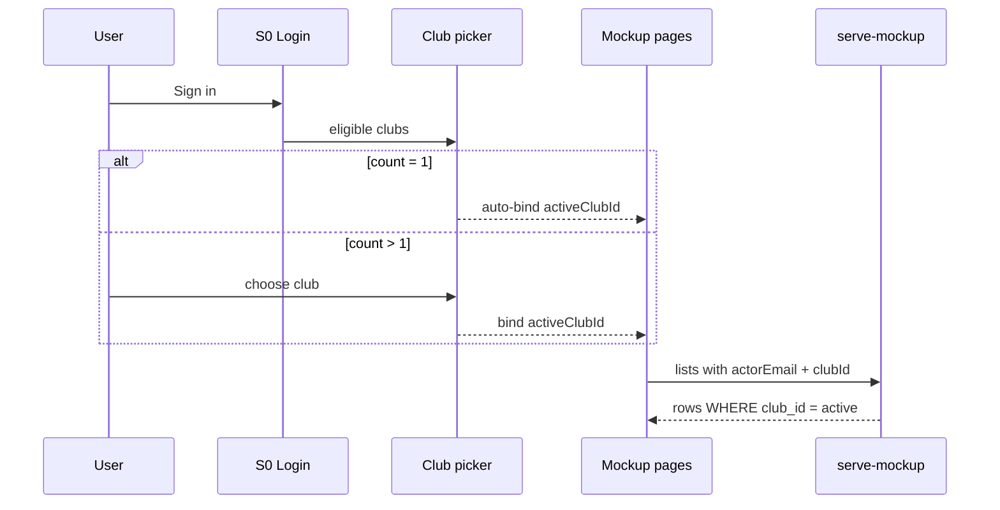
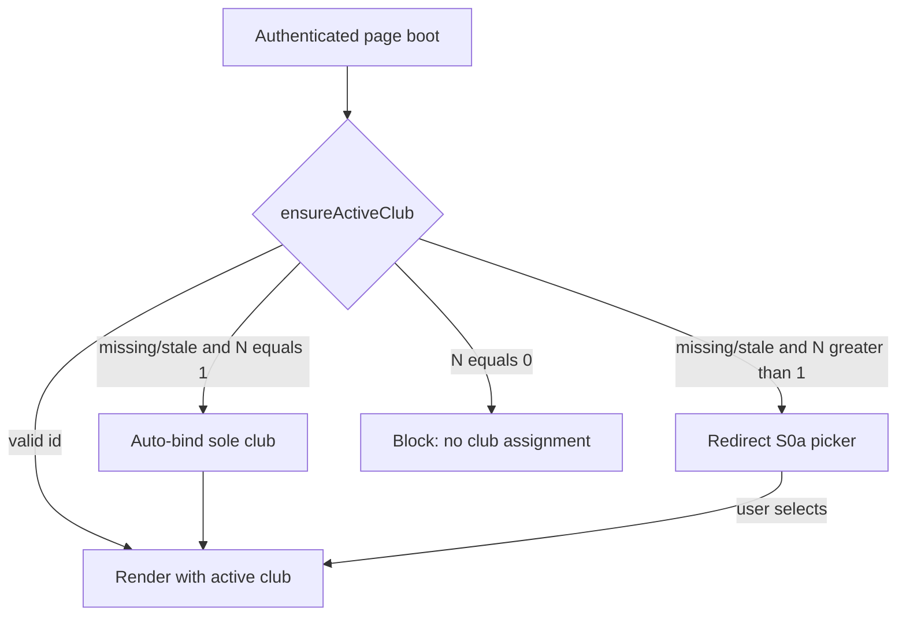

# feat: active club session lock from sign-on

## Goal Capsule

Bind every authenticated session to **one active club** chosen at (or immediately after) sign-on. Multi-club users must pick before using the app; the club name appears in the header left of the role badge; players, teams, coaches/users lists, games, clips, and sport filters stay inside that club until logout or an explicit header switch. Stop when login→picker→header→API/client scoping work end-to-end and Playwright covers single-club auto-bind, multi-club gate, and cross-club leakage blocks.

**Authority:** this plan; user confirmation (2026-07-18) of product intent; planning defaults for open forks (below).

**Product Contract preservation:** N/A (ce-plan-bootstrap).

---

## Product Contract

### Summary

Today Coach/ClubAdmin see the **union** of all `coach_clubs` memberships, and SystemAdmin sees everything. Multi-club actors have no picker (plan 007 used first-assignment only). This feature introduces an **active club** session: choose once (or auto-bind when only one eligible club), show the name in the header, and scope all operational data and APIs to that club for the rest of the session (with an optional header re-pick).

### Problem Frame

Operators with more than one club assignment can currently see and act across every club they belong to in one session. That makes it easy to score the wrong roster, assign the wrong team, or confuse which club’s games are on screen. The product need is a hard session boundary: after sign-on, one club is active, the UI names it, and every operational list/API stays inside that club until the user switches or logs out.

### Requirements

- R1. After successful login, resolve **eligible clubs** for the actor; if more than one, require an explicit club selection before entering app pages.
- R2. If exactly one eligible club, auto-bind it (no picker).
- R3. Persist `activeClubId` (and display name when useful) in `localStorage` alongside the login email; clear on logout.
- R4. Header shows **club name** immediately left of the role badge on authenticated mockup pages (not guest/share).
- R5. While a club is active, lists and pickers for players, teams, coaches/users (club-scoped), games, clips, and team/club filters show **only that club’s data**.
- R6. API list/mutate paths that today scope by “any membership” must accept and enforce the **active `clubId`** (actor must be allowed for that club); responses must not leak other clubs’ rows.
- R7. S8 Sport defaults / filters use the active club’s `defaultSportId` (plan 007); do not invent per-club sport tables.
- R8. Guest/share token flows never require club selection.
- R9. User may change active club mid-session from the header (re-pick among eligible clubs); data refreshes to the new club.
- R10. Deep-linking an authenticated page without a valid active club runs the same gate as post-login (redirect to picker, auto-bind, or block) — picker cannot be bypassed by URL.
- R11. If stored `activeClubId` is no longer eligible (membership removed, club inactive), clear it and re-run the gate before showing data.

### Actors

- A1. Coach / ClubAdmin — eligible clubs = active `coach_clubs` memberships; must pick when ≥2.
- A2. SystemAdmin — eligible clubs = **all active clubs** (platform-wide picker); operational pages lock to the chosen club.
- A3. Guest (share token) — no club session.
- A4. Multi-club Coach — blocked from app chrome until pick completes.

### Key Flows

- F1. Login → 1 eligible club → auto-bind → land on role home (S7 or S1) with header club name.
- F2. Login → ≥2 eligible clubs → club picker → select → bind → land on role home.
- F3. Open Players / Teams / Games / Users (club-scoped) → only active club rows.
- F4. Header “Change club” → picker → new active club → lists refresh.
- F5. Logout → clear email + active club.
- F6. Authenticated deep-link with missing/stale active club → gate → picker / auto-bind / error.

### Acceptance Examples

- AE1. Coach with one club never sees the picker; header shows that club name.
- AE2. User with two clubs cannot reach S1/S10 until a club is chosen; choosing club A hides club B’s teams/players/games.
- AE3. SystemAdmin picks club A → `GET /teams?actorEmail=&clubId=` (or equivalent) returns only club A teams; switching to club B updates header and lists.
- AE4. Share-token S2/S6 still loads without login or club picker.
- AE5. API request with `clubId` the actor is not allowed to use → `403 forbidden_scope` (or equivalent existing code).
- AE6. Multi-club user opens `S1-player-list.html` directly with no active club → redirected to picker (does not load players).
- AE7. Active club removed from membership → next page load clears club and re-gates (picker or auto-bind remaining club).

### Scope Boundaries

**In scope:** Session key + client helpers; post-login club picker page (or modal); header badge + switcher on mockup pages; serve-mockup + mockup-api-client enforcement of single-club `clubId`; replace multi-membership union with active-club filter on operational lists; S8 default sport from active club; Playwright; mapping note.

**Out of scope:** Per-club duplicated sports/skills schema; React SPA parity unless trivial; forcing SystemAdmin **S7a Clubs** roster to a single club (platform exception: SystemAdmin may still list/manage all clubs on S7a while the operational active club drives other pages); changing guest share tokens.

### Deferred to Follow-Up Work

- Optional: lock S7a to active club for SystemAdmin too.
- Optional: remember last-used club per user across logins (server-side preference).

---

## Planning Contract

### Assumptions

- Confirmed product intent (2026-07-18): multi-club must pick; session locked; header club name; no cross-club data.
- Planning defaults when confirmation did not re-pick forks:
  - **SystemAdmin** picks among **all active clubs**; Coach/ClubAdmin among **memberships only**.
  - **Sports/Skills:** scope visibility/defaults to active club’s `defaultSportId` (no new sport ownership model).
  - **Mid-session switch** via header is allowed (R9).
- Zero eligible clubs (Coach/ClubAdmin with no membership): show blocking error after login (“No club assignment”); do not enter app.
- SystemAdmin with zero clubs in DB: picker empty → block with admin message (edge).
- Multi-club Playwright fixtures can extend patterns already used in `tests/playwright/club-admin-role.spec.js` (`c_second` / `c_other` membership seeding).

### Key Technical Decisions

- KTD1. **Session:** `localStorage` key e.g. `vantageiq_active_club_id` (+ optional cached name); cleared in `logout()` with `SESSION_KEY`.
- KTD2. **Eligible clubs:** `listEligibleClubs(user)` — SystemAdmin → `listClubs(..., 'active')` all; else → memberships ordered by `created_at ASC`.
- KTD3. **Gate:** `ensureActiveClub()` on every authenticated page boot (and after login) — missing/invalid + eligible.length > 1 → redirect to picker (preserve return URL); length === 1 → auto-set; length === 0 → error; valid id stays. Do not trust client-only checks for data — server still enforces `clubId`.
- KTD4. **API:** Operational list/mutate endpoints require `clubId` when an authenticated actor is present; `assertActorMayUseClub(actor, clubId)`; filter to that club only (replace `IN (all memberships)`). Exception: SystemAdmin `GET /clubs` used by S7a remains unfiltered by active club. Prefer one shared helper over per-route copy-paste.
- KTD5. **Header:** Add `[data-testid="active-club-name"]` and change control left of role badge; shared `MockupApi.renderSessionHeader(...)` called from each authenticated page.
- KTD6. **S7a exception:** SystemAdmin Clubs admin page continues to list all clubs for create/assign; other pages remain active-club locked. Header still shows the operational active club on S7a.
- KTD7. **S8:** Init sport filters from active club `defaultSportId`; supersedes plan 007 “first `coach_clubs` assignment” rule; read-only rules from plan 007 unchanged.
- KTD8. **Missing `clubId` on operational API:** Treat as `400` (client bug) once the session lock ships — do not silently fall back to multi-club union.

### High-Level Technical Design

### Patterns to follow

- `coach_clubs` membership checks and `isClubScopedActor` in `scripts/serve-mockup.js`
- Existing optional `clubId` on `GET /teams` (promote to required for operational lists)
- Plan 007 `defaultSportId` / `resolveDefaultSportId` (prefer **active club**)
- `SESSION_KEY` / `getCurrentUser` / `logout` in `mockup-api-client.js`
- Guest share routes remain token-only
- Multi-club seeding in `tests/playwright/club-admin-role.spec.js`

### Operational endpoint surface (U4 checklist)

Require + enforce `clubId` (unless noted):

- Players list / player mutations that today use membership union
- Teams list / create / update / assign-to-club (scoped actors)
- Games / clips list and mutations tied to teams
- Users list for ClubAdmin (share active club only)
- Club-scoped coach membership reads used by operational pickers

Leave unscoped by active club:

- SystemAdmin `GET /clubs` (S7a)
- Guest share-token routes
- Auth/login endpoints

### Authenticated header pages (U3 checklist)

Apply club name + switcher (and `ensureActiveClub` boot): `S1-player-list`, `S2-player-dashboard` (logged-in only), `S3-team-management`, `S3a-team-update`, `S4-video-capture`, `S5-player-edit`, `S6-assessment-list` (logged-in only), `S7-admin-user-management`, `S7a-clubs`, `S8-skills`, `S9-assessment`, `S10-games`. Skip guest/`?share=` entry paths.

### Risks

- Omitting `clubId` on one page re-opens leakage — client injects active club by default; server rejects missing clubId (KTD8); Playwright leakage tests.
- SystemAdmin S7a vs operational split may confuse — document in mapping; header still shows operational club on S7a.
- Large header touch surface — shared render helper + checklist above.
- Existing multi-club ClubAdmin tests that expect union of `c_default` + `c_second` must be rewritten for single active club (see U5 inventory and residual doc-review items).

### System-Wide Impact

- Supersedes plan 007 first-assignment sport default with active-club default.
- Changes security posture: Coach/ClubAdmin lose multi-club union visibility in one session.
- Touch surface spans client, mock server, OpenAPI notes, nearly all authenticated mockup pages, and Playwright fixtures that assume multi-club union.

---

## Implementation Units

### U1. Active club session helpers (client)

**Goal:** Persist, read, clear, and validate active club; list eligible clubs; inject `clubId` into API helpers.

**Requirements:** R3, R5–R6, R8, R11

**Dependencies:** None

**Files:**
- Modify: `docs/ux/mockup/js/mockup-api-client.js`
- Test: `tests/playwright/active-club-session.spec.js`

**Approach:** Add `ACTIVE_CLUB_KEY`; `getActiveClub()` / `setActiveClub(club)` / `clearActiveClub()` on logout; `listEligibleClubs(user)`; reject `setActiveClub` outside eligibility; inject active `clubId` into list helpers (`listPlayers`, `listTeams`, `listGames`, club-scoped `listUsers`, clips); change `resolveDefaultSportId` to prefer active club’s `defaultSportId`.

**Test scenarios:**
- Happy: set active club → `listTeams` query includes that `clubId`.
- Edge: logout clears active club.
- Error: `setActiveClub` for id not in eligible set rejected client-side.
- Edge: stale id cleared when no longer in `listEligibleClubs`.

**Verification:** Offline + backend client paths pass clubId; logout clears both keys.

---

### U2. Post-login club picker + gate

**Goal:** Multi-club users must select; single-club auto-binds; zero-club blocked; deep-links cannot bypass.

**Requirements:** R1, R2, R10, R11, F1, F2, F6, AE1, AE2, AE6, AE7

**Dependencies:** U1

**Files:**
- Create: `docs/ux/mockup/S0a-club-select.html`
- Modify: `docs/ux/mockup/S0-login.html`
- Modify: authenticated pages listed in Planning Contract checklist (boot calls `ensureActiveClub`)

**Approach:** After login success, run eligibility **before** any role-home redirect in `S0-login.html` (today SystemAdmin → S7, others → S1): picker, auto-bind, or block first, then navigate. Picker lists eligible clubs; on submit set active club and continue (carry intended destination). Every authenticated **non-guest** page boot calls `ensureActiveClub()` before data fetch; skip guest share entry paths on S2/S6 (`?share=` per R8).

**Test scenarios:**
- Covers AE1. Single-club Coach → no picker URL; header club set.
- Covers AE2. Two-club fixture user → lands on picker; S1 blocked until select.
- Covers AE6. Direct S1 with empty active club → picker redirect.
- Covers AE7. Stale active club → re-gate.
- Edge: zero-club Coach → error, no active club.

**Verification:** Playwright login + deep-link flows for 1-club and 2-club users.

---

### U3. Header club name + switcher

**Goal:** Club name left of role; mid-session change.

**Requirements:** R4, R9, F4

**Dependencies:** U1, U2

**Files:**
- Modify: authenticated mockup pages in header checklist
- Modify: `docs/ux/mockup/style/site.css` if needed for header layout
- Modify: `docs/ux/mockup/js/mockup-api-client.js` (`renderSessionHeader` helper)

**Approach:** Insert club name node left of role badge; Change opens picker (navigate to S0a with return URL, or inline modal); on change, reload or re-fetch lists.

**Test scenarios:**
- Happy: header `[data-testid="active-club-name"]` visible with club name after login.
- Happy: switch club → header text updates; previously visible other-club team disappears.
- Guest: no club name on share S2.

**Verification:** Playwright header + switch smoke on S1 and S10.

---

### U4. Server enforce single-club scope

**Goal:** Backend rejects cross-club access and filters to active `clubId`.

**Requirements:** R5, R6, AE3, AE5

**Dependencies:** U1

**Files:**
- Modify: `scripts/serve-mockup.js` (endpoint checklist in Planning Contract)
- Modify: `openapi/v1/` params where list endpoints document `clubId`
- Test: `tests/playwright/active-club-session.spec.js` plus updates to `tests/playwright/club-admin-role.spec.js`

**Approach:** Parse `clubId` from query/body; shared `assertActorMayUseClub`; replace membership-union predicates with equality to `clubId`; SystemAdmin operational lists require `clubId`; keep S7a `GET /clubs` unscoped; missing `clubId` → `400` (KTD8).

**Test scenarios:**
- Covers AE3. SystemAdmin + clubId A → only A’s teams.
- Covers AE5. Coach passes another club’s id → 403.
- Error: authenticated operational list without `clubId` → 400.
- Regression: ClubAdmin users list only users sharing active club (rewrite prior union expectations).

**Verification:** Focused Playwright/API checks green; no cross-club rows in responses.

---

### U5. Page wiring + S8 default + mapping + suite green

**Goal:** Every operational page uses active club; S8 sport default; docs; suite.

**Requirements:** R5, R7, AE4

**Dependencies:** U2, U3, U4

**Files:**
- Modify: mockup pages that load players/teams/games/users/clips/S8
- Modify: `docs/ux/mockup/API-Mockup-Mapping.md`
- Modify: `tests/playwright/club-admin-role.spec.js`, `tests/playwright/s1-player-list.spec.js`, `tests/playwright/s10-games.spec.js` (or current S10 specs), `tests/playwright/s8-skills.spec.js` as needed
- Create: `tests/playwright/active-club-session.spec.js`

**Approach:** Replace first-assignment assumptions with `getActiveClub()`; guest specs untouched; mapping documents session club lock, gate, and S7a exception; green the impacted suite.

**Test scenarios:**
- Covers AE4. Guest share still works.
- Integration: multi-club user cannot see other club’s player on S1.
- Regression: single-club Coach S1/S10 still pass.

**Verification:** New active-club spec + impacted Playwright files green.

---

## Verification Contract

- Playwright: single-club auto-bind; multi-club gate; deep-link gate; stale club re-gate; header name; switch; API 403 on wrong club; API 400 on missing clubId; guest share unchanged; ClubAdmin multi-club expectations updated
- Manual: assign a coach to two clubs → login → pick → confirm teams/players/games isolation → switch club → confirm refresh

## Definition of Done

- U1–U5 complete; AE1–AE7 covered
- Authenticated session always has one valid active club before operational UI
- Header shows club name left of role; switch supported
- No cross-club leakage on scoped lists/APIs; missing clubId rejected
- Guest/share unaffected; SystemAdmin S7a remains able to manage all clubs
- Plan 007 first-assignment rule superseded by active club for sport defaults
