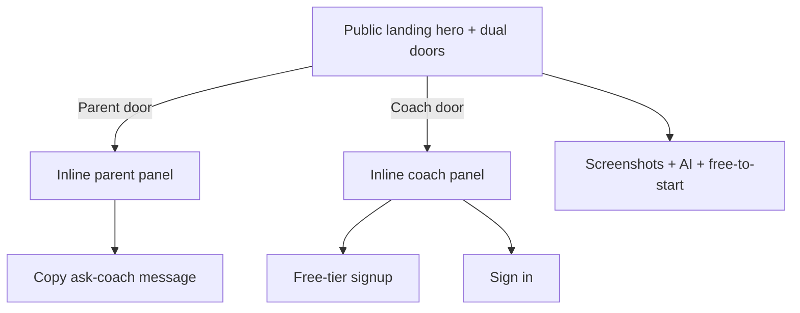
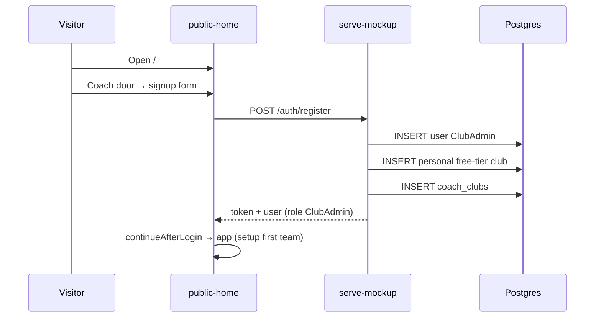

# VantagIQ Public Landing (Share-First) - Plan

## Goal Capsule

- **Objective:** Ship a public brand landing that attracts parents and young coaches away from messy social sharing into VantagIQ — parents via ask-coach (share-first, no parent account), coaches via free-tier signup + sign-in — with product proof on the page.
- **Product authority:** Ideation `docs/ideation/2026-07-18-vantagiq-public-landing-ideation.html` (idea #2); brainstorm dialogue 2026-07-18; planning forks: marketing at `/`, auto-create personal club on signup; free signup as ClubAdmin with 1-team / 1-coach caps.
- **Open blockers:** None.
- **Execution:** code
- **Done when:** `/` is the marketing landing; parent ask-coach + coach signup/sign-in work; signup creates ClubAdmin + personal club and enters the app; free tier allows only 1 team and blocks adding other coaches; Playwright covers AE1–AE4 paths; mockup hub remains reachable off-root.

## Product Contract

### Summary

A brand-forward public landing (emphasized `data/img/vantagiq_logo_background.png`) with equal Parent and Coach doors that expand **inline**. Parents get ask-your-coach help and a copyable message (no parent account). Coaches get free-tier signup and sign-in; free signup creates a **ClubAdmin** with a personal club capped at **1 team** and **1 coach** (their own account). The page includes product screenshots, an AI assessment mention, and soft “free to start” language. Primary success signal is coach free-tier signups from the landing.

### Problem Frame

Coaches and parents already share athlete stats and pictures on social networks in a disorganized way. There is no durable player story and no clear public front door into VantagIQ. Today `/` is the internal mockup hub, auth is login-only with admin-provisioned users, and the only parent path is a guest share link created by a coach — so visitors have nowhere appealing to start.

### Key Decisions

- **Dual doors, equal weight** — First viewport serves parents and coaches equally so neither audience feels secondary.
- **Parent path = ask coach only** — No parent account and no paste-share-URL field on the landing; parents request a share from their coach.
- **Coach path = signup + sign-in** — Free-tier self-serve signup plus sign-in for registered users (sign-in alone is insufficient for v1).
- **Free signup role = ClubAdmin** — New free-tier accounts are created as `ClubAdmin` (not `Coach`) so the user can set up their initial team and club settings without an admin.
- **Free tier = 1 team, 1 coach** — The personal free club may have at most one team and one coach account (the signup user’s own account). Adding a second team or another coach user is blocked on free tier.
- **Inline expand (flow A)** — Door taps expand panels in place on one page; not separate destination pages or jump-scroll stacks.
- **Core + proof** — v1 includes screenshots, AI mention, and free-tier messaging — not doors/CTAs alone.
- **Soft free-tier copy on landing** — Marketing page says free to start without hard numbers; the 1-team / 1-coach caps are enforced in-product after signup (and may be mentioned briefly after signup / in-app).
- **Brand background emphasized** — Hero uses `vantagiq_logo_background.png` as a strong visual plane, not a tiny logo badge.

### Actors

- A1. Parent visitor — wants organized player progress; no account on this landing.
- A2. Coach visitor (often young / new) — wants a better way to share progress than social dumps; may sign up free or sign in.
- A3. Registered coach/admin — already has an account; uses sign-in.
- A4. System (existing) — guest share experience after a coach creates a share (out of band from the landing; not a landing actor flow).

### Key Flows

- F1. Parent asks coach
  - **Trigger:** Visitor chooses Parent door.
  - **Actors:** A1
  - **Steps:** Inline panel opens with short instructions and a copyable “please share my player on VantagIQ” message; no account creation.
  - **Outcome:** Parent can send the ask to their coach; progress viewing still happens later via coach-created guest share (not on this page).
  - **Covered by:** R3, R4

- F2. Coach starts free or signs in
  - **Trigger:** Visitor chooses Coach door.
  - **Actors:** A2, A3
  - **Steps:** Inline panel offers free-tier signup and sign-in; signup creates a ClubAdmin free account with a personal club; sign-in reaches the existing authenticated app entry.
  - **Outcome:** New or returning user enters the product able to set up their first team; primary conversion metric is free-tier signup.
  - **Covered by:** R5, R6, R7, R11

- F3. Browse proof without choosing a door
  - **Trigger:** Visitor scrolls the landing.
  - **Actors:** A1, A2
  - **Steps:** Sees product screenshots, AI assessment mention, and soft free-to-start message.
  - **Outcome:** Understands what VantagIQ does before committing.
  - **Covered by:** R8, R9, R10

### Requirements

**Landing shell & brand**

- R1. A public marketing landing is reachable as the primary public entry (not the internal mockup hub chrome).
- R2. The first viewport emphasizes brand via `data/img/vantagiq_logo_background.png` as a dominant visual plane, with logo/wordmark and one short outcome promise; equal Parent and Coach doors live in that composition.

**Parent share-first**

- R3. Choosing Parent opens an inline panel (same page) with ask-your-coach guidance and a copyable request message; no parent account is created.
- R4. The parent panel does not require pasting a share URL and does not open player progress by itself.

**Coach free tier & sign-in**

- R5. Choosing Coach opens an inline panel with free-tier signup and sign-in for already registered users.
- R6. Free-tier signup is self-serve (no admin provisioning); the new account’s role is `ClubAdmin` so they can set up their initial team.
- R7. Sign-in from the landing reaches the same authenticated app entry coaches/admins use today.
- R11. Free-tier personal clubs allow at most **1 team** and **1 coach** (the signup user’s own account); attempts to create an additional team or add another coach user are rejected with a clear free-tier message.

**Proof & free messaging**

- R8. The page includes real product screenshots (or equivalent live UI captures) showing development / progress and related coach tools.
- R9. The page mentions AI-assisted assessment / guidance as part of the product promise.
- R10. Free-tier messaging on the landing is soft “free to start”; hard usage limits are not presented as numbered claims on the marketing page (they are enforced in-product per R11).

### Acceptance Examples

- AE1. Parent path stays account-free
  - **Covers:** R3, R4
  - **Given:** A parent visitor on the landing
  - **When:** They open the Parent door
  - **Then:** They see ask-coach help and can copy a message, and they are not prompted to create a parent account or paste a share link

- AE2. Coach can start free or sign in
  - **Covers:** R5, R6, R7
  - **Given:** A coach visitor on the landing
  - **When:** They open the Coach door and complete free signup
  - **Then:** An account is created without an administrator; the user’s role is `ClubAdmin`; they can proceed to set up their initial team

- AE3. Proof without conversion
  - **Covers:** R8, R9, R10
  - **Given:** A visitor who has not chosen a door
  - **When:** They scroll the landing
  - **Then:** They see product screenshots, an AI assessment mention, and free-to-start language without hard numeric free-tier limits

- AE4. Free-tier caps
  - **Covers:** R11
  - **Given:** A free-tier ClubAdmin who already has one team in their personal club
  - **When:** They try to create a second team, or add another coach user to the club
  - **Then:** The action is blocked with a clear free-tier limit message; their own account remains the sole coach

### Success Criteria

- Primary: coach free-tier accounts created from the landing (first weeks after ship).
- Qualitative: parents and coaches understand who the page is for within the first viewport; brand feels like VantagIQ (athletic background emphasis), not a generic SaaS template.

### Scope Boundaries

**In**

- Public dual-door landing with inline panels; ask-coach parent path; coach free signup + sign-in; screenshots; AI mention; soft free-to-start; emphasized brand background.

**Deferred for later**

- Paste / open share URL on the landing
- Parent or athlete login accounts
- Hard free-tier numbers on the marketing page (caps enforced in-app; landing stays soft)
- Separate `/for-parents` and `/for-coaches` destinations (visual option B)
- Long-scroll jump-link layout (visual option C)
- Interactive AI video demo on the marketing page
- Paid/club upgrade path that lifts the 1-team / 1-coach caps

**Outside this product's identity**

- Turning the internal mockup index into the public marketing page
- Replacing social networks as a general content platform (VantagIQ organizes player development, it does not become a feed)

### Deferred to Follow-Up Work

- Parity port of public register into `apps/api` Nest modules if/when that surface is the live auth path.
- Guided first-team onboarding wizard after free signup (ClubAdmin can use existing team/club UI; wizard is optional polish).
- Rate limiting on public register.

### Dependencies / Assumptions

- Guest share (`?share=` on S2/S6) remains how parents view progress after a coach creates a share; this landing does not replace that mechanism.
- Self-serve free-tier signup does not exist today and must be introduced for R5–R6 / R11.
- Free-tier clubs are identifiable somehow for enforcement (e.g. club flag, signup provenance, or “personal free” naming convention) — exact mechanism is a planning implementation detail under KTD6.
- Live mock backend is `scripts/serve-mockup.js` + Postgres (`DATABASE_URL`); public register ships there first.

### Outstanding Questions

**Deferred to implementation**

- Exact ask-coach message wording (English v1 string is fine; polish later).
- Screenshot asset sources — capture from S1/S2/S6/S10 or temporary branded placeholders under `data/img/` with clear `data-testid` hooks.
- Personal club display name formula (e.g. “{Coach name}’s Club” vs email-derived); uniqueness collisions if name taken.

### Sources / Research

- Ideation: `docs/ideation/2026-07-18-vantagiq-public-landing-ideation.html`
- Guest share: Features 034/035; `docs/backlog/007-guest-readonly-social-share.md`
- Auth today: `docs/ux/mockup/S0-login.html` (login-only); Parent role deferred in club-admin plan
- Serve root: `scripts/serve-mockup.js` currently maps `/` → mockup `index.html`
- User create (admin): `scripts/serve-mockup.js` `POST /api/v1/users`; club create (admin): `POST /api/v1/clubs`
- Post-login: `MockupApi.continueAfterLogin` → `ensureActiveClub` → S1 or S0a

---

## Planning Contract

### Assumptions

- Marketing page uses existing `site.css` tokens and logo assets; no new design system.
- Sign-in from the coach panel may deep-link to `S0-login.html` or embed the same login call; both satisfy R7 if session handoff matches S0.
- Auto-created personal club uses default sport `sport_soccer` unless a better default is obvious from existing seed data.
- Password rules for free signup match admin create (≥10 chars + digit) for consistency.
- Internal developers still need the mockup hub; relocating it off `/` is required, not deleting it.

### Key Technical Decisions

- KTD1. **`/` serves the marketing landing** — New `docs/ux/mockup/public-home.html` (name flexible). Current mockup hub moves to a dedicated path (e.g. `/mockup` → `mockup-hub.html` or renamed `index` content). Update `resolveTarget` in `scripts/serve-mockup.js` so `/` is no longer the prototype hub.
- KTD2. **Public `POST /api/v1/auth/register` (unauthenticated)** — Accepts name, email, password; creates `ClubAdmin` user (not `Coach`), creates a unique personal free-tier club, inserts `coach_clubs`, returns the same session shape as login (`token`, `role`, `user`) so the client can call `continueAfterLogin`. Does not reuse admin `POST /users` (that requires an actor).
- KTD3. **Personal club on signup** — Transactional create: user + club + membership. Club name derived from user name with collision suffix if needed. User lands ready (single club → `ensureActiveClub` should succeed without S0a pick) and can create their first team as ClubAdmin.
- KTD4. **Landing chrome** — Auth/marketing shell only (like S0). No `.bottom-nav`. Hero uses full-bleed `vantagiq_logo_background.png` with overlay for readability.
- KTD5. **Inline panels** — Parent and Coach panels toggle in-page (show/hide); only one expanded at a time is fine.
- KTD6. **Free-tier enforcement (1 team, 1 coach)** — Mark clubs created via public register as free-tier. Block creating a second team in that club and block adding/inviting another coach (or ClubAdmin) user to that club. Clear error copy referencing free-tier limits. First team create remains allowed.

### High-Level Technical Design

### Alternative Approaches Considered

- **Landing at `/home`, hub stays at `/`** — Rejected; product wants marketing as primary public entry.
- **Signup then forced club setup** — Rejected; user chose auto-create personal club.
- **UI-only signup without DB** — Rejected; brainstorm requires real free-tier accounts for the success metric.

---

## Implementation Units

### U1. Marketing landing page (UI)

**Goal:** Dual-door public page with brand hero, inline parent/coach panels, proof strip, and soft free-to-start copy.

**Requirements:** R1–R5, R7–R10, F1, F3, AE1, AE3

**Dependencies:** None

**Files:**
- Create: `docs/ux/mockup/public-home.html`
- Modify: `docs/ux/mockup/style/site.css` (landing-specific classes only as needed)
- Create or reuse: `data/img/` proof screenshots (or placeholders)
- Test: `tests/playwright/public-landing.spec.js` (scaffold assertions in U5; U1 may land HTML-only first)

**Approach:**
- Hero with emphasized background image, logo, short promise, equal Parent/Coach doors.
- Parent panel: instructions + copyable ask-coach message + copy control (`data-testid` on message and copy button).
- Coach panel: signup fields (name, email, password) + Sign in control linking to S0 or triggering login.
- Proof section: screenshots, AI mention, “free to start” without numeric limits.
- No bottom nav; load `mockup-api-client.js` for signup wiring in U4.

**Patterns to follow:** `docs/ux/mockup/S0-login.html` (auth-shell, no app chrome); `site.css` tokens; brand logo path `/data/img/VantagIQ_transp_300_2.png`.

**Test scenarios:** Covered under U5 (UI-only verification: open page in browser / Playwright smoke once routed).

**Verification:** Page renders hero doors and proof; parent panel has copyable message; coach panel shows signup + sign-in; no parent account fields.

### U2. Serve marketing at `/`; relocate mockup hub

**Goal:** Primary public entry is the landing; prototype hub remains available off-root.

**Requirements:** R1

**Dependencies:** U1

**Files:**
- Modify: `scripts/serve-mockup.js` (`resolveTarget` for `/`)
- Create/rename: `docs/ux/mockup/mockup-hub.html` (content from current `index.html`) or equivalent
- Modify: `docs/ux/mockup/index.html` only if retained as redirect/alias — prefer explicit hub file + route
- Update any internal links that assumed hub at `/` (hub self-links, docs that cite Open Login from hub)

**Approach:**
- `/` → `public-home.html`
- `/mockup` (and optionally `/mockup-hub.html`) → former hub content
- Keep extensionless HTML resolution working for S0–S10

**Patterns to follow:** Existing `resolveTarget` in `scripts/serve-mockup.js` (~1353).

**Test scenarios:**
- `GET /` returns marketing page content (title/doors), not “Mockup Flow”.
- `GET /mockup` (or chosen hub path) still shows prototype navigation.

**Verification:** Visiting `/` shows marketing; hub still reachable for developers.

### U3. Public free-tier register API

**Goal:** Unauthenticated signup that creates ClubAdmin + personal free-tier club + membership and returns a login-equivalent session.

**Requirements:** R5, R6, F2, AE2

**Dependencies:** None (can parallel U1)

**Files:**
- Modify: `scripts/serve-mockup.js` (new `POST ${apiPrefix}/auth/register`; exclude from auth-guard like login; mark club free-tier)
- Modify: `docs/ux/mockup/js/mockup-api-client.js` (`register` helper)
- Optional docs: `docs/ux/mockup/API-Mockup-Mapping.md` (one row for register)
- Schema/migration if a `tier` / `is_free_tier` (or equivalent) column is needed on `clubs` — only if no existing flag fits

**Approach:**
- Validate name, email, password (same bar as admin create).
- Reject duplicate email (409).
- Create **ClubAdmin** user; create club with unique name marked free-tier; link `coach_clubs`.
- Return `{ token, role, user }` compatible with login consumers (`role` = `ClubAdmin`).
- Ensure mutating auth-guard allowlist includes `/auth/register` alongside `/auth/login`.

**Patterns to follow:** Login handler (~4170); user insert (~4019); club insert (~3117); password rules on admin create.

**Execution note:** Prefer a single transactional path (or ordered inserts with clear rollback on failure) so partial signups do not leave orphan users.

**Test scenarios:**
- Happy path: register → 201 → user role `ClubAdmin` → club membership exists → can login with same credentials.
- Duplicate email → 409.
- Weak password → 400.
- Unauthenticated call succeeds (no actorEmail required).

**Verification:** New user can register without SystemAdmin, has role ClubAdmin, and has exactly one club membership on a free-tier club.

### U3b. Enforce free-tier 1 team / 1 coach

**Goal:** Free-tier clubs cannot add a second team or a second coach account.

**Requirements:** R11, AE4

**Dependencies:** U3

**Files:**
- Modify: `scripts/serve-mockup.js` (team create; user/coach assign paths scoped to free-tier clubs)
- Modify: relevant mockup UI error surfaces if they swallow API errors (S7 / team create flows as applicable)
- Test: covered in U5

**Approach:**
- On team create for a free-tier club: if team count ≥ 1, return 403/400 with clear free-tier message.
- On add-coach / create-user assigned to a free-tier club: if the club already has a coach/admin membership beyond the signup user (or any second user), reject.
- Paid/non-free clubs unchanged.

**Test scenarios:**
- Covers AE4. Free ClubAdmin with one team → second team create fails with free-tier message.
- Free ClubAdmin → attempt to create/add another coach to same club fails.
- First team create on empty free club succeeds.

**Verification:** Caps hold for free-tier clubs; non-free clubs unaffected.

### U4. Wire landing signup and sign-in handoff

**Goal:** Coach panel completes free signup into the app; sign-in reaches the same post-login path as S0.

**Requirements:** R5–R7, F2, AE2

**Dependencies:** U1, U3

**Files:**
- Modify: `docs/ux/mockup/public-home.html` (form handlers)
- Modify: `docs/ux/mockup/js/mockup-api-client.js` if register client helper lives here

**Approach:**
- Signup submit → `MockupApi.register` → on success `continueAfterLogin(user)` with `ClubAdmin` role.
- Sign-in: navigate to `S0-login.html` or inline login using `MockupApi.login` + `continueAfterLogin`.
- Surface errors in-panel (duplicate email, validation).
- After signup with personal club, expect authenticated app entry with active club (S1 or ClubAdmin-appropriate home).

**Patterns to follow:** `S0-login.html` submit handler; `continueAfterLogin`.

**Test scenarios:** Covered in U5 integration cases.

**Verification:** Completing signup from `/` lands as ClubAdmin with an active club, able to create the first team.

### U5. Playwright coverage for landing + signup

**Goal:** Automated acceptance for AE1–AE3 and signup happy path.

**Requirements:** AE1, AE2, AE3, AE4, R1–R11

**Dependencies:** U1–U4, U3b

**Files:**
- Create: `tests/playwright/public-landing.spec.js`
- Modify: none required unless `playwright.config.js` needs a note (usually not)

**Approach:** Mirror `tests/playwright/s0-auth-entry.spec.js` style (`page.goto`, roles/testids).

**Test scenarios:**
- Covers AE1. Open `/` → Parent door → ask-coach message visible → no signup form for parent → copy control present.
- Covers AE3. Open `/` → proof screenshots / AI mention / free-to-start visible without opening doors.
- Covers AE2. Coach door → signup + sign-in controls visible; signup → role `ClubAdmin` (assert via UI badge or session/API).
- Signup happy path: unique email → submit → authenticated shell with active club.
- Sign-in control reaches S0 or completes login.
- `/` is not the old “Mockup Flow” hub title/chrome.
- Covers AE4. After free signup + first team, second team create blocked; adding another coach blocked.

**Verification:** `npx playwright test tests/playwright/public-landing.spec.js` passes against `serve-mockup.js`.

---

## Verification Contract

| Gate | Command / check | Applies to |
|------|-----------------|------------|
| Landing UI + flows | `npx playwright test tests/playwright/public-landing.spec.js` | U1–U5, U3b |
| Auth regression | `npx playwright test tests/playwright/s0-auth-entry.spec.js` | U3–U4 |
| Manual smoke | Open `/` — brand hero, dual doors, proof; Parent copy; ClubAdmin signup → first team OK; second team blocked | U1–U4, U3b |
| Hub preserved | Open `/mockup` (or chosen path) — prototype hub still usable | U2 |

## Definition of Done

- Product Contract R1–R11 satisfied on the running mockup server.
- `/` is marketing; mockup hub is off-root and still reachable.
- Free signup creates **ClubAdmin** + personal free-tier club and enters the app without admin provisioning.
- Free-tier enforcement: max 1 team and 1 coach (own account) per free club.
- Playwright public-landing spec green (including AE4 caps); S0 auth entry still green.
- Soft free-to-start copy on the landing (no hard numeric limits in marketing copy).
- API-Mockup mapping updated if the team treats it as the contract for new endpoints.

## Risk Analysis & Mitigation

| Risk | Mitigation |
|------|------------|
| Public register spam / account flooding | Ship without rate limit in v1; add IP/email throttling as follow-up before wide marketing push |
| Club name collisions on personal clubs | Suffix with short unique token when `LOWER(name)` conflicts |
| Developers lose mockup hub at `/` | Explicit `/mockup` (or equivalent) route + hub page title stating it is internal |
| Signup orphans (user without club) | Single register path creates user+club+membership together; fail closed on partial error |
| Free-tier user cannot create first team | Assign `ClubAdmin` (not `Coach`) so team/club setup permissions exist |
| Caps bypassed via admin APIs | Enforce on server team-create and coach-add paths for free-tier clubs, not UI-only |

## System-Wide Impact

- **Developers:** Habit change — prototype hub URL moves; document in hub page and any README that cites `/`.
- **Existing coaches:** Unaffected except clearer public entry; login path unchanged.
- **Parents:** Still depend on coaches creating guest shares after the ask-coach message.
- **Ops:** New unauthenticated register endpoint — watch for spam (rate limit deferred; note as future hardening).
