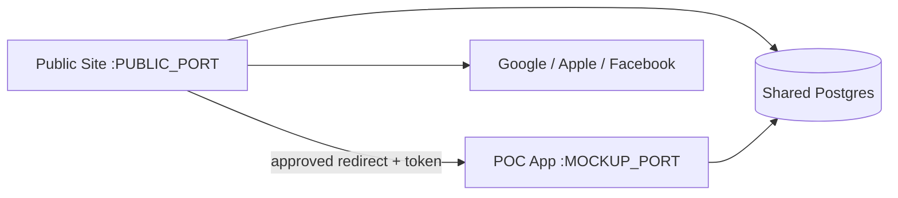
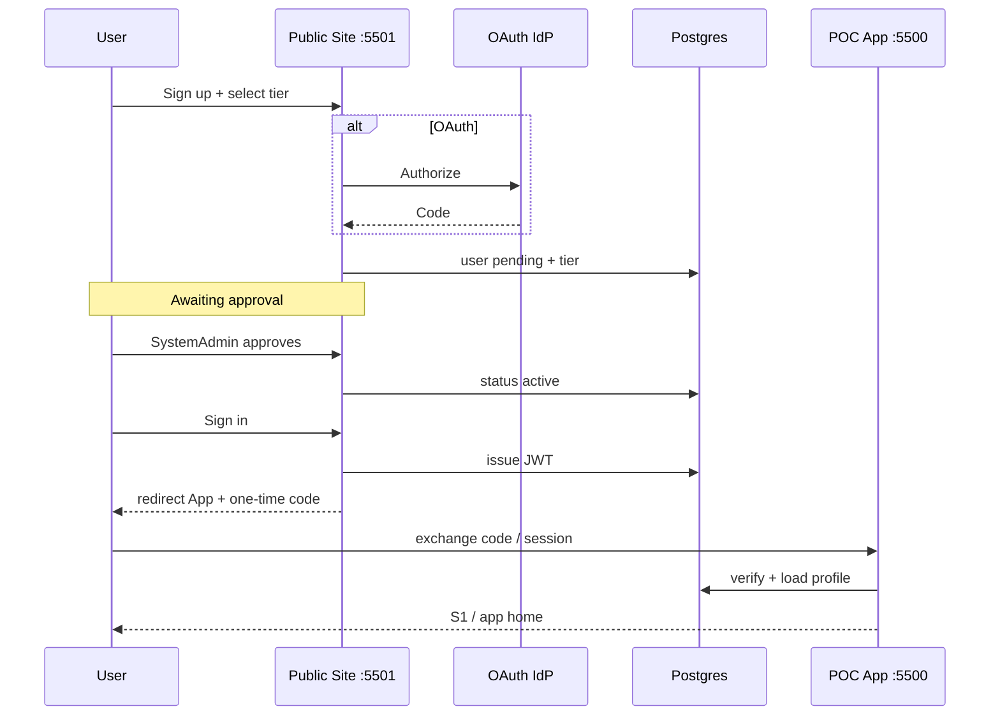

# Public Site, OAuth & Subscription Tiers - Plan

## Goal Capsule

- **Objective:** Split VantagIQ into a **public site** (future `vantagiq.com`, local separate port) for marketing, self-registration (OAuth or email/password), and subscription-tier selection, and keep **POC App** (future `app.vantagiq.com`, local separate port) for the coach product — accepting auth tokens and authorizing from a **shared user profile** (role + subscription tier). No payment billing in this release; SystemAdmin must approve every new user before app access. Tier limits are configurable in a SystemAdmin-managed table.
- **Product authority:** User decisions 2026-07-19 (no billing; OAuth + email/password; approval gate; tier matrix A–D). Prior public landing (`2026-07-18-013`) moves onto the public site port. Prior JWT brainstorm (`2026-07-02`) is superseded for external IdP (that doc forbade IdPs).
- **Open blockers:** None for planning. Provider app credentials (Google/Apple/Facebook) are env-config at implementation time; local may use stub OAuth until keys exist.
- **Execution:** code
- **Done when:** Two local servers run on distinct ports; public site handles signup/tier select/approval-pending UX; SystemAdmin can approve users and edit tier config; app validates session/token and enforces tier quotas (teams, coaches, ClubAdmins, videos/day, max videos/team); Playwright covers happy paths for both surfaces.

## Product Contract

### Summary

Build in this monorepo two processes: **Public Site** (marketing + enrollment + tier self-select, no charges) and **POC App** (existing mockup product). Shared Postgres holds users, OAuth links, subscription tiers, and approval status. New users pick Free Tier / Professional / Club Basic / Club Premium and authenticate via Google, Apple, Facebook, **or** email/password. Accounts start **pending** until a SystemAdmin approves. The app authorizes using the shared profile’s **role** and **subscription tier**. DNS mapping is later ops work.

### Problem Frame

Today marketing and the coach app share one server (`MOCKUP_PORT` 5500), auth is stub `jwt-{role}` plus email in `localStorage`, and free-tier caps are a hard-coded club flag (`is_free_tier`). That cannot support a root-domain enrollment experience, multi-provider OAuth, SystemAdmin approval, or configurable paid-style tiers without billing.

### Key Decisions

- **Two local servers, one repo** — Public Site and POC App are separate Node processes / ports now; later map DNS (`vantagiq.com` → public, `app.vantagiq.com` → app).
- **No billing yet** — Users select a tier at signup; no Stripe/Apple IAP. Entitlements still apply as if subscribed.
- **SystemAdmin approval gate** — Every new self-registered user is `pending` until SystemAdmin approves; only then may they enter the POC App.
- **Auth choice** — User may use Google, Apple, Facebook, **or** app-managed email/password.
- **Configurable tiers** — SystemAdmin-only table seeds and edits the four tiers and their quotas (below).
- **Shared profile** — Role + subscription tier live in shared DB; app trusts a verified access token (or equivalent server-validated session) carrying identity claims, not client-asserted `actorEmail` alone for new auth paths.
- **Supersede hard-coded free-only flag** — Generalize quota enforcement to the user’s active tier (migrate `is_free_tier` behavior into Free Tier row).

### Actors

- A1. Prospective user — registers on public site (OAuth or email/password), selects tier, waits for approval.
- A2. Approved end user — uses POC App under their role and tier quotas.
- A3. SystemAdmin — approves/rejects pending users; configures subscription tiers; may still manage users/roles.
- A4. OAuth providers — Google, Apple, Facebook (external).

### Key Flows

- F1. Self-register with email/password
  - **Trigger:** User submits signup on public site with tier selection.
  - **Actors:** A1, A3
  - **Steps:** Create user `pending` + preferred tier; no app access until SystemAdmin approves → `active`.
  - **Outcome:** User sees “awaiting approval”; SystemAdmin sees pending queue.
  - **Covered by:** R3, R5, R6, R7

- F2. Self-register with OAuth
  - **Trigger:** User chooses Google / Apple / Facebook on public site.
  - **Actors:** A1, A4, A3
  - **Steps:** OAuth consent → link identity → create/link user `pending` + selected tier → approval required same as F1.
  - **Outcome:** Same pending gate; later login via same provider once approved.
  - **Covered by:** R4, R5, R6, R7

- F3. Enter POC App
  - **Trigger:** Approved user signs in (OAuth or password) and opens app URL/port.
  - **Actors:** A2
  - **Steps:** Validate token/session; load role + tier; enforce quotas on create paths.
  - **Outcome:** App usable within tier limits.
  - **Covered by:** R8, R9, R10, R11

- F4. SystemAdmin configures tiers
  - **Trigger:** SystemAdmin edits tier quotas in admin UI.
  - **Actors:** A3
  - **Steps:** Update configurable tier rows; subsequent enforcement uses new values.
  - **Outcome:** Quotas change without code deploy (within validation bounds).
  - **Covered by:** R12, R13

### Requirements

**Topology**

- R1. Public Site runs as a separate local server (env `PUBLIC_HOST` / `PUBLIC_PORT`, default e.g. `5501`) hosting marketing + enrollment + account/tier management UI.
- R2. POC App continues on `MOCKUP_HOST` / `MOCKUP_PORT` (default `5500`) for coach product screens; public marketing at app `/` is relocated or redirected to the Public Site.

**Enrollment & approval**

- R3. Users may register with email/password managed by the app.
- R4. Users may register/sign-in with Google, Apple, or Facebook OAuth (real providers when env credentials exist; documented local stub/mock mode allowed until credentials are configured).
- R5. At signup the user selects one subscription type: Free Tier, Professional, Club Basic, Club Premium.
- R6. New self-registered users are created with status **pending** (not active) and cannot use POC App APIs/UI until SystemAdmin approval.
- R7. SystemAdmin can list pending users and approve or reject them; approval sets status **active** (rejection sets a terminal non-active state with clear messaging).

**Shared auth for POC App**

- R8. After approval, sign-in issues a **server-verifiable** access credential (signed JWT or equivalent) including at least user id, role, subscription tier id/code, and status.
- R9. POC App validates that credential on protected routes and rejects missing/invalid/expired/pending users.
- R10. Authorization uses the shared profile’s **role** and **subscription tier** (not client-supplied role claims alone).

**Subscription tiers (configurable)**

- R11. Quota enforcement uses the user’s active tier from the shared DB (not only `clubs.is_free_tier`).
- R12. A SystemAdmin-only configurable table (or equivalent admin-editable store) defines tiers and quotas; seed the four tiers below.
- R13. Only SystemAdmin may create/update tier configuration (not ClubAdmin/Coach).

**Seeded tier entitlements (initial values; editable later via R12)**

| Code | Display | Max teams | Max coaches | Max ClubAdmins | Videos / day | Max videos / team | Notes |
|------|---------|-----------|-------------|----------------|--------------|-------------------|-------|
| `free` | Free Tier | 1 | 1 | 0 (single user account) | 2 | 11 | Assigned to single user; to add videos beyond max, user must delete |
| `professional` | Professional | 3 | 3 | 0 (no ClubAdmin role) | 2 | 11 | Coaches only |
| `club_basic` | Club Basic | 5 | 10 | 1 | 11 | 33 | |
| `club_premium` | Club Premium | 10 | 10 | 10 | 11 | 55 | |

- R14. Creating a team beyond the tier max is rejected with a clear limit message.
- R15. Adding a coach / ClubAdmin membership beyond the tier max is rejected with a clear limit message.
- R16. Professional tier users must not receive ClubAdmin role via self-serve paths.
- R17. Video/clip create respects **per-day** and **per-team max** caps; when at max videos for a team, user must delete before adding new ones.
- R18. No payment capture, invoices, or provider billing webhooks in this release.

### Acceptance Examples

- AE1. Pending gate
  - **Covers:** R6, R7, R9
  - **Given:** A newly registered user (password or OAuth) with a selected tier
  - **When:** They try to open the POC App before approval
  - **Then:** Access is denied; after SystemAdmin approval, sign-in succeeds

- AE2. Auth choice
  - **Covers:** R3, R4
  - **Given:** Public Site enrollment page
  - **When:** User chooses email/password or an OAuth provider
  - **Then:** Either path can create a pending account with a selected tier

- AE3. Free Tier quotas
  - **Covers:** R11, R14, R15, R17
  - **Given:** An approved Free Tier user
  - **When:** They create a second team, or exceed 2 videos/day or 11 videos on the team
  - **Then:** The action is blocked with a clear free-tier/limit message

- AE4. Professional has no ClubAdmin
  - **Covers:** R16
  - **Given:** An approved Professional user
  - **When:** Profile/role is inspected after approval
  - **Then:** They are not ClubAdmin; coach seats are limited to 3 / 3 teams

- AE5. SystemAdmin edits tier
  - **Covers:** R12, R13
  - **Given:** SystemAdmin opens tier configuration
  - **When:** They change Club Basic max teams and save
  - **Then:** Subsequent enforcement uses the new value (within validation)

- AE6. Two ports
  - **Covers:** R1, R2
  - **Given:** Both servers running
  - **When:** Browser hits public port vs app port
  - **Then:** Public port shows enrollment/marketing; app port shows POC App (not the old single-process marketing-only story)

### Success Criteria

- Local demo: Public Site on one port, POC App on another, shared DB, OAuth stub or real + password, approval queue, tier quotas enforced.
- SystemAdmin can change tier numbers without a code change (table/config UI).
- Ready for later DNS: no hard-coded production hostnames required beyond env config.

### Scope Boundaries

**In**

- Two Node servers in this monorepo; shared Postgres; public enrollment UI; OAuth providers (or stubs); email/password; pending approval; tier config table + seed; app token validation; quota enforcement for teams/coaches/ClubAdmins/videos.

**Deferred for later**

- Real billing / Stripe / App Store / Google Play
- DNS / TLS / production reverse-proxy setup (document env ports only)
- Parent/athlete login personas
- Refresh-token rotation policies beyond a minimal workable session
- Migrating every historical API off `actorEmail` in one shot (new auth path first; dual-support during transition)

**Outside this product's identity**

- Becoming a generic IdP for third-party apps
- Social feed / content network (still player-development product)

### Deferred to Follow-Up Work

- Full removal of stub `jwt-{role}` and plaintext password compare once signed JWT + hashed passwords are live.
- Fine-grained per-feature feature flags beyond the tier matrix.
- Apple Sign In / Facebook app review production checklists (ops).

### Dependencies / Assumptions

- Shared DB remains the source of truth for users, tiers, and memberships.
- OAuth provider credentials arrive via env (`GOOGLE_*`, `APPLE_*`, `FACEBOOK_*`); without them, stub mode returns deterministic test identities for local Playwright.
- “Videos” means product clips (upload/link ingest) counted per team and per calendar day (UTC or club-local — pick one in implementation and document).
- Free Tier “single user” means one account owning the club with coach seat = 1 (aligned with today’s personal free club).
- Existing approved admin-provisioned users remain usable; map them to a tier (default Free or Professional — implementation default: existing SystemAdmins unconstrained; existing ClubAdmin/Coach → Free Tier unless Admin sets otherwise).

### Outstanding Questions

**Deferred to implementation**

- Exact JWT library and cookie vs `Authorization: Bearer` handoff between public site and app (prefer Bearer + httpOnly cookie option documented in KTDs).
- Day boundary timezone for videos/day.
- Whether rejecting a user allows re-registration with same email.

### Sources / Research

- Current auth: `scripts/serve-mockup.js` login/register; stub token; `docs/ux/mockup/js/mockup-api-client.js` session email
- Ports: `MOCKUP_HOST` / `MOCKUP_PORT` (default 5500)
- Free-tier checks: `assertFreeTierAllowsNewTeam` / `assertFreeTierAllowsNewMember`
- S7: `docs/ux/mockup/S7-admin-user-management.html`
- JWT brainstorm (superseded on IdP): `docs/brainstorms/2026-07-02-internal-jwt-auth-and-role-control-requirements.md`
- Public landing plan: `docs/plans/2026-07-18-013-feat-vantagiq-public-landing-share-first-plan.md`

---

## Planning Contract

### Assumptions

- Default ports: Public `5501`, App `5500` (overridable via env).
- Clip quota counts rows in `clips` (and link-ingest clips) associated to the team’s players; “delete video” = soft or hard delete already supported by product — use whatever delete path exists.
- SystemAdmin approval UI lives primarily on the **Public Site** admin area and/or S7 extended on the app; prefer **one** admin surface — recommend Public Site “Admin → Approvals & Tiers” for enrollment concerns, keep S7 for in-app user ops, with pending list available in both or deep-linked (KTD chooses Public Site as source of truth for approvals + tiers to avoid split brain).

### Key Technical Decisions

- KTD1. **Monorepo dual servers** — `scripts/serve-public.js` (or `apps/public/`) for Public Site; existing `scripts/serve-mockup.js` for POC App. Shared modules under e.g. `scripts/auth/` or `apps/api` for token issue/verify and quota helpers.
- KTD2. **Signed access tokens** — Replace stub `jwt-{role}` for new auth with HMAC/RSA JWT (`sub`, `role`, `tier`, `status`, `exp`). App middleware verifies signature; reject `pending`. Keep transitional support for existing mock sessions during migration if needed.
- KTD3. **Password hashing** — Store hashed passwords for new email/password users; migrate existing plaintext when touched.
- KTD4. **Schema** — Tables such as: `subscription_tiers` (code, name, max_teams, max_coaches, max_club_admins, videos_per_day, max_videos_per_team, active); `users` columns `subscription_tier_id`, `approval_status` (`pending|active|rejected`); `user_oauth_identities` (provider, provider_user_id, user_id). Seed four tiers. Deprecate reliance on `clubs.is_free_tier` after backfill (keep column temporarily for compat).
- KTD5. **OAuth** — Authorization-code + PKCE where required; callback on Public Site; link-or-create user; never auto-activate. Local stub providers when env missing.
- KTD6. **Quota engine** — Shared `assertTierAllows(action, ctx)` used by team create, coach/ClubAdmin assign, clip create — driven by tier row for user’s club owner or club’s effective subscription (club inherits owner’s tier for Free/Professional; Club tiers attach to club — document: **subscription is on the approving user’s account / club owner**).
- KTD7. **Cross-origin handoff** — After login on Public Site, redirect to App origin with one-time code or set shared cookie on parent domain later; for local ports use redirect with short-lived code exchanged by App for session (avoids leaking tokens in logs).

### High-Level Technical Design

### Alternative Approaches Considered

- **Billing-first with Stripe** — Rejected for this release; tier select only.
- **OAuth-only** — Rejected; keep email/password.
- **Same port path-prefix only** — Rejected; user wants separate ports for future DNS split.
- **Immediate active on signup** — Rejected; SystemAdmin approval required.

### Phased Delivery

1. **P1 — Split servers + pending approval + email/password** (move public landing; pending status; Admin approve)
2. **P2 — Tier table + seed + generalize quota enforcement** (teams/coaches/ClubAdmins/videos)
3. **P3 — OAuth Google/Apple/Facebook** (real + stub) + signed JWT handoff to App
4. **P4 — Polish** — Admin tier editor UI, Playwright e2e across ports, deprecate stub tokens

---

## Implementation Units

### U1. Schema: tiers, approval, OAuth identities

**Goal:** Persist configurable tiers, user approval status, tier assignment, and OAuth identity links.

**Requirements:** R5, R6, R11, R12, R16

**Dependencies:** None

**Files:**
- Create: `apps/api/src/db/migrations/033_subscription_tiers_and_approval.sql` (name may adjust)
- Modify: `apps/api/src/db/schema/tables.sql`
- Modify: `scripts/serve-mockup.js` `ensureDatabase` retrofit

**Approach:** Create `subscription_tiers` + seed four rows with quotas from the Product Contract table; add `users.approval_status`, `users.subscription_tier_id`; create `user_oauth_identities`; backfill existing users to `active` + Free Tier (SystemAdmin unconstrained flag optional).

**Test scenarios:** Migration applies idempotently; seed codes `free|professional|club_basic|club_premium` present.

**Verification:** Verify SQL against local DB; existing logins still work after backfill.

### U2. Public Site server shell + move marketing

**Goal:** Second process on `PUBLIC_PORT` serves public HTML; app port no longer owns marketing home.

**Requirements:** R1, R2, AE6

**Dependencies:** None (can parallel U1)

**Files:**
- Create: `scripts/serve-public.js` (or package under `apps/public/`)
- Move/adapt: `docs/ux/mockup/public-home.html` → public site static root (or shared `docs/ux/public/`)
- Modify: `scripts/serve-mockup.js` — `/` redirect or app splash linking to public URL
- Modify: `.env.example` — `PUBLIC_PORT`, `PUBLIC_ORIGIN`, `APP_ORIGIN`, `MOCKUP_PORT`
- Test: Playwright baseURL config for dual servers

**Approach:** Static + API for auth/enrollment on public server; reuse CSS/brand assets.

**Execution note:** Smoke both ports after start scripts documented in README or package.json scripts.

**Verification:** `PUBLIC_PORT` shows landing; `MOCKUP_PORT` is app entry.

### U3. Pending registration + SystemAdmin approval

**Goal:** Email/password signup creates pending users; Admin approves before app access.

**Requirements:** R3, R5, R6, R7, AE1

**Dependencies:** U1, U2

**Files:**
- Modify: public signup API + UI
- Modify: `scripts/serve-mockup.js` register path (disable auto-active or route through public API only)
- Create/Modify: Admin approvals UI (public admin or S7)
- Test: Playwright pending → deny app → approve → allow

**Approach:** Replace immediate `status='active'` on public register; add approve/reject endpoints SystemAdmin-only.

**Verification:** AE1 passes.

### U4. Tier config admin + quota engine

**Goal:** SystemAdmin edits tiers; team/coach/ClubAdmin/video limits enforced from tier rows.

**Requirements:** R11–R17, AE3, AE4, AE5

**Dependencies:** U1

**Files:**
- Create: shared quota helper module
- Modify: team create, coach assign, clip create paths in `serve-mockup.js` (+ public if needed)
- Create: SystemAdmin tier editor UI
- Test: Free/Professional/Club Basic limit cases

**Approach:** Replace `assertFreeTier*` with tier-driven checks; Professional cannot be assigned ClubAdmin via self-serve; video counters for day + per-team max.

**Verification:** AE3–AE5 pass.

### U5. OAuth providers (Google, Apple, Facebook)

**Goal:** Low-friction enrollment via IdPs with same pending + tier selection.

**Requirements:** R4, AE2

**Dependencies:** U3

**Files:**
- Create: OAuth routes/callbacks on Public Site
- Modify: env example for client IDs/secrets
- Create: stub mode for CI/Playwright
- Test: stub OAuth creates pending user + identity row

**Approach:** Auth code + PKCE; store `user_oauth_identities`; do not activate until approval.

**Verification:** Stub Google path creates pending user with selected tier.

### U6. Signed JWT + App acceptance

**Goal:** POC App verifies tokens and authorizes from shared profile.

**Requirements:** R8, R9, R10, F3

**Dependencies:** U3, U5 (password path can land first)

**Files:**
- Create: token issue/verify helpers
- Modify: App login/session bootstrap; protect mutating APIs
- Modify: public → app handoff (one-time code)
- Test: invalid/pending token rejected; valid active accepted

**Approach:** JWT secret in env; App exchange endpoint; gradually require Bearer/session for writes.

**Verification:** Approved user reaches S1; pending cannot.

### U7. Dual-port Playwright suite

**Goal:** End-to-end coverage across Public Site and App.

**Requirements:** AE1–AE6

**Dependencies:** U2–U6

**Files:**
- Create: `tests/playwright/public-site-oauth-tiers.spec.js` (name flexible)
- Modify: `playwright.config.js` — dual webServers or sequential start

**Test scenarios:** Cover AE1–AE6; keep existing public-landing tests updated for new port.

**Verification:** Suite green locally with stub OAuth.

---

## Verification Contract

| Gate | Command / check | Applies to |
|------|-----------------|------------|
| Dual servers | Start public + mockup; hit both origins | U2 |
| Schema | Apply migration; seed tiers visible | U1 |
| E2E | Playwright dual-port suite | U7 |
| Regression | Existing s0 / landing tests updated to ports | U2, U7 |
| Manual | Approve user; Free Tier second team blocked; video day cap | U3, U4 |

## Definition of Done

- Public Site and POC App run on separate configurable ports.
- Signup supports OAuth (or stub) and email/password with tier selection.
- Users remain pending until SystemAdmin approval.
- Tier table seeded with Free / Professional / Club Basic / Club Premium quotas; SystemAdmin can edit.
- App accepts verified auth and enforces role + tier quotas.
- No billing integration shipped.
- Playwright dual-port coverage green; checklist note for future DNS.

## Risk Analysis & Mitigation

| Risk | Mitigation |
|------|------------|
| OAuth provider review / missing secrets | Stub mode for local/CI; document real env vars |
| Token leakage on redirect | One-time code exchange; short TTL; no long-lived token in query string |
| Quota bypass via old `actorEmail` APIs | Enforce quotas server-side regardless of client; tighten auth in U6 |
| Split-brain Admin UIs | Single source for approvals + tiers (Public Site admin) |
| Existing plaintext passwords | Hash on next password set; prefer OAuth |

## System-Wide Impact

- **Developers:** Two processes to run; update Playwright and README.
- **Existing users:** Backfilled active + default tier; SystemAdmin approval only for **new** self-serve signups.
- **Ops:** Later DNS to two ports/services; secrets for three IdPs + JWT.
- **Prior public landing plan:** Marketing/enrollment ownership moves to Public Site port; free-tier caps superseded by configurable Free Tier row.
