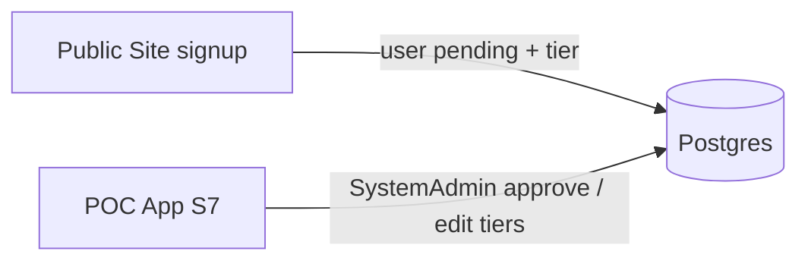
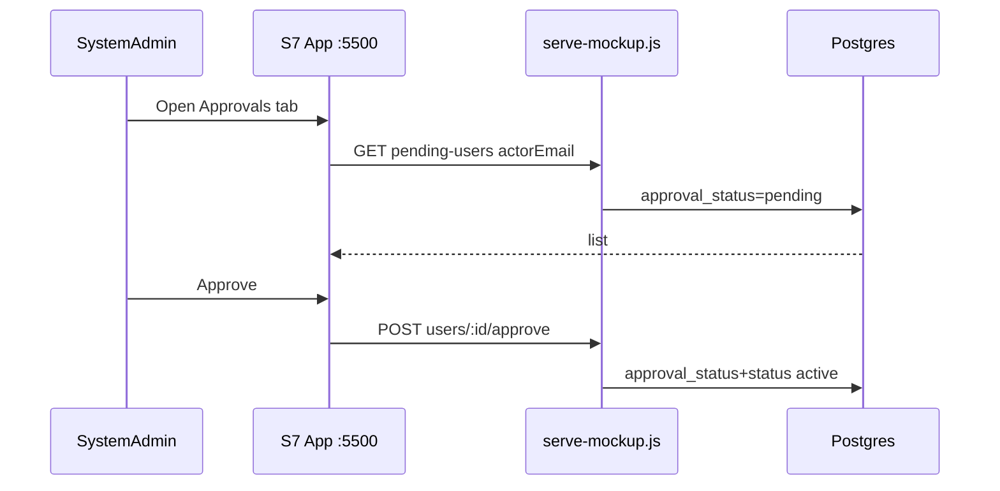

# Move Approvals & Tiers Admin into S7 (SystemAdmin) - Plan

## Goal Capsule

- **Objective:** Move pending-user approval and subscription-tier configuration out of the public site (`public-admin.html` on port 5501) into the **protected POC App**, as **SystemAdmin-only** sections/tabs on existing **S7 User & Role Management**. Public enrollment stays on the public site; enrollment ops move behind app auth.
- **Product authority:** User choice 2026-07-19 — place UI on **S7 sections/tabs** (not a new nav screen). Supersedes the prior plan’s KTD that made Public Site the sole Approvals & Tiers surface.
- **Open blockers:** None.
- **Execution:** code
- **Done when:** SystemAdmin signed into the app can approve/reject pending users and edit tier quotas on S7; ClubAdmin/Coach cannot access those panels; public site no longer exposes a working admin UI or SystemAdmin deep-link for that purpose; Playwright covers SystemAdmin vs non-SystemAdmin access.

## Product Contract

### Summary

Consolidate enrollment administration into S7 so SystemAdmins manage pending signups and tier limits in the same protected app they already use for users/roles. The public site remains marketing + self-registration + sign-in only.

### Problem Frame

Approvals and tier editing today live on `docs/ux/mockup/public-admin.html` served by `scripts/serve-public.js`, gated only by typing a SystemAdmin email (`X-Actor-Email`). That splits admin UX across ports, is easy to miss, and is weaker than session-protected app screens. S7 already shows an Approval column but cannot approve or edit tiers.

### Key Decisions

- **S7 sections/tabs** — Add Approvals and Tiers panels on `S7-admin-user-management.html` (no new bottom-nav item).
- **SystemAdmin only** — Approvals and Tiers tabs/panels visible and callable only for `role === SystemAdmin` with an active session; ClubAdmin keeps the existing Users experience.
- **Protected app APIs** — Pending-user and tier-admin endpoints move onto (or are duplicated then removed from) the POC App server so S7 does not depend on the public port.
- **Public site cleanup** — Remove SystemAdmin admin entry from public landing; retire or hard-redirect `public-admin.html` away from a usable admin surface.

### Actors

- A1. SystemAdmin — approves/rejects pending self-registered users; edits subscription tier quotas in S7.
- A2. ClubAdmin / Coach — use S7 (or other screens) without seeing Approvals/Tiers admin panels.
- A3. Prospective user — still registers on the public site and waits for approval (unchanged product rule).

### Key Flows

- F1. Approve pending user from S7
  - **Trigger:** SystemAdmin opens Approvals tab and clicks Approve.
  - **Actors:** A1
  - **Steps:** Load pending list → Approve → `approval_status` and `status` become `active`.
  - **Outcome:** User can sign in (password or OAuth).
  - **Covered by:** R1, R2, R5

- F2. Edit tier quotas from S7
  - **Trigger:** SystemAdmin saves a tier row on the Tiers tab.
  - **Actors:** A1
  - **Steps:** Load tiers → edit quotas → save → subsequent enforcement uses new values.
  - **Outcome:** Quotas change without code deploy.
  - **Covered by:** R3, R5

- F3. Non-SystemAdmin denied
  - **Trigger:** ClubAdmin/Coach opens S7 or hits admin APIs.
  - **Actors:** A2
  - **Steps:** Approvals/Tiers UI hidden; admin APIs return 403.
  - **Outcome:** No enrollment-admin capability outside SystemAdmin.
  - **Covered by:** R4, R6

### Requirements

- R1. SystemAdmin can list pending users and approve or reject them from S7 (same semantics as current public admin: approve → `approval_status=active` + `status=active`; reject → `rejected` + `inactive`).
- R2. Approvals UI is a section/tab on S7, not a separate public-site page.
- R3. SystemAdmin can view and update subscription tier quotas from an S7 section/tab (same fields as today: max teams/coaches/ClubAdmins, videos/day, max videos/team).
- R4. Approvals and Tiers UI is hidden from ClubAdmin and Coach; mutating admin APIs reject non-SystemAdmin.
- R5. Admin APIs used by S7 are served by the POC App (`scripts/serve-mockup.js`) using the signed-in actor session (`actorEmail` / existing admin actor resolution), not a public-site email gate alone.
- R6. Public site removes the SystemAdmin admin entry point; `public-admin.html` is removed or redirects to app S7 with a clear message that admin moved.
- R7. Public signup, pending messaging, and public sign-in (password/OAuth) remain on the public site.

**Product Contract preservation:** New contract for this move. Prior plan `2026-07-19-001` KTD placing Approvals & Tiers solely on the Public Site is **superseded** for admin UI location only; enrollment + pending gate product rules are unchanged.

### Acceptance Examples

- AE1. SystemAdmin approves from S7
  - **Covers:** R1, R2, R5
  - **Given:** A pending self-registered user
  - **When:** SystemAdmin opens S7 Approvals and approves
  - **Then:** User can complete public sign-in into the app

- AE2. Tier edit from S7
  - **Covers:** R3, R5
  - **Given:** SystemAdmin on Tiers tab
  - **When:** They change Club Basic max teams and save
  - **Then:** GET tiers reflects the new value

- AE3. ClubAdmin cannot use Approvals/Tiers
  - **Covers:** R4, R6
  - **Given:** ClubAdmin session on S7
  - **When:** They view the page / call admin APIs
  - **Then:** Approvals/Tiers panels are not available; APIs return 403

- AE4. Public site no longer hosts admin
  - **Covers:** R6, R7
  - **Given:** Visitor on public landing
  - **When:** They look for SystemAdmin admin entry
  - **Then:** No working public-admin flow; signup/sign-in still work

### Success Criteria

- One SystemAdmin surface for users + approvals + tiers inside the protected app (S7).
- Public site is enrollment-only for admins (no parallel admin UI).
- Existing pending/tier behavior preserved; only location and auth boundary change.

### Scope Boundaries

**In**

- S7 tabs/sections for Approvals and Tiers (SystemAdmin-only).
- Move/port admin APIs to POC App server; wire MockupApi or fetch from S7.
- Remove/redirect public admin page and public-home SystemAdmin link.
- Playwright updates for S7 SystemAdmin flows and public cleanup.

**Deferred**

- Merging Approvals into the main users table as inline Approve (tabs are enough).
- Full JWT-only enforcement without `actorEmail` (keep current S7 actor pattern unless already required).
- Redesigning S7 layout beyond tabs/sections needed for this feature.

**Outside**

- Changing tier matrix seed values.
- Billing.

### Deferred to Follow-Up Work

- Deep-link from pending public page to “contact admin” only (no SystemAdmin CTA on public).
- Email notification when a user is approved.

### Dependencies / Assumptions

- Dual servers remain; public signup still writes pending users to shared Postgres.
- S7 already requires an authenticated session via existing mockup patterns.
- User chose **S7 sections/tabs** over a new SystemAdmin-only nav screen.

### Outstanding Questions

**Deferred to implementation**

- Exact tab labels/control pattern (pill tabs vs section headers) — match existing S7/S8 patterns if any; otherwise simple pill tabs above content.
- Whether ClubAdmin’s S7 “Switch to Coach View” interacts with tabs — Approvals/Tiers must remain SystemAdmin-gated regardless of view toggle.

### Sources / Research

- Current public admin: `docs/ux/mockup/public-admin.html`, routes in `scripts/serve-public.js` (`/api/v1/admin/pending-users`, approve/reject, subscription-tiers).
- App admin: `docs/ux/mockup/S7-admin-user-management.html`, user APIs in `scripts/serve-mockup.js`.
- Prior dual-site plan (superseded on admin location): `docs/plans/2026-07-19-001-feat-public-site-oauth-subscription-tiers-plan.md`.

---

## Planning Contract

### Assumptions

- Tab set for SystemAdmin: **Users | Approvals | Tiers**. ClubAdmin sees Users only (existing content).
- Approvals and Tiers content ported from `public-admin.html` into S7 markup/JS with app styling (`site.css` data-table / auth-form patterns already used).
- Shared DB; no schema migration required for this move.

### Key Technical Decisions

- KTD1. **UI on S7 tabs** — Single page `S7-admin-user-management.html`; SystemAdmin-only tab controls reveal Approvals and Tiers panels.
- KTD2. **APIs on POC App** — Port admin endpoints into `scripts/serve-mockup.js` using existing `resolveUserAdminActor` / SystemAdmin checks (`actorEmail` + role), same payloads as public admin today.
- KTD3. **Remove public admin surface** — Delete or redirect `public-admin.html`; strip SystemAdmin link from `public-home.html`; remove or stub public-server admin routes to avoid split brain (prefer remove after app parity).
- KTD4. **MockupApi thin wrappers** — Prefer `MockupApi` helpers for list/approve/reject/listTiers/updateTier so S7 stays consistent with other admin actions; optional direct `fetch` only if wrappers are excessive.

### High-Level Technical Design

### Alternative Approaches Considered

- **New S7b screen + nav item** — Rejected by user; prefer tabs on S7.
- **Keep APIs only on public server; S7 cross-origin calls** — Rejected; fragile and keeps split brain.
- **Inline Approve only on users table** — Deferred; tabs keep Approvals and Tiers discoverable together.

### Phased Delivery

1. Port admin APIs to app + S7 tabs UI (SystemAdmin-only).
2. Remove public admin entry points and update Playwright.

## Implementation Units

### U1. Port admin APIs to POC App

**Goal:** Pending-user and subscription-tier admin endpoints available on the app server with SystemAdmin-only authorization.

**Requirements:** R1, R3, R4, R5

**Dependencies:** None

**Files:**
- Modify: `scripts/serve-mockup.js`
- Modify: `docs/ux/mockup/js/mockup-api-client.js` (listPendingUsers, approveUser, rejectUser, listSubscriptionTiersAdmin, updateSubscriptionTier)
- Test: `tests/playwright/s7-approvals-tiers.spec.js` (API portions) or extend existing S7/public-site specs

**Approach:** Port handlers from `scripts/serve-public.js` admin routes; gate with SystemAdmin via existing actor helpers; return same JSON shapes S7 will consume.

**Test scenarios:**
- SystemAdmin can GET pending users and approve → user login succeeds.
- Non-SystemAdmin GET/POST admin routes → 403.
- SystemAdmin PUT tier quotas → persisted value returned on subsequent GET.

**Verification:** Focused Playwright/API checks against `:5500`.

### U2. S7 tabs: Users | Approvals | Tiers (SystemAdmin-only)

**Goal:** SystemAdmin manages approvals and tiers inside S7 without leaving the protected app.

**Requirements:** R1–R4, AE1–AE3

**Dependencies:** U1

**Files:**
- Modify: `docs/ux/mockup/S7-admin-user-management.html`
- Modify: `docs/ux/mockup/style/site.css` only if tab styles missing (prefer existing pill/toolbar patterns)
- Test: `tests/playwright/s7-approvals-tiers.spec.js`

**Approach:** Add tab control; Users panel = current S7 content; Approvals panel = pending table + Approve/Reject; Tiers panel = editable tier forms. Hide Approvals/Tiers tabs unless current user role is SystemAdmin (`data-role-visible-to` / `applyRoleVisibility` pattern).

**Execution note:** Prefer proof via Playwright: ClubAdmin does not see Approvals tab; SystemAdmin can approve a pending user created via public register API.

**Verification:** AE1–AE3 pass.

### U3. Retire public admin surface

**Goal:** Public site no longer offers a parallel admin UI.

**Requirements:** R6, R7, AE4

**Dependencies:** U1, U2

**Files:**
- Modify: `docs/ux/mockup/public-home.html` (remove SystemAdmin link)
- Modify or Delete: `docs/ux/mockup/public-admin.html` (redirect to app S7 or remove)
- Modify: `scripts/serve-public.js` (remove admin routes after app parity)
- Modify: `tests/playwright/public-landing.spec.js` / `public-site-oauth-tiers.spec.js` (point approval flows at app S7 or app APIs)

**Approach:** Keep public signup/sign-in; update e2e that currently hit public `/api/v1/admin/*` to use app endpoints with SystemAdmin session/`actorEmail`.

**Verification:** Public landing has no admin entry; AE4; existing public signup still pending until approved via app.

## Verification Contract

| Gate | Command / check | Applies to |
|------|-----------------|------------|
| App admin APIs | SystemAdmin approve + tier save on `:5500` | U1 |
| S7 UI | SystemAdmin tabs; ClubAdmin cannot see Approvals/Tiers | U2 |
| Public cleanup | No public-admin entry; signup still works | U3 |
| Regression | Pending gate still blocks unapproved login | U2, U3 |

## Definition of Done

- Approvals and Tiers live on S7 for SystemAdmin only.
- Public site no longer hosts a usable admin approvals/tiers UI.
- Admin APIs are SystemAdmin-gated on the POC App.
- Playwright covers AE1–AE4; prior public-admin-dependent tests updated.

## Risk Analysis & Mitigation

| Risk | Mitigation |
|------|------------|
| Split brain if public admin routes left live | Remove public admin routes in U3 after U1 parity |
| ClubAdmin sees Approvals via CSS-only hide | Enforce 403 on APIs; hide UI with role visibility |
| Tests still call public admin | Update suite in U3 in the same change set |

## System-Wide Impact

- **SystemAdmins:** Approve and configure tiers inside the app after normal sign-in.
- **Public site:** Marketing + enrollment only.
- **Prior dual-site plan:** Admin UI location superseded; enrollment/pending rules unchanged.
