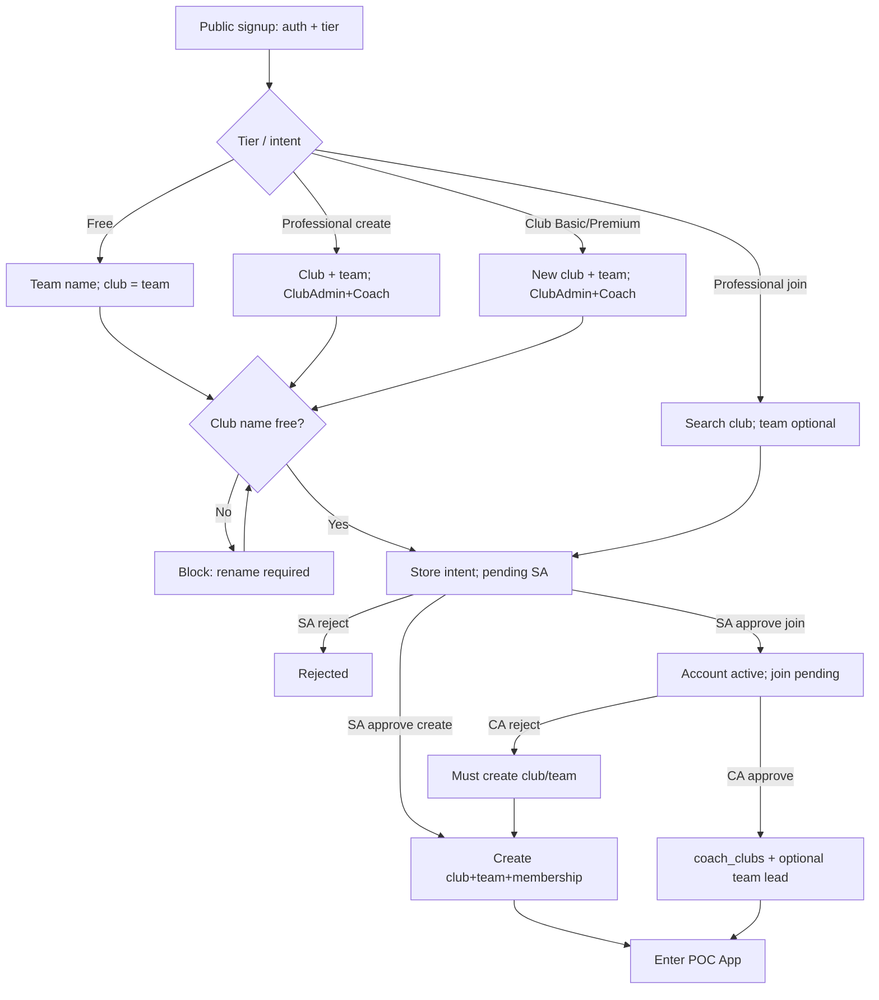

# Tier-Aware Registration Club & Team - Plan

## Goal Capsule

- **Objective:** Replace auto-generated personal club names (`{name}'s Club`) with a **tier-aware public signup wizard** that collects real club/team create or join intent, so new accounts are not misleading and existing clubs can be joined safely under the right approvals.
- **Product authority:** Brainstorm 2026-07-19 — Approach A; ship all tier rules together. Planning locks: ClubAdmin join queue on S7 (1a); create club/team rows only after SystemAdmin approve (2b); rejected join → active account must create club/team (3a).
- **Open blockers:** None.
- **Execution:** code
- **Done when:** Public signup branches by tier for create vs join; Free cannot join; Professional can create or search-join; Club Basic/Premium must create club+team as ClubAdmin+Coach; create names that collide are blocked; SystemAdmin gates account activation and materializes create-path orgs; ClubAdmin gates Professional join on S7; junk auto club names are gone for new signups.

## Product Contract

### Summary

On public registration, after tier + auth, collect club/team **create** or **join** intent by tier (no more `{name}'s Club`). Create paths validate unused club names at signup and **materialize club/team only after SystemAdmin approval**. Professional join uses club search (team optional) and needs SystemAdmin activation plus ClubAdmin join approval on S7. Rejected joins leave the account active but require a create-club recovery before app use.

### Problem Frame

Today self-registration auto-creates a personal club named from the user’s display name. Those names are junk or misleading, and there is no self-serve way to attach to an existing club/team—membership is admin-assigned only. Coaches who belong under an existing club cannot express that at signup.

### Key Decisions

- **KD1. Approach A — public tier-aware wizard** — Club/team create or join intent is collected on the public signup flow so SystemAdmin sees real names before activation.
- **KD2. Ship all tier rules together** — Free, Professional (create + join), and Club Basic/Premium create rules land in one release.
- **KD3. Free = create only** — Free cannot join. User enters one **team** name; **club name = team name**. Role is personal-club **ClubAdmin**.
- **KD4. Professional = create or join** — Create: **club + team**; creator is **ClubAdmin + Coach**. Join: **search/select** club (team optional); role **Coach**; ClubAdmin of target club approves join.
- **KD5. Club Basic / Club Premium = create only** — New club + at least one new team; user is **ClubAdmin** and **Coach** for that team.
- **KD6. Create name collision = block & rename** — Case-insensitive club name already taken → reject; Free gets no join shortcut.
- **KD7. Two gates for Professional join** — SystemAdmin activates account; ClubAdmin separately approves join.
- **KD8. Strict access until club membership exists** — Join-requesters cannot use the POC App until ClubAdmin approves **or** they complete create-club recovery after a reject.
- **KD9. ClubAdmin join queue on S7** — New **Join requests** panel/tab on `S7-admin-user-management.html`, visible to ClubAdmin (and SystemAdmin as needed).
- **KD10. Deferred materialization (create path)** — Signup stores create intent only; club, team, and `coach_clubs` are created when SystemAdmin approves (re-check uniqueness at approve).
- **KD11. Rejected join recovery** — After ClubAdmin reject, account remains SystemAdmin-active; user must **create** a club/team (same create rules as their tier) before entering the app.

### Actors

- A1. Prospective registrant — chooses tier, authenticates, completes create or join fields, waits on approval(s).
- A2. SystemAdmin — activates or rejects the pending account; sees create/join intent; materializes create-path org on approve.
- A3. ClubAdmin — approves or rejects Professional join requests for their club on S7.
- A4. Coach (joined Professional) — after both gates, operates as Coach in the approved club (and optional team).

### Key Flows



- F1. Free create
  - **Trigger:** Registrant selects Free and submits a team name.
  - **Actors:** A1, A2
  - **Steps:** Validate unused club name (= team name) → store create intent + pending user → SystemAdmin approve → materialize club+team+membership → enter app as ClubAdmin.
  - **Outcome:** Real club/team names; no join path.

- F2. Professional create
  - **Trigger:** Registrant selects Professional → Create.
  - **Actors:** A1, A2
  - **Steps:** Enter club + team → block if club name taken → store intent → SystemAdmin approve → materialize; user is ClubAdmin + Coach (lead coach on team).
  - **Outcome:** Owned club with real names; can later receive joiners as ClubAdmin.

- F3. Professional join
  - **Trigger:** Registrant selects Professional → Join.
  - **Actors:** A1, A2, A3
  - **Steps:** Search/select club; optional team → store join intent (no new club) → SystemAdmin activate → ClubAdmin Join requests approve/reject → on approve, Coach membership; on reject, create-club recovery required.
  - **Outcome:** Membership only after ClubAdmin approve; reject forces create path.

- F4. Club Basic / Premium create
  - **Trigger:** Registrant selects Club Basic or Club Premium.
  - **Actors:** A1, A2
  - **Steps:** Enter new club + team → uniqueness check → store intent → SystemAdmin approve → materialize ClubAdmin + Coach.
  - **Outcome:** Club-tier org seeded with real names.

### Requirements

**Public signup**

- R1. Public registration collects club/team **create or join** details according to the selected tier before the account is submitted as pending.
- R2. Free signup requires a new team name; the club name is set equal to that team name; Free must not be able to join an existing club.
- R3. Professional signup offers **Create** or **Join**.
- R4. Professional Create requires a new club name and a new team name; on success the user is ClubAdmin and Coach for that club/team.
- R5. Professional Join requires selecting an existing club via **search/select**; team selection is optional.
- R6. Club Basic and Club Premium signup require a new club name and at least one new team name; on success the user is ClubAdmin and Coach for that team.
- R7. On any create path, if the club name already exists (case-insensitive match), registration must block and require a different name (no auto-suffix rename, no force-join for Free).

**Approvals**

- R8. Every new self-registered account still requires SystemAdmin activation before POC App use (unchanged product gate).
- R9. Professional Join additionally requires approval by a ClubAdmin of the requested club before membership (and app use per KD8) is granted.
- R10. SystemAdmin pending review must surface enough create/join intent (tier, create vs join, club/team names or target club) to decide activation.
- R11. ClubAdmin can list pending join requests for their club and approve or reject them on S7.

**Naming quality**

- R12. New self-registrations must not create clubs named with the auto pattern `{displayName}'s Club` (or equivalent junk derivation from the person name alone).

**Deferred materialization & recovery**

- R13. Initial create-path club, team, and membership rows are created only when SystemAdmin approves (not at signup). **Carve-out:** after ClubAdmin rejects a join, create-recovery materializes club/team immediately without a second SystemAdmin gate (account already active).
- R14. After ClubAdmin rejects a join, the account remains active and the user must complete a create-club/team flow before using the POC App.

### Acceptance Examples

- AE1. Free create happy path
  - **Given:** Free tier signup with team name `U15 Lions` and no existing club of that name
  - **When:** User registers and SystemAdmin approves
  - **Then:** Club and team are both named `U15 Lions`; user is ClubAdmin; user can enter the app

- AE2. Free cannot join / collision blocked
  - **Given:** Club `U15 Lions` already exists
  - **When:** Free registrant enters team name `U15 Lions`
  - **Then:** Signup is blocked with a rename requirement; no join offer

- AE3. Professional join two gates
  - **Given:** Club `Riverside FC` exists with a ClubAdmin
  - **When:** Professional joins via search, SystemAdmin activates, then ClubAdmin approves
  - **Then:** User is Coach in `Riverside FC` (and on the selected team if one was chosen) and can enter the app

- AE4. Professional join blocked until ClubAdmin
  - **Given:** Professional join request pending ClubAdmin after SystemAdmin activation
  - **When:** User attempts to use the POC App
  - **Then:** Access is denied until ClubAdmin approves or the user completes create-club recovery after a reject

- AE5. Club Premium create roles
  - **Given:** Club Premium signup with new club `Northside Academy` and team `First Team`
  - **When:** SystemAdmin approves
  - **Then:** User is ClubAdmin of the club and Coach of `First Team`

- AE6. Professional create ownership
  - **Given:** Professional Create with club `Solo Pro FC` and team `Main`
  - **When:** SystemAdmin approves
  - **Then:** User is ClubAdmin + Coach on that club/team and can later approve joiners

- AE7. Rejected join recovery
  - **Given:** Professional join rejected by ClubAdmin after SystemAdmin activation
  - **When:** User submits a create club+team recovery
  - **Then:** Club/team materialize; user can enter the app as ClubAdmin+Coach of the new club

### Scope Boundaries

- **In scope:** Public signup wizard by tier; create name uniqueness; Professional search-join; SystemAdmin + ClubAdmin gates; deferred create materialization; S7 Join requests for ClubAdmin; reject→create recovery; replace auto `{name}'s Club` for new signups.
- **Deferred for later:** Invite/join codes; billing; renaming existing junk clubs already in the DB; parents/guardians joining; multi-club join at signup; fuzzy “did you mean” beyond search/select; holding a hard DB lock on proposed club names across all pending intents beyond uniqueness checks at signup and approve.
- **Out of scope:** Changing SystemAdmin approval off for create-only tiers; public browse of full club directories without search intent; allowing Free to join existing clubs.
- **Deferred to Follow-Up Work:** Backfill/rename of historical `{name}'s Club` rows.

### Assumptions

- AS1. Club name uniqueness is global (case-insensitive) for create paths.
- AS2. “Coach for the team” means `teams.lead_coach_user_id` (and ClubAdmin role on `users.role`); single `users.role` remains the source of truth.
- AS3. ClubAdmin join UI is an S7 **Join requests** tab/panel.
- AS4. Team `ageGroup` at materialization uses a documented default (e.g. `U15`) when signup does not collect age group — planning choice to avoid expanding public form scope.
- AS5. Global `teams.name` uniqueness is enforced at materialization; collisions return a clear error for SystemAdmin/recovery to rename.

### Outstanding Questions

- None blocking. (Q1/Q2 resolved: S7 Join requests; reject → create recovery.)

### Product Contract preservation

- **Product Contract changed:** R13–R14 (incl. R13 carve-out), KD9–KD11, AE7, F3 reject arm, Summary/KD1 materialization wording — planning locks from user choices 1a/2b/3a. R1–R12 and tier rules otherwise unchanged; Professional create as ClubAdmin supersedes plan `001` Coach-only for that path (KTD7).
- Preserves SystemAdmin pending gate from `2026-07-19-001`.
- Does not move Approvals & Tiers admin back to the public site (`2026-07-19-002`).

---

## Planning Contract

### Key Technical Decisions

- **KTD1. Registration intent + join-request tables** — Persist signup intent (`create|join`, proposed names / target club+team ids, status) separately from `clubs`/`teams` so create rows are not written until SystemAdmin approve. Join requests track ClubAdmin queue status (`pending|approved|rejected`).
- **KTD2. Rewrite `createPendingRegistration`** — Stop auto `{name}'s Club` and unconditional club insert. Accept intent payload; validate Free/Pro/Club rules; hard-block club name clashes; set role from create vs join (not only `roleForTierCode(tier)`).
- **KTD3. Materialize on SystemAdmin approve (and reject-join recovery)** — Approve handler creates club + team + `coach_clubs` + lead coach for create intents; for join intents only activates the user and leaves join `pending` for ClubAdmin. Reject-join **create recovery** materializes the same org shape immediately (no re-pending SystemAdmin).
- **KTD7. Founding ClubAdmin vs `max_club_admins`** — Professional create as ClubAdmin follows the Free personal-owner pattern: the founder’s ClubAdmin seat is not counted as an “additional” ClubAdmin against `max_club_admins` (Free already uses ClubAdmin with `max_club_admins=0`). Quota checks apply when adding further ClubAdmins/Coaches. If live `assertTierAllowsNewMember` treats the founder as a seat, adjust enforcement to match this rule rather than forcing Professional create back to Coach-only (supersedes plan `001` “professional → Coach only” for the create path).
- **KTD4. Public club search** — New public `GET /api/v1/clubs/search?q=` (min query length, limited results) on `serve-public.js`; do not expose full directory.
- **KTD5. App access gate** — Login / session entry rejects users with pending join or rejected-join-without-club until membership exists (pending-join page or create-recovery UI).
- **KTD6. Migration apply** — Ship `034_…` (or next) and **apply to the live DB** before code that reads new columns/tables (repo learning: migration-not-applied → 500s).

### High-Level Technical Design

```mermaid
sequenceDiagram
  participant Pub as Public site
  participant Reg as registration.js
  participant SA as SystemAdmin S7
  participant CA as ClubAdmin S7
  participant App as POC App

  Pub->>Reg: register + intent
  Reg-->>Pub: pending (no club rows if create)
  SA->>Reg: approve user
  alt create intent
    Reg->>Reg: insert club+team+coach_clubs
    SA-->>App: user may enter
  else join intent
    Reg->>Reg: activate user; join pending
    CA->>Reg: approve join
    Reg->>Reg: coach_clubs (+ team)
    CA-->>App: user may enter
  end
```

### Assumptions (planning)

- Mockup/public Node servers remain the enrollment surface (not Nest) for this plan.
- OAuth register path uses the same intent-aware `createPendingRegistration`.
- SystemAdmin may view Join requests for support; ClubAdmin sees only their club’s requests.

### Risks & Dependencies

| Risk | Mitigation |
|------|------------|
| Name taken between signup and SA approve | Re-check uniqueness on materialize; fail approve with clear message |
| `teams.name` global UNIQUE conflicts | Surface error; allow rename in recovery/approve |
| Professional create vs `roleForTierCode` → Coach | Role from intent (create → ClubAdmin) |
| Schema not applied | Explicit migrate/bootstrap step in Verification |
| Pending join after SA approve can login today | Enforce KD8/KTD5 in login + handoff |

---

## Implementation Units

### U1. Schema: registration intent + club join requests

**Goal:** Durable storage for create/join intent and ClubAdmin join queue without creating clubs at signup.

**Requirements:** R1, R9–R11, R13, KD10

**Dependencies:** None

**Files:**
- Create: `apps/api/src/db/migrations/034_registration_intent_and_join_requests.sql`
- Modify: `apps/api/src/db/schema/tables.sql`
- Modify: `scripts/auth/registration.js` (`ensureSubscriptionSchema` or sibling ensure for new tables)

**Approach:** Add tables (names directional) for registration intents and club join requests linked to `users.id`, with status enums, optional target club/team ids, proposed club/team name fields, and indexes for pending queues. Sync `tables.sql`. Do not invent Nest entities unless already required by bootstrap.

**Patterns to follow:** `033_subscription_tiers_and_approval.sql`; `ensureSubscriptionSchema` bootstrap style.

**Test scenarios:**
- Migration applies cleanly on empty and existing DB
- Intent row can be inserted for create and join shapes
- Join request status transitions pending → approved/rejected

**Verification:** Migration applied locally; schema present in DB; bootstrap does not 500.

---

### U2. Intent-aware pending registration (no junk clubs)

**Goal:** Rewrite registration so signup stores intent and never creates `{name}'s Club` (or any club) on create/join submit.

**Requirements:** R1–R7, R12, KD3–KD6, F1–F4

**Dependencies:** U1

**Files:**
- Modify: `scripts/auth/registration.js`
- Modify: `scripts/tiers/quota.js` (role selection for create vs join)
- Test: `tests/playwright/public-site-oauth-tiers.spec.js` (API-level register helpers)

**Approach:** Extend `createPendingRegistration` options with `intent`, names, and join targets. Free: clubName=teamName. Professional create/join branch. Club tiers require both names. Hard-block existing club name (and conflicting pending create intents if implemented). Role: create paths → ClubAdmin; join → Coach. No `clubs`/`teams`/`coach_clubs` inserts until approve (U3).

**Execution note:** Prefer API-first Playwright checks for collision and pending payload before UI polish.

**Patterns to follow:** Existing BEGIN/COMMIT in `createPendingRegistration`; case-insensitive club lookup (block, do not suffix).

**Test scenarios:**
- Covers AE2: Free colliding club name → 400/validation; no club row
- Free valid register → user pending; no club row yet; intent stored
- Professional join → user pending; no personal club; join intent/request pending
- Professional/Club create → intent names stored; role ClubAdmin

**Verification:** Register APIs satisfy collision and no-auto-club rules; OAuth path shares the same helper.

---

### U3. SystemAdmin approve materializes create; activates join

**Goal:** On SystemAdmin approve, create org for create intents; for join, activate user and leave ClubAdmin queue pending.

**Requirements:** R8, R10, R13, KD7, KD10, AE1, AE5, AE6

**Dependencies:** U2

**Files:**
- Modify: `scripts/serve-mockup.js` (approve/reject + pending-users payload)
- Modify: `docs/ux/mockup/S7-admin-user-management.html` (Approvals columns for intent)
- Modify: `docs/ux/mockup/js/mockup-api-client.js`

**Approach:** Enrich `GET .../pending-users` with tier, intent, proposed names / target club. On approve: if create, insert club (is_free_tier when Free), team (default ageGroup per AS4), `coach_clubs`, set `lead_coach_user_id`; if join, set user active and keep join request pending. Reject leaves no org. Re-validate club/team name uniqueness at materialize.

**Patterns to follow:** Existing approve/reject handlers; S7 Approvals tab patterns from plan 002.

**Test scenarios:**
- Covers AE1: Free approve → club=team name exists; ClubAdmin can login
- Covers AE5/AE6: Club Premium / Professional create materialize roles and lead coach
- Pending-users payload includes intent (create/join, names or target club) for SystemAdmin review (R10)
- Approve create with name taken since signup → clear failure; user stays pending or recoverable
- Join approve by SA → user active; still no `coach_clubs` until CA

**Verification:** S7 Approvals shows intent; approve create enters app with real club name.

---

### U4. Public wizard + club search

**Goal:** Tier-branched public signup UI and search API for Professional join.

**Requirements:** R1–R6, KD1, KD4

**Dependencies:** U2

**Files:**
- Modify: `docs/ux/mockup/public-home.html`
- Modify: `scripts/serve-public.js` (register body + `GET /api/v1/clubs/search`)
- Modify: OAuth stub / pending pages if they skip intent fields
- Test: `tests/playwright/public-landing.spec.js`, `tests/playwright/public-site-oauth-tiers.spec.js`

**Approach:** After tier (+ auth method), show Free team field; Professional Create/Join toggle; Club tiers club+team fields. Join: typeahead/search select club, optional team list for that club. Pass intent in register/OAuth start. Search requires minimum query length and caps results.

**Patterns to follow:** Existing signup form / OAuth stub flow on public site.

**Test scenarios:**
- Free form hides join controls
- Professional join search returns matching club; register stores target
- Club Premium requires club + team fields before submit
- Covers AE2 via UI collision message

**Verification:** Manual + Playwright signup branches match tier rules.

---

### U5. ClubAdmin Join requests on S7 + access gate + reject recovery

**Goal:** ClubAdmin approves/rejects joins on S7; app blocks until membership or create recovery.

**Requirements:** R9, R11, R14, KD8–KD9, KD11, AE3, AE4, AE7

**Dependencies:** U1, U3

**Files:**
- Modify: `scripts/serve-mockup.js` (list/approve/reject join; login/handoff gate; create-recovery endpoint or reuse register materialize path)
- Modify: `docs/ux/mockup/S7-admin-user-management.html` (Join requests tab)
- Modify: `docs/ux/mockup/js/mockup-api-client.js`
- Modify: `docs/ux/mockup/public-pending.html` and/or app pending-join / recovery page
- Modify: `scripts/tiers/quota.js` (assert coach seat on join approve)
- Test: `tests/playwright/s7-approvals-tiers.spec.js` (extend or sibling `s7-join-requests.spec.js`)

**Approach:** New S7 tab **Join requests** (`data-role-visible-to=ClubAdmin,SystemAdmin`). List pending joins for actor’s clubs. Approve → `coach_clubs` + optional team assignment (not necessarily lead coach unless chosen); Reject → mark rejected; user completes create-club recovery (collect names, **materialize immediately** per R13 carve-out / KTD3 — no second SystemAdmin pending). Login/handoff denies app until `coach_clubs` exists (or equivalent membership).

**Patterns to follow:** S7 Approvals/Tiers tabs; `assertTierAllowsNewMember` for Coach.

**Test scenarios:**
- Covers AE3: SA + CA approve → Coach in club; app access
- Covers AE4: after SA only → app denied
- Covers AE7: CA reject → create recovery → app access
- ClubAdmin cannot see other clubs’ join requests
- Coach (non-admin) cannot open Join requests mutating APIs (403)

**Verification:** End-to-end Professional join and reject-recovery paths pass Playwright.

---

### U6. Playwright coverage + helpers + mapping docs

**Goal:** Lock AE1–AE7 in automated tests; update helpers and API mapping notes.

**Requirements:** AE1–AE7, R1–R14

**Dependencies:** U2–U5

**Files:**
- Modify: `tests/playwright/public-site-oauth-tiers.spec.js`
- Modify: `tests/playwright/s7-approvals-tiers.spec.js`
- Create or modify: `tests/playwright/s7-join-requests.spec.js` (if split)
- Modify: `tests/playwright/_fixture-utils.js` (register helper with intent)
- Modify: `docs/ux/mockup/API-Mockup-Mapping.md`

**Approach:** Extend `registerPending` to require intent fields. Cover collision, deferred materialization (no club until approve), two-gate join, reject recovery. Document new public search and join admin APIs in mapping doc.

**Test scenarios:** Suite green for AE1–AE7; regression that old auto club name pattern does not appear for new Free signup after approve.

**Verification:** Targeted Playwright files pass against both servers with migration applied.

---

## Verification Contract

| Gate | Command / check | Applies to |
|------|-----------------|------------|
| Schema applied | Run migration `034_…` / bootstrap; confirm new tables exist | U1 |
| Register API | Create/join intents; collision block; no club until SA approve | U2–U3 |
| Public wizard | Tier branches + search join | U4 |
| S7 Join requests | ClubAdmin approve/reject + access gate + recovery | U5 |
| E2E | `npx playwright test` on public-site + s7 approvals/join specs | U6 |

**Execution direction:** Prefer API/contract Playwright proofs first for registration/approve, then UI flows.

---

## Definition of Done

- [ ] Product Contract R1–R14 and AE1–AE7 satisfied
- [ ] No new signup creates `{name}'s Club`
- [ ] Create orgs materialize only after SystemAdmin approve
- [ ] Professional join requires ClubAdmin on S7 Join requests
- [ ] Rejected join forces create recovery before app use
- [ ] Migration applied on the environment under test
- [ ] Playwright coverage for AE1–AE7 green
- [ ] `API-Mockup-Mapping.md` updated for new endpoints

---

## Appendix

### Sources & Research

- Origin: `docs/plans/2026-07-19-003-feat-tier-aware-registration-club-team-plan.md` (enriched in place)
- Grounding: current `scripts/auth/registration.js` auto club; `roleForTierCode` professional→Coach; S7 Approvals on app; no public club search; no join-request entity
- Learning: `docs/solutions/database-issues/serve-mockup-500-birth-month-column-not-applied.md` — apply migrations before code that depends on them
- External research: skipped — strong local enrollment patterns
